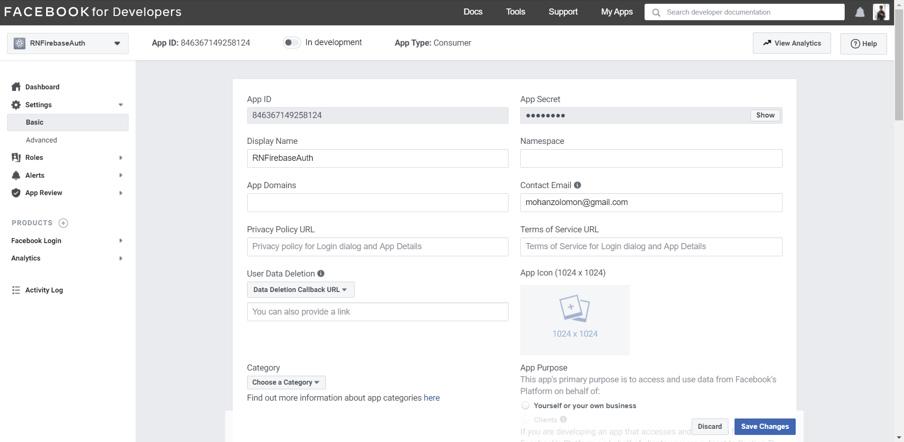
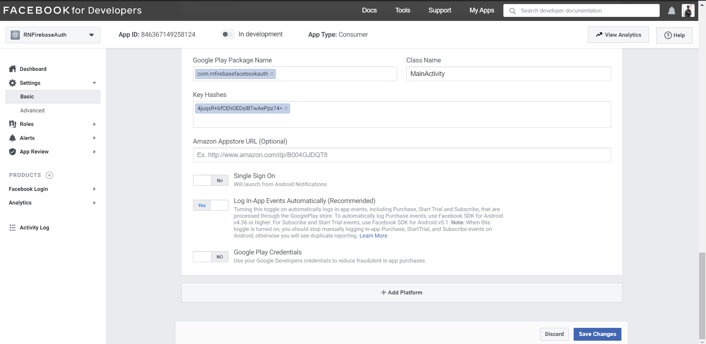
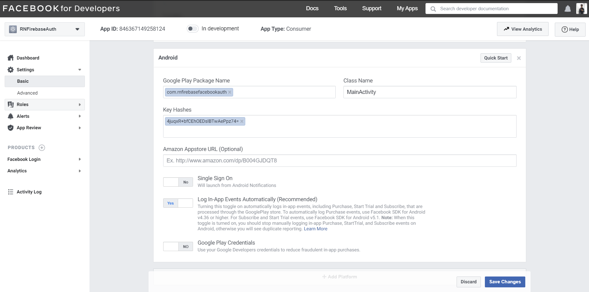
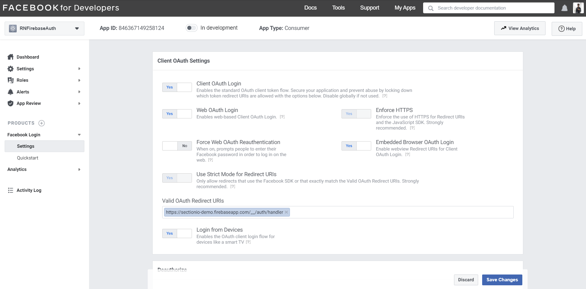

In this tutorial, we will learn how to authenticate users with their Facebook accounts using the authentication module in Firebase in a Non-Expo React Native application.
<!--more-->

To learn more about Firebase, refer to [this link](https://en.wikipedia.org/wiki/Firebase).

### Prerequisites

We'll not cover the basics of React and React Native in this tutorial. If you are not comfortable with the basics, we highly recommended to go over this [tutorial](https://reactnative.dev/docs/tutorial) before you continue further.

### Overview

We'll be going through these steps in this article:

1. [Development environment](#development-environment).
2. [Cloning the starter code](#cloning-the-starter-code).
3. [Setting up the Firebase project](#setting-up-the-firebase-project).
4. [Setting up Facebook App](#setting-up-facebook-app)
5. [Setting up Firebase Authentication](#setting-up-firebase-authentication).
6. [Sign-in](#sign-in)
7. [Display authenticated screen](#display-authenticated-screen)
8. [Sign out](#sign-out)
9. [Recap](#lets-recap)

### Development environment

> **IMPORTANT** - We will not be using [Expo](https://expo.io/) in our project.

Follow [this documentation](https://reactnative.dev/docs/environment-setup) to set up the development environment.

Make sure you're following the React Native CLI Quickstart, not the Expo CLI Quickstart.


### Cloning the starter code

Clone the starter code from this [GitHub repository](https://github.com/zolomohan/react-native-firebase-facebook-auth-starter).

You can checkout the final code from this [GitHub Repository](https://github.com/zolomohan/react-native-firebase-facebook-auth).

This will be the folder structure of the application.


I've set up 2 screens in the `screens/` directory:

- _Authentication.js_: Screen with a Facebook Sign-in button to initiate the sign-in process.

- _Authenticated.js_: Screen that the user can see only if he is logged in.


### Setting up the Firebase project

Head to the [Firebase console](console.firebase.google.com/u/0/), sign in to your account and Create a new project.


You'll be presented with the dashboard once you create the new project.


Now, click on the Android icon to add an android app to the Firebase project.


You'll need the package name of the application to register your application. You'll find the package name in the `AndroidManifest.xml` which is located in `android/app/src/main/`.


On the next step, you should download the `google-services.json` file and place it in the `android/app` directory.

This file contains configurations that'll enable your application to access firebase services.


On the next step, It'll ask you to add configurations to the `build.gradle` files.

First, add the `google-services` plugin as a dependency inside of your `android/build.gradle` file:

```gradle
buildscript {
  dependencies {
    // ... other dependencies
    classpath 'com.google.gms:google-services:4.3.3'
  }
}
```

Then, execute the plugin by adding the following to your `android/app/build.gradle` file:

```Gradle
apply plugin: 'com.android.application'
apply plugin: 'com.google.gms.google-services'
```

You need to perform some additional steps to configure `Firebase` for `iOS`. Follow [this documentation](https://rnfirebase.io/#3-ios-setup) to set it up.

Finally, let's install the `@react-native-firebase/app` package in our app to complete the set up for Firebase.

```bash
npm install @react-native-firebase/app
```

### Setting up Facebook App

Head to [developers.facebook.com](https://developers.facebook.com/) and create a developer account.

Go to the [Apps](https://developers.facebook.com/apps) section and create a new app.


Once you create an application, you will be greeted with the App Dashboard. Add the Facebook Login product to your app from the dashboard.


To find the App ID and the App secret, which will be required in the later steps, head to basic settings.



Once you make a copy of it, Scroll down until you find **Add Platform**.



Once you click on it, Select Android. 

Fill out the **Package Name**, which you can find the package name in the `AndroidManifest.xml` which is located in `android/app/src/main/`.

For the **Class Name**, fill it out as `MainActivity`.

For the **Key Hash**, you need to generate it using [openSSL](https://www.openssl.org/). You can download it from [Google Code Archive](https://code.google.com/archive/p/openssl-for-windows/downloads). Download the **K** version.


Once you've downloaded it, extract it and copy the folder to `C:/`.

Detect your `keytool.exe`, which can be found in the JDK directory inside the `bin/` directory. The JDK is usually in a location like `C:\Program Files\Java\jdk1.8.0_261\bin`.

Now, inside the `bin/` folder, run:

```bash
./keytool -exportcert -alias androiddebugkey -keystore "C:\Documents and Settings\Administrator.android\debug.keystore" | "C:\OpenSSL\bin\openssl" sha1 -binary |"C:\OpenSSL\bin\openssl" base64
```

Output:

```bash
4iuaxR+bpCEhMEQslBTwAePpz74=
```

Refer to this [StackOverflow Question](https://stackoverflow.com/questions/7506392/how-to-create-android-facebook-key-hash) for more details on how to generate a Key Hash.



For iOS setup, refer to this [Quick Start](https://developers.facebook.com/quickstarts/?platform=ios) Guide.

### Setting up Firebase Authentication

Head to the Authentication section in the dashboard and click on the `Get Started` button. This will enable the authentication module of your project.


Then, enable Facebook authentication in the sign-in methods. Once you've enabled it, provide the App ID and the App secret from the Facebook Developer Console and press Save.


To complete set up, you should add the OAuth redirect URI to your Facebook app configuration. Copy the OAuth redirect URI and head to the Facebook Developer console.

Under Products, head to *Settings* in Facebook Login. Paste the redirect URI under *Valid OAuth Redirect URIs* in *Client OAuth Settings*.



Now, let's head to the application and install the auth module.

Let's install the `@react-native-firebase/auth` package in our app.

```bash
npm install @react-native-firebase/auth
```

Let's declare the dependency for the authentication module in the `android/app/build.gradle` file using the [Firebase Android BoM](https://firebase.google.com/docs/android/learn-more?authuser=0#bom)

```gradle
dependencies {
    // Add these lines
    implementation platform('com.google.firebase:firebase-bom:26.3.0')
    implementation 'com.google.firebase:firebase-auth'
}
```

Next, let's install the React Native Facebook SDK.

```bash
npm install react-native-fbsdk
```

In `android/build.gradle`, add `mavenCentral()` under `repositories` in `buildscript`:

```gradle
buildscript {
    repositories {
        google()
        jcenter()

        // Add this line
        mavenCentral()
    }
}
```

In `android/app/build.gradle`, add the following under `dependencies`:

```gradle
implementation 'com.facebook.android:facebook-android-sdk:[5,6)'
```

Now, you should add your Facebook App ID to your project's strings file in `android/app/res/values/strings.xml`.

```XML
<resources>
  <string name="app_name">RNFirebaseFacebookAuth</string>
  <string name="facebook_app_id"><-- Your App ID here --></string>
</resources>
```

In the `AndroidManifest.xml` file, add a `uses-permission` element under `manifest`: (Ignore if already present)

```XML
<uses-permission android:name="android.permission.INTERNET" />
```

Next, add a `meta-data` to the `application` element:

```XML
<application android:label="@string/app_name" ...>
    ...
    <meta-data android:name="com.facebook.sdk.ApplicationId" android:value="@string/facebook_app_id"/>
    ...
</application>
```

Follow this [Getting Started Guide](https://developers.facebook.com/docs/ios/getting-started/?sdk=cocoapods) to set up the SDK for iOS.

### Sign-in

In *App.js*, Let's create a function called `signIn` which will be called when the user presses the Sign in button. Let's wrap all the code inside the function in a `try/catch` block to display any error that may arise during the sign in flow.

```JSX
async function signIn() {
  try {

    // Code goes here

  } catch (error) {
    alert(error);
  }
}
```

Let's use the Login Manager to log in with permissions. We need to pass a array of permissions that the app needs to the function.

```JSX
const result = await LoginManager.logInWithPermissions([
  'public_profile',
  'email',
]);
```

If the result contains an `isCancelled` propery, it means the user cancelled process. Let's throw an error which will then be handled by `catch` block.

```JSX
if (result.isCancelled) {
  throw 'User cancelled the login process';
}
```

Once signed in, we should get the users AccesToken.

```JSX
const data = await AccessToken.getCurrentAccessToken();
```

If the data is empty, let's throw an error.

```JSX
if (!data) {
  throw 'Something went wrong obtaining access token';
}
```

Now, we should create a credential using the access token and sign in the user into the app.

```JSX
const facebookCredential = auth.FacebookAuthProvider.credential(data.accessToken);
return auth().signInWithCredential(facebookCredential);
```

Here is the complete code for the `signIn` function:

```JSX
async function signIn() {
  try {
    const result = await LoginManager.logInWithPermissions([
      'public_profile',
      'email',
    ]);

    if (result.isCancelled) {
      throw 'User cancelled the login process';
    }

    const data = await AccessToken.getCurrentAccessToken();

    if (!data) {
      throw 'Something went wrong obtaining access token';
    }

    const facebookCredential = auth.FacebookAuthProvider.credential(data.accessToken);
    return auth().signInWithCredential(facebookCredential);
    
  } catch (error) {
    alert(error);
  }
}
```

### Display Authenticated Screen

The `onAuthStateChanged` event will be triggered whenever the authentication state of the user changes inside the application.

You can set an event handler for this listener. This handler will receive the `user` object. If the `user` object is `null`, it means the user is signed-out, otherwise, they are signed-in.

You can access the current authenticated user's details using `auth().currentUser` from anywhere in the application. The user object will contain the `displayName`, `email`, and `photoURL` which were copied from Facebook to Firebase.

To learn more about the user object, refer to this [documentation](https://rnfirebase.io/reference/auth/user).

Let's create a state to track whether the user is authenticated or not. We should set the default value to `false`.

```JSX
const [authenticated, setAutheticated] = useState(false);
```

Let's set the `authenticated` state to `true` if the `user` object is not `null` in the `onAuthStateChanged` handler.

```JSX
auth().onAuthStateChanged((user) => {
  if(user) {
    setAutheticated(true);
  }
})
```

If the user is authenticated, we should display the *Authenticated* screen. 

```JSX
if (authenticated) {
  return <Authenticated />;
}
return <Authentication signIn={signIn} />;
```

I'm using `auth().currentUser` in the *Authenticated* screen to display the email ID, name, and the user's profile picture.

```JSX
const user = auth().currentUser;
return (
  <View style={styles.screen}>
    <Text style={styles.title}>You're Logged In</Text>
    <Image source={{ uri: user?.photoURL }} style={styles.image} />
    <Text style={styles.text}>{user?.displayName}</Text>
    <Text style={styles.text}>{user?.email}</Text>
    <View style={{ marginTop: 30 }}>
      <Button title="Signout" onPress={() => auth().signOut()} />
    </View>
  </View>
);
```


### Sign out

We should use the `signOut` method in the auth module to sign out a user from the application.

Let's import the `auth` module in *Authenticated.js*.

```JSX
import auth from '@react-native-firebase/auth';
```

Let's call the `signOut` method when the user presses the signout button.

```JSX
<Button title="Signout" onPress={() => auth().signOut()} />
```

Now, when the user presses the button, the auth module will sign out the user from the application. This will trigger the `onAuthStateChanged` listener. The handler will receive `null` instead of the `user` object.

Thus, we should set the authenticated state to `false` if we receive `null`.

```JSX
auth().onAuthStateChanged((user) => {
  if(user) {
    setAuthenticated(true);
  } else {
    setAuthenticated(false);
  }
})
```


### Let's Recap

1. We set up our development environment and created a React Native app.

2. We cloned the starter code.

3. We created a Facebook app with a developer account and enabled Facebook Login for the app.

3. We created a Firebase project and enabled Facebook authentication in our project with App ID and App Secret.

4. We installed the required packages and we added the dependencies to the `build.gradle` files.

5. We added the App ID to the `strings.xml` file and added some configurations to the `AndroidManifest.xml` file.

5. We wrote a function to login the user with their facebook access token using the Facebook SDK.

6. We created a state to track the authentication state of the user and used the `onAuthStateChanged` handler to update the state.

7. We displayed the *Authenticated* screen when the user has been authenticated.

8. We used the `auth` module to sign out the user from the application from the *Authenticated* screen.

Congratulations, :partying_face: You did it.

Thanks for Reading!