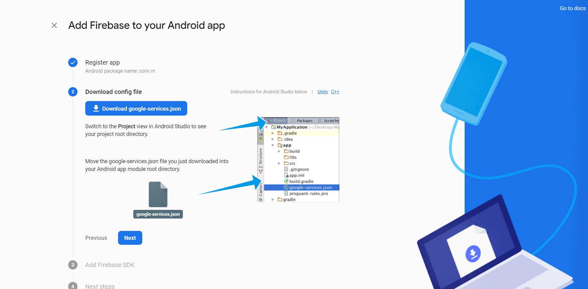

In this tutorial, we will learn how to authenticate users with their Google accounts using the authentication module in Firebase in a Non-Expo React Native application.
<!--more-->

### Firebase

Firebase is a platform developed by Google for creating mobile and web applications. It was originally an independent company founded in 2011. In 2014, Google acquired the platform and it is now their flagship offering for app development.

### Authentication Module

Firebase's authentication module provides backend services and SDKs to authenticate users in your app. It supports authentication using passwords, phone numbers, popular identity providers like Google, Facebook and Twitter, and more.

The native Firebase SDKs ensure that a user's authentication state between app sessions is persisted. The user can clear their authentication state by clearing the app's data/cache.

### Prerequisites

The basics of React and React Native will not be covered in this tutorial. If you are not comfortable with the basics, this is a [helpful tutorial](https://reactnative.dev/docs/tutorial).

### Overview

We'll be going through these steps in this article:

1. [Development environment](#development-environment).
2. [Cloning the starter code](#cloning-the-starter-code).
3. [Setting up the Firebase project](#setting-up-the-firebase-project).
4. [Setting up Firebase Authentication](#setting-up-firebase-authentication).

### Development environment

> **IMPORTANT** - We will not be using [Expo](https://expo.io/) in our project.

You can follow [this documentation](https://reactnative.dev/docs/environment-setup) to set up the environment and create a new React app.

Make sure you're following the React Native CLI Quickstart, not the Expo CLI Quickstart.


### Cloning the starter code

To focus more on the authentication module, You can clone the starter code from this [repository](https://github.com/zolomohan/rn-firebase-phone-auth-starter) on GitHub. Follow the Repository's README for instructions.

For the final code, you can look at this [GitHub Repository](https://github.com/zolomohan/rn-firebase-phone-auth).

This will be the folder structure of the application.


I've set up 2 screens in the `screens/` directory:

- _Authentication.js_: Screen with a Google Sign-in button to initiate the sign-in process.

- _Authenticated.js_: Screen that the user can see only if he is logged in.


### Setting up the Firebase project

Head to the [Firebase console](console.firebase.google.com/u/0/) and sign in to your account.

Create a new project.


Once you create a new project, you'll see the dashboard.


Now, click on the Android icon to add an android app to the Firebase project.


You will need the package name of the application to register application. You can find the package name in the `AndroidManifest.xml` which is located in `android/app/src/main/`.


You will also need the Debug signing certificate `SHA-1`. You can get that by running the following command in the project directory.

```bash
cd android && ./gradlew signingReport
```

This will generate the signing certificate of the application. You will get similar output like this:

```bash
Task :app:signingReport
Variant: debugUnitTest
Config: debug
Store: C:\Users\Mohan\.android\debug.keystore
Alias: AndroidDebugKey
MD5: 5F:BB:9E:98:5E:E7:E6:29:19:28:61:4F:42:B9:74:AB
SHA1: 9E:61:75:0E:5C:F4:EB:B4:EB:9D:B3:13:5F:50:D6:AB:2E:4E:12:0D
SHA-256: 6C:BB:49:66:18:B9:7F:74:49:B5:56:D0:24:43:6A:1B:41:91:97:A3:2E:7C:4A:6E:59:40:8F:5C:74:6F:CC:93
Valid until: Friday, December 23, 2050
```

> Make sure you are copying the `SHA1` from `Task :app:signingReport` and not from any other Task.

Copy the `SHA1` value and paste it into the Firebase console.

Now, Proceed to the next step, you can download the `google-services.json` file. You should place this file in the `android/app` directory.

This file contains configurations that'll enable your application to access firebase services.



After adding the file, proceed to the next step. It will ask you to add some configurations to the `build.gradle` files.

First, add the `google-services` plugin as a dependency inside of your `android/build.gradle` file:

```gradle
buildscript {
  dependencies {
    // ... other dependencies
    classpath 'com.google.gms:google-services:4.3.3'
  }
}
```

Then, execute the plugin by adding the following to your `android/app/build.gradle` file:

```Gradle
apply plugin: 'com.android.application'
apply plugin: 'com.google.gms.google-services'
```

You need to perform some additional steps to configure `Firebase` for `iOS`. Follow [this documentation](https://rnfirebase.io/#3-ios-setup) to set it up.

Finally, We should install the `@react-native-firebase/app` package in our app to complete the set up for Firebase.

```bash
npm install @react-native-firebase/app
```

### Setting up Firebase Authentication

Head over to the Authentication section in the dashboard and click on the `Get Started` button. This will enable the authentication module in your project.


Next, you should enable phone authentication in the sign-in methods. Once you've enabled it, press save.


Now, let's head to the application and install the auth module.

Let's install the `@react-native-firebase/auth` package in our app.

```bash
npm install @react-native-firebase/auth
```

Let's declare the dependency for the authentication module in the `android/app/build.gradle` file using the [Firebase Android BoM](https://firebase.google.com/docs/android/learn-more?authuser=0#bom)

```gradle
dependencies {
    // Add these lines
    implementation platform('com.google.firebase:firebase-bom:26.3.0')
    implementation 'com.google.firebase:firebase-auth'
}
```

With this, the firebase authentication module is set up in our application.
