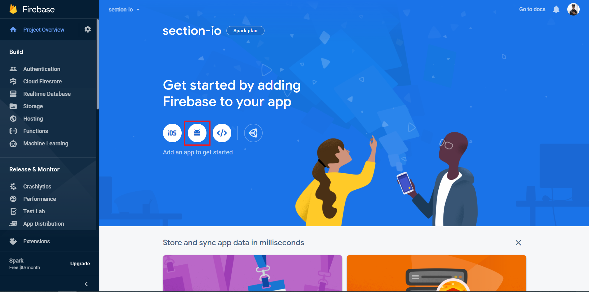

In this tutorial, we will learn how to authenticate users with their Google accounts using the authentication module in Firebase in a Non-Expo React Native application.
<!--more-->

### Firebase

Firebase is a platform developed by Google for creating mobile and web applications. It was originally an independent company founded in 2011. In 2014, Google acquired the platform and it is now their flagship offering for app development.

### Authentication Module

Firebase's authentication module provides backend services and SDKs to authenticate users in your app. It supports authentication using passwords, phone numbers, popular identity providers like Google, Facebook and Twitter, and more.

The native Firebase SDKs ensure that a user's authentication state between app sessions is persisted. The user can clear their authentication state by clearing the app's data/cache.

### Prerequisites

The basics of React and React Native will not be covered in this tutorial. If you are not comfortable with the basics, this is a [helpful tutorial](https://reactnative.dev/docs/tutorial).

### Overview

We'll be going through these steps in this article:

1. [Development environment](#development-environment).
2. [Cloning the starter code](#cloning-the-starter-code).
3. [Setting up the Firebase project](#setting-up-the-firebase-project).
4. [Setting up Firebase Authentication](#setting-up-firebase-authentication).
5. [Sign-in](#sign-in)

### Development environment

> **IMPORTANT** - We will not be using [Expo](https://expo.io/) in our project.

You can follow [this documentation](https://reactnative.dev/docs/environment-setup) to set up the environment and create a new React app.

Make sure you're following the React Native CLI Quickstart, not the Expo CLI Quickstart.


### Cloning the starter code

To focus more on the authentication module, You can clone the starter code from this [repository](https://github.com/zolomohan/rn-firebase-phone-auth-starter) on GitHub. Follow the Repository's README for instructions.

For the final code, you can look at this [GitHub Repository](https://github.com/zolomohan/rn-firebase-phone-auth).

This will be the folder structure of the application.


I've set up 2 screens in the `screens/` directory:

- _Authentication.js_: Screen with a Google Sign-in button to initiate the sign-in process.

- _Authenticated.js_: Screen that the user can see only if he is logged in.


### Setting up the Firebase project

Head to the [Firebase console](console.firebase.google.com/u/0/) and sign in to your account.

Create a new project.


Once you create a new project, you'll see the dashboard.



Now, click on the Android icon to add an android app to the Firebase project.


You will need the package name of the application to register application. You can find the package name in the `AndroidManifest.xml` which is located in `android/app/src/main/`.


You will also need the Debug signing certificate `SHA-1`. You can get that by running the following command in the project directory.

```bash
cd android && ./gradlew signingReport
```

This will generate the signing certificate of the application. You will get similar output like this:

```bash
Task :app:signingReport
Variant: debugUnitTest
Config: debug
Store: C:\Users\Mohan\.android\debug.keystore
Alias: AndroidDebugKey
MD5: 5F:BB:9E:98:5E:E7:E6:29:19:28:61:4F:42:B9:74:AB
SHA1: 9E:61:75:0E:5C:F4:EB:B4:EB:9D:B3:13:5F:50:D6:AB:2E:4E:12:0D
SHA-256: 6C:BB:49:66:18:B9:7F:74:49:B5:56:D0:24:43:6A:1B:41:91:97:A3:2E:7C:4A:6E:59:40:8F:5C:74:6F:CC:93
Valid until: Friday, December 23, 2050
```

> Make sure you are copying the `SHA1` from `Task :app:signingReport` and not from any other Task.

Copy the `SHA1` value and paste it into the Firebase console.

Now, Proceed to the next step, you can download the `google-services.json` file. You should place this file in the `android/app` directory.

This file contains configurations that'll enable your application to access firebase services.


After adding the file, proceed to the next step. It will ask you to add some configurations to the `build.gradle` files.

First, add the `google-services` plugin as a dependency inside of your `android/build.gradle` file:

```gradle
buildscript {
  dependencies {
    // ... other dependencies
    classpath 'com.google.gms:google-services:4.3.3'
  }
}
```

Then, execute the plugin by adding the following to your `android/app/build.gradle` file:

```Gradle
apply plugin: 'com.android.application'
apply plugin: 'com.google.gms.google-services'
```

You need to perform some additional steps to configure `Firebase` for `iOS`. Follow [this documentation](https://rnfirebase.io/#3-ios-setup) to set it up.

Finally, We should install the `@react-native-firebase/app` package in our app to complete the set up for Firebase.

```bash
npm install @react-native-firebase/app
```

### Setting up Firebase Authentication

Head over to the Authentication section in the dashboard and click on the `Get Started` button. This will enable the authentication module in your project.


Next, you should enable phone authentication in the sign-in methods. Once you've enabled it, press save.


Now, let's head to the application and install the auth module.

Let's install the `@react-native-firebase/auth` package in our app.

```bash
npm install @react-native-firebase/auth
```

Let's declare the dependency for the authentication module in the `android/app/build.gradle` file using the [Firebase Android BoM](https://firebase.google.com/docs/android/learn-more?authuser=0#bom)

```gradle
dependencies {
    // Add these lines
    implementation platform('com.google.firebase:firebase-bom:26.3.0')
    implementation 'com.google.firebase:firebase-auth'
}
```

With this, the firebase authentication module is set up in our application.

### Sign-in

The [`google-signin`](https://github.com/react-native-google-signin/google-signin) library provides a wrapper around the official Google login library.

We should use this library to create a credential, and then sign-in with Firebase.

Before triggering a sign-in request, you must initialize the Google SDK using your `webClientId` which can be found in the `google-services.json` file in `android/app` as the `client/oauth_client/client_id` property.


In *App.js*, Let's import the `google-signin` library and the Firebase `auth` module.

```JSX
import auth from '@react-native-firebase/auth`;
import { GoogleSignin } from '@react-native-community/google-signin';
```

You should call the `GoogleSignin.configure` method with the `webClientId` to initialize the SDK. You should do this outside the `App()` function.

```JSX
GoogleSignin.configure({
  webClientId:
    '260759292128-4h94uja4bu3ad9ci5qqagubi6k1m0jfv.apps.googleusercontent.com',
});
```

Now, that we have initialized the Google SDK, let's work on authenticating the user.

In the starter code, I've set up a function called `onGoogleButtonPress` in *App.js* file. This function in passed down to the *Authentication* screen as a prop, and then, it is set as the `onPress` property of the Google Sign-in button. Thus, this function in the *App.js* file will be called when the Google sign-in button is pressed by the user.

Let's write the code to sign-in the user in the `onGoogleButtonPress` function.


```JSX
async function onGoogleButtonPress() {
  // Sign-in Process here
}
```

First, we should get the user's `idToken` from Google using the `GoogleSignin.signIn()` method. It's an async function, this let's use the `await` keyword to wait for the Promise to get resolved.

```JSX
// Get the users ID token
const { idToken } = await GoogleSignin.signIn();
```

Now, we should create a Google credential using the `idToken`.

```JSX
// Create a Google credential with the token
const googleCredential = auth.GoogleAuthProvider.credential(idToken);
```

With the Google credential that we have created for the user, we should use the `signInWithCredential` method from the Firebase auth module to sign-in the user into the app.

```JSX
// Sign-in the user with the credential
return auth().signInWithCredential(googleCredential);
```

This is complete code for the `onGoogleButtonPress` function.

```JSX
async function onGoogleButtonPress() {
  // Get the users ID token
  const { idToken } = await GoogleSignin.signIn();

  // Create a Google credential with the token
  const googleCredential = auth.GoogleAuthProvider.credential(idToken);

  // Sign-in the user with the credential
  return auth().signInWithCredential(googleCredential);
}
```

### Authenticated Screen

The `onAuthStateChanged` event will be triggered whenever the authentication state of the user changes inside the application.

You can set an event handler for this listener. This handler will receive the `user` object. If the `user` object is `null`, it means the user is signed-out, otherwise, they are signed-in.

You can access the current authenticated user's details using `auth().currentUser` from anywhere in the application. 

To learn more about the user object, refer to this [documentation](https://rnfirebase.io/reference/auth/user).

Let's create a state to track whether the user is authenticated or not. We should set the default value to `false`.

```JSX
const [authenticated, setAutheticated] = useState(false);
```

Let's set the `authenticated` state to `true` if the `user` object is not `null` in the `onAuthStateChanged` handler.

```JSX
auth().onAuthStateChanged((user) => {
  if(user) {
    setAutheticated(true);
  }
})
```

If the user is authenticated, we should display the *Authenticated* screen. 

```JSX
if (authenticated) {
  return <Authenticated />;
}

return <Authentication onGoogleButtonPress={onGoogleButtonPress} />;
```

### Signout

We should use the `signOut` method in the auth module to sign out a user from the application.

Let's import the `auth` module in *Authenticated.js*.

```JSX
import auth from '@react-native-firebase/auth';
```

Let's call the `signOut` method when the user presses the signout button.

```JSX
<Button title="Signout" onPress={() => auth().signOut()} />
```

Now, when the user presses the button, the auth module will sign out the user from the application. This will trigger the `onAuthStateChanged` listener. The handler will receive `null` instead of the `user` object.

Thus, we should set the authenticated state to `false` if we receive `null`.

```JSX
auth().onAuthStateChanged((user) => {
  if(user) {
    setAuthenticated(true);
  } else {
    setAuthenticated(false);
  }
})
```

