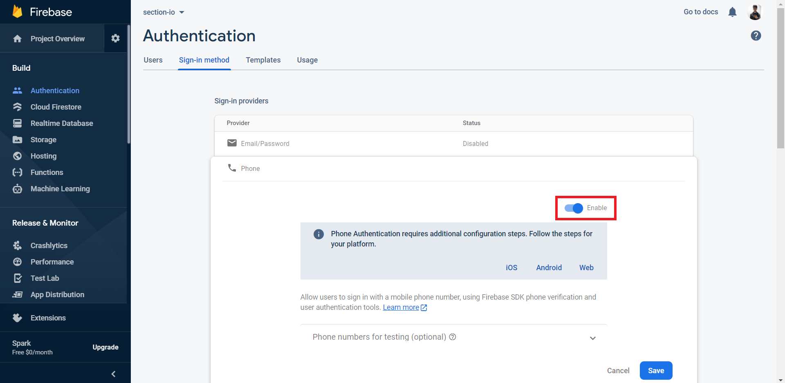
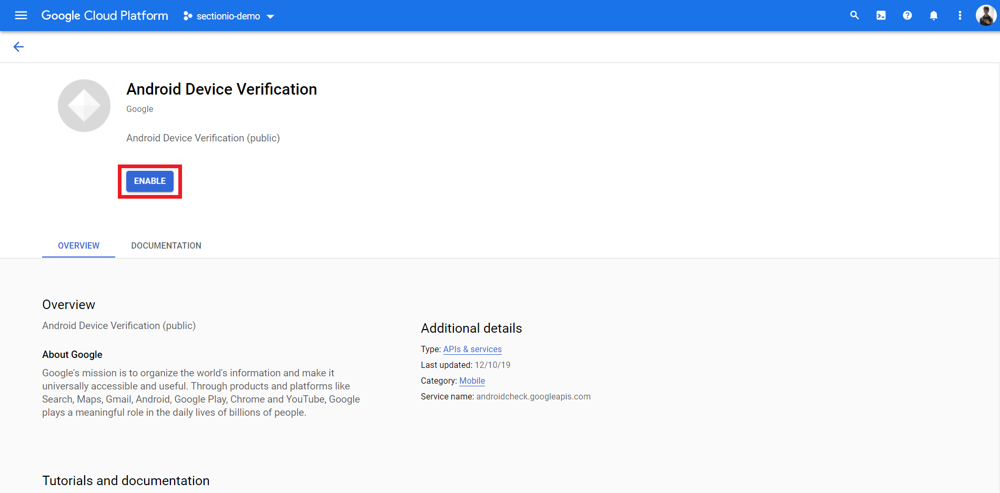

In this tutorial, we will learn how to authenticate users with their phone number using Firebase's authentication module in a Non-Expo React Native application.

### Firebase

Firebase is a platform developed by Google for creating mobile and web applications. It was originally an independent company founded in 2011. In 2014, Google acquired the platform and it is now their flagship offering for app development.

Firebase's authentication module provides backend services and SDKs to authenticate users in your app. It supports authentication using passwords, phone numbers, popular identity providers like Google, Facebook and Twitter, and more.

### Prerequisites

The basics of React and React Native will not be covered in this tutorial. If you are not comfortable with the basics, this is a [helpful tutorial](https://reactnative.dev/docs/tutorial).

### Overview

We'll be going through these steps in this article:

1. Development environment.
2. Setting up the Firebase project.
3. Setting up Firebase Authentication.
4. Installing dependencies.

### Development environment

> **IMPORTANT** - We will not be using Expo in our project.

You can follow [this documentation](https://reactnative.dev/docs/environment-setup) to set up the environment and create a new React app.

Make sure you're following the React Native CLI Quickstart, not the Expo CLI Quickstart.


### Installing dependencies

You can install these in advance or while going through the article.

```JSON
"@react-native-firebase/app": "^10.5.0",
"@react-native-firebase/auth": "^10.5.1",
"react": "16.13.1",
"react-native": "0.63.4"
```

To install a dependency, run:

```bash
npm i --save <package-name>
```

After installing the packages, for iOS, go into your `ios/` directory, and run:

```bash
pod install
```

> **IMPORTANT FOR ANDROID**
>
> Adding more native dependecies may bump you over the 64k method limit on the Android build system. If you reach this limit, you will see the following error while attempting to build your Android application.
>
> `Execution failed for task ':app:mergeDexDebug'.`
>
> Use [this documentation](https://rnfirebase.io/enabling-multidex) to enable multidexing.
> To learn more about multidex, view the official [Android documentation](https://developer.android.com/studio/build/multidex#mdex-gradle).

### Setting up the Firebase project
Head to the [Firebase console](console.firebase.google.com/u/0/) and sign in to your account.

Create a new project.


Once you create a new project, you'll see the dashboard.


Now, click on the Android icon to add an android app to the Firebase project.


You will need the package name of the application to register the application. You can find the package name in the `AndroidManifest.xml` which is located in `android/app/src/main/`.


You will also need the Debug signing certificate `SHA-1`. You can get that by running the following command in the application directory.

```bash
cd android && ./gradlew signingReport
```

This will generate the signing certificate of the application. You will get a similiar output like this:

```bash
Variant: debugUnitTest
Config: debug
Store: C:\Users\Mohan\.android\debug.keystore
Alias: AndroidDebugKey
MD5: 5F:BB:9E:98:5E:E7:E6:29:19:28:61:4F:42:B9:74:AB
SHA1: 9E:61:75:0E:5C:F4:EB:B4:EB:9D:B3:13:5F:50:D6:AB:2E:4E:12:0D
SHA-256: 6C:BB:49:66:18:B9:7F:74:49:B5:56:D0:24:43:6A:1B:41:91:97:A3:2E:7C:4A:6E:59:40:8F:5C:74:6F:CC:93
Valid until: Friday, December 23, 2050
```

Copy the `SHA1` value and paste it in the firebase console.

Now, Proceed to the next step, you can download the `google-services.json` file. You should place this file in the `android/app` directory.

This file contains configurations that'll enable your application to access firebase services.


After adding the file, proceed to the next step. It will ask you to add some configurations to the `build.gradle` files.

First, add the `google-services` plugin as a dependency inside of your `android/build.gradle` file:

```gradle
buildscript {
  dependencies {
    // ... other dependencies

    classpath 'com.google.gms:google-services:4.3.3'
  }
}
```

Then, execute the plugin by adding the following to your `android/app/build.gradle` file:

```Gradle
apply plugin: 'com.android.application'
apply plugin: 'com.google.gms.google-services'
```

You need to perform some additional steps to configure `Firebase` for `iOS`. Follow [this documentation](https://rnfirebase.io/#3-ios-setup) to set it up.

Finally, We should install the `@react-native-firebase/app` package in our app to complete the set up for Firebase.

```bash
npm install @react-native-firebase/app
```

### Setting up Firebase Authentication

Head over to the Authentication section in the dashboard and click on the `Get Started` button. This will enable the authentication module in your project.


Next, you should enable the phone authentication in the sign-in methods. Once you've enabled it, press save.



Firebase must be able to verify that the requests are coming from your app.

There are two ways to accomplish this:

1. **SafetyNet**: If the user has a device with Google Play Services installed, then Firebase can verify whether the request is legitimage.

    In the Google Cloud console, enable the [Android Device Verification API](https://console.cloud.google.com/apis/library/androidcheck.googleapis.com) for your project. The default Firebase API Key will be used, and needs to be allowed to access the DeviceCheck API.

    

2. **reCAPTCHA**: In the event that SafetyNet cannot be used, Firebase does a *reCAPTCHA* verification. The *reCAPTCHA* challenge can often be completed without the user having to solve anything. 

    > Please note that this flow requires that a SHA-1 is associated with your application.

Now, let's head to the application and install the auth module.

Let's install the `@react-native-firebase/auth` package in our app.

```bash
npm install @react-native-firebase/app
```

Let's declare the dependency for the authentication module in the `android/app/build.gradle` file using the [Firebase Android BoM](https://firebase.google.com/docs/android/learn-more?authuser=0#bom)

```gradle
dependencies {
    // Add these lines
    implementation platform('com.google.firebase:firebase-bom:26.3.0')
    implementation 'com.google.firebase:firebase-auth'
}
```

When `reCAPTCHA` is used for device verification, the application will open the browser for the `reCAPTCHA` test. So, we should also add `implementation "androidx.browser:browser:1.2.0"` in the  `android/app/build.gradle` file.

```gradle
dependencies {
    implementation platform('com.google.firebase:firebase-bom:26.3.0')
    implementation 'com.google.firebase:firebase-auth'

    // Add this line
    implementation "androidx.browser:browser:1.2.0
}
```

With this, the firebase authentication module is set up in our application.