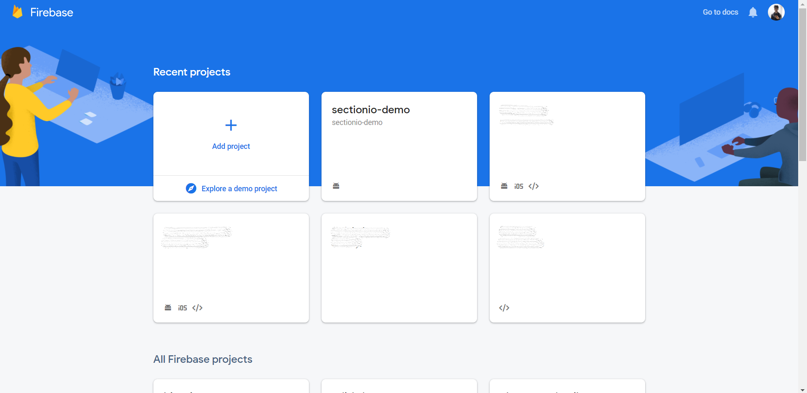

Firebase ML Kit's text recognition APIs can recognize text in any Latin-based character set. They can also be used to automate data-entry tasks such as processing credit cards, receipts, and business cards. In this tutorial, we will be building a Non-Expo React Native application to recognize text from an image using Firebase's ML kit.

Cloud Vision APIs allows developers to easily integrate vision detection features within applications, including image labeling, face and landmark detection, optical character recognition (OCR), and tagging of explicit content. [Cloud Vision Docs](https://cloud.google.com/vision/docs).

### Firebase
Firebase is a platform developed by Google for creating mobile and web applications. It was originally an independent company founded in 2011. In 2014, Google acquired the platform and it is now their flagship offering for app development. [Wikipedia](https://en.wikipedia.org/wiki/Firebase)

### Prerequisites

To proceed with this tutorial:

- You will need a fundamenal knowledge of React & React Native.

- You will need a Firebase project with the [Blaze plan](https://firebase.google.com/pricing) enabled to access the Cloud Vision APIs.

### Overview

We'll be going through these steps in this article:

1. Development environment.
2. Installing dependencies.
3. Setting up the Firebase project.
4. Setting up Cloud Vision API.
5. Building the UI.
6. Adding media picker.
7. Recognize text from the Image.
8. Additional configurations.
9. Recap.

You can take a look at the final code in this [GitHub Repository](https://github.com/zolomohan/react-native-firebase-ml-text-recognition).

### Development environment

> **IMPORTANT** - We will not be using [Expo](https://expo.io/) in our project.

You can follow [this documentation](https://reactnative.dev/docs/environment-setup) to set up the environment and create a new React app.

Make sure you're following the React Native CLI Quickstart, not the Expo CLI Quickstart.


### Installing dependencies

You can install these packages in advance or while going through the article.

```JSON
"@react-native-firebase/app": "^10.4.0",
"@react-native-firebase/ml": "^10.4.0",
"react": "16.13.1",
"react-native": "0.63.4",
"react-native-image-picker": "^3.1.3"
```

To install a dependency, run:

```bash
npm i --save <package-name>
```

After installing the packages, for iOS, go into your `ios/` directory, and run:

```bash
pod install
```

> **IMPORTANT FOR ANDROID**
>
> As you add more native dependencies to your project, it may bump you over the 64k method limit on the Android build system. Once you reach this limit, you will start to see the following error while attempting to build your Android application.
>
> `Execution failed for task ':app:mergeDexDebug'.`
>
> Use [this documentation](https://rnfirebase.io/enabling-multidex) to enable multidexing.
> To learn more about multidex, view the official [Android documentation](https://developer.android.com/studio/build/multidex#mdex-gradle).

### Setting up the Firebase project

Head to the [Firebase console](console.firebase.google.com/u/0/) and sign in to your account.

Create a new project.



Once you create a new project, you'll see the dashboard. Upgrade you project to the Blaze plan.


Now, click on the Android icon to add an android app to the Firebase project.


You will need the package name of the application to register the application. You can find the package name in the `AndroidManifest.xml` which is located in `android/app/src/main/`.


Once you enter the package name and proceed to the next step, you can download the `google-services.json` file. You should place this file in the `android/app` directory.


After adding the file, proceed to the next step. It will ask you to add some configurations to the `build.gradle` files.

First, add the `google-services` plugin as a dependency inside of your `android/build.gradle` file:

```gradle
buildscript {
  dependencies {
    // ... other dependencies

    classpath 'com.google.gms:google-services:4.3.3'
  }
}
```

Then, execute the plugin by adding the following to your `android/app/build.gradle` file:

```Gradle
apply plugin: 'com.android.application'
apply plugin: 'com.google.gms.google-services'
```

You need to perform some additional steps to configure `Firebase` for `iOS`. Follow [this documentation](https://rnfirebase.io/#3-ios-setup) to set it up.

We should install the `@react-native-firebase/app` package in our app to complete the set up for Firebase.

```bash
npm install @react-native-firebase/app
```
