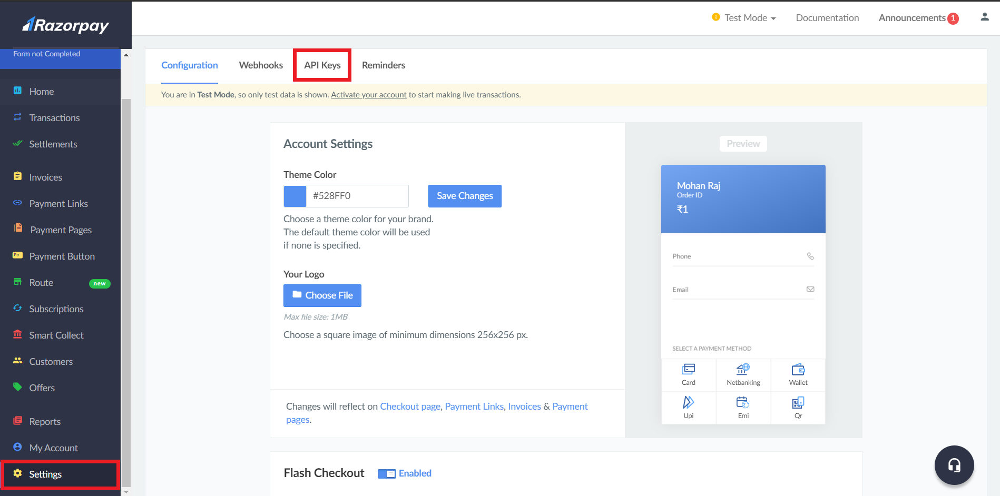

In this tutorial, we will be building a simple React Native application and integrate Razorpay to accept payments from users.

### Goals

By the end of this tutorial, you’ll know:

- The steps required to initiate and complete a Razorpay transaction.

- How to integrate Razorpay checkout to a React Native app.

- How to verify Razorpay payments.

### Prerequisites

In this tutorial, we will be working on the application and the server. The application will be built using React Native and the server will be built using Node.js and Express.

So, if you are not comfortable with the fundamentals of these technologies, Refer to these articles below before proceeding with this project.

- [React Native Tutorial](https://reactnative.dev/docs/tutorial).
- [Node.js & Express Tutorial](https://medium.com/@jaeger.rob/introduction-to-nodes-express-js-db5617047150).

You should also deploy the server to use it from the app. You can use Heroku or DigitalOcean to deploy the server.

If you do not know how to deploy a Node.js app, refer to the articles below.

- [Deploy Node.js App to Heroku](https://devcenter.heroku.com/articles/deploying-nodejs)
- [Deploy Node.js App to DigitalOcean](https://www.section.io/engineering-education/deploying-nodejs-web-app/)

### Razorpay

Founded in 2013, Razorpay is a payment gateway service. With Razorpay, you have access to all payment modes, including credit and debit cards, UPI, and popular mobile wallets to include it in your app.

If you'd like to learn more about Razorpay, refer to [this blog post](https://razorpay.com/blog/best-payment-gateway-india/).

### Overview

We'll be going through these steps in this article:

1. Create an Razorpay account.
2. Development environment.
3. Clone the starter code.
4. Install dependencies.
5. Create a Razorpay Order.
6. Add the Razorpay Checkout.
7. Verify Payment.
8. Recap.

### Creating an Razorpay account

Head to Razorpay and create an account. You can reach the signup page from [here](https://dashboard.razorpay.com/signup?captcha=invisible).

Fill in the details and create an account or you can signup with Google. Once you've signed up with all the necessary information, you'll see the dashboard.


Scroll down the navigation bar and select Settings.



In the Settings tab, you'll see a section called API keys. Enter that section.


Click on Generate Test Key. The website will display a modal with the Test API Key and a Secret Key. We'll need the keys in our app and our server.

> The secret key will be displayed only once this time and you won't be able to find it again if you don't make a copy of it now. The Test API Key and the Secret key must be kept safe.


### Development environment

> **IMPORTANT** - We will not be using Expo in our project. This is because the Razorpay Checkout is a wrapper around native SDK, so it doesn't work with Expo which doesn't support native modules.

You can follow [this](https://reactnative.dev/docs/environment-setup) documentation to set up the non-expo environment.

Make sure you're follwing the React Native CLI Quickstart, not the Expo CLI Quickstart.

### Clone the starter code

To focus more on the Razorpay Transactions, I've prepared a starter code. You can clone it [from this repository](https://github.com/zolomohan/rn-razorpay-app-starter) on GitHub. Follow the Repository's README for instructions.

In the starter code, I've set up a Checkout screen that will fetch random products from [fakestoreapi.com](https://fakestoreapi.com/).

### Installing dependencies

You can install these in advance or while going through the article.

```json
TODO: Add Dependencies
```

To install a dependency, run:

```bash
npm i --save <package-name>
```

After installing the packages, for iOS, go into your `ios/` directory, and run:

```bash
pod install
```

> **IMPORTANT FOR ANDROID**
>
> As you add more native dependencies to your project, it may bump you over the 64k method limit on the Android build system. Once you reach this limit, you will start to see the following error while attempting to build your Android application.
>
> `Execution failed for task ':app:mergeDexDebug'.`
>
> Use [this documentation](https://rnfirebase.io/enabling-multidex) to enable multidexing.
> To learn more about multidex, view the official [Android documentation](https://developer.android.com/studio/build/multidex#mdex-gradle).

### Razorpay Payment Process

There are 3 steps in the Razorpay payment process.

1. Creating an order.
2. Checkout.
3. Verifying Transaction.

Here is a sequence diagram of the payment flow.


### STEP 1: Creating an Order

We can create a Razorpay order and link them to payments. Every payment can be associated with an order to help prevent multiple payments.

Once a payment is captured, the order is marked as paid.

You can learn more about orders [here](https://razorpay.com/docs/api/orders/).

#### Server Side

Razorpay provides a node package to work with it's APIs. Working with their APIs require the API Key and the Secret Key.

It's not a good idea to expose these keys in the app, so we will write a server and make our app request this server to create an order.

Let's start with building the server.

> You'll need Node.js to set up an Express server. You can download Node.js from [here](https://nodejs.org/en/).
> To test the server, I'll be using [Postman](https://www.postman.com/) to make requests to this server. You can download it from [here](https://www.postman.com/downloads/).

Let's install `Express` using `NPM`.

```bash
npm install express
```

Now, we can import `express` in our code to create a simple server module that'll listen on port 3000.

```JavaScript
const express = require("express");
const app = express();
app.use(express.json());

app.get("/", (req, res) => res.send("Razorpay Server"));

const port = process.env.PORT || 3000;
app.listen(port, () => console.log(`Razorpay Server listening at Port ${port}`));
```

You can start the server by running:

```bash
node index.js
```

This server will be listening on port 3000 and when you hit the `'/'` endpoint, it'll send `"Razorpay Server"`.

Now that we have the server setup, let's install the `razorpay` package.

```bash
npm install razorpay
```

Let's import `razorpay` in toour code.

```JavaScript
const Razorpay = require("razorpay");
```

Now that we have imported the module, Let's create an instance of `Razorpay`. To initialize the instance, we need to API key and the Secret Key. It is not a good idea to leave the keys in the code, so you can set environment variables and use them in the code.

```JavaScript
const razorpay = new Razorpay({
  key_id: process.env.APIKEY,
  key_secret: process.env.SECRETKEY,
});
```

Let's add a POST handler for a new endpoint called `'/createOrder'` to create an order.

```JavaScript
app.post("/createOrder", (req, res) => {
  // Create an Order
});
```

When the app requests this endpoint, the server will request the Razporpay's API to create an order.

The `razorpay` package provides a function to create an order. The amount and currency are mandotory details required to create an order. The app that requests this endpoint should provide these details in the request body.

> The amount must be in provided in the base denomination. For example, the amount must be in paisa for INR. 1 Rupee = 100 Paisa.

You can learn more about the create order API [here](https://razorpay.com/docs/api/orders/#create-an-order).

Let's write the code to create an order.

> Creating an order is an async function since it's an API call.

```JavaScript
app.post("/createOrder", async (req, res) => {
  try{
      const order = await razorpay.orders.create({
        amount: req.body.amount,
        currency: req.body.currency,
      });
      res.send(order);
  } catch (error) {
    res.send(error);
  }
});
```

Let's run this locally and test this with Postman.

Request Body:

```json
{
  "amount": 50000,
  "currency": "INR"
}
```

Response:

```json
{
  "id": "order_G99PhGAo41rsFB",
  "entity": "order",
  "amount": 50000,
  "amount_paid": 0,
  "amount_due": 50000,
  "currency": "INR",
  "receipt": null,
  "offer_id": null,
  "status": "created",
  "attempts": 0,
  "notes": [],
  "created_at": 1607125999
}
```


Now, deploy this server so that we can create an order from our app.

#### Client Side

From our app, we need to request our server's `/createOrder` endpoint to create an Razorpay order.

Let's write a function to request our server's endpoint. I'm using Axios to make requests from the app.

You can learn more about Axios [here](https://www.npmjs.com/package/axios).

I've deployed my server in heroku, so my URL for the server is `https://rn-razorpay.herokuapp.com/`. You can replace this URL with your server's URL.

```JavaScript
const createOrder = async () => {
  const { data } = await axios.post(
    'https://rn-razorpay.herokuapp.com/createOrder',
    {
      amount: product.price * 100,
      currency: 'INR',
    },
  );
  return data;
};
```

In the app's starter code, you'll find a function called `onPay`. This function will get called when the user presses the buy button.

Let's call the `createOrder` funtion from `onPay` to create an order.

```JavaScript
const onPay = async () => {
  setPaymentProcessing(true);
  // Step 1: Create Order
  const order = await createOrder();

  setPaymentProcessing(false);
};
```

### Step 2: Using Razorpay Checkout

