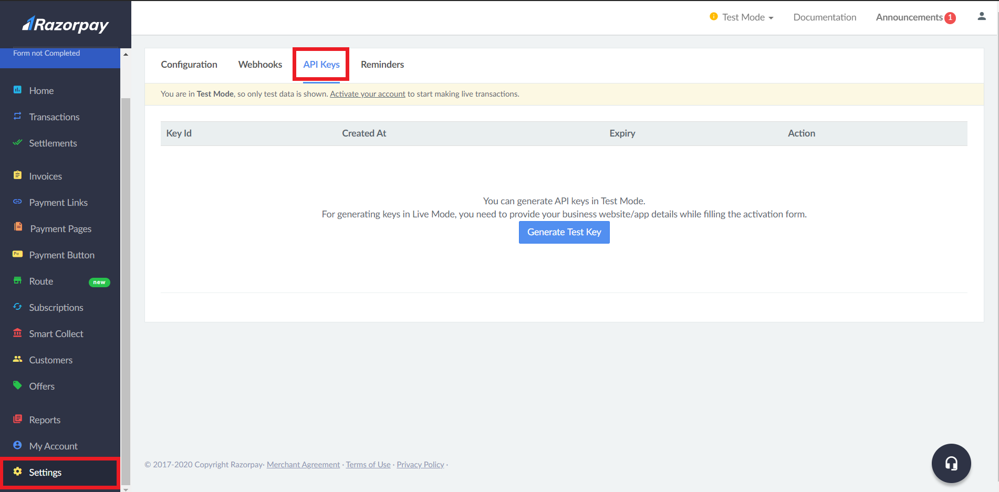

In this tutorial, we will be building a simple React Native application with fake data and integrate Razorpay to accept payments from the users.

### Goals
By the end of this tutorial, you’ll know:

- The steps required to initiate and complete a Razorpay transaction.

- How to integrate Razorpay checkout to a React Native app.

- How to verify payments.

### Prerequisites
In this tutorial, we will be working on the application and the server. The application will be built using React Native and the server will be built using Node.js and Express. 

So, if you are not comfortable with the fundamentals of these technologies, Refer to the articles below before proceeding with this project.

- [React Native Tutorial](https://reactnative.dev/docs/tutorial).
- [Node.js & Express Tutorial](https://medium.com/@jaeger.rob/introduction-to-nodes-express-js-db5617047150).

We will also be using Heroku to deploy the server. If you do not know how to deploy your Node.js app to Heroku, refer to [this article](https://devcenter.heroku.com/articles/deploying-nodejs).

### Razorpay
Founded in 2013, Razorpay is a payment gateway service. With Razorpay, you have access to all payment modes, including credit and debit cards, UPI, and popular mobile wallets to include it in your app.

If you'd like to learn more about Razorpay, refer to [this blog post](https://razorpay.com/blog/best-payment-gateway-india/).

### Overview
We'll be going through these steps in this article:

1. Creating an Razorpay account.
2. Development environment.
3. Clone the starter code.
4. Installing dependencies.
5. Creating a Razorpay Order.
6. Adding the Razorpay Checkoout.
7. Verify Payment.
8. Recap.

### Creating an Agora account
Head to Razorpay and create an account. You can reach the signup page from [here](https://dashboard.razorpay.com/signup?captcha=invisible).

Fill in the details and create an account or you can signup with Google. Once you've signed up with all the necessary information, you'll see the dashboard.


Scroll down the navigation bar and select Settings.


In the Settings tab, you'll see a section called API keys. Enter that section.



Click on Generate Test Key. The website will display a modal with the Test API Key and a Secret Key. We'll need the keys in our app and our server.

> The secret key will be displayed only once this time and you won't be able to find it again if you don't make a copy of it now. The Test API Key and the Secret key must be kept safe.


### Development environment
> **IMPORTANT** - We will not be using Expo in our project. This is because the Razorpay Checkout is a wrapper around native SDK, so it doesn't work with Expo which doesn't support native modules.

You can follow [this](https://reactnative.dev/docs/environment-setup) documentation to set up the non-expo environment.

Make sure you're follwing the React Native CLI Quickstart, not the Expo CLI Quickstart.

### Clone the starter code
To focus more on the Razorpay Transactions, I've prepared a starter code. You can clone it [from this repository](https://github.com/zolomohan/rn-razorpay-app-starter) on GitHub. Follow the Repository's README for instructions.

In the starter code, I've set up a Checkout screen that will fetch random products from [fakestoreapi.com](https://fakestoreapi.com/).

### Installing dependencies
You can install these in advance or while going through the article.

```json
TODO: Add Dependencies
```

To install a dependency, run:

```bash
npm i --save <package-name>
```

After installing the packages, for iOS, go into your `ios/` directory, and run:

```bash
pod install
```

> **IMPORTANT FOR ANDROID**
>
> As you add more native dependencies to your project, it may bump you over the 64k method limit on the Android build system. Once you reach this limit, you will start to see the following error while attempting to build your Android application.
>
> `Execution failed for task ':app:mergeDexDebug'.`
>
> Use [this documentation](https://rnfirebase.io/enabling-multidex) to enable multidexing.
> To learn more about multidex, view the official [Android documentation](https://developer.android.com/studio/build/multidex#mdex-gradle).