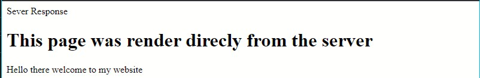
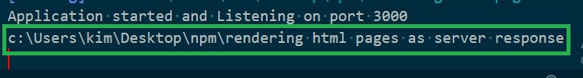
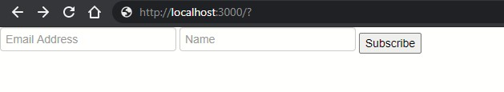
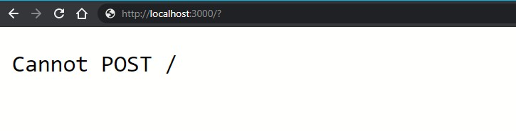
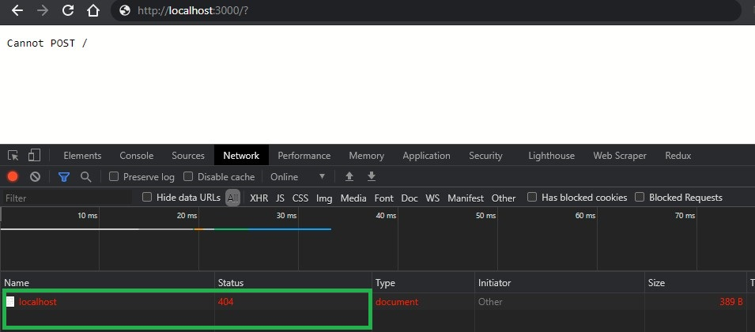
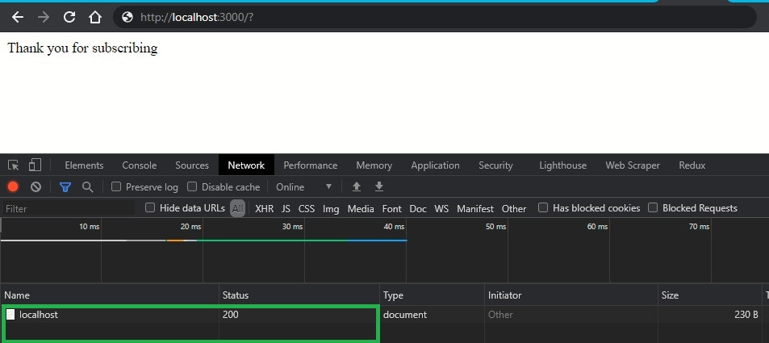
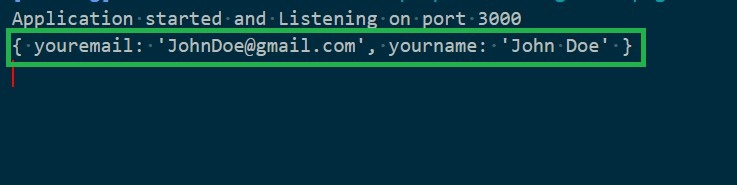
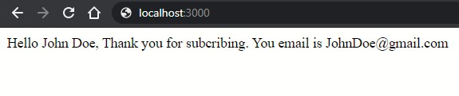

When developing web applications, you might need to render the HTML components inside your server. This helps you create interactive pages on the client side once a request to access these pages is made. There are various ways of hosting your HTML pages (website), for example;

- Rendering your client-side on its own using frameworks for such as React or,
- Rend the pages directly from the server - when the browser tries to access a route specified in your server, the server will load these HTML pages upon users' requests.

This guide will teach you how to render HTML elements and HTML pages on your server using Node.js.

### Prerequisites

Basic knowledge of using [Node.js](https://www.youtube.com/watch?v=fBNz5xF-Kx4) and [Express.js](/engineering-education/express/)

### What we will cover

- [Prerequisites](#prerequisites)
- [What we will cover](#what-we-will-cover)
- [Setting up](#setting-up)
- [Rendering inline Html elements as HTTP responses](#rendering-inline-html-elements-as-http-responses)
- [Render HTML web pages as server responses](#render-html-web-pages-as-server-responses)
- [Parsering form data to the server using the HTML forms](#parsering-form-data-to-the-server-using-the-html-forms)
- [Conclusion](#conclusion)

### Setting up

- [Download Node.js](https://nodejs.org/en/) and install it. Run `node -v` to test if the installation was successful.

```bash
$ node -v
v12.18.3 ## installed node.js version
```

- Create a Node.js project/directory. Initialize the project within the directory you have created. Use `npm init -y` to automatically initialize this Node.js project or check this [guide](/engineering-education/beginner-guide-to-npm/) to learn more about using NPM.
- Install the Express framework using `npm install express`. Check this [guide](/engineering-education/express/) to learn more about of Express.
- We will create a server using Express. You may want to hook the server with Nodemon. It is an optional package (installed globally) which automatically restarts the server after saving server-side code changes. Go ahead and install Nodemon using `npm install -g nodemon`. Check this [guide](https://www.npmjs.com/package/nodemon) to learn more about Nodemon.

### Rendering inline Html elements as HTTP responses

Below is a [simple hello world HTTP server](https://expressjs.com/en/starter/hello-world.html) (`app.js`) listening on port 3000.

```js
const express = require("express");
const app = express();

app.listen(3000, () => {
  console.log("Application started and Listening on port 3000");
});

app.get("/", (req, res) => {
  res.send("Hello world!");
});
```

>Run `nodemon` to start the server.

Whenever the server is running, accessing the route `http://localhost:3000/`, will give you plain text `hello world!`.

We can use the same server to render HTML elements as the server response instead of sending plain text.

Here is a list of some HTML elements. We can render them directly into our server by specifying the response to send when the default route is accessed.

```js
const express = require("express");
const app = express();

app.listen(3000, () => {
  console.log("Application started and Listening on port 3000");
});

app.get("/", (req, res) => {
  res.send("<html> <head>server Response</head><body><h1> This page was render direcly from the server <p>Hello there welcome to my website</p></h1></body></html>");
});
```

Restart the server and open route `http://localhost:3000/` on the browser.



`res.send` is sending individual bits of HTML data to the server, but if we want to send an entire web page such as an `index.html`, we have to use something different.

### Render HTML web pages as server responses

The above can be very tiresome and not the type of code you want to write inside your server. In a normal web page, HTML elements are written in a `.html` file. This way, you can write all your HTML elements, including your CSS styling, to layout these elements. This way, you separate the server files and the HTML elements, thus a clean code setup.

To render an HTML file into the server using Express, we use `res.sendFile()`. This read and render the data that you include in your HTML files. This transfers the file over to the browser whenever it makes a [Get request](https://en.wikipedia.org/wiki/Hypertext_Transfer_Protocol#Request_methods) to the server. The server submits a response status with HTML rendered web content as the message body.

Here is the `res.sendFile()` syntax.

```js
res.sendFile(path [, options] [, fn])
```

The path specifies the location of the HTML file you want to use. The path takes an array of the file name such as `index.html`. In some cases, especially when the server is hosted on the cloud (when the server is not hosted locally on your computer), we use `__dirname` instead of the relative file path. When the server is online, you might have no idea of your HTML file location. `__dirname` will give you the current file path no matter where it's hosted inside you project folders.

Let’s demonstrate how `__dirname` works with a  simple example that `console.log(__dirname)`.

```js
const express = require("express");
const app = express();

app.listen(3000, () => {
  console.log("Application started and Listening on port 3000");
});

app.get("/", (req, res) => {
  console.log(__dirname)
});
```

Open the route `http://localhost:3000/` on the browser. This will print the values of `__dirname` into the console.



As you can see, it gives you the exact path to reach your server location.

Now we can send HTML files to the server using `__dirname`.

To start with, I have created an HTML form (`index.html`) and included some CSS styling (`app.css`), as shown below.

```html
<!DOCTYPE html>
<html lang="en"> 
<head>
  <meta charset="UTF-8">
  <meta name="viewport" content="width=device-width, initial-scale=1.0">
  <link rel="stylesheet" href="app.css">
  <link rel="stylesheet"
  href="//netdna.bootstrapcdn.com/twitter-bootstrap/2.3.2/css/bootstrap-combined.no-icons.min.css">
  <title>html form</title>
</head>
<body>
<div class="subscribe-container">
  <form method="POST">
    <input type="email" name="youremail" placeholder="Email Address" required>
    <input type="text" name="yourname" placeholder="Name" required>
    <input class="subscribe-button" type="submit" value="Subscribe">
  </form>
</div>
</body>
</html>
```

`app.css`

```css
.subscribe-container {
    max-width: 800px;
    margin: 60px auto;
    background-color: rgba(130, 184, 219, 0.5);
    border: 5px solid rgb(98, 143, 228);
}
.subscribe-container form {
    display: flex;
    flex-wrap: wrap;
}
.subscribe-container form input {
    margin: 15px;
    border: 1px solid rgb(98, 143, 228);
    padding: 0.4rem;
}
.subscribe-container form input {
    flex: 1 1 200px;
}

.subscribe-container form input[type="submit"] {
    border-radius: 3px;
    background-color: rgba(17, 228, 10, 0.5);
color: rgb(98, 143, 228);
}

.subscribe-container form input[type="email"] {
    flex: 1 1 250px;
}
```

Let's render the file into the server.

```js
const express = require("express");
const app = express();

app.listen(3000, () => {
  console.log("Application started and Listening on port 3000");
});

app.get("/", (req, res) => {
  res.sendFile(__dirname + "/index.html");
});
```



But notice, this didn’t load the CSS styling. `app.css` is a static file. To [static server files](https://expressjs.com/en/starter/static-files.html) included in the `index.html` use `express.static` as shown in the example below;

```js
const express = require("express");
const app = express();

app.listen(3000, () => {
  console.log("Application started and Listening on port 3000");
});

// serve your css as static
app.use(express.static(__dirname));

app.get("/", (req, res) => {
  res.sendFile(__dirname + "/index.html");
});
```

Save the file and open `http://localhost:3000/` in the browser, and the server will send a web page as expected.


### Parsering form data to the server using the HTML forms

The server is running. It's now returning HTML form as a response to the client (browser). Whenever you access this server's route, the `Get` request will be executed from the browser. But what would happen if you fill this form with the data and press the button subscribe?

Let's try that out. This gives you the results below, an error returned by the server.



Reload the page again. Open the browser inspector tool and head to the Network tab. Fill in the form data and click the subscribe button. This will give you a 404 status code. This means the client cannot send/POST data to the server.



The HTML form we have created has a `POST` method. This means we are sending a POST request to the server.

Our server does not have a way of processing any POST requests from the client. The server does not give the client a `POST` permission from this route.

We can fix this by adding a `post` method to the route. This will handle any POST requests that come from this route.

```js
const express = require("express");
const app = express();

app.listen(3000, () => {
  console.log("Application started and Listening on port 3000");
});

// server your css as static
app.use(express.static(__dirname));

app.get("/", (req, res) => {
  res.sendFile(__dirname + "/index.html");
});

app.post("/", (req, res) => {
  res.send("Thank you for subscribing");
});
```

When you click the subscribe button, you will get the `Thank you for subscribing` message back. And if you check your browser inspector network, this time you'll get a 200 code, which is okay. The client has POST permissions and can send a POST request to the server.



Everything is working great. But we need the server to get the form data and send the relevant results to the browser instead of sending some relative plain text such as `Thank you for subscribing`.

To interact with the form data, we need a body-parser package. Go ahead and install this package using `npm install body-parser`. [Body-parser](https://www.npmjs.com/package/body-parser) helps you parse incoming request bodies in a middleware before your handlers, available under the req.body property.

Import the package using the `require()` function and get the server to use it using `app.use`. Body-parser has a few modes such as;

- `bodyParser.text` - pass all the requests into text.
- `bodyParser.json` - parse data into JSON format.
- `bodyParser.urlencoded` - commonly used when getting data posted from HTML forms.

In this example, we will use the `bodyParser.urlencoded` format to interact with the form data.

Body-parser allows you to go into any of your routes using `req.body` and get a parsed version of HTTP requests made to the server.

With the body-parser, we can access this form data and interact with it. Let try to console log `req.body` to get a grip of a parsed HTTP request;

```js
const express = require("express");
const bodyParser = require("body-parser");
const app = express();

app.listen(3000, () => {
  console.log("Application started and Listening on port 3000");
});

// server css as static
app.use(express.static(__dirname));

// get our app to use body parser 
app.use(bodyParser.urlencoded({ extended: true }))

app.get("/", (req, res) => {
  res.sendFile(__dirname + "/index.html");
});

app.post("/", (req, res) => {
  console.log(req.body)
});
```

Open `http://localhost:3000/`. Fill in the form inputs and click the subscribe button. Check your console.


And yes, This form data is readily available, and we can now instruct the server what to do with it.

```js
const express = require("express");
const bodyParser = require("body-parser");
const app = express();

app.listen(3000, () => {
  console.log("Application started and Listening on port 3000");
});

// server css as static
app.use(express.static(__dirname));

// get our app to use body parser 
app.use(bodyParser.urlencoded({ extended: true }))

app.get("/", (req, res) => {
  res.sendFile(__dirname + "/index.html");
});

app.post("/", (req, res) => {
  var subName = req.body.yourname
  var subEmail = req.body.youremail;
 res.send("Hello " + subName + ", Thank you for subcribing. You email is " + subEmail);
});
```

Fill in the form inputs and click the subscribe button.



>NOTE: The information stored in variables `subName` and `subEmail` correspond to `yourname` and `youremail` respectively. `yourname` and `yourname` naming comes from the `name attribute` of your HTML form inputs. This way, you can use the form data and decide what happen to each of the inputs as if they were just properties of the object body.

### Conclusion
I hope this guide helped you understand how to render HTML data into your server using Express. You can also use a template engine such as [pug](https://www.npmjs.com/package/pug) or [ejs](https://www.npmjs.com/package/ejs) render dynamic HTML data into the server. They both compile down HTML using backed technologies such as Express.