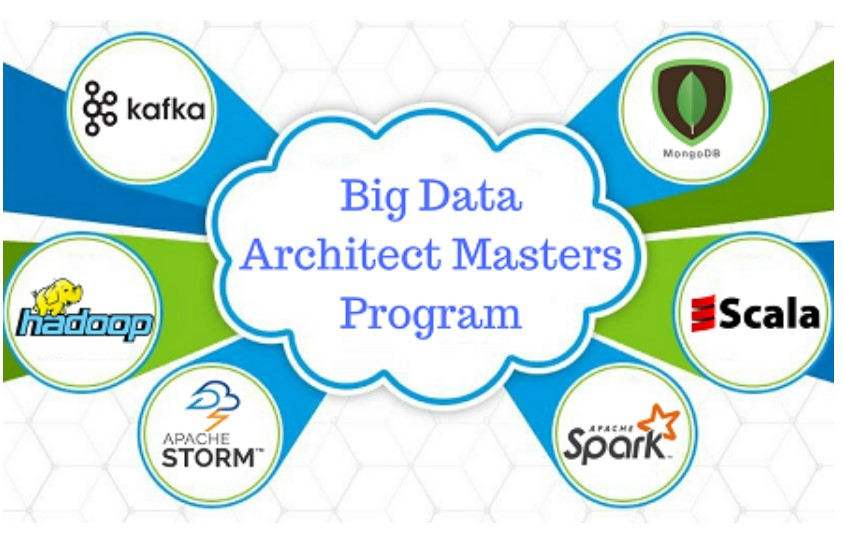

# Roles in Data Science Industry

The data science industry has many synonyms associated with it. The terms artificial intelligence, machine learning, and data science are used interchangeably. The growth of the industry has led to phenomenal progress in the field of tech. Machine learning and data science's tremendous development has resulted in many jobs. One needs to be careful while preparing for roles involving data science and machine learning. We decipher the responsibilities and various technologies associated with each position. Let us begin by listing the prominent roles. 

1. Machine Learning Engineer
2. Machine Learning Scientist
3. Data Analysts
4. Data Architect

The roles mentioned above are all equally exciting and challenging. Each one has its own set of requirements, and I hope reading this article will allow you to choose the role of your dreams. Let's begin.

### Machine Learning Engineer
Machine learning engineers deal predominantly with the implementation of the algorithms. The algorithm discovery is a crucial step performed by ML Scientists. The team of ML engineers works on ensuring the algorithms work under the constraints. For example, consider the Generative Pre-Trained Language Model. It is responsible for the ImageNet moment in the field of Natural Language Processing. The GPT is available via various open-source domains. When a company has a particular use case for a specific product, this algorithm needs to be modified or extended. Multiple changes are applicable. For example:

1. Input Data: The data that will be input to the model in the live environment will most probably be different from the data used to train it in the first place. Therefore, the model needs to be re-trained or trained from scratch, depending on the use case. Thus, data *pre-processing* is one of the critical jobs of a machine learning engineer. Understanding data is essential to fine-tune models. 

2. Incorporating changes in the algorithm: The original algorithm may be suited for a specific set of problems. Refining the models is essential to enhance its capabilities. Sufficient knowledge about machine learning algorithms is required to do so.

3. Integration with hardware devices: The need for placing in-device intelligence to enhance user experience and improve privacy features has resulted in implementing liter versions of such models. Liter versions require less computing power and fewer data to make efficient decisions.
    
### Machine Learning Scientist
Machine learning scientists work on cutting edge research. Their role is to develop and try out new model architectures to create innovative and efficient ways of solving challenging problems. The Google DeepMind team is responsible for the [RankBrain](https://www.searchenginejournal.com/google-algorithm-history/rankbrain/) algorithm. A group of ML Scientists came together to develop knowledge graphs. Graphs have been a frequently used data structure ever since the inception of Computer science. Distributed representations called word vectors help with search queries. Let us look at an example of a word vector. What amazes me is the degree of abstraction that computer science has achieved. 


[Image Source](https://www.analyticsvidhya.com/blog/2017/06/word-embeddings-count-word2veec/)

Consider the example shown above. The word vectors are representations for words that capture various levels of semantic details. General operations such as addition, subtraction can be performed on these vectors. For example:

```
king + woman - man -> queen
```
#### Frame the problem

Given a problem statement, what are some of the Key Performance Indicators(KPIs) suitable for the problem? How do we define the problem such that it optimizes the use case and generalizes overall edge cases? For example, how do we formulate the problem of self-driving cars? The research in this field has advanced a lot. Let us look at the steps involved in self-driving cars:

*[Image Source](https://arxiv.org/pdf/1910.07738.pdf)*

Each block in the flowchart represents an individual problem to be solved. Formulating individual problems and identifying particular KPIs progresses the overall project. This is the role of the machine learning scientist. It is the company's backbone, and now we know why ML scientists are paid a considerable sum.


### Data Analysts
Ever wondered who crunched the petabytes of data? It is the role of the data analysts. Data analysts are empowered with tools to deduce patterns from data. They are involved with data warehousing. A term commonly used is ETL, which stands for Extract, Load, and Transform. Tools for ETL are extensively used to build data warehouses. The first step is creating the data warehouses where data is stored in a structured and efficient manner. Next comes the aspect of data crunching. The data is identified and obtained systematically, and datasets are created. These datasets are designed for specific use cases. 

Data analysts usually work in SQL based environments. They also perform exploratory data analysis to enhance the dataset creation process and analysis phase.  
Coordinating with ML engineers and scientist is a critical aspect of the job, as datasets created will be used by them.


### Data Architect
Data architect takes up a large chunk of the responsibility for the data science team in a company. They ensure the backend infrastructure for performing all the data-science related tasks. Moreover, once the models are built, providing scalable, reliable, secure, and cost-efficient data, pipelines are their primary job. Data architecture is one of the significant components of big data. Designing the architecture of the data flow using various emerging technologies is a useful skill to have. If you are good at learning new technologies at a breakneck pace, this might be the right job for you. 



[Image Source](https://www.karmelsoft.com/skills-every-big-data-architect-needs/)

The above image shows the various technologies a data architect deals with. There is a logical explanation for the entire process of what a data architect does. The steps can be summarized into five key points: 
   1. Data ingestion: For example, consider the millions of likes, comments, and shares that Facebook deals with. Therefore, scalable infrastructure is required to support such massive amounts of input data. Several software frameworks support efficient ingestion of data. 
   2. Data Storage: Storing petabytes of data efficiently is necessary for easy retrieval. Therefore, many ecosystems have been built around this aspect.
   3. Data processing: Processing data refers to ensuring models developed ML scientists and engineers take in the input and give the desired output. 
   4. Data Analysis: Certain algorithms such as recommendation engines analyze the viewing data in real-time and give millions of recommendation every second. Just imagine the scale of operations. A genuine appreciation for the tools is developed. 
   5. Data exploration: Many processes are automated to ensure the other three roles have minimal trouble while exploring data. For example, categorical features are encoded using various encoding schemes. 

Having considered the various responsibilities, let us look at some of the technologies used to implement the same.
 
### Tools and Technologies Commonly Used


1. Machine Learning Engineer: 
   1. Exploratory Data Analysis Tools: [Excel](https://www.microsoft.com/en-us/microsoft-365/excel), [Matlpotlib](https://matplotlib.org/), [Seaborn](https://seaborn.pydata.org/), [H20](https://www.h2o.ai/)
   2. Embedded Systems: [Raspberry-pi](https://www.raspberrypi.org/), [Beaglebone Black](https://beagleboard.org/black),[ Nvidia Jetson](https://developer.nvidia.com/buy-jetson), [Movidius](https://www.intel.com/content/www/us/en/products/processors/movidius-vpu.html)
   3. Programming environments: [Anaconda](https://www.anaconda.com/), [H20.ai](https://www.h2o.ai/)
   4. Programming Languages: [Python](https://www.python.org/), C/C++
   5. Commonly used libraries: [Tensorflow](https://www.tensorflow.org/), [PyTorch](https://pytorch.org/), [Tensorflow Lite](https://www.tensorflow.org/lite), [Scikit-learn](https://scikit-learn.org/) 
2. Machine Learning Scientist:
   1. Machine Learning Frameworks: [Tensorflow](https://www.tensorflow.org/), [PyTorch](https://pytorch.org/), [MxNet](https://mxnet.apache.org/), [Caffe](http://caffe.berkeleyvision.org/)
   2. Parallel and Distributed Programming Framweworks: [CUDA](https://developer.nvidia.com/cuda-downloads), [OpenGL](https://www.opengl.org/)
3. Data Analysts:
   1. Exploratory Data Analysis:
   2. Databases Management Systems: 
      1. SQL based systems: [MySql](https://www.mysql.com/), [PostgreSQL](https://www.postgresql.org/)
      2. NoSQL based systems: [mongoDB](https://www.mongodb.com/), [Redis](https://redis.io/), [Cassandra](http://cassandra.apache.org/) 
   3. Programming languages: Python, [R](https://www.r-project.org/) (used for statistical analysis of data)
4. Data Architect: 
   1. Data ingestion: [Flume](https://flume.apache.org/), [Sqoop](https://sqoop.apache.org/), [Nifi](https://nifi.apache.org/)
   2. DAta Storage: [Hadoop Distributed File Systems](https://hadoop.apache.org/) (HDFS), [HBase](https://hbase.apache.org/)
   3. Data processing: [mapReduce](https://hadoop.apache.org/docs/current/hadoop-mapreduce-client/hadoop-mapreduce-client-core/MapReduceTutorial.html), [Spark](https://spark.apache.org/)
   4. Data Analysis; [Hive](https://hive.apache.org/), [Impala](https://impala.apache.org/overview.html), [Pig](https://pig.apache.org/)
   5. Data exploration: [Cloudera](https://www.cloudera.com/), [Databricks](https://databricks.com/)
### Conclusion

We have looked at the various roles and the technologies associated with them. The importance of each of these roles is highly significant towards the growth of the company. Being well-paid jobs, these offer an opportunity to work on technology that is just emerging and very young. 