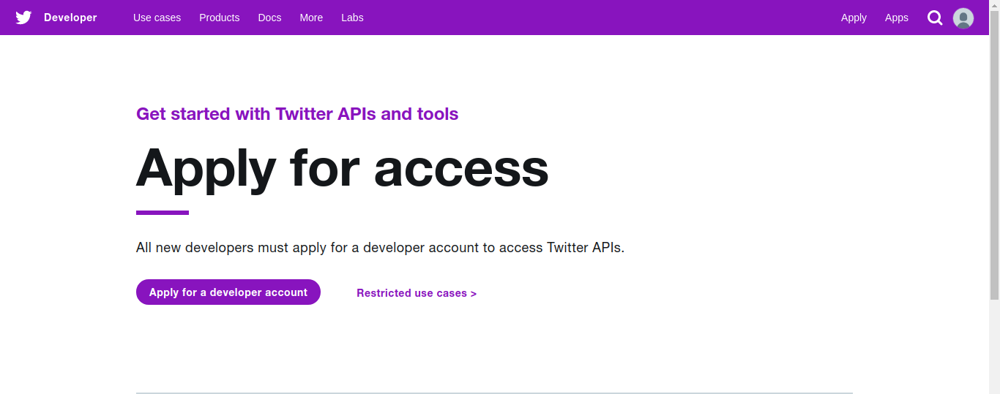
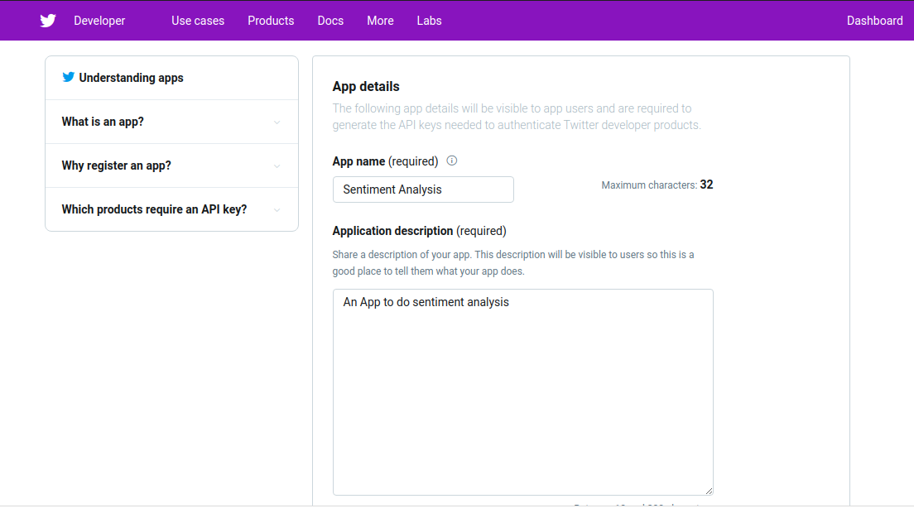
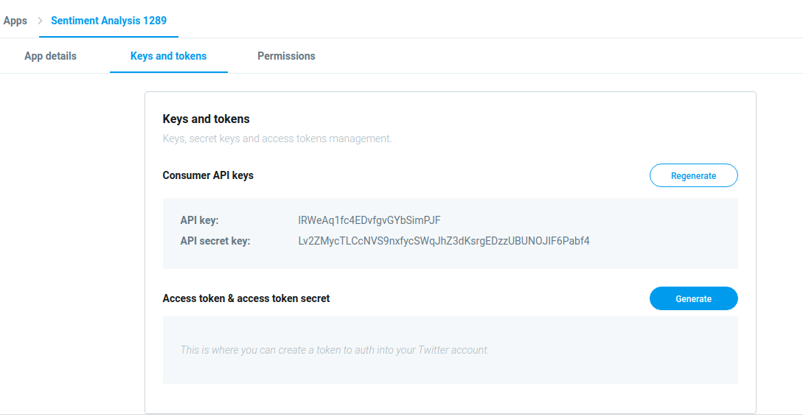
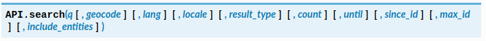

# Sentiment Analysis of Twitter data
Social networks are the main resources to gather information about people’s opinion and sentiments towards different topics as they spend hours daily on social medias and share their opinion. In this article we shall discuss about the applications of sentiment analysis and how to connect to twitter and run sentiment analysis queries. Basic knowledge of [Python](https://www.python.org/about/gettingstarted/) is required for understanding the code. 

Sentiment analysis is the process of extracting the *sentiment* from a piece of text and to classify it as **positive**, **negative** or **neutral** accordingly.

### Why Sentiment Analysis on Twitter ?

Sentiment analysis has many applications for different domains for example in business to get feedbacks for products by which companies can learn user's feedback and reviews on social media.  Social networks is a rich platform to learn about people's opinion and sentiment regarding different topics as they communicate and share their opinions. [Twitter](https://twitter.com/) has 1.3 billion accounts with a 330 million monthly active users and 145 million daily users. Twitter data is the most comprehensible source of live, public conversations worldwide. Understand customer sentiment as people and markets respond to product and business decisions. Sentiment analysis can predict the outcome of upcoming events, evaluate the impact of a recent product launch, pivot the direction or content of an ad campaign, and more.  

## Sentiment analysis with python

We will use the Twitter API to get realtime tweets and perform sentiment analysis and visualize our findings.

### Setup development environment 
Install the required libraries using `pip`.
	
	pip install tweepy
	pip install textblob
	pip install nltk

You should have a Twitter account. Apply for [developer account](https://developer.twitter.com/en/apply-for-access). Fill out the details asked in the subsequent steps. 


Submit the application and wait for developer access.


After getting access, we need to create an [app](https://developer.twitter.com/en/apps/) and API key in order to authenticate and integrate with most Twitter developer products.


Fill out the required details. Ignore the fields you dont need ( these are used for authenicating with twitter and other use cases.)



Go to the `Keys and Tokens` tab under your app to get the API key and API secret key (Do not share with others). 



### Lets get cracking
Let's start coding. We use a python library called [tweepy](https://tweepy.org) for authenticating and getting information from the Twitter API. You can also use [Twitter](https://pypi.org/project/twitter/).

```python
import tweepy

access_token = "xxxx"
access_token_secret = "xxxx"
consumer_key = "xxxx"
consumer_secret = "xxxx"

auth = tweepy.OAuthHandler(consumer_key, consumer_secret)
auth.set_access_token(access_token, access_token_secret)
```
Tweepy's API classs provides access to the entire twitter [RESTful](https://www.tutorialspoint.com/restful/restful_introduction.htm) API methods. Each method can accept various parameters and return responses. 

We will use [API.search](http://docs.tweepy.org/en/latest/api.html) which returns a collection of relevant tweets matching a specified query. A raw tweet may contain many unwanted characters and information which may not be neccessary like emoji, "@" mentions, "#" hastags, etc. These may be useful in some other scenario.



```python
qurery=""
count=""
tweets = api.search(q=query, count=count) 
text = []
for i in tweets:
	text.append(i.text)
#we are extracting text and excluding metadata from the tweet
#this method is useful for getting tweets related to a particular topic
```
We can also use `API.mentions_timeline` to get the most recent tweets where your organizations has been tweeted about. 

Next, we clean the text before using sentiment analysis. 

```python
import re
text = re.sub('@[A-Za-z0–9]+', '', text)
text = re.sub('#', '', text)
text = re.sub('RT[\s]+', '', text)
text = re.sub('https?:\/\/\S+', '', text)
#removed @mentions, #hastags and URLs
```
We will use the [TextBlob](https://textblob.readthedocs.io/en/dev/quickstart.html?highlight=sentiment#sentiment-analysis) library to get the sentiment of the text. 

```python
from textblob import TextBlob 
text = cleaned_tweet

blob = TextBlob(text)
sentiment = blob.sentiment.polarity
#blob.sentiment returns (polarity,  subjectivity)
#polarity is within the range [-1.0, 1.0]. -1 very negative. 0 neutral. 1 very positive
#The subjectivity is a float within the range [0.0, 1.0] where 0.0 is very objective and 1.0 is very subjective.
```
TextBlob has [Naive-Bayes](https://en.wikipedia.org/wiki/Naive_Bayes_classifier) classifier which we can use to classify text.

#### How Sentiment Analysis works ?

Let's examine two sentences, * This is a beautiful day, I am very happy* and * What a horrible person *, when we read these sentences the words `happy`, `beautiful` describe the positivity of the sentence 1 and the words `horrible` describes the negativity of sentence 2, words like `is`, `a` don't convey any particular sentiment and are neutral. We can have *rule based* systems that perform sentiment analysis based on a set of manually crafted rules or *Automatic* systems that rely on machine learning techniques to learn from data. These systems learn which words represent a positive sentiment and which represent negative. Of course, words have different meaning in different contexts and to different persons. So we can train a supervised machine learning algorithm to perform sentiment analysis. If you are interested you can look at my code [here](https://github.com/rohanreddych/stuff) where I implemented Sentiment Analysis using neural networks. 

### Sample Results


## Conclusion
Sentiment analysis can be very useful for teams like marketing and sales. It shows whether people are responding poorly or greatly to a product or service. Automated sentiment analysis coupled with Chatbots can provide respond to customer greivances and reduce human workload. Sentiment Analysis provides great insights into data.
