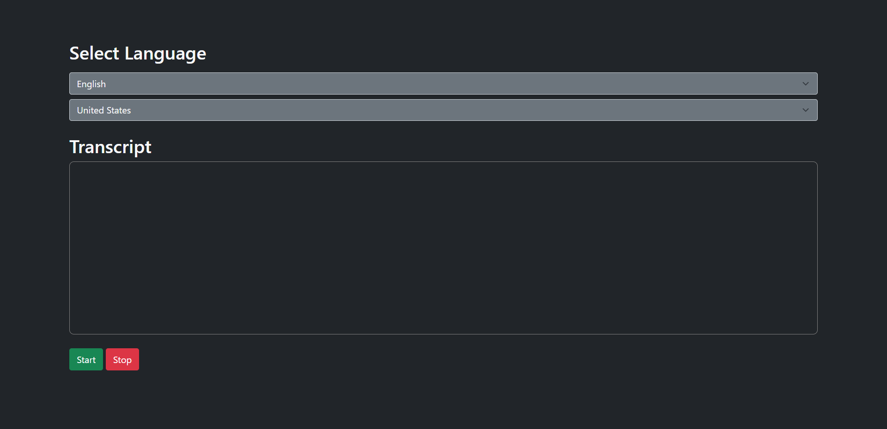

The Web Speech API is used to incorporate voice data into web apps. In this tutorial, we will build a simple webpage that uses the Web Speech API to implement speech recognition.

You can check the browser compatibility for the Web Speech API [here](https://developer.mozilla.org/en-US/docs/Web/API/Web_Speech_API#Browser_compatibility.).

### Prerequisites
To follow along with this tutorial, you should have:

- Basic understanding of HTML and JavaScript.

- A code editor. I'll be using [Visual Studio Code](https://code.visualstudio.com/download).

- A browser to view the webpage, preferably [Google Chrome](https://www.google.com/intl/en_in/chrome/) or [Firefox](https://www.mozilla.org/en-US/firefox/new/).

### Cloning the Starter Code
To focus more on the speech recognition, I've prepared a starter code. You can clone it [from this repository](https://github.com/zolomohan/speech-recognition-in-javascript-starter) on GitHub. Follow the Repository's README for instructions.

In the starter code, I've set up a language and dialect selecto, two buttons to start/stop the speech recognition and a box to display the transcript. I've used to [Bootstrap](https://getbootstrap.com/) to style the webpage.

