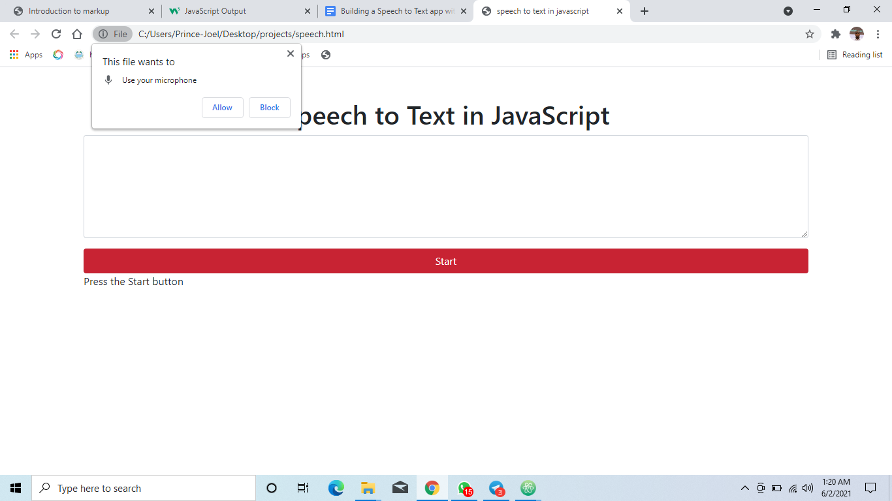
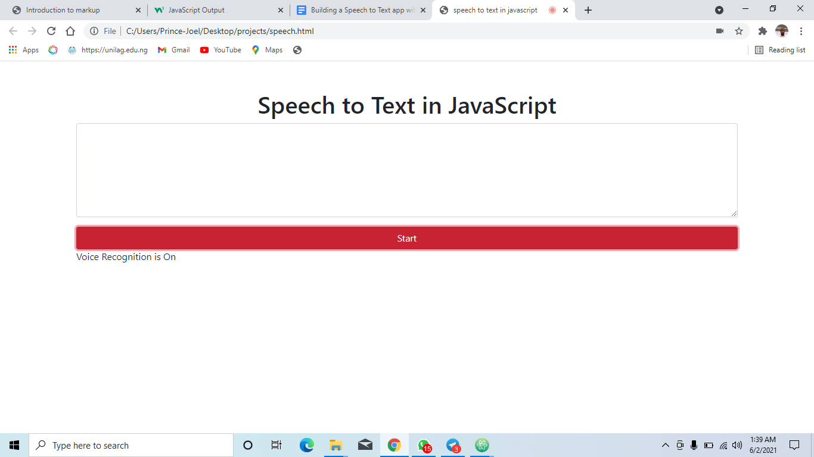
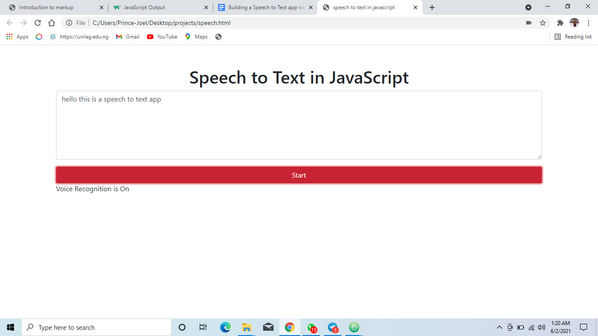
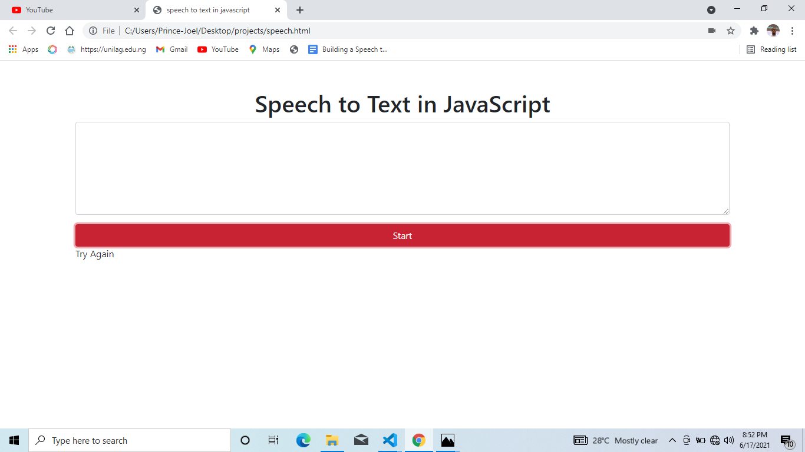

# Building a Speech to Text App with JavaScript

# Introduction

This article will cover how to build a speech-to-text application JavaScript using the [Web Speech Recognition](https://developer.mozilla.org/en-US/docs/Web/API/Web_Speech_API) API. Speech to text is the conversion of spoken words to text. You might have been looking for ways to convert spoken words to text or wondered if it’s possible and how you can do it. This article will answer all the questions you have.

# Getting Started

## Building the User Interface

Create a file named `speech.html` and paste the following code inside:

<!DOCTYPE html>

<html lang="en" dir="ltr">

<head>

 <meta charset="utf-8">

 <title>speech to text in javascript</title>

 <link rel="stylesheet" href="https://cdn.jsdelivr.net/npm/bootstrap@4.6.0/dist/css/bootstrap.min.css">

</head>

<body>

 

 <h1 class="text-center mt-5">

 Speech to Text in JavaScript

 </h1>

 

 <textarea id="textbox" rows="6" class="form-control"></textarea>

 

 

 <button id="start-btn" class="btn btn-danger btn-block">

 Start

 </button>

 
Press the Start button

 

 

 

 

</body>

</html>

In the code above, we designed the user interface for our speech-to-text application using HTML and CSS. However, for simplicity, we are going to use [Bootstrap](https://getbootstrap.com/) to ease the designing process.

We also created a `button` that will trigger the speech-to-text converter code, and the result is shown in the `textarea` we created above.

You should get a response similar to the image below when you open the `speech.html` file in your browser:

## Writing the JavaScript Code

Create a file named `script.js` and paste the following code inside:

var speechRecognition = window.webkitSpeechRecognition

var recognition = new speechRecognition()

var textbox = $("#textbox")

var instructions = $("#instructions")

var content = ''

recognition.continuous = true

// recognition is started

recognition.onstart = function() {

 instructions.text("Voice Recognition is On")

}

recognition.onspeechend = function() {

 instructions.text("No Activity")

}

recognition.onerror = function() {

 instruction.text("Try Again")

}

recognition.onresult = function(event) {

 var current = event.resultIndex;

 var transcript = event.results[current][0].transcript

 

 content += transcript

 textbox.val(content)

}

$("#start-btn").click(function(event) {

 recognition.start()

})

textbox.on('input', function() {

 content = $(this).val()

})

In the code above, we invoked the `Web Speech Recognition` API and initialized an instance stored in the `recognition` variable.

After this, we made references to our `#textbox` and `#instructions` elements we defined in the HTML using JQuery to control them from our code.

We also created a `content` variable that keeps track of text the application has converted and displayed in the `textarea` from the HTML file. We are initializing it to an empty string because we have not converted anything yet.

We then set the continuous variable of the `recognition` object to `true`. Thus, we are making the API continuously listen for input from the user’s microphone.

We created an event handler triggered whenever the user clicks on the `Start` button to start recognizing. When this happens, the recognition API is begun and will listen for input from the user.

When you press the button, your browser will request permission to use your microphone, as shown in the image below.

We also added a couple of event handlers to the `recognition` object to bring our application to life. They are onstart, onspeechend, onerror, and onresult.

The `onstart` event handler is triggered when the recognition API starts and has microphone access. Here, we programmed our application to inform the user that voice recognition is on and converts speech to text.

Next, we will write code for the `onresult` event handler. This event is triggered when the recognition API has successfully converted speech from the user’s microphone to text, and the data is made available via the `event.results` variable.

In this function, we will fetch the transcript of the speech given to us by the `event.results` variable, then update our previous `content` variable and `textarea` with the new results.

Now, the application is complete. If you click the `Start` button, you will see that it will automatically convert whatever you speak into text and fill the transcribed text inside the textbox.

We also created the `onerror` event handler triggered when an error occurs while transcribing the speech. If any error occurs during this process, our application will inform the user via the instruction box.

We also created the `onspeechend` event handler triggered when there is no input from the microphone, and the application is in an idle state. When this happens, our application will inform the user via the instruction box.

# Conclusion

In this article, we built a speech-to-text application with Javascript. We saw how easy it is to create a user interface interactive using HTML, CSS, and JavaScript, also saw how to import our web assets from CDNs, and got the chance to make our application able to convert speech to text successfully.

