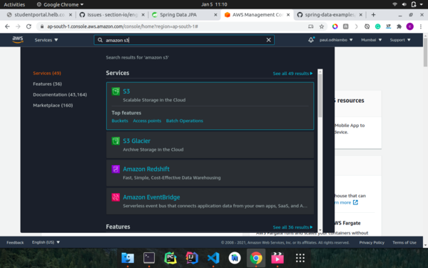
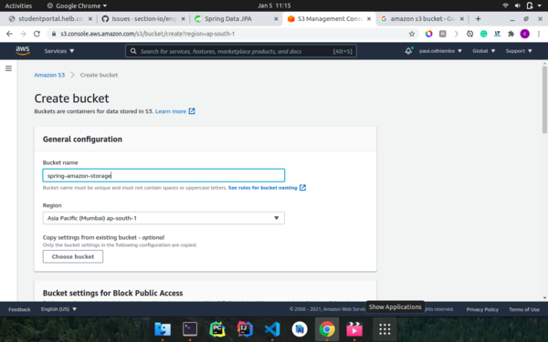
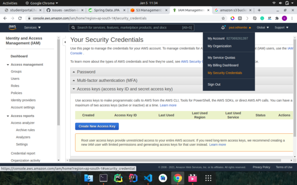
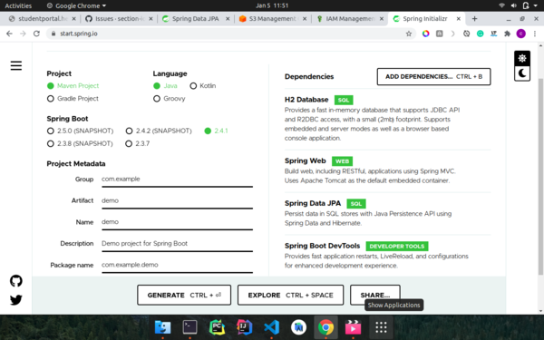
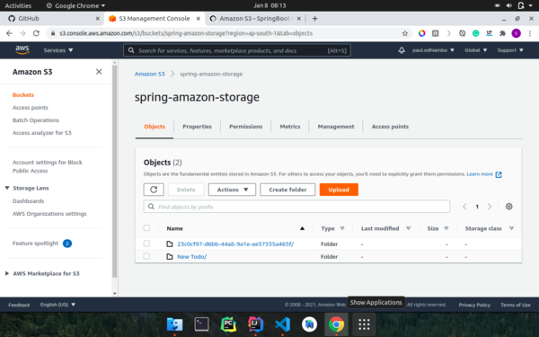

Amazon simple storage (Amazon S3) is a service offered by Amazon web services that offer scalable, secure, and performant object storage.

### Prerequisites
1. Some knowledge in [Java](https://www.javatpoint.com/java-tutorial) and [Spring Boot](https://spring.io/projects/spring-boot).
2. Java development kit installed on your computer.
3. Favourite IDE. I use [Intellij community edition](https://www.jetbrains.com/idea/download/) which is free.

### Amazon web services account
Before we start creating our application, head over to [Amazon console](https://portal.aws.amazon.com/billing/signup#/start), and create an account. You will be given 12 months of free access to various Amazon web services which you can use to test various Amazon services.

After signing up, head over to [Amazon console](https://ap-south-1.console.aws.amazon.com/console/home?region=ap-south-1#) and search for Amazon S3 in the search box provided in the console.



### Amazon S3 bucket.
After selecting amazon S3 from the above step, create a new S3 bucket which we will use to store the files we will be uploading from our application.


Name the bucket as `spring-amazon-storage` and leave all other settings as default and create the bucket.

### Access and secret keys
Create a new access key from my security credentials navigation menu as shown in the image below. Copy the access and the secret key generated as we will be using them to access the bucket we created earlier from the application we will be creating.



### Creating application
We will be using [spring initializr](https://start.spring.io/) to create our application. Head over to [spring initializr](https://start.spring.io/) and create a new Spring Boot application adding `h2`, `spring boot dev tools`, `spring data jpa` and `spring web` as dependencies then generate the project.



Unzip the downloaded project and open it in your favorite IDE.

### Adding Amazon SDK dependency
Amazon SDK makes it possible to interact with various Amazon services from our applications.
In the `pom.xml` file add the Amazon SDK dependency as shown below.
```xml
    <!-- https://mvnrepository.com/artifact/com.amazonaws/aws-java-sdk -->
    <dependency>
        <groupId>com.amazonaws</groupId>
        <artifactId>aws-java-sdk</artifactId>
        <version>1.11.931</version>
    </dependency>
```

### Configuration package
In the configuration package, we have two Java files, one which authenticates with Amazon S3 and the other which contains the bucket name.

```java
import com.amazonaws.auth.AWSCredentials;
import com.amazonaws.auth.AWSStaticCredentialsProvider;
import com.amazonaws.auth.BasicAWSCredentials;
import com.amazonaws.services.s3.AmazonS3;
import com.amazonaws.services.s3.AmazonS3ClientBuilder;
import org.springframework.context.annotation.Bean;
import org.springframework.context.annotation.Configuration;

@Configuration
public class AmazonConfig {
    @Bean
    public AmazonS3 s3() {
        AWSCredentials awsCredentials =
                new BasicAWSCredentials("accessKey", "secretKey");
        return AmazonS3ClientBuilder
                .standard()
                .withRegion("ap-south-1")
                .withCredentials(new AWSStaticCredentialsProvider(awsCredentials))
                .build();

    }
}
```
`AmazonConfig` class above is annotated with `@Configuration` annotation to make it available to the Spring context is a configuration class. With the Amazon credentials we got from the Amazon console earlier we will authenticate to S3 using the `AmazonS3ClientBuilder` available in the Amazon-SDK that we added to our `pom.xml` ealier.

```java
import lombok.AllArgsConstructor;
import lombok.Getter;

@AllArgsConstructor
@Getter
public enum BucketName {
    TODO_IMAGE("spring-amazon-storage");
    private final String bucketName;
}
```
In the `BucketName` enum above we pass in the bucket name that we created in the Amazon console earlier. The bucket will be used to store all of our file uploads.
- `@AllArgsConstructor` annotation generates a constructor with the `bucketName` variable in the enum.
- `@Getter` annotation generates a getter for the `bucketName` variable in the enum.
  
### Domain package
In this package we have the `Todo` model which represents our `Todo` in the database.
```java
@Data
@AllArgsConstructor
@NoArgsConstructor
@Builder
@Entity
public class Todo {
    @Id
    @GeneratedValue
    private Long id;
    private String title;
    private String description;
    private String imagePath;
    private String imageFileName;

}
```
- `@Data` annotation generates `getters`, `setters`, `toString` and `equals` methods for the `Todo` class.
- `@AllArgsConstructor` annotation generates a constructor with all the arguments for the `Todo` class.
- `@NoArgsConstructor` annotation generates a constructor with no arguments for the `Todo` class.
- `@Builder` annotation creates a builder pattern for the `Todo` class.
- `@Entity` annotation makes the `Todo` class a database entity.
- `@Id` annotation marks the `id` field as a primary key in the database.
- `@GeneratedValue` annotation makes the `id` field to auto-increment whenever a new `todo` is saved into the database.
  
### Repository package
In this package, we have the repository class that extends the JPA `CrudRepository` interface which makes it possible to perform various database queries.

```java
public interface TodoRepository extends CrudRepository<Todo, Long> {
    Todo findByTitle(String title);
}
```
### Service Package
```java
@AllArgsConstructor
@Service
public class FileStore {
    private final AmazonS3 amazonS3;

    public void upload(String path,
                       String fileName,
                       Optional<Map<String, String>> optionalMetaData,
                       InputStream inputStream) {
        ObjectMetadata objectMetadata = new ObjectMetadata();
        optionalMetaData.ifPresent(map -> {
            if (!map.isEmpty()) {
                map.forEach(objectMetadata::addUserMetadata);
            }
        });
        try {
            amazonS3.putObject(path, fileName, inputStream, objectMetadata);
        } catch (AmazonServiceException e) {
            throw new IllegalStateException("Failed to upload the file", e);
        }
    }

    public byte[] download(String path, String key) {
        try {
            S3Object object = amazonS3.getObject(path, key);
            S3ObjectInputStream objectContent = object.getObjectContent();
            return IOUtils.toByteArray(objectContent);
        } catch (AmazonServiceException | IOException e) {
            throw new IllegalStateException("Failed to download the file", e);
        }
    }

}
```
In the above `FileStore` class, we have the logic for uploading to and downloading files from Amazon S3.
In the `upload` method we pass in:-
  - `path` is the path on the Amazon S3 bucket where the file will be stored.
  - `fileName` is the actual name of the file being uploaded. It will be used as the key when downloading the file from S3.
  - `optionalMetaData` map contains the details of the file i.e file type and file size.
  -  `inputStream` contains the actual file that should be saved to Amazon S3. 
  ```java
      ObjectMetadata objectMetadata = new ObjectMetadata();
      optionalMetaData.ifPresent(map -> {
            if (!map.isEmpty()) {
                map.forEach(objectMetadata::addUserMetadata);
            }
        });
  ```
  The above code block loops through the `optionalMetaData` map adding all of the file information to the S3 `objectMetaData`.
  - `amazonS3.putObject(path, fileName, inputStream, objectMetadata);` saves the file to Amazon S3 bucket.

In the `download` method:-
  - ` S3Object object = amazonS3.getObject(path, key);` downloads the file from the path passed in and with the file name similar to the key passed in the `getObject` method.
  - `S3ObjectInputStream objectContent = object.getObjectContent();` gets an inputStream from the object returned from Amazon S3.
  - `IOUtils.toByteArray(objectContent)` converts the input stream to `byteArray` which can be sent over Restful APIs.

```java
public interface TodoService {
    Todo saveTodo(String title, String description, MultipartFile file);

    byte[] downloadTodoImage(Long id);

    List<Todo> getAllTodos();
}
```
The `TodoService` interface above contains various methods that we will implement to be able to save and get `todos`.

```java
@Service
@AllArgsConstructor
public class TodoServiceImpl implements TodoService {
    private final FileStore fileStore;
    private final TodoRepository repository;

    @Override
    public Todo saveTodo(String title, String description, MultipartFile file) {
        //check if the file is empty
        if (file.isEmpty()) {
            throw new IllegalStateException("Cannot upload empty file");
        }
        //Check if the file is an image
        if (!Arrays.asList(IMAGE_PNG.getMimeType(),
                IMAGE_BMP.getMimeType(),
                IMAGE_GIF.getMimeType(),
                IMAGE_JPEG.getMimeType()).contains(file.getContentType())) {
            throw new IllegalStateException("FIle uploaded is not an image");
        }
        //get file metadata
        Map<String, String> metadata = new HashMap<>();
        metadata.put("Content-Type", file.getContentType());
        metadata.put("Content-Length", String.valueOf(file.getSize()));
        //Save Image in S3 and then save Todo in the database
        String path = String.format("%s/%s", BucketName.TODO_IMAGE.getBucketName(), UUID.randomUUID());
        String fileName = String.format("%s", file.getOriginalFilename());
        try {
            fileStore.upload(path, fileName, Optional.of(metadata), file.getInputStream());
        } catch (IOException e) {
            throw new IllegalStateException("Failed to upload file", e);
        }
        Todo todo = Todo.builder()
                .description(description)
                .title(title)
                .imagePath(path)
                .imageFileName(fileName)
                .build();
        repository.save(todo);
        return repository.findByTitle(todo.getTitle());
    }

    @Override
    public byte[] downloadTodoImage(Long id) {
        Todo todo = repository.findById(id).get();
        return fileStore.download(todo.getImagePath(), todo.getImageFileName());
    }

    @Override
    public List<Todo> getAllTodos() {
        List<Todo> todos = new ArrayList<>();
        repository.findAll().forEach(todos::add);
        return todos;
    }
}
```
In the `TodoServiceImpl` above, we provide the implementation for the methods for saving and getting all `todos`.

### Controllers package
In this package, we have `TodoController` class which handles the incoming HTTP requests.

```java

@RestController
@RequestMapping("api/v1/todo")
@AllArgsConstructor
@CrossOrigin("*")
public class TodoController {
    TodoService service;

    @GetMapping
    public ResponseEntity<List<Todo>> getTodos() {
        return new ResponseEntity<>(service.getAllTodos(), HttpStatus.OK);
    }

    @PostMapping(
            path = "",
            consumes = MediaType.MULTIPART_FORM_DATA_VALUE,
            produces = MediaType.APPLICATION_JSON_VALUE
    )
    public ResponseEntity<Todo> saveTodo(@RequestParam("title") String title,
                                         @RequestParam("description") String description,
                                         @RequestParam("file") MultipartFile file) {
        return new ResponseEntity<>(service.saveTodo(title, description, file), HttpStatus.OK);
    }

    @GetMapping(value = "{id}/image/download")
    public byte[] downloadTodoImage(@PathVariable("id") Long id) {
        return service.downloadTodoImage(id);
    }
}
```

### Testing upload and download from S3 bucket


### Conclusion
Now that you have learned how to upload and download files from Amazon S3, go ahead and implement the logic for uploading multiple files to Amazon S3.
Find the source code [here]().