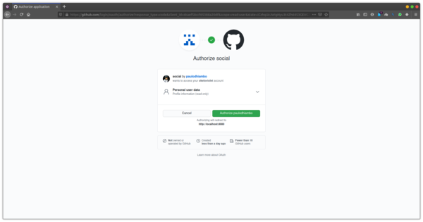
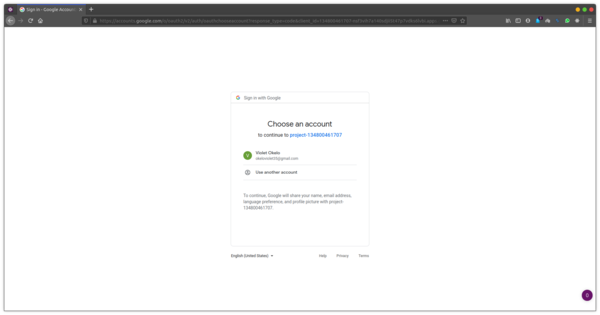
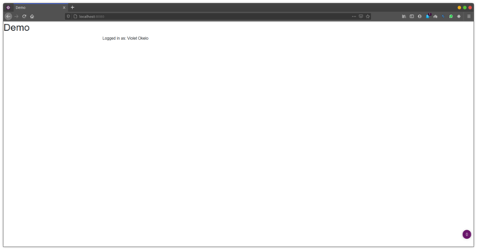

### Spring Boot Social auth
Spring Boot social auth makes it possible for users to authenticate into Spring Boot applications using their existing social accounts. Using Spring Boot social authentication makes it easy for developers to major in business logic rather than majoring in developing a custom authentication system.


### Prerequisites
1. Java developer kit [JDK]() installed on your computer.
2. Knowledge of [Kotlin]() programming language.
3. Knowledge of [Spring Boot]() framework. 

### Creating the application

### Adding webjar dependencies
```xml
      <dependency>
            <groupId>org.webjars</groupId>
            <artifactId>jquery</artifactId>
            <version>3.4.1</version>
        </dependency>
        <dependency>
            <groupId>org.webjars</groupId>
            <artifactId>bootstrap</artifactId>
            <version>4.3.1</version>
        </dependency>
        <dependency>
            <groupId>org.webjars</groupId>
            <artifactId>webjars-locator-core</artifactId>
        </dependency>
```

### Spring Security Configuration
```kotlin
import org.springframework.context.annotation.Configuration
import org.springframework.http.HttpStatus
import org.springframework.security.config.annotation.web.builders.HttpSecurity
import org.springframework.security.config.annotation.web.configuration.WebSecurityConfigurerAdapter
import org.springframework.security.core.AuthenticationException
import org.springframework.security.web.authentication.AuthenticationEntryPointFailureHandler
import org.springframework.security.web.authentication.HttpStatusEntryPoint
import javax.servlet.http.HttpServletRequest
import javax.servlet.http.HttpServletResponse

@Configuration
class WebConfig : WebSecurityConfigurerAdapter() {
    @Throws(Exception::class)
    override fun configure(http: HttpSecurity) {
        http
            .authorizeRequests { a ->
                a.antMatchers("/", "/error", "/webjars/**").permitAll()
                    .anyRequest().authenticated()
            }
            .exceptionHandling { e ->
                e.authenticationEntryPoint(HttpStatusEntryPoint(HttpStatus.UNAUTHORIZED))
            }
            .oauth2Login { o ->
                o.failureHandler { request: HttpServletRequest, response: HttpServletResponse?, exception: AuthenticationException ->
                    request.session.setAttribute("error.message", exception.message)
                    val handler: AuthenticationEntryPointFailureHandler? = null
                    assert(false)
                    handler!!.onAuthenticationFailure(request, response, exception)
                }
            }
    }
}
```

### Spring Social auth controller
```kotlin
@RestController
@RequestMapping("/api/v1/")
class SocialController {

    @GetMapping("/user")
    fun user(@AuthenticationPrincipal principal: OAuth2User): Map<String, Any?>? {
        return Collections.singletonMap("name", principal.getAttribute("name"))
    }
}
```

### Github authentication
```yaml
spring:
  security:
    oauth2:
      client:
        registration:
          github:
            clientId: github-client-id
            clientSecret: github-client-secret
```


### Google authentication
```yaml
spring:
  security:
    oauth2:
      client:
        registration:
          github:
            clientId: github-client-id
            clientSecret: github-client-secret
          google:
            client-id: google-client-id
            client-secret: google-client-secret
```



### Homepage
```html
<!doctype html>
<html lang="en">
<head>
    <meta charset="utf-8"/>
    <meta http-equiv="X-UA-Compatible" content="IE=edge"/>
    <title>Demo</title>
    <meta name="description" content=""/>
    <meta name="viewport" content="width=device-width"/>
    <base href="/"/>
    <link rel="stylesheet" type="text/css" href="/webjars/bootstrap/css/bootstrap.min.css"/>
    <script type="text/javascript" src="/webjars/jquery/jquery.min.js"></script>
    <script type="text/javascript" src="/webjars/bootstrap/js/bootstrap.min.js"></script>
</head>
<body>
<h1>Demo</h1>
<div class="container"></div>
<div class="container unauthenticated">
    <div>
        With GitHub: <a href="/oauth2/authorization/github">click here</a>
    </div>
    <div>
        With Google: <a href="/oauth2/authorization/google">click here</a>
    </div>
</div>

<div class="container authenticated" style="display:none">
    Logged in as: <span id="user"></span>
</div>

<script type="text/javascript">
    $.get("/api/v1/user", function (data) {
        $("#user").html(data.name);
        $(".unauthenticated").hide()
        $(".authenticated").show()
    });
</script>
</body>
</html>
```




### Conclusion
Now that you have learned how to authenticate users in your Spring Boot application through google and github, implement Facebook social authentication in your Spring Boot application. The source code for the application can be found [here]().

Happy coding.