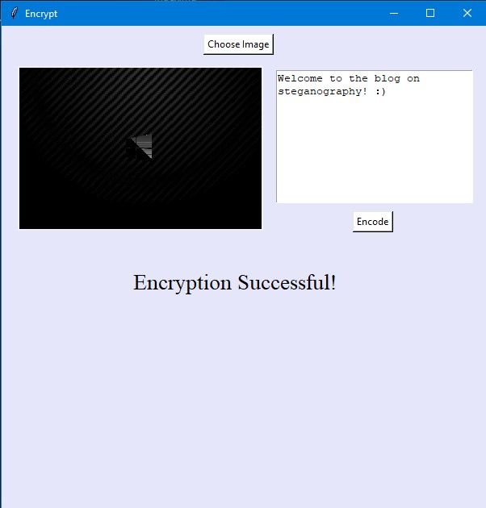

In steganography, an innocent-looking image is taken as an example and a message is embedded in the image by changing the number of pixels selected by the encryption algorithm. By embedding a hidden message or file in an image, the number of pixels can be changed.

In short, this means we use the encrypted RGB data to include other data, which significantly impairs the visual representation of the image. The hidden message is transmitted by increasing the bandwidth of the original message or by manipulating the file format. Since steganography is often used in phishing and as a way for malicious software to exfiltrate data, it is very difficult to detect it.
<!--more-->

### Military Uses vs Malicious Threats
To understand how image steganography works, we need to take a look at some of the basic ways in which text can be hidden in image files. Due to the nature of image file formats, it is not only possible to hide text strings, but also to hide entire files in jpg or other image formats. In a technique known as secret-key steganography, steganography is applied to a message that already has a key. This ensures multiple levels of security.

In malware, image steganography can be used to hide payloads within the code itself, or it can call additional code or executable programs associated with the attack. The attacker can also identify and replace the methods of the steganography in other ways, for example in the form of a command and control (C & C) script. The recent [attack](https://www.washingtonpost.com/technology/2020/01/29/apple-iphone-bezos-hack/) on Jeff Bezos's phone was one such act. The code was maliciously placed under the media file. Upon downloading, the code started executing in the background and transferred all the data illegally.

There are several [simple detection methods](https://0xrick.github.io/lists/stego/) based on file scans, such as the steganography tools found on the Internet.  But they are poorly developed and not extensive enough to detect such malicious acts.

Military intelligence services, however, use high-quality proprietary tools allowing automation to the process of detecting steganography. A lot of analytical tools can also be used if there is a suspicion that stealth is being used to hide messages.

### Cryptography Vs Steganography

As a technique for hiding data, cryptography is also used for the secure transmission of messages over the Internet. Cryptography is the science of ensuring that only the receiver (of the intended message) reads the message. Steganography, on the other hand, is the science of intelligently placing information so that no one knows about its presence. There are several cases where steganography may be better suited than cryptography. In some situations, cryptography is used to encrypt the message that is going to be placed under the image. Therefore, steganography and cryptography are not mutually exclusive.

### Code
We will build an example to demonstrate the encryption of data into images. The data is represented using its ASCII value. Each letter is represented using 8bits, or 1 byte. Each pixel in the image has three bits, one each for RGB frames. Each pixel can hold 3 bits. We will encode three pixels together, making a place for 9 bits. Out of the 9 bits, we will store 1 letter in the 8 bits and one (End Of File)EOF bit. If the EOF bit is high, then it indicates that the end of the message has been reached. Otherwise, it indicates the program to read more pixels for decoding.

We have a simple encryption technique included in the algorithm above. Instead of encoding 3 letters together, we can encode any other number of letters. Unless anyone knows this number, decrypting the file is going to be tough.

Let's focus on encoding the message inside the encoder.py file. The algorithm for encrypting data into the image is as follows:

1. Load the image and write the text in the text box provided below
2. Convert the message into an array representation of the ASCII letters.
3. Compute the number of pixels required, which is equal to the 3 times the length of the array of ASCII letters
4. Number of rows required = number of pixels required / width of the image  
5. Traversing the image row-wise, we will check for the following conditions:
   - Check the number of pixels traversed. If the bit is 1 and the pixel value is an even number, make it an odd number by subtracting 1. Similarly, if the bit is 0 and the pixel value is an odd number, make it an even number by subtracting 1.
   - Keep a count of the number of letters using the count variable.
   - If the index is 7, check if the next character exists. If yes, mark the EOF bit as 0 and continue. Else, mark as 1 and end.
6. We have successfully encrypted the image into the file.

### Heads Up

We will be using the [Tkinter library](https://docs.python.org/3/library/tkinter.html) to implement the GUI. It is a fun library to learn. Since this is an article on steganography, covering Tkinter is out of the scope. However, we have ensured to make the code readable by adding suitable comments when necessary.

We use CV2, numpy, and PIL for image processing. These are extensive libraries which can be discussed in detail in another article. For now, I have included comments for the usage of the functions.
### encrypt.py

```python
from tkinter import *
from PIL import Image, ImageTk
from tkinter import filedialog
import cv2
import numpy as np
import math

global path_image

image_display_size = 300, 300

def on_click():
    # Step 1.5
    global path_image
    # use the tkinter filedialog library to open the file using a dialog box.
    # obtain the image of the path
    path_image = filedialog.askopenfilename()
    # load the image using the path
    load_image = Image.open(path_image)
    # set the image into the GUI using the thumbnail function from tkinter
    load_image.thumbnail(image_display_size, Image.ANTIALIAS)
    # load the image as a numpy array for efficient computation and change the type to unsigned integer
    np_load_image = np.asarray(load_image)
    np_load_image = Image.fromarray(np.uint8(np_load_image))
    render = ImageTk.PhotoImage(np_load_image)
    img = Label(app, image=render)
    img.image = render
    img.place(x=20, y=50)

def encrypt_data_into_image():
    # Step 2
    global path_image
    data = txt.get(1.0, "end-1c")
    # load the image
    img = cv2.imread(path_image)
    # break the image into its character level. Represent the characyers in ASCII.
    data = [format(ord(i), '08b') for i in data]
    _, width, _ = img.shape
    # algorithm to encode the image
    PixReq = len(data) * 3

    RowReq = PixReq/width
    RowReq = math.ceil(RowReq)

    count = 0
    charCount = 0
    # Step 3
    for i in range(RowReq + 1):
        # Step 4
        while(count < width and charCount < len(data)):
            char = data[charCount]
            charCount += 1
            # Step 5
            for index_k, k in enumerate(char):
                if((k == '1' and img[i][count][index_k % 3] % 2 == 0) or (k == '0' and img[i][count][index_k % 3] % 2 == 1)):
                    img[i][count][index_k % 3] -= 1
                if(index_k % 3 == 2):
                    count += 1
                if(index_k == 7):
                    if(charCount*3 < PixReq and img[i][count][2] % 2 == 1):
                        img[i][count][2] -= 1
                    if(charCount*3 >= PixReq and img[i][count][2] % 2 == 0):
                        img[i][count][2] -= 1
                    count += 1
        count = 0
    # Step 6
    # Write the encrypted image into a new file
    cv2.imwrite("encrypted_image.png", img)
    # Display the success label.
    success_label = Label(app, text="Encryption Successful!",
                bg='lavender', font=("Times New Roman", 20))
    success_label.place(x=160, y=300)

# Step 1
# Defined the TKinter object app with background lavender, title Encrypt, and app size 600*600 pixels.
app = Tk()
app.configure(background='lavender')
app.title("Encrypt")
app.geometry('600x600')
# create a button for calling the function on_click
on_click_button = Button(app, text="Choose Image", bg='white', fg='black', command=on_click)
on_click_button.place(x=250, y=10)
# add a text box using tkinter's Text function and place it at (340,55). The text box is of height 165pixels.
txt = Text(app, wrap=WORD, width=30)
txt.place(x=340, y=55, height=165)

encrypt_button = Button(app, text="Encode", bg='white', fg='black', command=encrypt_data_into_image)
encrypt_button.place(x=435, y=230)
app.mainloop()
```

#### Output:


### decrypt.py

The algorithm to decode the encrypted file is as follows:

1. Open the encrypted image and convert it into a numpy array.
2. Obtain the data from the image by going through the encryption algorithm.
   - Every pixel in every row has 1 bit of information, which is added into the data variable, using the for loop.
   - Check if the EOF character is reached.
      - If yes break from the for loop
      - Otherwise, continue.
   - The ASCII is stored serially in the data variable.
3. After obtaining the ASCII bits, bits are grouped into letters by making groups of 8.   
4. The letters are stored in the message variable, which is linked using the join command in python.
5. Finally, the proper message is shown on the screen.

```python
import cv2
from tkinter import filedialog, Tk, Button, Label
from PIL import Image, ImageTk
import numpy as np

image_display_size = 500, 350


def decrypt():
    # load the image and convert it into a numpy array and display on the GUI.
    load = Image.open("./encrypted_image.png")
    load.thumbnail(image_display_size, Image.ANTIALIAS)
    load = np.asarray(load)
    load = Image.fromarray(np.uint8(load))
    render = ImageTk.PhotoImage(load)
    img = Label(app, image=render)
    img.image = render
    img.place(x=100, y=50)

    # Algorithm to decrypt the data from the image
    img = cv2.imread("./encrypted_image.png")
    data = []
    stop = False
    for index_i, i in enumerate(img):
        i.tolist()
        for index_j, j in enumerate(i):
            if((index_j) % 3 == 2):
                # first pixel
                data.append(bin(j[0])[-1])
                # second pixel
                data.append(bin(j[1])[-1])
                # third pixel
                if(bin(j[2])[-1] == '1'):
                    stop = True
                    break
            else:
                # first pixel
                data.append(bin(j[0])[-1])
                # second pixel
                data.append(bin(j[1])[-1])
                # third pixel
                data.append(bin(j[2])[-1])
        if(stop):
            break

    message = []
    # join all the bits to form letters (ASCII Representation)
    for i in range(int((len(data)+1)/8)):
        message.append(data[i*8:(i*8+8)])
    # join all the letters to form the message.
    message = [chr(int(''.join(i), 2)) for i in message]
    message = ''.join(message)
    message_label = Label(app, text=message, bg='lavender', font=("Times New Roman", 10))
    message_label.place(x=30, y=400)

# Defined the TKinter object app with background lavender, title Decrypt, and app size 600*600 pixels.
app = Tk()
app.configure(background='lavender')
app.title("Decrypt")
app.geometry('600x600')
# Add the button to call the function decrypt.
main_button = Button(app, text="Start Program", bg='white', fg='black', command=decrypt)
main_button.place(x=250, y=10)
app.mainloop()

```

#### Output


### Conclusion
We have learned about steganography and implemented a shortcode using Python's inbuilt module Tkinter, cv2, numpy, and Pillow library. The above code represents the workflow behind steganographic processes. We hope you enjoyed the tutorial and are inspired to know more about the field of steganography and cryptography. Data security has an unbounded future which is just starting to rise. Stay Safe. Be legendary.

### Further Reading
1. Detecting Steganography: https://www.garykessler.net/library/fsc_stego.html
2. Types of Encryption Techniques: https://lab.getapp.com/common-encryption-methods/
3. Tools for Image Steganography: https://resources.infosecinstitute.com/steganography-and-tools-to-perform-steganography/
