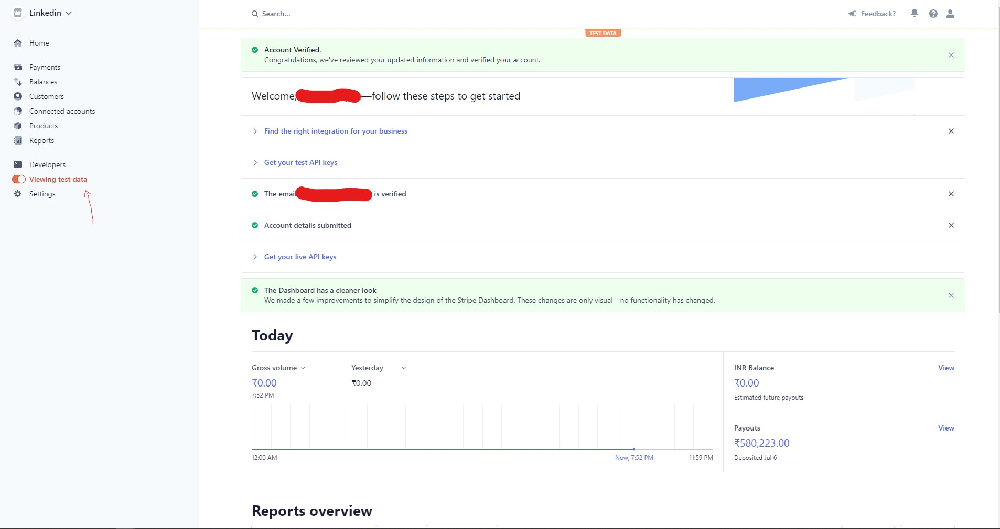
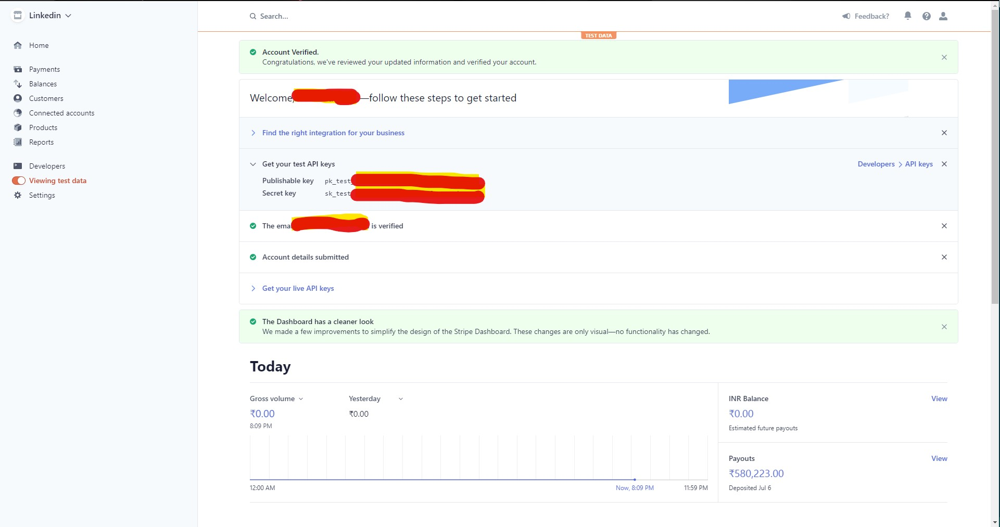
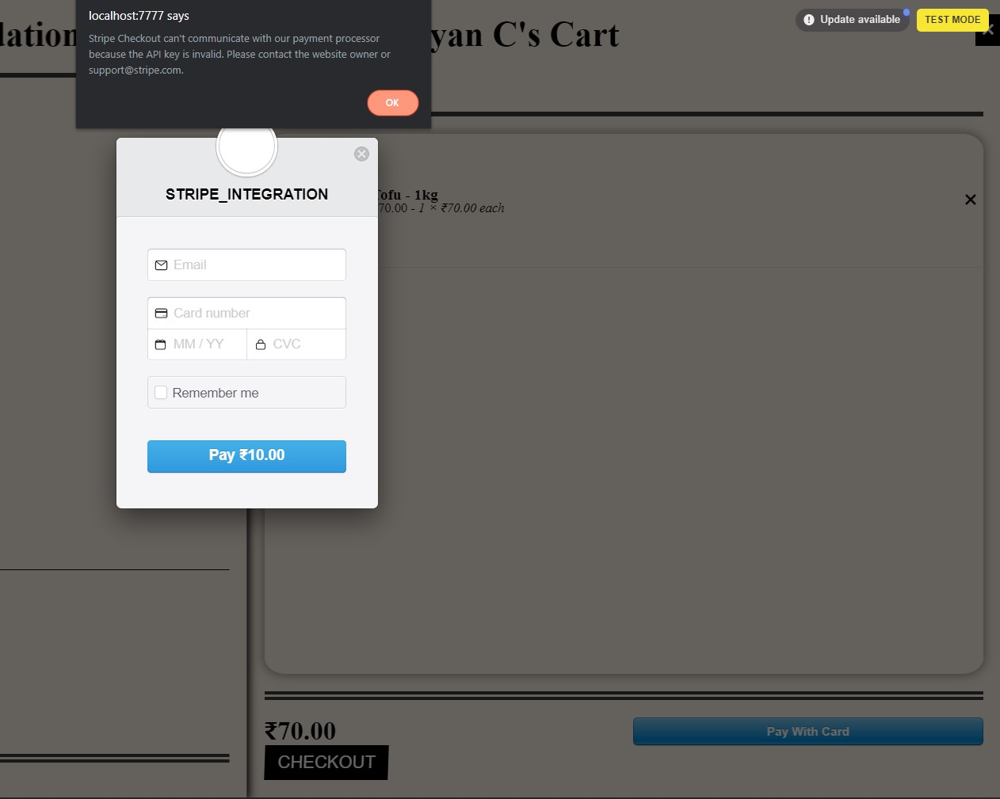

---
  layout: engineering-education
  status: publish
  published: true
  url: /engineering-education/stripe-integration-react/
  title: Integrating Stripe with React
  description: Learn how to create a Stripe account and integrate Stripe Payment with your React project.
  author: lalithnarayan-c
  date: 2020-08-24T00:00:00-10:00
  topics: [Stripe][React][Web Development]
  excerpt_separator: <!--more-->
  images:

    - url: /engineering-education/stripe-integration-react/hero.jpg
      alt: Stripe React Integration
  ---

# Integrating Stripe with React

All online stores need a payment gateway, irrespective of the service or product being sold. As such, it is important for developers to ensure the implementation is successful and that payments are secure for customers. In this article, we learn how to set up the Stripe API for all payment purposes. Stripe is the [go-to payment processor](https://stripe.com/en-in/payments/payment-methods-guide) for developers thanks to its developer-friendly API, highest grade of payment processing security, and detailed documentation [documentation](https://stripe.com/docs/api).

## Integration With React

Let's assume that we run an online store and have enough information to process the order: order details, order total, and user details. We will focus on the following:

1. Creating a Stripe Account
2. Switching to Test Mode on Stripe
3. Obtaining Stripe Access Token from Dashboard
4. Integrating with React using `react-stripe-checkout`
   
Before we get started with the implementation, let's understand the flow of payment information. 

### How does Stripe help us secure financial transactions?

1. Card details are entered on the website.
2. The web application sends a request to the Stripe API with card details in it.
3. Stripe API stores the card details securely and sends a token to the web application. 
4. The token is a point of reference to identify the card. Note that the card details are never shared with anyone for security reasons. The backend server receives the token and other meta-data related to the purchase.
5. The backend application makes a request to the API with the token in place. Also, it's a good practice to recalculate the price at the backend, as the token does not contain information about the total amount to be charged.  


*Image Source:* https://stripe.com/docs/payments/accept-a-payment#web

With this information in mind, we understand the important role Stripe plays. Payment gateways such as Stripe and PayPal garner the trust of millions of users by providing seamlessly integrated solutions.

### Creating a Stripe Account

To create an account, [register for an account](https://dashboard.stripe.com/register?redirect=%2Ftest%2Fpayments) and provide your account details (email, mobile number, name, and password). Upon successful registration, a confirmation mail is sent to the registered email account. Click on the email link to activate your new Stripe account. 

If already registered, log in to your dashboard with your credentials.

### Switch to Test Mode on Stripe

This step is important to ensure we are in testing mode. This enables us to test aspects of payments such as receiving payments, sending payments, or approving refunds. On the bottom left of your dashboard, you should find the *Viewing test data* button. Enable that by toggling the button provided. The dashboard is shown for your reference.


*Dashboard View*

### Obtain Stripe Access Token 
You will find a section called `Get your test API keys`. Under there, you will find two keys, a **Publishable key**, and a **secret key**. As the name suggests, we need to keep these keys secure. The publishable key is used to send requests, whereas the secret key is stored in the `.env` file at the backend.


*API Keys on Dashboard*
### Stripe Integration using react-stripe-checkout

There are many libraries available for integrating React with stripe. We will be using ```react-stripe-checkout``` library in this tutorial. 

Install the library using the following command:

```
npm install react-stripe-checkout
```

Once installed, create a new component called *CheckoutWithStripe.js* and add it to your main component list. Insert the appropriate details and create your custom functions to add more details to the API call. 

Here is an example function that you can modify using your custom store details:

```jsx
import React from 'react';
import StripeCheckout from 'react-stripe-checkout';

// sample function defined to compute total quantity of cart
function computeQuantity(cart) {
    return cart.reduce((count, itemInCart) => count + itemInCart.quantity, 0);
}
// similar functions can be defined to compute total price, email of the user, etc.

class CheckoutWithStripe extends React.Component {
    onToken = (res) => {
        fetch('/save-stripe-token', {
            method: 'POST',
            body: JSON.stringify(token),
        }).then(res => {
            res.json().then(data => {
                console.log(`Payment token generated, ${data.name}`)
            })
        })
    };

    render() {
        return (
            <StripeCheckout
                amount = '10.00'
                name="STRIPE_INTEGRATION"
                // functions defined above can be used to add more information while making the API call.
                // description={`Order of ${computeQuantity(cart)} items!`}
                image='LINKTOIMAGE'
                stripeKey="PUBLISHABLE_STRIPE_KEY"
                currency="INR"
                email='USER_EMAIL'
                token={this.onToken}/>          
        );
    }
}

export default CheckoutWithStripe
```

Call the component `CheckoutWithStripe` from the payment page. 

You should see a button which says `Pay With Card`. An example is given below.


Finally, a dialog box should appear to enter card details:


*Final Output*

The error says that the API key is invalid. 

To resolve the error, you may enter your public API key. 

To verify that the application is in test mode, you will get an alert on the top right corner as shown. 

### Additional Resources

1. [Stripe Documentation](https://stripe.com/docs/api)
2. Detailed description of [transaction process.](https://en.wikipedia.org/wiki/Payment_gateway) 
3. React Boilerplate with Stripe integration [code](https://github.com/shreeramneupane/reactstripe)

### Conclusion

We have walked through the entire process of accepting payments with Stripe. After setting up an account and obtaining API keys, we are able to integrate it seamlessly into our application. Stripe has made payments easy and we encourage you to build your applications with integrated payment gateways.

