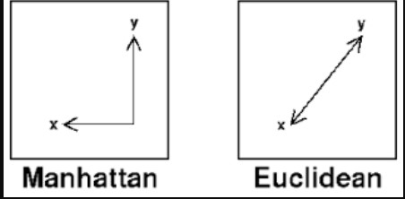
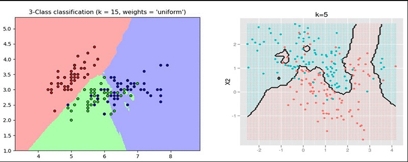
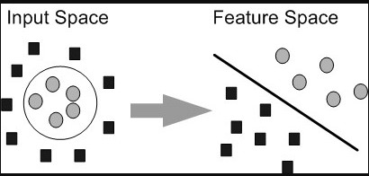

Artificial intelligence is the art of inducing intelligence into machines. The current era is an exciting one to live in, for the advances in technology are being guided by huge amounts of intelligence. The translation services that we use, voice assistants that simplify our tasks, ride-hailing services such as Uber, map services used for navigation are all examples of how AI is being leveraged into generating massive impact. Machine learning is a subset of artificial intelligence. Artificial intelligence is a broader subject that aims to attain artificial general intelligence(AGI). Human intelligence is an example of AGI. The entire field of AI is working towards one goal: AGI. Machine learning, on the other hand, focuses on the statistical approach to attain human-level intelligence.   
<!--more-->

### Introduction to machine learning
Tom Mitchell defines machine learning as follows: 'Machine learning is the study of computer algorithms that allow computer programs to automatically improve through experience'. The method of feeding experience to the algorithm is the basis for the primary categorization of algorithms. Under machine learning, we mainly study three types of algorithms:
1. Supervised Learning: Supervised learning algorithms receive a pair of input and output values as part of their dataset. The pairs of values help the algorithm model the function that generates such outputs for given inputs. We will be covering the entire topic of supervised learning in this article.
2. Unsupervised Learning: In this type of learning, algorithms are only fed in input data variables. The algorithms make sense of data based on patterns that the algorithm detects. For example, given a dataset of black and red cards, clustering algorithms will find all cards similar to black and place them in one set. On the other set, the red cards are placed. Thereby, a [decision boundary](https://en.wikipedia.org/wiki/Decision_boundary#:~:text=A%20decision%20boundary%20is%20the,are%20not%20always%20clear%20cut.) is formed. [Clustering](https://www.section.io/engineering-education/clustering-algorithms/) is one such example of unsupervised learning.  
3. Reinforcement Learning: Reinforcement learning is a subset of machine learning that deals with agents performing actions in a simulated environment. The outcome of the actions carries a reward. The objective is to optimize the reward obtained through actions in the environment. Most of the living ecosystem is best modeled by a reward-based mechanism. For example, a child likes to eat candies again and again, for it provides the dopamine rush which is the reward.
     
<!-- supervised learning -->
## Supervised Learning
Having understood supervised learning, let us look at a few of the applications of supervised learning before we dive into the algorithms. Supervised learning tasks require datasets with input-output pairs. Consider the example of trying to classify the digits. Given an image of a digit, what is the number? [MNIST digits](http://yann.lecun.com/exdb/mnist/) dataset is one of the earliest datasets that helped automate the processes of postal services. 

Another example of supervised learning is predicting the price of houses given the features. The features can include size, location, facilities, etc. The input consists of such features and the output consists of the price. Algorithms that predict continuous values of data are called regression-based algorithms. 

Supervised learning is mainly classified into two types: Classification and Regression. Let us look at the algorithms under each of the categories.  
<!-- classification -->
### Classification
Classification algorithms are a type of supervised learning algorithms that predict outputs from a discrete sample space. Predicting a disease, predicting the digits output labels such as Yes or No, or 1,2,3, respectively. We can also have scenarios where multiple outputs are required. Consider the example of self-driving cars. The various objects found on the road need to be classified according to their categories and also need to be classified as safe or unsafe. Such a scenario is an example of a multi-class classification. We will look at some of the key algorithms under classification algorithms.

1. K-Nearest Neighbours(KNN): KNN is an algorithm that works on creating a decision boundary based on distance metrics. Distance metrics define and parameterize distance. There are various distance metrics such as euclidean distance, manhattan distance, etc. Manhattan distance takes the absolute distance between two points, whereas Euclidean distance takes the square root of the sum of squares of the distance between the two points. 
   

   *[Image Source](https://www.ieee.ma/uaesb/pdf/distances-in-classification.pdf)*

   All machine learning algorithms have hyperparameters to be dealt with. In k-NN, the parameter is `k`. It is initialized to an integer depending on the number of classes in the dataset known apriori to fitting. `k` signifies the number of nearest points the algorithm considers while creating decision boundaries.  
   

   *[Image Source](https://d2908q01vomqb2.cloudfront.net/f1f836cb4ea6efb2a0b1b99f41ad8b103eff4b59/2018/07/11/sagemaker-knn-1.gif)*

   ```python
    # Import necessary modules
    from sklearn.neighbors import KNeighborsClassifier
    from sklearn.model_selection import train_test_split
    from sklearn.datasets import load_digits
    # Create feature and target arrays
    digits = load_digits()
    X = digits.data
    y = digits.target

    # Split into training and test set
    X_train, X_test, y_train, y_test = train_test_split(X, y, test_size = 0.2, random_state=42, stratify=y)

    # Create a k-NN classifier with 7 neighbors: knn
    knn = KNeighborsClassifier(n_neighbors=7)

    # Fit the classifier to the training data
    knn.fit(X_train, y_train)

    # Print the accuracy
    print(knn.score(X_test,y_test))
   ```

   The output is shown below:
   ```txt
    0.9833333333333333
   ```
   The accuracy of the classifier is 98.33%. This is tested on the test dataset. 98.33% is good accuracy, but the dataset is a simple one. 10 years ago, this number would have been a considerably good one. 


2. Support Vector Machines(SVM): SVMs are maximum margin classifiers that are optimized to find an N-dimensional hyperplane in an N-dimensional space. The objective is to find the hyperplane that has the maximum margin from all the classes.  Let us understand a few of the concepts and terminologies in SVM.
   1. Support Vector: Vectors that are closest to the hyperplane are called support vectors.
   2. Margin: Margin is defined as the distance between data points and the hyperplane.
   3. Hyperplane: The decision boundary which satisfies the maximum margin condition is called the hyperplane.

   The intuition behind SVM is to find the hyperplane with maximum distance from the support vectors. The hyperplane may be a linear decision boundary or a non-linear decision boundary. When dealing with non-linear planes, the dataset is projected into higher dimensions to create linear boundaries. For example, consider the following image
   
   *[Image Source](https://www.researchgate.net/profile/PK_Varshney/publication/228712327/figure/fig3/AS:667775798353922@1536221565025/Mapping-nonlinear-data-to-a-higher-dimensional-feature-space-where-a-linear-separating.ppm)*

   The input space is transformed using kernels. SVM kernels are functions that take low-dimensional input space and transform them into higher dimensional space where the data is linearly separable. Some of the kernels used commonly are

   1. Linear Kernel 
   2. Polynomial Kernel
   3. Radial Basis Function Kernel
   
   Let us look at implementing SVM using `sklearn`. 

   ```python
    # Import necessary modules
    from sklearn import svm
    from sklearn.model_selection import train_test_split
    from sklearn.datasets import load_digits
    # Create feature and target arrays
    digits = load_digits()
    X = digits.data
    y = digits.target

    # Split into training and test set
    X_train, X_test, y_train, y_test = train_test_split(X, y, test_size = 0.2, random_state=42, stratify=y)

    # Create a SVM classifier
    classifier = svm.SVC(kernel='poly')
    classifier.fit(X_train, y_train)
    print(classifier.score(X_test,y_test))
   ``` 

<!-- regression -->
### Regression
Regression algorithms are a subset of machine learning algorithms used to predict continuous numeric responses. As seen in the earlier example, predicting house rent given various factors is an example of the same. We will look at the regression algorithm and look at ridge regression as an example.

1. Linear Regression: Linear regression is a simple yet effective method used in a large number of applications. Let us say we have an input feature vector `x`. The output feature vector `y` is the predicted entity. We use the sum of least squares to compute the relation between the target and input variables. Linear regression can be implemented using sklearn. Let us look at the implementation below:
   
    ```python
    # Import necessary modules
    from sklearn.linear_model import LinearRegression
    from sklearn.model_selection import train_test_split
    from sklearn.datasets import load_digits
    import numpy as np
    import matplotlib.pyplot as plt
    # Create feature and target arrays

    digits = load_digits()
    X = digits.data
    y = digits.target

    # Split into training and test set
    X_train, X_test, y_train, y_test = train_test_split(X, y, test_size = 0.2, random_state=42, stratify=y)

    linear_regression = LinearRegression()
    linear_regression.fit(X_train,y_train)

    print(linear_regression.score(X_test,y_test))
    ```
    The output of the print statement will be 0.55. The scoring metric used for linear regression is the R^2 metric. Pronounced as R-squared, it tells us about the effectiveness of the curve fitting. The closer the value of R-squared is to 1, the higher chances of good curve fitting. Curve fitting may lead to overfitting when the number of features considered is less. Overfitting refers to the scenario where the model performs very well on the data it has seen. But its performance drops when it works on unseen data. Underfitting is also a possibility when we don't have sufficient data to train with. 


### Conclusion

We have looked at supervised learning and understood various code snippets to implement these algorithms using scikit-learn. Scikit-learn is a very powerful and elegantly written library. I hope this serves as an introduction to your machine learning journey. In the upcoming articles, we will focus on projects making use of the above-mentioned concepts and libraries. 
   

   
