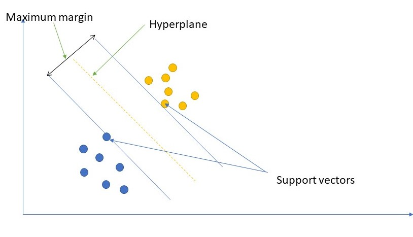
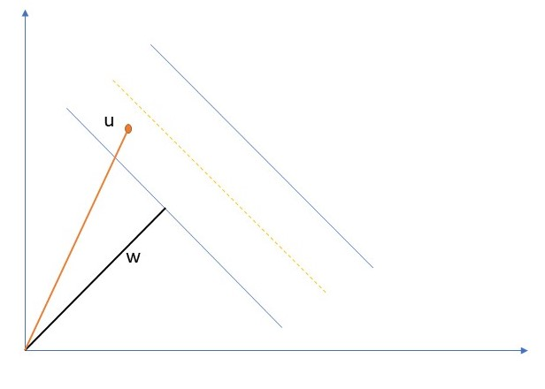

## Understanding support vector machines

### Introduction
Support vector machines are machine learning methods used mostly to solve classification problems. We can also use them to solve regression and outlier detection problems. Support vector machines perform well even with large datasets with a large number of features. They also don't consume a lot of memory since they only use a subset of the training data in determining the decision function.

Support vector machines separate the dataset into classes using the  **maximum margin hyperplane(MMH)**.

### Prerequisites
To follow along, you are required to have an understanding of linear algebra, numpy, and scikit-learn.
 **Definition of terms**
 1. **Support Vectors**: They are the data points closest to the hyperplane that helps decide the maximum margin. 
 2. **Hyperplane**: It's defined as the plane that separates the data into different classes.
 3. **Margin**: This is the path or gap between two lines separating different classes.
 

The following diagram gives a visual representation of the support vector machine concept.

 

***mathematical formulation***

Given training vectors `𝑥`<sub>i</sub> `∈ R`<sup>n</sup>, `i=1,. . . , n`, in two classes, and a vector `𝑦 ∈ {1,−1},` our goal is to find `𝑤 ∈ R`<sup>`n`</sup>*** and `𝑏 ∈ R`  such that `w` is normal to the hyperplanes.  (*see figure below*)
 
 

 `w.u>=c` ; ie. project `u` on the normal

`c = -b`

if `w.u + b >=0` ; then `u` is then classified as positive (decision rule).

`w.x + b >=1`

`w.x + b <=-1`

introducing  `y`<sub>i</sub> such that `y`<sub>i</sub>`=+-1` for +ve positive samples and -ve for negative samples.

*for the negative class* 

*replacing y with `-1` in the equation we have* 

`-(w.x + b) <=-1`

*dividing both sides by `-1` we have*

`w.x + b >= 1`

and hence the equations turn out to be the same,

`y`<sub>i</sub>`(w.x + b ) >=1`, for +ve samples

`y' <sub>i</sub>`(w.x +b)>=1`, for -ve samples and so we can use one of them can be used as the decision function ie.

`y(w.x + b)-1>=0`

Introducing a constraint to the above equation so that whenever we have a sample on the gutter (support vectors), it should then give us 0.

So we use:

`y`<sub>i</sub>`(w.x + b)-1 = 0` as our contstraint.

Now that we have both the decision function and its constraint we, therefore, need to find the width of the margin. We have:

***width***  = `(x`<sub>i</sub> `- x ) = 2/`<sub>||`w`||</sub> as  our optimization problem.(*see fegure below*)


 
We now need to find its maximum.

max <sup>`2`</sup>/<sub>`||w||`</sub>  or  min <sup>`1`</sup>/<sub>`2`</sub>`||w||`

Our optimization problem with the constraint will now be,   

`L` = <sup>1</sup>/<sub>2</sub> `||w||`<sup>2</sup> `-  Σ︁`<sub>i.....m</sub> `𝛼  [y(w.x + b)-1 ]`

where `m` is the number of samples.

Differentiating the above equation with respect to `w` we have: 
  
<sup>`dL`</sup>/<sub>`dw`</sub> ` = w -   Σ︁ 𝛼  y`<sub>i</sub> x<sub>i</sub> ` = 0` and so: `w = Σ︁`<sub>i...m</sub>` 𝛼 `<sub>i</sub> ` y`<sub>i</sub> `x`<sub>i</sub>
  
differentiating with respect to `b` we have: 

<sup>`dL`</sup>/<sub>`db`</sub>` = - Σ︁ 𝛼 `<sub>i</sub>` y`<sub>i</sub>` = 0` so  `Σ︁`<sub>`i....m`</sub>` 𝛼  y `<sub>i</sub>` = 0`

plugging back to the equation, we have:
 
`L = `<sup>1</sup>/<sub>2</sub>`  ( Σ︁ 𝛼 `<sub>i</sub>` y `<sub>i</sub>` x`<sub>i</sub>`) (Σ︁ 𝛼 `<sub>j</sub>` y  `<sub>j</sub>` x`<sub>j</sub>`) - (Σ︁ 𝛼`<sub>i</sub>` y `<sub>i</sub>` x`<sub>i</sub>`) - (Σ︁𝛼 y `<sub>i</sub>`x`<sub>i</sub>`) -  Σ︁ 𝛼`<sub>i</sub>`  y `<sub>i</sub>` + Σ︁ 𝛼`<sub>i</sub>

thereby evaluating to:

`L = Σ︁ 𝛼  - `<sup>1</sup>/<sub>2</sub>`  Σ︁ `<sub>j...m</sub>`  Σ︁ `<sub>j...m</sub>`   𝛼 `<sub>i</sub>`  𝛼 `<sub>i</sub>` y`<sub>i</sub>` y`<sub>j</sub>` x`<sub>j</sub>` x`<sub>j</sub>

This is the **dual optimization** for support vector machines. It depends on the samples' dot product, and so the kernel trick can be applied to improve its performance, especially when the data is not linearly separable.

*Our decision rule will now be:*
 
`𝛼y`<sub>i</sub>` x`<sub>i</sub>`.u + b = >0`, then  `+ve`

`scikit-learn` implements support vector machines in three different classes, namely **SVC(support vector classification), NuSVC(Nu support vector classification), LinearSVC(Linear support vector classification).**

### SVC
Support vector classification takes in a parameter `C` that is used in regularization to avoid overfitting. It uses the `sklearn.svm.SVC` module in its implementation. It can also be used in multiclass classification.
**The following table shows the parameters used by sklearn.svm.SVC class:**
|  parameter|descriprion  |
|--|--|
|  `C`  | Used to specify the regularization term. Its default value is 1. |
|`kernel` |This parameter specifies the kernel to be used. It can either be "rbf", "poly", "sigmoid", "linear" default is "rbf"
|`degree` |It is only used only with the "poly" kernel. It represents the degree of the "poly" kernel.
|`gamma`  |Specifies the kernel coefficient for kernels "rbf", "poly", and "sigmoid". It can either be "scale" or "auto."
|`max_iter` |It specifies the maximum number of iterations for the cost function.
|`random_state`| Used to generate random numbers for shuffling the data.
|`fit_intercept` It is used to specify whether to fit a constant in the calculations.

**Attributes**
1. `support_`: It returns the indices of data points closest to the margin(support vectors). 

2. `support_vectors_`: It returns data points closest to the margin(support vectors). 

3. `n_support_`:  It returns the number of support vectors for each class.

4. `dual_coef_`:  These are the weights of the support vectors in the decision function.

5.  `coef_`: This attribute, only available in the linear kernel case, provides the weight assigned to each feature. 
 
 6. `intercept_`:  It stores the independent/constant term in the calculations. 
 
7.  `fit_status_`: It returns one if the data is correctly fitted and 0 if incorrectly fitted. 
 
8.  `classes_`: It returns the labels of the classes.

**Implementation Example**

  *using the iris dataset from sklearn.datasets*
"`python
        #import necessary packages
import numpy as np
from sklearn.model_selection import train_test_split
from sklearn.svm import SVC
from sklearn.datasets import load_iris
from sklearn import metrics
    
#create an instance of the load_iris
iris = load_iris()
    
    #separate the features from the target
X = iris.data
y = iris.target
    
#split the data into training and testing sets
X_train,X_test,y_train,y_test = train_test_split(X,y,test_size = 0.3,random_state = 0)

    
#create an intstance of the SVC 
clf = SVC(kernel = 'linear',gamma = 'scale',degree = 3)
    
#fit the feature data into the SVC model
clf.fit(X_train,y_train)
    
#fit the X_test to the model to predict there target classes
y_pred = clf.predict(X_test)
    
#use the accuracy score and confusion matrix to evaluate the model's performance 
    
print("Accuracy score :",metrics.accuracy_score(y_test,y_pred))
    
print("Confusion matrix :\n",metrics.confusion_matrix(y_test,y_pred))
```
 **Output:**

```
Accuracy score : 0.9777777777777777
Confusion matrix :
 [[16  0  0]
 [ 0 17   1]
 [ 0  0 11]]
```
### NuSVC
NuSVC is like SVC in that it contains a new parameter `nu` instead of `C,` which controls the number of support data points to be used in the decision function(support vectors) and margin errors. A margin error is a data point in the margin allowed to be on the wrong side by the hyperplane.

**Implementation Example**
*using the iris dataset from sklearn.datasets*

```python 
#import necessary packages
import numpy as np
from sklearn.model_selection import train_test_split
from sklearn.svm import NuSVC
from sklearn.datasets import load_iris
from sklearn import metrics

#create an instance of the load_iris
iris = load_iris()
    
#separate the features from the target
X = iris.data
y = iris.target
    
#split the data into training and testing sets
X_train,X_test,y_train,y_test = train_test_split(X,y,test_size = 0.3,random_state = 0)
    
    
#create an intstance of the NuSVC 
clf = NuSVC(gamma = 'auto')
    
#fit the feature data into the NuSVC model
clf.fit(X_train,y_train)
    
#fit the X_test to the model to predict there target classes
y_pred = clf.predict(X_test)
    
#use the accuracy score and confusion matrix to evaluate the model'sperformance 
    
print("Accuracy score :",metrics.accuracy_score(y_test,y_pred))
    
print("Confusion matrix :\n",metrics.confusion_matrix(y_test,y_pred))
``` 
**Output:**
```
**Accuracy score : 0.9777777777777777
Confusion matrix :
[[16  0  0]
[ 0 17  1]
[ 0  0 11]]**
``` 
### Linear SVC
Linear SVC is like SVC with `kernel = linear.` But, Linear SVC supports other parameters such as the penalty parameter, which can either be L1 or L2 used for regularization and loss functions such as hinge, squared_hinge. Its optimization function is the hinge loss, which is directly optimized by LinearSVC, and unlike the dual form, this one does not involve inner products between samples and so the kernel trick cannot be applied.


   **Implementation example**
   *using the iris dataset from sklearn.datasets*
"`python
#import necessary packages
import numpy as np
from sklearn.model_selection import train_test_split
from sklearn.svm import LinearSVC
from sklearn.datasets import load_iris
from sklearn import metrics
    
#create an instance of the load_iris
    iris = load_iris()
    
#separate the features from the target
X = iris.data
y = iris.target
    
#split the data into training and testing sets
X_train,X_test,y_train,y_test = train_test_split(X,y,test_size = 0.3,random_state = 0)
    
    
#create an intstance of the LinearSVC 
clf = LinearSVC(dual = False,penalty = 'l1',loss = 'squared_hinge'max_iter = 10000)
    
#fit the feature data into the LinearSVC model
clf.fit(X_train,y_train)
    
#fit the X_test to the model to predict there target classes
y_pred = clf.predict(X_test)
    
#use the accuracy score and confusion matrix to evaluate the model's performance 
    
print("Accuracy score :",metrics.accuracy_score(y_test,y_pred))
    
print("Confusion matrix :\n",metrics.confusion_matrix(y_test,y_pred))
```
 
 **Output:**
```
Accuracy score : 0.9333333333333333
Confusion matrix :
 [[16  0  0]
 [ 0 15  3]
 [ 0  0 11]]
```
### Support vector machine regression
Unlike classification in regression, the support vector machine should predict continuous values. It is also implemented in three different classes namely **support vector regression(SVR), Nu support vector regression(NuSVC) and, linear support vector regression(LinearSVR)**.


**Support vector regression**
The method of Support Vector machines can also be extended to solve regression problems using Support Vector Regression, which unlike in classification, depends on a subset of the training data because the optimization function ignores samples whose predictions have low variance compared to the actual target values.
Its implementation is based on libsvm `C` and "epsilon."The epsilon parameter specifies the epsilon-tube whereby samples within are not penalized.

**Implementation example**
```python
#import necessary packages
import numpy as np
from sklearn.model_selection import train_test_split
from sklearn.svm import SVR
from sklearn.datasets import make_regression
from sklearn import metrics
    
#create the regression dataset
X,y = make_regression(n_samples = 200,n_features = 5,noise = 10,random_state = 0)
    
    
#split the data into training and testing sets
X_train,X_test,y_train,y_test = train_test_split(X,y,test_size = 0.3,random_state = 0)
    
    
#create an intstance of the SVR 
regre = SVR(kernel = 'linear')
    
#fit the feature data into the SVR model
regre.fit(X_train,y_train)
y_pred = regre.predict(X_test)
print("mean squared error : ",metrics.mean_squared_error(y_test,y_pred))
print("mean absolute error : ",metrics.mean_absolute_error(y_test,y_pred))
```
**Output**
```
mean squared error:  4479.436463820731
mean absolute error:  57.18029871202693
```
### Linear SVR
It is like SVR with parameter `kernel=’linear", which makes it flexible in choosing  penalties and loss functions and scales better to large numbers of samples
## Implementation example
"`python
#import necessary packages
import numpy as np
from sklearn.model_selection import train_test_split
from sklearn.svm import LinearSVR
from sklearn.datasets import make_regression
from sklearn import metrics
    
#create the regression dataset
X,y = make_regression(n_samples = 200,n_features = 5,noise = 10,random_state = 0)
    
    
#split the data into training and testing sets
X_train,X_test,y_train,y_test = train_test_split(X,y,test_size = 0.3,random_state = 0)
    
    
#create an intstance of the LinearSVR 
regre = LinearSVR(dual = False, random_state=0,loss='squared_epsilon_insensitive')
    
#fit the feature data into the LinearSVR model
regre.fit(X_train,y_train)
y_pred = regre.predict(X_test)
print("mean squared error : ",metrics.mean_squared_error(y_test,y_pred))
print("mean absolute error : ",metrics.mean_absolute_error(y_test,y_pred))
```
**Output**
```
mean squared error:  138.5487175228963
mean absolute error:  9.214920086279557
```
**NuSVR**
It is like NuSVC, for regression, uses a parameter nu to control the number of data points to be used in determining the epsilon tube. It also uses `nu` in place of epsilon of epsilon-SVR. 

### Implementation example
```python
#import necessary packages
import numpy as np
from sklearn.model_selection import train_test_split
from sklearn.svm import NuSVR
from sklearn.datasets import make_regression
from sklearn import metrics
    
#create the regression dataset
X,y = make_regression(n_samples = 200,n_features = 5,noise = 10,random_state = 0)
    
    
#split the data into training and testing sets
X_train,X_test,y_train,y_test = train_test_split(X,y,test_size = 0.3,random_state = 0)
    
    
#create an intstance of the NuSVR 
regre =NuSVR(kernel='linear', gamma='auto',C=1.0, nu=0.1)
#fit the feature data into the NuSVR model
regre.fit(X_train,y_train)
y_pred = regre.predict(X_test)
print("mean squared error : ",metrics.mean_squared_error(y_test,y_pred))
print("mean absolute error : ",metrics.mean_absolute_error(y_test,y_pred))
```
**Output:**
```
mean squared error:  21244.45509591478
mean absolute error:  123.82654607617737**
```
### Anomaly detection
Anomaly detection is an approach used to identify data that is odd and inconsistent from the rest.

**There are two methods of outlier detection** 
1. Outlier detection.
2. Novelty detection.

#### Outlier detection
The data used in training contains outliers. Outliers are inconsistent observations. Outlier detection estimators try to separate the region of noisy samples from the concentrated sample's region.

### Novelty detection

In novelty detection, the training data doesn't have outliers, but we try to detect outliers from incoming data.

### One-class svm
The One-Class SVM introduced by Schölkopf et al. It is a support vector machine technique used to detect strange occurring events. It treats the normal events as one class separating them from the outliers.
 
`kernel`    Specifies the kernel type to be employed in the algorithm. It takes the following values: "linear', 'poly', 'rbf', 'sigmoid', 'precomputed',' rbf."

`degree`  It is only applicable for the case of polynomial kernel function ("poly").

`gamma` specifies the Kernel coefficient for "rbf," "poly," and "sigmoid." It takes the following values "scale', 'auto' or float,' scale."

`max_iter`: It is used to limit the number of iterations within the solver or -1 for no limit.

### Attributes

`support_` returns the indices of the support vectors.

`support_vectors_` Returns the support vectors.

`dual_coef_` Coefficients of the support vectors in the decision
function.

`coef_'It returns the weights assigned to each feature (coefficients in the primal problem): it is only available for the linear kernel.

`intercept_` Returns the constant in the decision function.


`fit_status_`  It returns 0 if correctly fitted, one otherwise.

###  Implementation example
```python
#import necessary packages
from sklearn.svm import OneClassSVM
X = [[0], [0.44], [0.65], [0.55], [1]]
#create an instance of the OneClassSvm
clf = OneClassSVM(gamma='auto')
#fit/train the model
clf.fit(X)
clf.predict(X)
#display the scores_samples for the input data
clf.score_samples(X)
```
**output**
```
array([1.70903312, 2.03667   , 2.03667002, 2.05051418, 1.79795364])**
```
​

### Conclusion
So far, we've looked at the support vector machines concept from the mathematical perspective. we've also looked at its implementation in scikikit-learn. Support vector machines are very powerful and have a lot more applications, but this should get one started.
---
Peer Review Contributions by: [Lalithnarayan C](/engineering-education/authors/lalithnarayan-c/)
