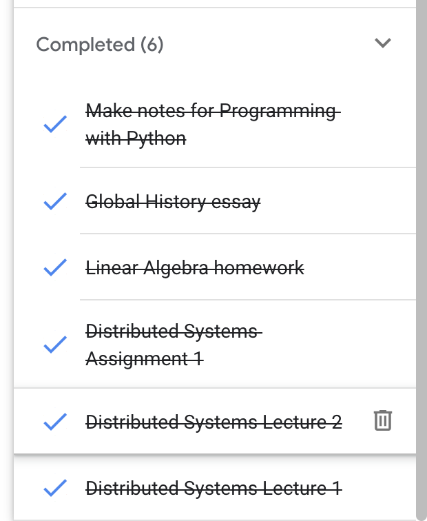
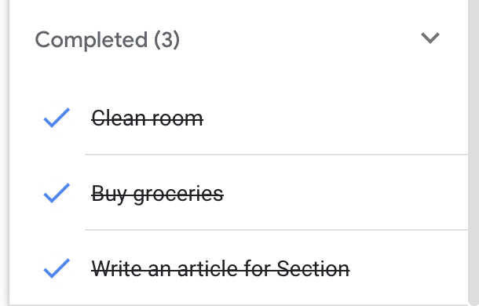
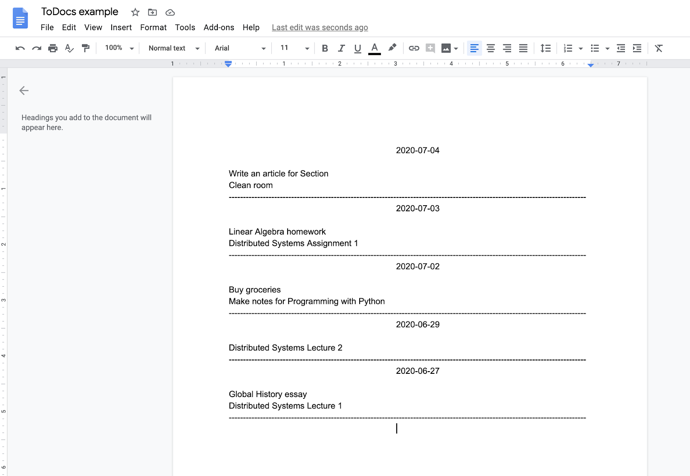
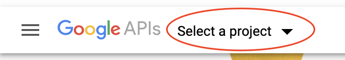
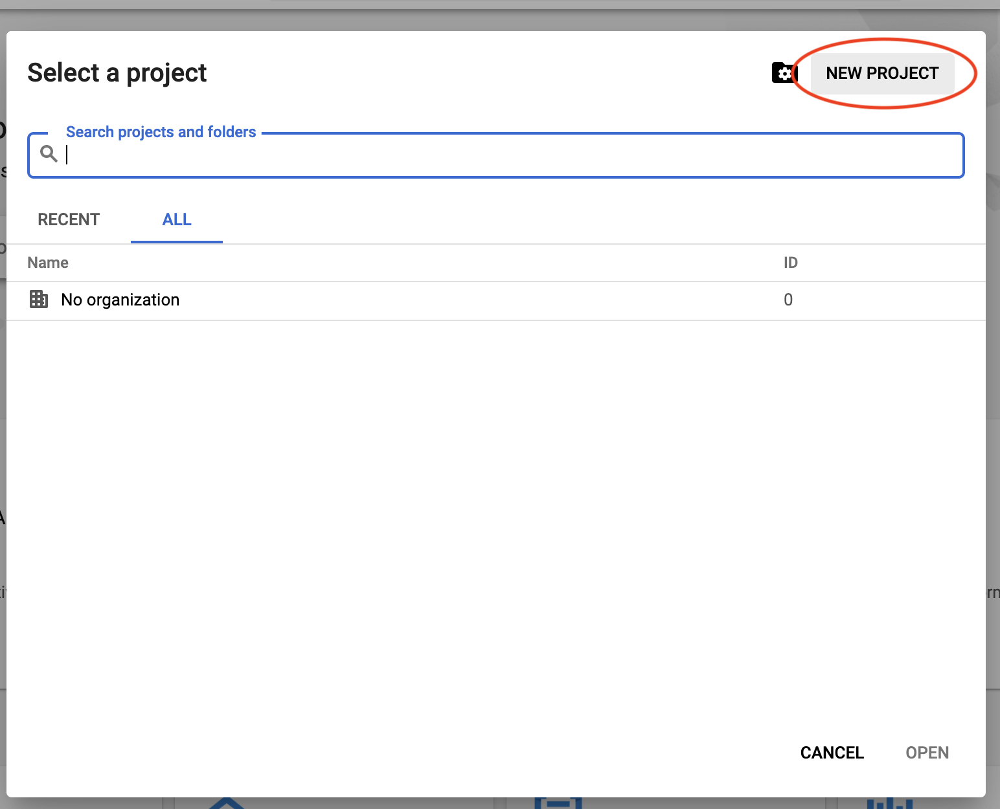
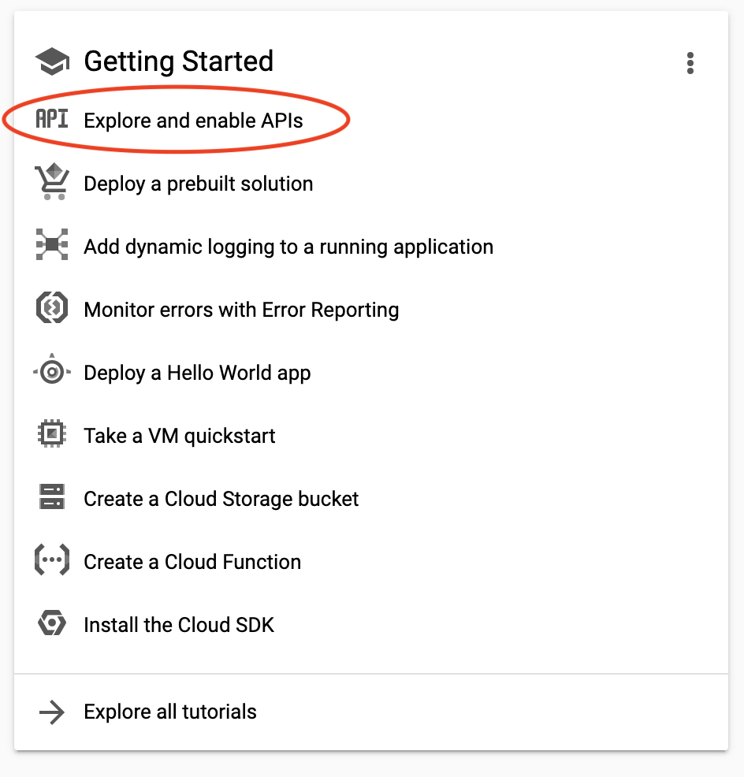
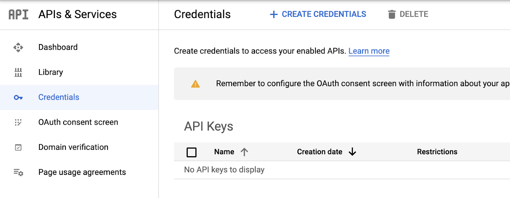
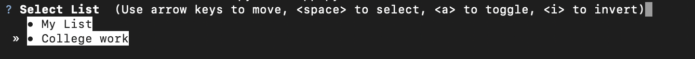

A lot of us use Google Tasks to maintain our To-Do lists because it is simple and convenient. However, if we want to improve our overall productivity and maintain a report of all the tasks completed daily in a Google Doc, we would have to manually enter these completed tasks on a day-to-day basis. I always found myself procrastinating when it was time to update my daily report. Therefore I decided to automate it.
<!--more-->

I currently have 2 To-Do lists.

College work - containing all my college-related tasks:



My List - containing the rest of the tasks:



And I want to move these to one designated Google Doc organized by date, like this:



This blog post is a tutorial on how to build a python script that moves completed tasks from Google Tasks to Google Docs, within a given time-frame, categorized by date.

**Note**: This tutorial only includes partial code. The complete code can be found on my [GitHub](https://github.com/keerthivarumbudy/ToDocs/blob/master/app.py).

### Google Developers Console Configuration

Firstly, we need to create our project on Google Developers Console and create credentials that will allow us to make use of their APIs.

1. Login to https://console.developers.google.com/

2. Create a new project.
   

   
   
3. Select the project, and go to its Dashboard. Click on Explore and Enable APIs.
<br>
Enable Google Docs and Tasks APIs.

4. Create credentials to use in our project.

Go to Credentials under APIs & Services.
<br>
Configure the OAuth consent screen (just entering the name of the application will suffice). Create an OAuth client ID for Desktop App by clicking on CREATE CREDENTIALS.

Once created, download the OAuth credentials, rename it as “credentials.json” and store it in the Project folder. (When we run the project for the first time, it will prompt us to log in to our Google account and give permission to view and manage Docs and Tasks. Once we give permission, it will create a token file and use that for all the future runs.)

### Installing Google Client Library
We are accessing our completed tasks through the Google Tasks API and inserting these into a document using the Google Docs API. These public APIs support [REST](https://en.wikipedia.org/wiki/Representational_state_transfer)ful calling styles and [client libraries](https://developers.google.com/api-client-library) in multiple programming languages, including python, making it our choice for this project. We need to install this library before we get started with the script.

```
pip install --upgrade google-api-python-client google-auth-httplib2 google-auth-oauthlib
```

### Python Script using Google Tasks API and Google Docs API

Now, let’s begin the python script. Import all the relevant libraries. We also need to define the scope, i.e. the access permissions this app will be allowed to have.

```python
from __future__ import print_function
import pickle
import os.path
from googleapiclient.discovery import build
from google_auth_oauthlib.flow import InstalledAppFlow
from google.auth.transport.requests import Request
import requests

SCOPES = ['https://www.googleapis.com/auth/tasks.readonly', 'https://www.googleapis.com/auth/documents']
```

In the main function, we use the [boiler-plate](https://github.com/gsuitedevs/python-samples/blob/master/tasks/quickstart/quickstart.py) code provided by Google to create access tokens which are required to access different Google services. Since we are using Docs and Tasks, we build a class each to interact with these resources. We also call 3 functions - `get_task_list()`, `pick_tasks()`, `put_tasks()`.	  

```python
 def main():
    creds = None
   # The file token.pickle stores the user's access and refresh tokens, and is
   # created automatically when the authorization flow completes for the first
   # time.
   if os.path.exists('token.pickle'):
       with open('token.pickle', 'rb') as token:
           creds = pickle.load(token)
   # If there are no (valid) credentials available, let the user log in.
   if not creds or not creds.valid:
       if creds and creds.expired and creds.refresh_token:
           creds.refresh(Request())
       else:
           flow = InstalledAppFlow.from_client_secrets_file(
               'credentials.json', SCOPES)
           creds = flow.run_local_server(port=0)
       # Save the credentials for the next run
       with open('token.pickle', 'wb') as token:
           pickle.dump(creds, token)

   service_task = build('tasks', 'v1', credentials=creds)
   service_docs = build('docs', 'v1', credentials=creds)

   items = get_task_list(service_task)
   completed_tasks = pick_tasks(items,service_task)
   put_tasks(completed_tasks,service_docs)
   print("Completed Tasks Successfully Updated :)")


```

#### get_task_list()
Returns the data of all To Do lists present in your account of Google Tasks. Within this function, we make an API call to Tasks using `service_task` (which returns a dictionary with more information than we require) and extract only the task lists (which are mapped to the key “items”) along with its meta data.

```python
 def get_task_list(service_task):  
        # Call the Tasks API  
        results = service_task.tasklists().list(maxResults=10).execute()  
        # Get Tasks Lists, along with it's metadata  
        items = results.get('items', [])  
        return items
```


#### pick_tasks()
Returns the tasks (along with the date of completion) completed within a specified timeframe from the To Do lists which were chosen among all the lists present in your Google Tasks account. To improve the aesthetic of command-line user prompts, I used a python library [questionary](https://pypi.org/project/questionary/) throughout this project. 

```python
def pick_tasks(items,service_task):
   # Allow users to select the task lists to move tasks from
   todo_lists = []
   for item in items:
       todo_lists.append(item['title'])

   selected_lists = (
           questionary.checkbox(
               "Select List", choices=todo_lists,
           ).ask()
           or ['My List']
       )

   print(f"Moving tasks from {' and '.join(selected_lists)}.")

   # Write code to add a date range, ie, prompt user to enter min_date and max_date, and convert these into strings of timeformat: %Y-%m-%dT%H:%M:%S.00Z

   #Filter completed tasks only
   completed_tasks = dict()
   for item in items:
       if item['title'] in selected_lists:
           task = service_task.tasks().list(tasklist=item['id'],showHidden=1,completedMin=min_date,completedMax=max_date).execute()

           # Group tasks based on date range
           for i in task['items']:
           	# Write code to populate completed_tasks with key = i[‘updated’] and value = i[‘title’]. We are concerned with date only, not time, hence splice the date string to only include date

   #Write code to sort completed_tasks in ascending order of updated date
   return completed_tasks
```

#### put_tasks()
Appends the tasks, categorized by date, into a Google Doc as specified by the user.

Google Docs API only allows us to insert text at indices (locations) that we specify/hard code in the script, so I made use of stack-type insertion into the doc, where tasks of a given date are added in ascending order at the beginning of the document, i.e. at index=1 instead of trying to find the location of the last character of the document.

```python
def put_tasks(completed_tasks,service_docs):
   # Write code to prompt user to include google doc id, found in the URL of the document: https://docs.google.com/document/d/DOCUMENT_ID/edit
   DOCUMENT_ID = questionary.text("Enter Google Doc Id").ask()
   document = service_docs.documents().get(documentId=DOCUMENT_ID).execute()
   print('The title of the document is: {}'.format(document.get('title')))

   # Format and append to doc
   for i in completed_tasks:
       # Write code to format date_text, which has date followed by all the tasks completed on that date
       requests = [
           {
               'insertText': {
                   'location': {
                       'index': 1,
                   },
                   'text': date_text
               }
           },
       ]

       result = service_docs.documents().batchUpdate(
           documentId=DOCUMENT_ID, body={'requests': requests}).execute()
```

### Complete
And you're done! Run this program whenever you need to update your report with all the new tasks you completed, by specifying the date range.

*If you're only concerned with moving tasks from the same lists every time, you can include a file that stores the datetime of the latest run. So the next time this program runs, it picks all the tasks completed since the previous update.*
