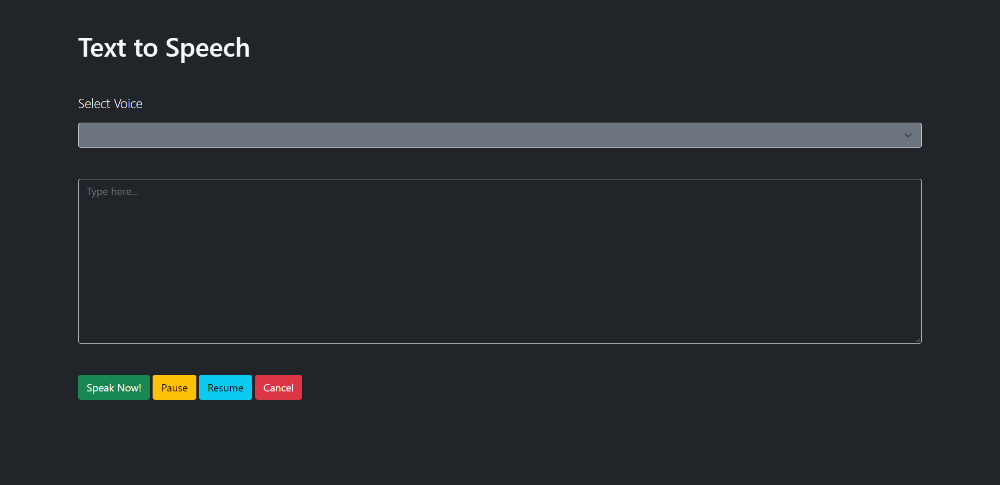

The Web Speech API is used to incorporate voice data into web apps. In this tutorial, we will build a simple webpage that uses the Web Speech API to implement text to speech.

You can check the browser compatibility for the Web Speech API [here](https://developer.mozilla.org/en-US/docs/Web/API/Web_Speech_API#Browser_compatibility.).

### Prerequisites

To follow along with this tutorial, you should have:

- A basic understanding of HTML and JavaScript.

- A code editor. I'll be using [Visual Studio Code](https://code.visualstudio.com/download).

- A browser to view the webpage, preferably [Google Chrome](https://www.google.com/intl/en_in/chrome/) or [Firefox](https://www.mozilla.org/en-US/firefox/new/).

### Project Directory

Create a new directory for the project and create 2 new files called `index.html` and `textToSpeech.js`.

```bash
project-directory/
|-index.html
|-textToSpeech.js
```

### The HTML Page

In this HTML file, Let's set up:

- An empty select menu. We will fill the empty select menu with the list of voices available using javascript later.

- Range sliders for volume, pitch, and rate.

- A `textarea` to type.

- Control buttons for the speech.

I've used [Bootstrap 5](https://getbootstrap.com/) to style the webpage. If you are new to Bootstrap, check out their [documentation](https://getbootstrap.com/docs/5.0/getting-started/introduction/) to get a better understanding.

```HTML
<html lang="en">
  <head>
    <link href="https://cdn.jsdelivr.net/npm/bootstrap@5.0.0-beta1/dist/css/bootstrap.min.css" rel="stylesheet" />
    <link rel="stylesheet" href="index.css" />
    <title>Text to Speech</title>
  </head>
  <body class="container mt-5 bg-dark">
    <h1 class="text-light">Text to Speech</h1>
    <p class="lead text-light mt-4">Select Voice</p>
    <select id="voices" class="form-select bg-secondary text-light"></select>
    <div class="d-flex mt-4 text-light">
      <div>
        <p class="lead">Volume</p>
        <input type="range" min="0" max="1" value="1" step="0.1" id="volume" />
        <span id="volume-label" class="ms-2">1</span>
      </div>
      <div class="mx-5">
        <p class="lead">Rate</p>
        <input type="range" min="0.1" max="10" value="1" id="rate" step="0.1" />
        <span id="rate-label" class="ms-2">1</span>
      </div>
      <div>
        <p class="lead">Pitch</p>
        <input type="range" min="0" max="2" value="1" step="0.1" id="pitch" />
        <span id="pitch-label" class="ms-2">1</span>
      </div>
    </div>
    <textarea class="form-control bg-dark text-light mt-5" cols="30" rows="10" placeholder="Type here..."></textarea>
    <div class="mb-5">
      <button id="start" class="btn btn-success mt-5 me-3">Start</button>
      <button id="pause" class="btn btn-warning mt-5 me-3">Pause</button>
      <button id="resume" class="btn btn-info mt-5 me-3">Resume</button>
      <button id="cancel" class="btn btn-danger mt-5 me-3">Cancel</button>
    </div>
  </body>
  <script src="./textToSpeech.js"></script>
</html>
```



### The JavaScript file

Let's create an instance of the `SpeechSynthesisUtterance` class. We'll configure this instance with various properties.

```JavaScript
let speech = new SpeechSynthesisUtterance();
```

#### Properties

Now, let's configure some properties on this `SpeechSynthesisUtterance` instance.

There are 6 properties on the `SpeechSynthesisUtterance` instance that we can tweak. They are:

**Text**:

The `text` property gets and sets the text that will be synthesized when the utterance is spoken. The text can be provided as plain text.

```JavaScript
speech.text = 'This line will be spoken by the Speech Synthesis Utterance instance';
```

**Language**:

The `language` property gets and sets the language of the utterance. If unset, the `<html lang="en">` lang value will be used, or the user-agent default if the `<html lang="en">` lang is unset.

It accepts a DOMString representing a BCP 47 language tag.

```JavaScript
speech.lang = "en";
```

**Volume**:

The `volume` property gets and sets the volume of the utterance. It is a float that represents the volume value, between 0 (lowest) and 1 (highest). The default value is 1 if this property is unset.

Let's add a `onInput` listener to the `volume` range slider and adjust the `volume` property when the value of the slider changes. We've already set the min, max and default value of the slider in the HTML tag.

Let us also set the `<span>` that displays the value of the `volume` in the webpage next to the range slider.

```JavaScript
document.querySelector("#volume").addEventListener("input", () => {
  const volume = document.querySelector("#volume").value;
  speech.volume = volume;
  document.querySelector("#volume-label").innerHTML = volume;
});
```

**Rate**:

The `rate` property gets and sets the rate of the utterance. It is a float representing the rate value which can range between 0.1 (lowest) and 10 (highest). The default value is 1 if this property is unset.

Let's add a `onInput` listener to the `rate` range slider and adjust the `rate` property when the value of the slider changes. We've already set the min, max and default value of the slider in the HTML tag.

Let us also set the `<span>` that displays the value of the `rate` in the webpage next to the range slider.

```JavaScript
document.querySelector("#rate").addEventListener("input", () => {
  const rate = document.querySelector("#rate").value;
  speech.rate = rate;
  document.querySelector("#rate-label").innerHTML = rate;
});
```

**Pitch**:

The `pitch` property gets and sets the pitch of the utterance. It is a float representing the pitch value which can range between 0 (lowest) and 2 (highest). The default pitch is 1 if this property is unset.

Let's add a `onInput` listener to the `pitch` range slider and adjust the pitch property when the value of the slider changes. We've already set the min, max and default value of the slider in the HTML tag.

Let us also set the `<span>` that displays the value of the `pitch` in the webpage next to the range slider.

```JavaScript
document.querySelector("#pitch").addEventListener("input", () => {
  const pitch = document.querySelector("#pitch").value;
  speech.pitch = pitch;
  document.querySelector("#pitch-label").innerHTML = pitch;
});
```

**Voice**:

The `voice` property gets and sets the voice that will be used to speak the utterance. This should be set to one of the `SpeechSynthesisVoice` objects. If it is not set, the most suitable default voice available for the utterance's language setting will be used.

To set the voice of the utterance, we need to get the list of available voices in the `window` object. When the window object loads, the available voices will not be available immediately. It's an async operation. An event will be triggered when the voices are loaded. We can set a function that should be executed when the voices are loaded.

```JavaScript
window.speechSynthesis.onvoiceschanged = () => {
  // On Voices Loaded
};
```

We can get the list of voices using `window.speechSynthesis.getVoices()`. It'll return an array of `SpeechSynthesisVoice` objects that are available. Let's store the list in a global array and update the select menu on the web page with the list of available voices.

```JavaScript
let voices = []; // global array

window.speechSynthesis.onvoiceschanged = () => {
  // Get List of Voices
  voices = window.speechSynthesis.getVoices();

  // Initially set the First Voice in the Array.
  speech.voice = voices[0];

  // Set the Voice Select List. (Set the Index as the value, which we'll use later when the user updates the Voice using the Select Menu.)
  let voiceSelect = document.querySelector("#voices");
  voices.forEach((voice, i) => (voiceSelect.options[i] = new Option(voice.name, i)));
};
```

Now that we have updated the voice menu, let's add an `onChange` event listener on it to update the `SpeechSynthesisUtterance` instance's voice. When a user updates the voice, we will use the index number (which is set as the value for each option) and the global array of voices to update the voice.

```JavaScript
document.querySelector("#voices").addEventListener("change", () => {
  speech.voice = voices[document.querySelector("#voices").value];
});
```

#### Controls

Let's add controls to the SpeechSynthesis instance.

**Start**:

Let's select the start button and add a `click` event listener to it.

On click, We should set the `SpeechSynthesisUtterance` instance's text property with the value of the text area. Then, we should pass that instance to the `window.speechSynthesis.speak()` method. This will start converting the text to speech.

> NOTE: If you start another Text to Speech while an instance is already running, it'll get queued behind the one that is currently running.

```JavaScript
document.querySelector("#talk").addEventListener("click", () => {
  speech.text = document.querySelector("textarea").value;
  window.speechSynthesis.speak(speech);
});
```

**Pause**:

We can pause the `SpeechSynthesisUtterance` instance that's running at the moment using `window.speechSynthesis.pause()`. Let's select the pause button and add a `click` event listener to it and pause the `SpeechSynthesisUtterance` instance when the button is clicked.

```JavaScript
document.querySelector("#pause").addEventListener("click", () => {
  window.speechSynthesis.pause();
});
```

**Resume**:

We can resume the `SpeechSynthesisUtterance` instance that's paused at the moment using `window.speechSynthesis.resume()`. Let's select the resume button and add a `click` event listener to it and resume the `SpeechSynthesisUtterance` instance when the button is clicked.

```JavaScript
document.querySelector("#resume").addEventListener("click", () => {
  window.speechSynthesis.resume();
});
```

**Cancel**:

We can cancel the `SpeechSynthesisUtterance` instance that's running at the moment using `window.speechSynthesis.cancel()`. Let's select the cancel button and add a `click` event listener to it and cancel the `SpeechSynthesisUtterance` instance when the button is clicked.

```JavaScript
document.querySelector("#resume").addEventListener("click", () => {
  window.speechSynthesis.resume();
});
```

The final version of `textToSpeech.js`:

```JavaScript
let speech = new SpeechSynthesisUtterance();
speech.lang = "en";

let voices = [];
window.speechSynthesis.onvoiceschanged = () => {
  voices = window.speechSynthesis.getVoices();
  speech.voice = voices[0];
  let voiceSelect = document.querySelector("#voices");
  voices.forEach((voice, i) => (voiceSelect.options[i] = new Option(voice.name, i)));
};

document.querySelector("#rate").addEventListener("input", () => {
  const rate = document.querySelector("#rate").value;
  speech.rate = rate;
  document.querySelector("#rate-label").innerHTML = rate;
});

document.querySelector("#volume").addEventListener("input", () => {
  const volume = document.querySelector("#volume").value;
  speech.volume = volume;
  document.querySelector("#volume-label").innerHTML = volume;
});

document.querySelector("#pitch").addEventListener("input", () => {
  const pitch = document.querySelector("#pitch").value;
  speech.pitch = pitch;
  document.querySelector("#pitch-label").innerHTML = pitch;
});

document.querySelector("#voices").addEventListener("change", () => {
  speech.voice = voices[document.querySelector("#voices").value];
});

document.querySelector("#start").addEventListener("click", () => {
  speech.text = document.querySelector("textarea").value;
  window.speechSynthesis.speak(speech);
});

document.querySelector("#pause").addEventListener("click", () => {
  window.speechSynthesis.pause();
});

document.querySelector("#resume").addEventListener("click", () => {
  window.speechSynthesis.resume();
});

document.querySelector("#cancel").addEventListener("click", () => {
  window.speechSynthesis.cancel();
});

```

### Result

You can take a look at the project that's been deployed using GitHub pages [here](https://zolomohan.github.io/text-to-speech/).

You can check out the final code in this [GitHub Repository](https://github.com/zolomohan/text-to-speech).

### Let's Recap

- We created an HTML page with a select menu for the voices, a text area, and control buttons.

- We created a new JavaScript file and linked it to the HTML file.

- We created a new `SpeechSynthesisUtterance` object.

- We tweaked the 6 properties of the `SpeechSynthesisUtterance` instance. They are Pitch, Volume, Text, Voice, Rate, and Language.

- We added listeners on the control button to control the `SpeechSynthesisUtterance` instance when they are clicked. They are Start, Pause, Resume, and Cancel.

Congratulations, :partying_face: You did it.

Thanks for reading!
