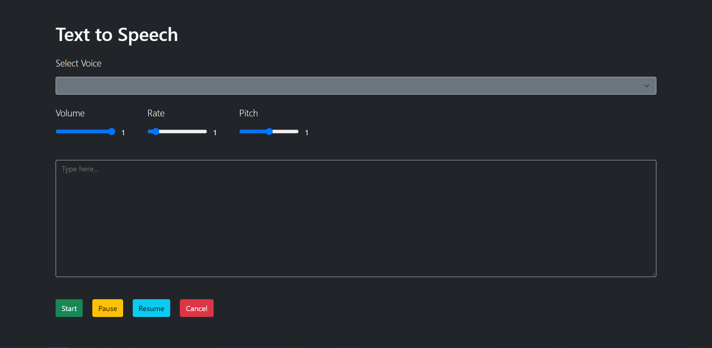

The Web Speech API is used to incorporate voice data into web apps. In this tutorial, we will build a simple webpage that uses the Web Speech API to implement text to speech.

You can check the browser compatibility for the Web Speech API [here](https://developer.mozilla.org/en-US/docs/Web/API/Web_Speech_API#Browser_compatibility.).

### Prerequisites
To follow along with this tutorial, you should have:

- A basic understanding of HTML and JavaScript.

- A code editor. I'll be using [Visual Studio Code](https://code.visualstudio.com/download).

- A browser to view the webpage, preferably [Google Chrome](https://www.google.com/intl/en_in/chrome/) or [Firefox](https://www.mozilla.org/en-US/firefox/new/).

### Get the Starter Code
To focus more on text to speech, I've prepared a gist for the HTML file. You can copy it [from here](https://gist.github.com/zolomohan/4115e5399f6770f7e74ab235b78ef6ed) on GitHub.

You can take a look at the final code in this [GitHub Repository](https://github.com/zolomohan/text-to-speech). I've also deployed the project [here](https://zolomohan.github.io/text-to-speech/).

In the starter code, I've set up an empty select menu, a text area to type, and control buttons for the speech. I've used [Bootstrap](https://getbootstrap.com/) to style the webpage.



### Let's Code
Create a new JavaScript file and name it `textToSpeech.js`. Now add the file to the HTML file using the `script` tag after the `body` tag. This will make sure that the script file is loaded after all the elements have been loaded to the DOM.

```html
<script src="./textToSpeech.js"></script>
```

Let's create a `SpeechSynthesisUtterance` object. We'll configure this instance with various properties.

```JavaScript
let speech = new SpeechSynthesisUtterance();
```

### Properties
Now, let's configure some properties on this `SpeechSynthesisUtterance` instance.

There are 6 properties on the `SpeechSynthesisUtterance` instance that we can tweak. They are:

**Language**:

The language property gets and sets the language of the utterance. If unset, the `<html>` lang value will be used, or the user-agent default if the `<html>` lang is unset. 

It accepts a DOMString representing a BCP 47 language tag.

```JavaScript
speech.lang = "en";
  ```

**Pitch**:

The pitch property gets and sets the pitch of the utterance. It is a float representing the pitch value which can range between 0 (lowest) and 2 (highest). The default pitch is 1 if this property is unset.

```JavaScript
speech.pitch = 1;
  ```

**Rate**:

The rate property gets and sets the rate of the utterance. It is a float representing the rate value which can range between 0.1 (lowest) and 10 (highest). The default value is 1 if this property is unset.

```JavaScript
speech.rate = 2;
  ```

**Volume**:

The volume property gets and sets the volume of the utterance. It is a float that represents the volume value, between 0 (lowest) and 1 (highest). The default value is 1 if this property is unset.

```JavaScript
speech.volume = 0.5;
  ```

**Text**:

The text property gets and sets the text that will be synthesised when the utterance is spoken. The text can be provided as plain text.

```JavaScript
speech.text = 'This line will be spoken by the Speech Synthesis Utterance instance';
```  

**Voice**:

The voice property gets and sets the voice that will be used to speak the utterance. This should be set to one of the `SpeechSynthesisVoice` object. If it is not set, the most suitable default voice available for the utterance's language setting will be used.

To set the voice of the utterance, we need to get the list of available voices in the `window` object. When the window object loads, the available voices will not be available immedieately. Its an async operation. An event will be triggered when the voices are loaded. We can set a function that should be executed when the voices are loaded.

```JavaScript
window.speechSynthesis.onvoiceschanged = () => {
  // On Voices Loaded
};
```

We can get the list of voices using `window.speechSynthesis.getVoices()`. It'll return an array of `SpeechSynthesisVoice` objects that are available. Let's store the list in a global array and update the select menu in the web page with the list of available voices.


```JavaScript
let voices = []; // global array

window.speechSynthesis.onvoiceschanged = () => {
  // Get List of Voices
  voices = window.speechSynthesis.getVoices();

  // Initially, set the First Voice in the Array.
  speech.voice = voices[0];

  // Set the Voice Select List. (Set the Index as the value, which we'll use later when the user updates the Voice using the Select Menu.)
  let voiceSelect = document.querySelector("#voices");
  voices.forEach((voice, i) => (voiceSelect.options[i] = new Option(voice.name, i)));
};
```

Now that we have updated the voice menu, let's add an `onChange` event listener on it to update the `SpeechSynthesisUtterance` instance's voice. When a user updates the voice, we will use the index number (which is set as the value for each option) and the global array of voices to update the voice.

```JavaScript
document.querySelector("#voices").addEventListener("change", () => {
  speech.voice = voices[document.querySelector("#voices").value];
});
```

### Controls

Let's add controls to the SpeechSynthesis instance.

**Start**:

Let's select the start button and add an `click` event listener to it. 

On click, We should set the `SpeechSynthesis` instance's text property with the value of the text area. Then, we should pass the `SpeechSynthesis` instance that we created to the `window.speechSynthesis.speak()` method. This will start converting the text to speech.

> NOTE: If you start another Text to Speech while an instance is already running, it'll get queued behind the one that is currently running.

```JavaScript
document.querySelector("#talk").addEventListener("click", () => {
  speech.text = document.querySelector("textarea").value;
  window.speechSynthesis.speak(speech);
});
```

**Pause**:

We can pause the `SpeechSynthesis` instance that's running at the moment using `window.speechSynthesis.pause()`. Let's select the pause button and add an `click` event listener to it and pause the `SpeechSynthesis` instance when the button is clicked.

```JavaScript
document.querySelector("#pause").addEventListener("click", () => {
  window.speechSynthesis.pause();
});
```

**Reume**:

We can resume the `SpeechSynthesis` instance that's paused at the moment using `window.speechSynthesis.resume()`. Let's select the resume button and add an `click` event listener to it and resume the `SpeechSynthesis` instance when the button is clicked.

```JavaScript
document.querySelector("#resume").addEventListener("click", () => {
  window.speechSynthesis.resume();
});
```

**Cancel**:

We can canel the `SpeechSynthesis` instance that's running at the moment using `window.speechSynthesis.cancel()`. Let's select the cancel button and add an `click` event listener to it and cancel the `SpeechSynthesis` instance when the button is clicked.

```JavaScript
document.querySelector("#resume").addEventListener("click", () => {
  window.speechSynthesis.resume();
});
```