## HOW TO TUNE RECOMMENDATION  ENGINE TO FORECAST FUTURE TRENDS.

## Introduction
We begin this article by describing what a recommendation system is and how we can go about to tune it. To achieve this, we would follow the steps listed below in no particular order:
-What is a Recommendation Engine?
-Deeper Look into building a Recommendation Model.
-Building the Algorithm and Classification Model.
-Fine tuning our Recommendation model.
-Conclusion.

In this article, we will consider some steps required to build a recommendation engine using an educational recommendation engine as a case study. This engine is capable of recommending the best learning materials to users and was built with an algorithm that functions from the user’s history pattern. 
This educational app aims to assist users by suggesting the choicest materials to aid their study. This article further explains how user’s history patterns can be used to suggest better ways to source for these materials using a recommendation model. 

## Prerequisite:
Knowledge of Python programming.
Knowledge of Data Science.
Basic knowledge of mathematical concepts (statistics).

                      
## What is a recommendation model ?

In the second half of 1970s, the first manifestation of recommender systems was noticed at the Usenet communication system which was created by the Duke University. This discovery was carried out during some research work done by researchers in the field of cognition science and information retrieval. 
However, some years later, two very different directions of recommender systems have evolved over time: 
i)  collaborative filtering.
ii) content-based filtering. 
Collaborative filtering attempts to map (profile) the taste of users and offers content to them that users with similar preferences liked. While  content-based filtering is about knowing the dimensions of the entity to be recommended. A good example is a musical content recommendation system that can consider the following dimensions: style, artist, era, orchestration, etc and the user’s preferences for these characteristics. Thus, every time a user likes another song, this new information is added to their profile.

In 1994, the first solution was developed on how to combine these two recommender systems, collaborative and content-based together and it was successfully achieved by two Stanford students. They pointed out that their objective with the hybrid system is to eliminate the disadvantages of the two procedures which became known by that time. Their model consists of two basic processes: first, they collect content for specific topics (such as websites or articles about financial topics), then for each individual user they select those items collected from specific subjects which highly likely will interest them specifically and finally these contents will reach the user.

We can now combine these two approaches in several ways. One of such procedures is to  embed one approach in another, or it is possible to give a joint recommendation as a result of the two procedures, as Netflix does. Netflix’s algorithm, CineMatch, was the most successful recommender system for online movie sales in the early 2000s. It was a serious catalyst for such research and the scientific field – which only started its independent existence in the 90s – started rapidly to develop.
Also, from the 2006 Netflix Award’s challenge, it is evident that the recommender algorithms are at least 10% better than the results of CineMatch due to the 100 million film reviews made available.

Today, we have come to realise that Recommendation systems are everywhere. They are used to suggest relevant items to users based on different factors and data. Top companies including Netflix, LinkedIn, and Amazon utilize the power of recommendation systems to suggest personalized items to users.
So many companies now resolve to use customer data and machine learning(ML) algorithms to build a recommendation model that can accurately suggest the best and most suitable service or product to customers. Some of the benefits of Recommendation system includes but not limited to the following:
The Recommender system helps to quickly provide personalized suggestions.
It also supports precise marketing.
It helps to facilitate smarter travels for tourists.
This technique is now used by many online business owners to monitor and track customers' orders. So many businesses utilize these data sets in making less error-prone decisions and further assist their sales/marketing departments to improve their sales figures. 
Aslo, this trend assists digital marketers and SEO experts to project where their line of advertisement will be channeled to inorder to be able to convert and onboard target audience into loyal and reliable customers based on their information from Google Analytics and the likes. 
The purpose of the recommender systems operating in the online customer space is to customize the storefront according to the current taste and need of the customers. 
This also creates an almost unbeatable competitive advantage for online shops over traditional onsite store purchases.

The next subtopic below contains some well explained procedures involved in tuning a recommendation model.

## Deeper Look into building a Recommendation Model
Getting alternatives or close substitutes for goods or some certain goods is an issue to a certain individual especially when it comes to a parent buying the right movies that are free from adult content for their children. Therefore, the Recommendation Model, which is a machine learning algorithm that plays a key role here can be used to recommend movies, music, e.t.c based on certain features in the data set to an individual, a group or a parent.

Basically, there are three (3)  types of recommendation models. They are:
Simple recommender.
Content-based recommender.
Collaborative filtering engines.

In this article, we will be using the content-based recommendation model. The content-based recommendation model suggests similar items based on a particular item. This system uses item metadata, such as genre, director, description, actors for movies, to make these recommendations. The general idea behind this particular type of recommendation system is that if a person likes a particular item, they will also like an item that is similar to it. This similarity in choices makes it easier for the recommendation model to recommend the next item. The recommendation model simply makes use of the user's past item metadata.
A good example could be YouTube, with a lot of videos online on various topics and subject matter. Still yet, the recommendation system is used here to determine the favourite choice of a user’s video ‘suggestion list’ based on the previous history. This algorithm pattern continues and keeps on suggesting new videos that you could potentially watch.

## BUILDING THE ALGORITHM MODEL
In building this algorithm (model) used in our case study, we are going to use the Python programming language because of its robust libraries and the fact that it is faster, precise and more accurate when it comes to scientific calculations. 

## BUILDING THE CLASSIFICATION MODEL
We will build this classification model using the ‘Cosine Similarity matrix’. The cosine similarity matrix helps to take the distance between points. For instance, let us consider some points and we name them : X1, X2, X3, X4…….Xn. 
We will then check closely and make our observations on the relationship within these points X1,X2,X3,X4...........Xn. 
Note that, if the distance between two certain points are close ,we will group them together as related i.e  (positive) but if the distance between points   X1,   X2,   X3,    X4………..Xn are far apart, we will group them as (negative) or we can also refer to them as dissimilar or unrelated.
Furthermore, we are going to use a set of movie data-set to build these models. The movie set we will make use of here was gotten from UCI which is a machine learning repository for the data source.
Now we will go through the process of building the recommendation model in python, using some specific libraries.
In building this model, the first thing you have to do is to build your environment using this command Python -m venv venv, after that you install the following packages using pip install for windows user while for Linux user you use pip3 install:
A. Sklearn
B. Numpy
C. Pandas
D. Matplotlib
E. Jupyter notebook/Jupyter lab
The sklearn is used for scientific calculation, pandas are used for loading the data into the notebook in other for me to be able to work with, Matplotlib is used for plotting of graphs, Numpy is being used for mathematical computation while Jupyter notebook/jupyter lab is an environment where the python code will be written.

## About Data-set
The dataset files contain metadata for all 45,000 movies listed in the Full MovieLens Dataset. The dataset consists of movies released on or before July 2017. This dataset captures feature points like overview, plot, budget, revenue, posters, release dates, languages, production companies, countries, TMDB vote counts, and vote averages.
These feature points could be potentially used to train machine learning models for content and collaborative filtering.

This dataset consists of the following files:
movies_metadata.csv: This file contains information on approximately 45,000 movies featured in the Full MovieLens dataset. Features include posters, backdrops, budget, genre, revenue, overview, release dates, languages, production countries, and companies.  And this will be the dataset I will be using for building the recommendation model.

The Full MovieLens Dataset comprises 26 million ratings and 750,000 tag applications, from 270,000 users on all the 45,000 movies in this dataset. It can be accessed from GroupLens website.

Snippet of libraries
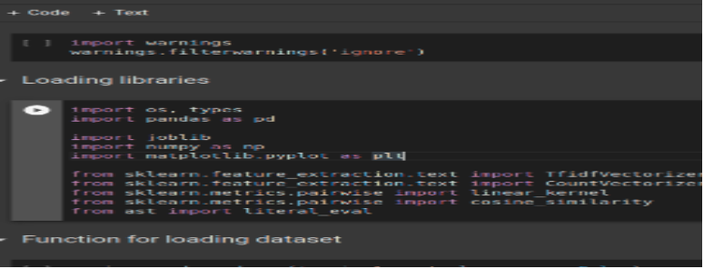

 
To load the dataset, we will make use of the pandas DataFrame library. The panda’s DataFrame library is mainly used for data manipulation and analysis. It helps to represent your data set in a row-column format. Pandas DataFrame library is backed by the NumPy array for the implementation of pandas data objects. Pandas offer off-the-shelf data structures and operations for manipulating numerical tables, time series, imagery, and natural language processing datasets. Basically, pandas are useful for those datasets which can be easily represented in a tabular fashion.

Loading Dataset

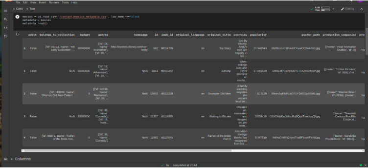

Next, we will check for missing values in our data-set. This is done in order to avoid bias in our models. From the code snippet below there are missing values in our dataset. In order to avoid the models from being biased, we deal with the missing values by replacing them with the mean and mode of the column.

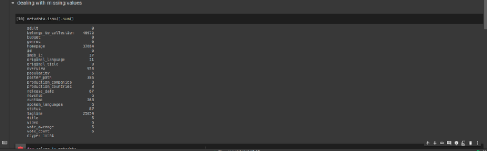

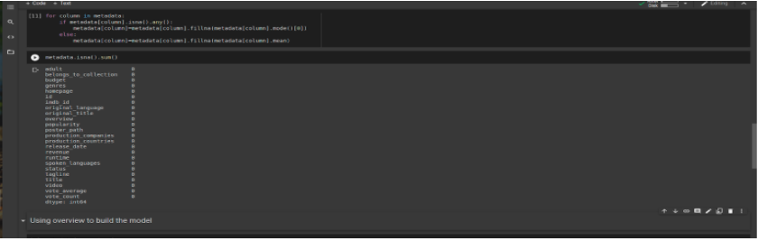

## Plot Description Based Recommender
In this section, we will be building a system that recommends movies that are similar to a particular movie. To achieve this, we will compute pairwise cosine similarity scores for all movies based on their plot descriptions and recommend movies based on that similarity score threshold.
The plot description is available as the overview feature in my movie dataset. Let's inspect the plots of a few movies:
 

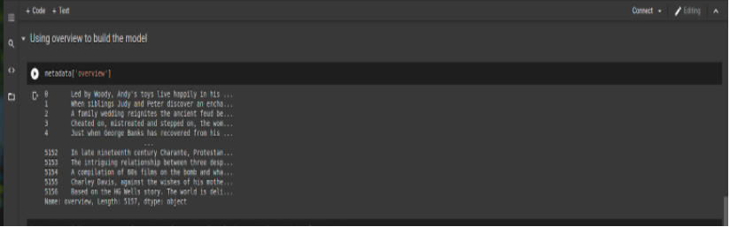

Since we have to deal with the Natural Language Processing problem. And it is not possible to compute the similarity between any two overviews in their raw forms. To do this we will have to compute the word to vectors of each overview or document, as it will be called. 
As the name suggests, word vectors are vectorized representations of words in a document. The vectors carry a semantic meaning with them. For example, man & king will have vector representations close to each other while man & woman would have representation far from each other.
I will be computing Term Frequency-Inverse Document Frequency (TF-IDF) vectors for each document. This will give you a matrix where each column represents a word in the overview vocabulary (all the words that appear in at least one document), and each column represents a movie, as before.
The TF-IDF score is the frequency of a word occurring in a document, down-weighted by the number of documents in which it occurs. This is done to reduce the importance of words that frequently occur in plot overviews and, therefore, their significance in computing the final similarity score.

In this case, we are going to use the sci-kit-learn library which has a built-in TF-IDFVectorizer class that produces the TF-IDF matrix. In order to make the algorithm work properly without bias we remove words that are not relevant to the topic. An example of such words includes like, the, an, on, e.t.c.
				
				

A Snippet of TF-IDF Matrix

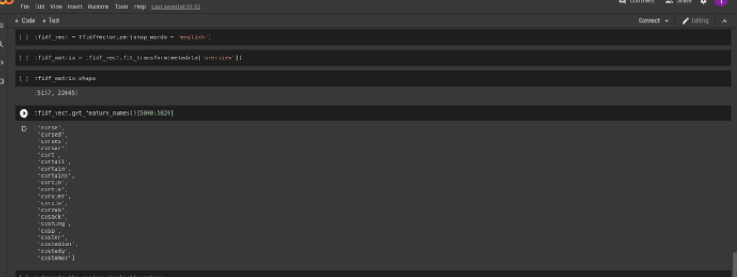

From the above output, you observe that 22645 different vocabularies or words in your dataset have 5157 movies. With the TFI-DF matrix, it can now be easier for us to compute the cosine similarity. This cosine similarity helps to calculate a numeric quantity that denotes the similarity between two movies. 
Mathematically,this can be express as:

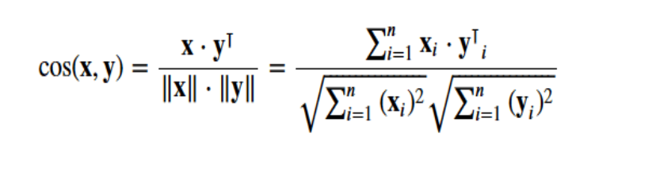

Since we used the TF-IDF vectorizer, calculating the dot product between each vector will directly give us the cosine similarity score. Therefore, we will use sklearn’s linear_kernel() instead of cosine_similarities() since it is faster. This as a result would return a matrix of shape 5157x5157, which means each movie overview cosine similarity score with every other movie overview. Hence, each movie 
 
 
will be a 1x5157 column vector where each column will be a similarity score with each movie.

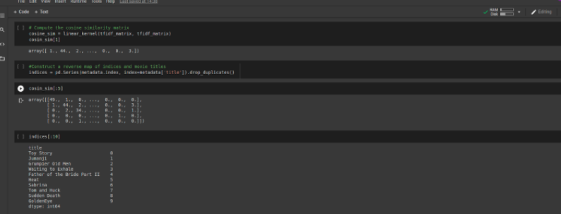

We are now going to define a function that takes in a movie title as an input and outputs a list of the 10 most similar movies. In order for us to do this, we will need a reverse mapping of movie titles and DataFrame indices. Also, we will need a mechanism to identify the index of a movie in the Movie DataFrame, given its title. 

A snippet of the Recommendation model

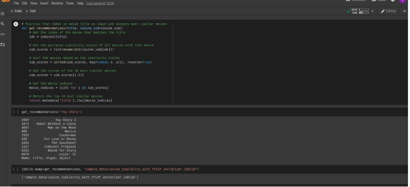

After getting the function, we will then save it using joblib and generate the requirements using the command pip freeze > requirements.txt. This will help us to avoid some environmental variable issues while deploying the model on any hosting site, also it will make it easier for other machine learning engineers to contribute and improve on the model. 
  

## FINE-TUNING THE RECOMMENDATION MODEL.

To fine tune the recommendation system model, we will have to build a system based on some metadata which include casts, crew, keywords, and genres.
This will help to increase the performance of the recommendation model by capturing more of the finer details.
Here, we will be using a kaggle notebook to run the model because of the availability of GPU. GPU means Graphic Processing Unit, it is very useful because it helps in faster execution of the model.

				Loading Libraries

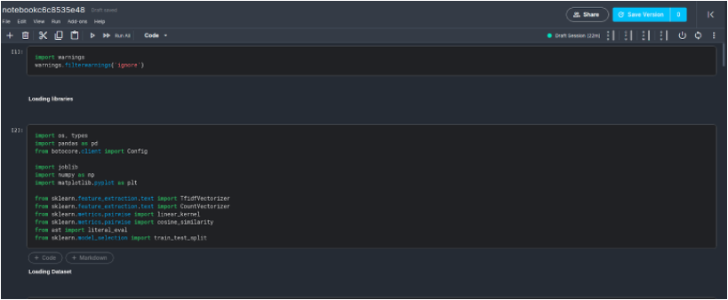

			

Loading Dataset
We are going to load the dataset from three different data tables and merge them all together in one dataframe.
To do this, we will first of all convert the id’s columns of those individual dataframe to integers, this conversion is done to make it easier to be merged  as one.

Loading and Merging dataframe

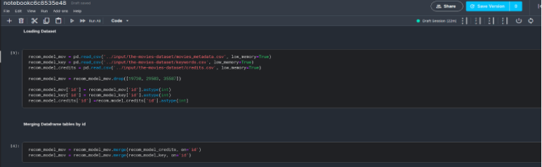

			
Selecting the Features
Since we are trying to tune the model in order to get a more robust recommendation system that will be perfect for recommending movies that have the similar features. We can achieve this by extracting four features from the merged dataframe. These features include cast, crew, genres, keywords. With these features we will be able to build a model that can tell us the movies that have the same storyline and actions. For instance, if you have watched a movie previously, and perhaps went ahead to like it, a similar movie will be recommended to you, this is not done by accident or magic, it is all algorithm model at play here. This is why you notice that there are certain movies that children of a certain age can view (parental guidance and restrictions) .
Back to our steps, so next, we will have to first convert the data from stringfield lists using the literal_eval for safe evaluation and expression.

				Features Selections

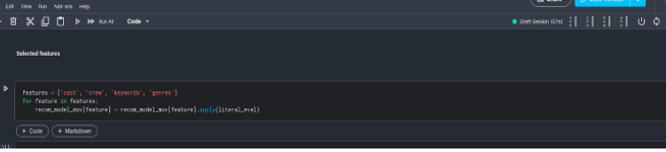
 

	Function for Extraction of Required Information.

We create a function that will help in extracting the required information from our features such as the directors, title, cast, keywords, and genres.

				Snippet of Function

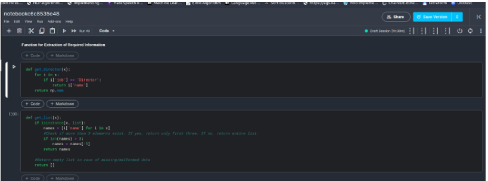

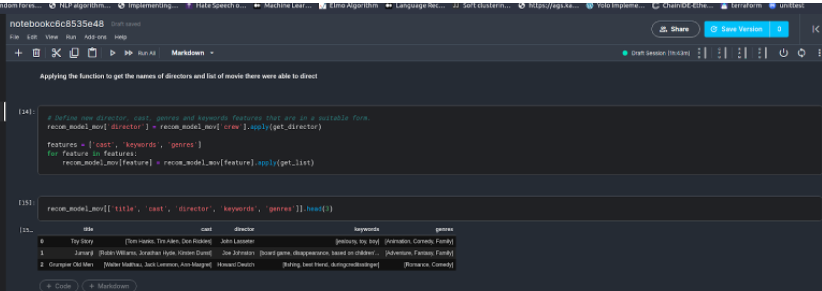

Function For Cleaning Dataset
In order to improve the quality of our recommendation model, increase productivity and do away with incorrect information we will have to clean our dataset.

			                      Snippet

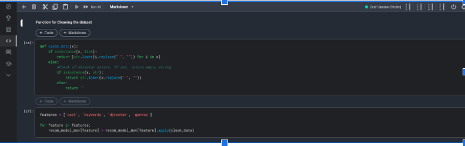
 

Since we have successfully cleaned our dataset, we are now in a position to create a function that contains all the features that we have to feed to our vectorizer.
This function will join all the feature columns and the output will be used to build the model.
				

Snippet

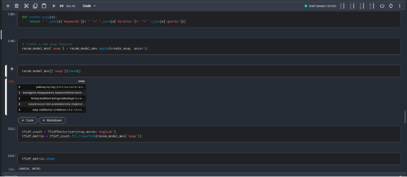

From the output we can see that there are 9879 vocabularies in the features that we feed to our vectorizers. 
Next we will use the cosine similarity to measure the distance between two embeddings.

		
Application of cosine-similarity

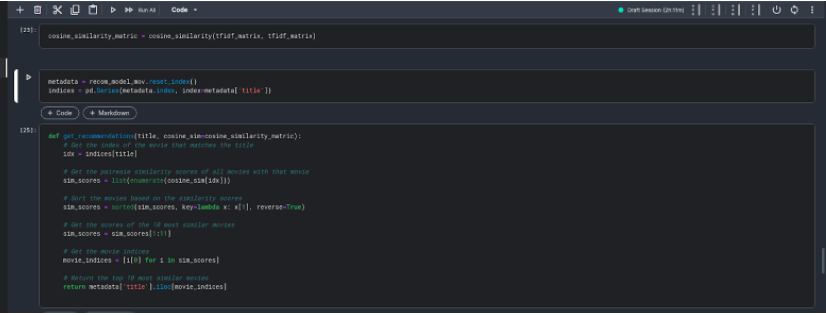

		

Snippet of output

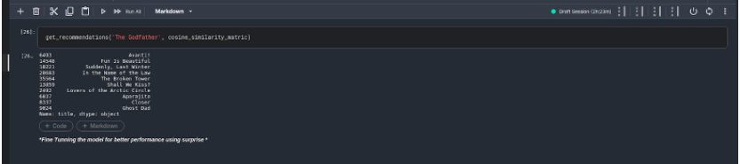

                                            CONCLUSION
In this article, we were able to fine tune our movie recommendation model. We also gave a brief introduction to Machine Learning and Artificial Intelligence. By now, we all agree that recommender systems are here to stay. They are widespread and very popular among users drowning in the flood of information, even when many people know that they only try to sell them another product. However, the success of these solutions is indisputable and has irrevocably become part of our lives, let’s just think about Youtube or Facebook, we will then realise that we can also consider ways where we can channel these knowledge or data sets into positive use. 
If you have any questions, don't hesitate to contact me on: 

[Peter Aideloje LinkedIn] (https://www.linkedin.com/in/peter-aideloje-64aab6116//)
[Peter Aideloje Github] (https://github.com/aidelojep)
[Peter Aideloje Twitter handle] (https://twitter.com/PAideloje)
