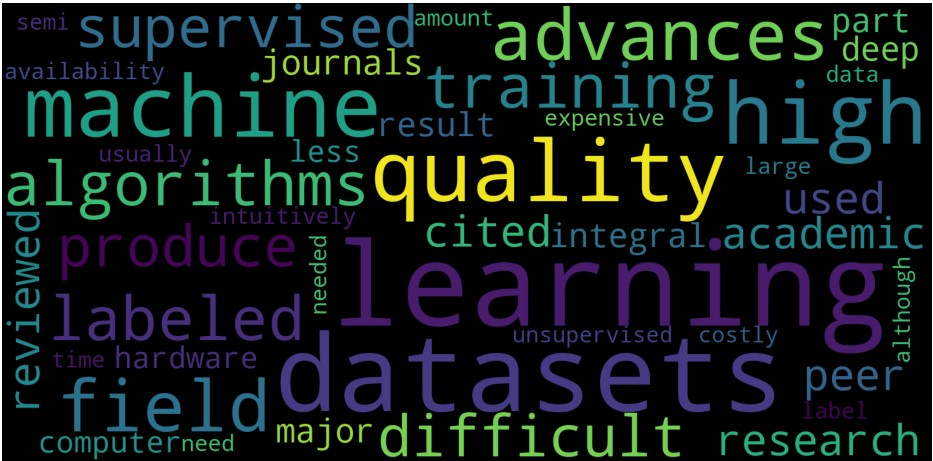

Welcome to an exciting article on the word cloud generation. Word clouds are great ways to summarize vast pieces of information visually. They are typically used to depict metadata on websites. The bigger the font size of the keyword, the higher its significance on the website. In this article, we will code a program to generate custom word clouds.  
<!--more-->
### Installation
We'll install the packages required for this tutorial in a virtual environment. We'll use `conda` to create a virtual environment. For more installation information, refer to the [Anaconda Package Manager website](https://www.anaconda.com/products/individual). 

Create a new virtual environment by typing the command in the terminal. Perform this after installing anaconda package manager using the instructions mentioned on Anaconda's website.

```bash
conda create -n wordcloud python=3.6
```

This will create a virtual environment with Python 3.6. 

We will be installing the following packages:
1. *matplotlib*
2. *nltk*
3. *wordcloud*

Activate the virtual environment using the command, `conda activate wordcloud.` After activating the virtual environment, we'll be installing these packages locally in the virtual environment. To use these packages, we must always activate the virtual environment named `wordcloud` before proceeding. You may also use the name of your choice for the virtual environment. Just replace `wordcloud` with the name of your choice.

To install the packages, we will use the following commands:
1. **matplotlib**: `pip3 install matplotlib`
2. **nltk**: `pip3 install nltk`
3. **wordcloud**: `pip3 install wordcloud`
   
*Note: If you get an error during installation, install the 1.19.3 version of numpy. Use the command* `pip3 install numpy==1.19.3` *For more information on the error, refer to this [discussion](https://developercommunity.visualstudio.com/content/problem/1207405/fmod-after-an-update-to-windows-2004-is-causing-a.html).*

*NLTK Installation:* On the basis of the installer used, you may or may not need to run the following commands. If you get an error related to `stopwords` or `punkt` package while running the code, run the following commands: 

```python
>>> import nltk
>>> nltk.download('popular')
```

A Graphical User Interface pops up. If you are unsure of what to download, refer to this [question](https://stackoverflow.com/questions/22211525/how-do-i-download-nltk-data) on Stack Overflow. 

Once installed, check if the packages are installed correctly. Run the following piece of code in an instance of the python shell (activated by running `python3`) in your terminal, and you should get a valid output for the version number.

```py
>>> import nltk
>>> print(ntlk.__version__)
>>> import matplotlib
>>> print(matplotlib.__version__)
>>> import wordcloud
>>> print(wordcloud.__version__)
```

If you get valid output, you have successfully installed the package and can proceed with the rest of the article. We should get the following output: 

```py
>>> import matplotlib
>>> matplotlib.__version__
'3.3.3'
>>> import nltk
>>> nltk.__version__
'3.5'
>>> import wordcloud
>>> wordcloud.__version__
'1.8.1'
```

### Word Cloud Generation
Let's now look at the code to generate word clouds. The input to the program will be a paragraph copied from any website of your choice. With the paragraph as input, we'll pre-process it and send it to the `wordcloud` package. 

Let's begin.

As mentioned above, we use the following libraries:
1. **[matplotlib](https://www.section.io/engineering-education/matplotlib-visualization-python/):** A visualization and plotting tool used extensively in Python. 
2. **[nltk.corpus.stopwords](https://pythonprogramming.net/stop-words-nltk-tutorial/):** Natural language toolkit, known as `nltk,` is a library built for performing various Natural Language Processing (NLP) tasks. It's a vast library with tools for pre-processing, data cleaning, data visualization, data modeling, etc. We'll use the list of stopwords for English. Stopwords are redundant words that don't add significant meaning to the data.
3. **[nltk.tokenize.word_tokenize](https://www.nltk.org/api/nltk.tokenize.html):** Tokenization is the process of breaking down the text into smaller units called tokens. The tokens can be words, sub-words, or phrases. We'll use the tokenizer available in `nltk.` 
4. **[wordcloud](https://pypi.org/project/wordcloud/):** It's a library that takes in the list of words and outputs a word cloud image. Developed by [Andreas Mueller](https://amueller.github.io/), it's quite extensible and flexible with respect to the features.

### Code
We define a class called `WordCloudGeneration` and define the following methods in the class:
1. **pre-processing**: We pass the input `data` through the tokenizer. The `data` is converted to lower case and tokenized. Tokenization results in a list of words. This list of words is further filtered. The filtering process copies words to `preprocessed_data` only if the word is not a stopword.

2. **create_word_cloud**: This function takes in the processed list of words and calls the `WordCloud` class object. The `generate` method in the `WordCloud` class returns an image of the word cloud. Using the library `matplotlib`, we plot the image. 

```py
import matplotlib.pyplot as plt

from nltk.corpus import stopwords
from nltk.tokenize import word_tokenize
from wordcloud import WordCloud

class WordCloudGeneration:
    def preprocessing(self, data):
        # convert all words to lowercase
        data = [item.lower() for item in data]
        # load the stop_words of english
        stop_words = set(stopwords.words('english'))
        # concatenate all the data with spaces.
        paragraph = ' '.join(data)
        # tokenize the paragraph using the inbuilt tokenizer
        word_tokens = word_tokenize(paragraph) 
        # filter words present in stopwords list 
        preprocessed_data = ' '.join([word for word in word_tokens if not word in stop_words])
        print("\n Preprocessed Data: " ,preprocessed_data)
        return preprocessed_data

    def create_word_cloud(self, final_data):
        # initiate WordCloud object with parameters width, height, maximum font size and background color
        # call the generate method of WordCloud class to generate an image
        wordcloud = WordCloud(width=1600, height=800, max_font_size=200, background_color="black").generate(final_data)
        # plt the image generated by WordCloud class
        plt.figure(figsize=(12,10))
        plt.imshow(wordcloud)
        plt.axis("off")
        plt.show()

wordcloud_generator = WordCloudGeneration()
# you may uncomment the following line to use custom input
# input_text = input("Enter the text here: ")
input_text = 'These datasets are used for machine-learning research and have been cited in peer-reviewed academic journals. Datasets are an integral part of the field of machine learning. Major advances in this field can result from advances in learning algorithms (such as deep learning), computer hardware, and, less-intuitively, the availability of high-quality training datasets.[1] High-quality labeled training datasets for supervised and semi-supervised machine learning algorithms are usually difficult and expensive to produce because of the large amount of time needed to label the data. Although they do not need to be labeled, high-quality datasets for unsupervised learning can also be difficult and costly to produce.'
input_text = input_text.split('.')
clean_data = wordcloud_generator.preprocessing(input_text)
wordcloud_generator.create_word_cloud(clean_data)

```

The output of the code pops in a separate window. It should look like the image shown below.



### Conclusion
This was a fun experiment we coded in Python. We went over how to generate a virtual environment using Anaconda and how to install the needed packages to generate word clouds. I encourage you to test the program with various inputs and experiment with the code. Happy learning.

Peer Review Contributions by: [Adrian Murage](/engineering-education/authors/adrian-murage/)
