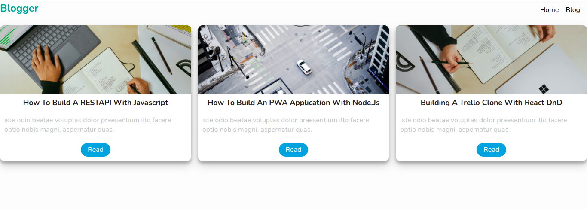
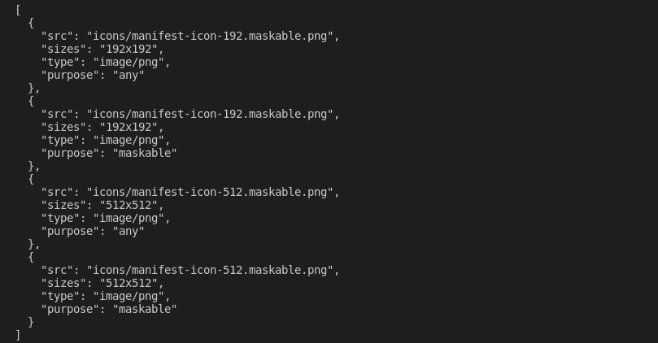
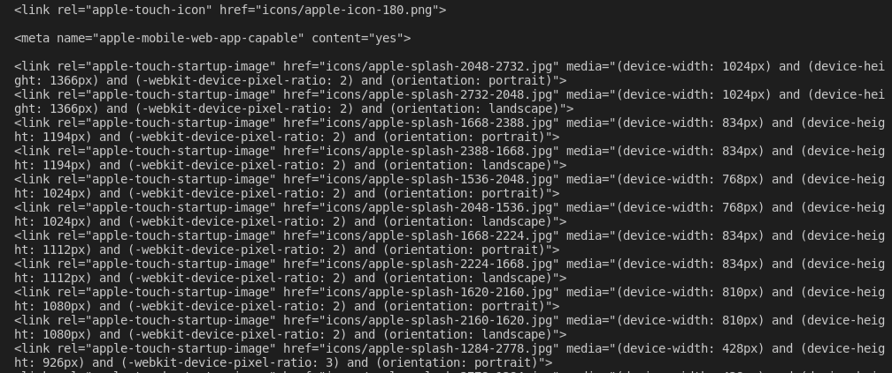
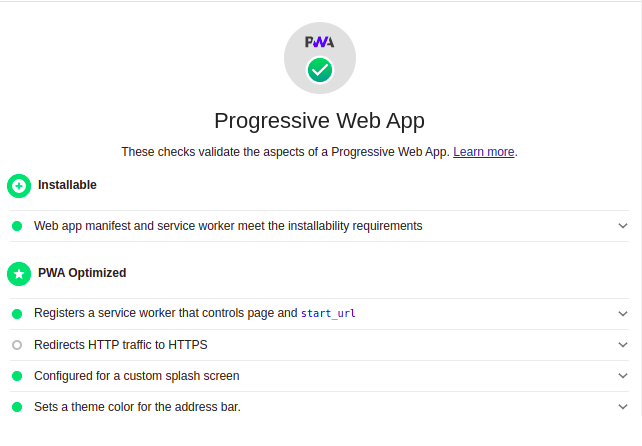

# Building an Offline-First application with Node.js
Offline First is an application development paradigm in which developers ensure that an app's functionality is unaffected by a temporary loss of network connectivity. Consider giving our application the look and feel of a mobile app, allowing us to install and run it without an internet connection. Progressive web applications make all of this possible.
In this tutorial, we'll learn how to build an offline-first application with Node.js. We'll cover the following:

- Introduction to PWA
- Initialize NodeJs application
- Set up an Express server
- Optimizing application
- Create a Manifest
- Setup Service Workers
- Google Lighthouse Check
- Conclusion

Let's start with an introduction to Progressive Web Apps.

## Introduction to PWA

Progressive Web Apps (PWAs) are web apps that use service workers, manifests, and other web-platform features, along with progressive enhancement, to provide users with an experience comparable to native apps. 
Progressive Web Apps (PWAs) outperform native apps in terms of efficiency. They operate on demand and are always available, without consuming valuable smartphone memory or data. Users consume less data when they choose a PWA over a native version of the same application (as is the case for the Twitter PWA). However, this does not imply that users should forego the convenience of a native app. They can still save the PWA to their home screen; it's installable without the need for a full download.

## What are we building?

To demonstrate the power of progressive web applications, we'll be building a simple blog application.

## Initialize NodeJs application

Let's get our hands dirty. To get started, we'll 
Create our project folder with the command below:

    mkdir PWA && cd PWA

Then, we'll initialize a Node.js application with the commands below:

    npm init -y

The above command creates a `package.json` file for the application.

Next, create the following folder structure in our project folder:
📦PWA
 ┣ 📂public
 ┃ ┣ 📂 css
 ┃ ┣ 📂icons
 ┃ ┣ 📂images
 ┃ ┣ 📂js
 ┃ ┗ 📜index.html
 ┗ 📜package.json

## Set up an Express server

With our application setup, let's install Express to create our Node.js server with the command below:
`npm install express`

Then, we'll create a couple of folders and files in the public folder:

- css/style.css file
- js/app.js file -

Next, create an `index.js` file in the project root directory with the following code snippets below: 

    const express = require("express");
    const path = require("path");
    const app = express();
    app.use(express.static(path.join(__dirname, "public")));
    
    app.get("/", function (req, res) {
      res.sendFile(path.join(__dirname, "public/index.html"));
    });
    app.listen(8000, () => console.log("Server is running on Port 8000"));

In the above code snippet, we import **express** to create our server and the **path** module. We configured our app to render our static files using the **express.static** method, which takes the path to the static folder (public), we created the root route of our application and rendered the **index.html** file. Then we configured the app to listen to port **8000**.

Next, we'll create a list of blog posts to render on our client-side with the code snippet below:

    ...
    let blogs = [
      {
        id: "1",
        title: "How To Build A RESTAPI With Javascript",
        avatar: "images/coffee2.jpg",
        intro: "iste odio beatae voluptas dolor praesentium illo facere optio nobis magni, aspernatur quas.",
      },
      {
        id: "2",
        title: "How to Build an Offline-First Application with Node.js,"
        avatar: "images/coffee2.jpg",
    "iste odio beatae voluptas dolor praesentium illo facere optio nobis magni, aspernatur quas.",
      },
      {
        id: "3",
        title: "Building a Trello Clone with React DnD",
        avatar: "images/coffee2.jpg",
        intro: "iste odio beatae voluptas dolor praesentium illo facere optio nobis magni, aspernatur quas.",
      },
    ];
    ...

Each block post in our application will have an **id**, **title**, **avatar**, and **intro** fields. 

Then open the `index.html` file and add the following code snippets below:

    <!DOCTYPE html>
    <html lang="en">
      <head>
        <meta charset="UTF-8" />
        <meta name="viewport" content="width=device-width, initial-scale=1.0" />
        <meta http-equiv="X-UA-Compatible" content="ie=edge" />
        <link rel="stylesheet" href="css/style.css" />
        <title>Blogger</title>
        <link rel="manifest" href="manifest" />
      </head>
      <body>
        <section>
          <nav>
            <h1>Blogger</h1>
            <ul>
              <li>Home</li>
               <li class="active">Blog</li>
            </ul>
          </nav>
          

        </section>
        
      </body>
    </html>

In the above markup, we created a simple markup with links to our **manifest**, which we'll be creating in the next section, **styles**, and **app.js** files. 

Then, we'll create a **blogs** route in our **index.js** file to return the blogs to the client side.

    ...
    app.get("/blogs", (req, res) => {
      res.status(200).json({
        blogs,
      });
    });
    ...

In our **pubblic/js/app.js** file, we'll send a get request to the blog endpoint to get the blogs from our backend. Then we loop through the blogs, target the **container** class and display them.

    let result = "";
    fetch("http://localhost:8000/blogs")
      .then((res) => res.json())
      .then(({ blogs } = data) => {
        blogs.forEach(({ title, avatar, intro } = blogs) => {
          result += `
           

                
                <h1 class="card-title">${title}</h1>
                
${intro}

                <a class="card-link" href="#">Read</a>
            

           `;
        });
        document.querySelector(".container").innerHTML = result;
      })
      .catch((e) => {
        console.log(e);
      });

We'll also add some styling to our application in the **public/css/style.css** with code snippet below:

    * {
      margin: 0;
      padding: 0;
      box-sizing: border-box;
    }
    body {
      background: #fdfdfd;
      font-size: 1rem;
    }
    section {
      max-width: 900px;
      margin: auto;
      padding: 0.5rem;
      text-align: center;
    }
    nav {
      display: flex;
      justify-content: space-between;
      align-items: center;
    }
    ul {
      list-style: none;
      display: flex;
    }
    li {
      margin-right: 1rem;
    }
    h1 {
      color: #0e9c95;
      margin-bottom: 0.5rem;
    }
    .container {
      display: grid;
      grid-template-columns: repeat(auto-fit, minmax(15rem, 1fr));
      grid-gap: 1rem;
      justify-content: center;
      align-items: center;
      margin: auto;
      padding: 1rem 0;
    }
    .card {
      display: flex;
      align-items: center;
      flex-direction: column;
      width: 15rem auto;
      background: #fff;
      box-shadow: 0 10px 20px rgba(0, 0, 0, 0.19), 0 6px 6px rgba(0, 0, 0, 0.23);
      border-radius: 10px;
      margin: auto;
      overflow: hidden;
    }
    .card-avatar {
      width: 100%;
      height: 10rem;
      object-fit: cover;
    }
    .card-title {
      color: #222;
      font-weight: 700;
      text-transform: capitalize;
      font-size: 1.1rem;
      margin-top: 0.5rem;
    }
    .card-link {
      text-decoration: none;
      background: #16a0d6e7;
      color: #fff;
      padding: 0.3rem 1rem;
      border-radius: 20px;
      margin: 10px;
    }
    .intro {
      color: #c2c5c5;
      padding: 10px;
    }
    .active {
      color: #16a0d6e7;
    }

Now open the **package.json** file and add the start script.

    "start": "node index.js"

At this point, we've set up our application. But we cannot run our application when the server is not running or when there is no network connection for production. Let's set that up in the next section.

## Optimizing application

We need to make our application compatible with all screen sizes and add a theme color by adding the markup below in the head section of our **index.hml** file.

    <meta name="viewport" content="width=device-width, initial-scale=1">
    <meta name="theme-color" content="#16a0d6e7"/>

## Create a Manifest 

Now we need to describe our app and how it should behave when installed on the user's device. We can do this by creating a manifest. Create a **manifest** file in the project root directory and add the following configurations:

    {
        "name": "Blogger"
        "short_name": "Blogger"
        "start_url": "/",
        "display": "standalone",
        "background_color": "#0e9c95",
        "theme_color": "#16a0d6e7",
        "orientation": "portrait",
        "icons": []
    }

In our manifest, we defined the following configurations:

- **name**: This defines the app's display name.
- **short_name**: This defines the name that will be displayed under the app icon when installed.
- **start_url**: This tells the browser the root URL of the application.
- **display**: This tells the browser how to display the app. 
- **background_color:** This defines the background color of the application when installed.
- **theme_color:** This defines the color of the status bar.
- **orientation:** This defines the orientation to use during the app display.
- **icons:** This defines the icons or images of different sizes to be used as our app home icons.

Creating our home screen icons manually can be a very complicated task, but not to worry. We'll take advantage of a third-party module known as [pwa-asset-generator](https://www.npmjs.com/package/pwa-asset-generator) to generate icons of different sizes from our main app icon inside the public directory with the command below:

    #change directory to the public folder
    cd public
    #generate icons
    npx pwa-asset-generator logo.png icons

 
The above command will create an **icons** folder inside the public folder with a bunch of icons for our application, along with some **json** on the terminal that we will paste into our icons array in the manifest.

The icons array in our manifest should look like this:

    ...
     "icons": [
        {
          "src": "public/icons/manifest-icon-192.maskable.png",
          "sizes": "192x192",
          "type": "image/png",
          "purpose": "any"
        },
        {
          "src": "public/icons/manifest-icon-192.maskable.png",
          "sizes": "192x192",
          "type": "image/png",
          "purpose": "maskable"
        },
        {
          "src": "public/icons/manifest-icon-512.maskable.png",
          "sizes": "512x512",
          "type": "image/png",
          "purpose": "any"
        },
        {
          "src": "public/icons/manifest-icon-512.maskable.png",
          "sizes": "512x512",
          "type": "image/png",
          "purpose": "maskable"
        }
      ]

Also, the command generated the markup links to the icons generated.

Copy and paste the markup to the head section of the markup in the **public/index.html** file.

## Setup Service Workers

With our manifest created, let's set up the service workers. A service worker is a piece of JavaScript code that your browser runs in the background in a separate thread to handle the cache for assets and data that you save for future requests to enable offline support for your application.
So create a **blogger.serviceWorker.js** file in the **public** folder. For the service worker, there are a bunch of events (push, activate, install, fetch, message, sync), but for the demonstration in this tutorial, we'll cover the **install, activate,** and **fetch** events. Before that, we need to create an array to store all the assets we used in our application.

    const assets = [
      "/",
      "css/style.css",
      "js/app.js",
      "/images/blog1.jpg",
      "/images/blog2.jpg",
      "/images/blog3.jpg,"
    ];

Then, we'll listen to the **install** event to register and save our static files to the browser's cache. This process takes some time to complete. To skip the wait, we'll use **skipWaiting().**

    const BLOGGER_ASSETS = "blogger-assets";
    self.addEventListener("install", (installEvt) => {
      installEvt.waitUntil(
        caches
          .open(BLOGGER_ASSETS)
          .then((cache) => {
            cache.addAll(assets);
          })
          .then(self.skipWaiting())
          .catch((e) => {
            console.log(e);
          })
      );
    });
    ...

Then, we need to clear the cache to remove the old assets whenever the service worker is updated. For that, we'll listen to the **activate** code snippet below:

    ...
    self.addEventListener("activate", function (evt) {
      evt.waitUntil(
        caches
          .keys()
          .then((keysList) => {
            return Promise.all(
              keysList.map((key) => {
                if (key === BLOGGER_ASSETS) {
                  console.log(`Removed old cache from ${key}`);
                  return caches.delete(key);
                }
              })
            );
          })
          .then(() => self.clients.claim())
      );
    });

In the above code snippet, we use the **waitUntil** method on the service worker. This method waits for the action to finish, and then we check if the assets we are trying to clear are the assets of our current app before we delete them.

Next, we need the files stored in our cache to use them. 

    self.addEventListener("fetch", function (evt) {
      evt.respondWith(
        fetch(evt.request).catch(() => {
          return caches.open(BLOGGER_ASSETS).then((cache) => {
            return cache.match(evt.request);
          });
        })
      );
    })

When a request is made on the page, PWA will check our cache and read from it if there is data in the cache rather than going to the network. Then, using the **respondWith** method, we override the browser's default and make our event return a promise. When the cache is complete, we can return the cache that corresponds to the evt.request. When cache is ready, we can return the cache that matches the evt.request.
We have succefully setup our service worker, now let's make available in our appllication.

## Register the Service Worker

Now let's register our service worker in our **public/js/app.js** file with the code snippet below:

    ...
    if ("serviceWorker" in navigator) {
      window.addEventListener("load", function () {
        navigator.serviceWorker
          .register("/blogger.serviceWorker.js")
          .then((res) => console.log("service worker registered"))
          .catch((err) => console.log("service worker not registered", err));
      });
    }

In the above snippet, we check if the browser running our application supports service workers (of course, not all browsers support service workers), then register our service worker file.

Now run the application with the command below:

    npm start

Go to localhost:8000 in your browser to access the app.

## Google Lighthouse Check

Now let's check if the application is a Progressive Web App using the Google Lighthouse check. Right-click on your browser and select "inspect." On the inspect tabs, select lighthouse and click on generate report. If everything went well with your application, you should see an output like the one in the screenshot below:

We have successfully created our first application. You can stop the server to test the application in offline mode. 

## Conclusion

Progressive Web Apps (PWA) use modern APIs to provide enhanced capabilities, dependability, and installability while reaching anyone, anywhere, and on any device with a single codebase. Allowing your end-user to use your application regardless of whether or not they have an internet connection.
You should feel free to fork the [repository](https://github.com/Claradev32/Offline-first-App) and add additional features to the project now that you've learned how to build an offline first application. This tutorial should have taught you a lot.

