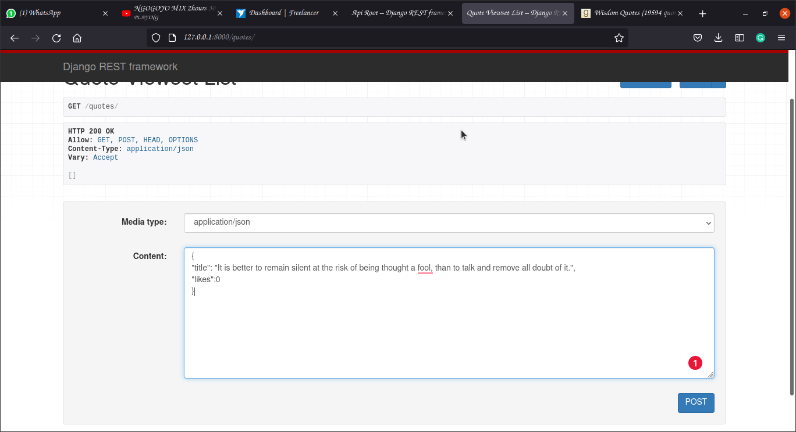

After becoming more knowledgeable upon creating your APIs using the Django REST framework, you may find that you need to alter or create data on your Django APIs using data from other Django APIs. 
<!--more-->
Some form of communication is thus required to facilitate these operations.
### Introduction
We are going to use RabbitMQ to enable this communication. RabbitMQ is a messaging service that allows microservices to communicate with one another. 

It offers the following advantages:
- Order and delivery guarantee
- Redundancy
- Scalability

RabbitMQ works by having publishers/producers create messages and send them to an exchange with a `routing-key`. Consumers then call and receive the messages and process them.

### Prerequisites
For you to follow along, it's important that:
1. You are able to create a Django application and have basic understanding of how to build APIs using the [Django REST framework](https://www.django-rest-framework.org/).
2. Install RabbitMQ. You can install it from [here](https://www.rabbitmq.com/download.html).
3. You have installed `pika` library. You can run `pip3 install pika`.
4. A suitable IDE such as Pycharm, VS Code, etc.

### Takeaways
By the end of this tutorial, the reader will:
- Have a better understanding of how RabbitMQ works.
- Be able to communicate between your APIs using RabbitMQ as a messaging service.

### Getting started
Consider a scenario where an API contains details about different quotes and their associated number of likes. We also have another API that handles the liking of a quote such that a user can only like a qoute once and when he/she does the number of quotes is incremented.

We will create a new directory called `Projects` to keep our projects. We are going to first create a project called `Quotes` that will contain our quotes. We will also create another project `Likes` that handles liking. 
 
Create a new directory called Projects. Cd into your `Projects` directory, run the following commands:

```bash
django-admin startproject Quotes
django-admin startproject Likes

```

Your directory structure should now look as follows:
```bash
.
├── Likes
│   ├── Likes
│   │   ├── asgi.py
│   │   ├── __init__.py
│   │   ├── settings.py
│   │   ├── urls.py
│   │   └── wsgi.py
│   └── manage.py
└── Quotes
    ├── manage.py
    └── Quotes
        ├── asgi.py
        ├── __init__.py
        ├── settings.py
        ├── urls.py
        └── wsgi.py

```

### Quotes project
Let's create an app called `quotes` that we will build our quotes API with. Cd into Quotes and run `python3 manage.py startapp qoutes`. 

Then add the following to your `INSTALLED APPS` in the `settings.py` file:

`Quotes/settings.py`

```python
'quotes',
'rest_framework',
'corsheaders'
```

You need to have the Django REST framework and django-cors-headers installed. You can run `pip3 install djangorestframework` and `pip3 install django-cors-headers` to install them.

Add the code snippet `  'corsheaders.middleware.CorsMiddleware'` in `MIDDLEWARE` and set `CORS_ORIGIN_ALLOW_ALL = True` so as to allow other sites we are going to use to make cross-origin requests to our application. This however is not recommended as it gives all websites access to your website.

We can proceed to create our model. 

Change your `models.py` file to look like this:

`quotes/models.py`

```python
from django.db import models

# Create your models here.
class Quote(models.Model):
    title = models.CharField(max_length=50)

    likes = models.PositiveIntegerField(default=0)

    def __dir__(self):
        return self.title

```

Create a `serializers.py` file to serialize and deserialize the quote instances. 

Add the following code to it:

`quotes/serializer.py`

```python
from rest_framework import serializers
from .models import *
from django.contrib.auth.models import User

class QuoteSerializer(serializers.ModelSerializer):
    class Meta:
        model = Quote
        fields = '__all__'

class UserSerializer(serializerms.ModelSerializer):
    class Meta:
        model = User
        exclude = ('password', )
```

Let's create some views to render data to a web page. There happens to be several ways for creating views and our `views.py` file will have two for a start.

Edit your `views.py ` file to this:

`qoutes/views.py`

```python
from django.http import Http404
from django.shortcuts import render
import random
from rest_framework import viewsets, status
from rest_framework.response import Response
from rest_framework.views import APIView
from .models import *
from .serializers import *


# Create your views here.
class QuoteViewset(viewsets.ViewSet):
    def list(self, request):
        products = Quote.objects.all()
        serializer = QuoteSerializer(products, many=True)
        return Response(serializer.data, status=status.HTTP_200_OK)

    def create(self, request):
        serializer = QuoteSerializer(data=request.data)
        serializer.is_valid(raise_exception=True)
        serializer.save()
        return Response(serializer.data, status=status.HTTP_201_CREATED)

    def retrieve(self, request, pk=None):
        product = Quote.objects.get(pk=pk)
        serializer = QuoteSerializer(product)
        return Response(serializer.data, status=status.HTTP_200_OK)

    def update(self, request, pk=None):
        product = Quote.objects.get(pk=pk)
        serializer = QuoteSerializer(instance=product, data=request.data)
        serializer.is_valid(raise_exception=True)
        serializer.save()
        return Response(serializer.data, status=status.HTTP_200_OK)

    def destroy(self, request, pk=None):
        product = Quote.objects.get(pk=pk)
        product.delete()
        
        return Response('Quote deleted')


class UserAPIView(APIView):
    def get(self, _):
        users = User.objects.all()
        return Response(UserSerializer(users).data)
class UserDetailAPIView(APIView):
    def get_user(self, pk):
        try:
            User.objects.get(pk=pk)
        except User.DoesNotExist:
            raise Http404
    def get(self, request, pk, format=None):
        user = self.get_user(pk)
        serializer = UserSerializer(user)
        return Response(serializer.data, status=status.HTTP_200_OK)

```

We then create a `url.py` file for routing our views. 

Edit the file to be similar to this:

`qoutes/url.py`

```python
from django.urls import path, include
from rest_framework.routers import DefaultRouter

from . import views
router = DefaultRouter()
router.register('quotes', views.QuoteViewset, basename='quotes')
urlpatterns = [
    path('', include(router.urls)),
    path('users', views.UserAPIView.as_view(), name='users'),
    path('users/<int:pk>/', views.UserDetailAPIView.as_view(),name='user-details')
]

```

We then configure our `urls.py` file in `Quotes` folder to this:

`Quotes/urls.py`

```python
from django.contrib import admin
from django.urls import path, include

urlpatterns = [
    path('admin/', admin.site.urls),
    path('', include('quotes.url'))
]
```

We can now run `python3 manage.py makemigrations` and then `python3 manage.py migrate`. Let's also create a superuser by running `python3 manage.py createsuperuser`.

When we run `python3 manage.py runserver`, we should have a page like this.

`http://127.0.0.1:8000/quotes`


`http://127.0.0.1:8000/users`


### Likes project
Lets create an app called `likes`. Cd into Likes and run `python3 manage.py startapp likes` and add the following to your `INSTALLED APPS` in your `settings.py` file.

`Likes/settings.py`

```python
 'rest_framework',
 'corsheaders',
 'likes'
```

Similarly add the code snippet `  'corsheaders.middleware.CorsMiddleware'` in `MIDDLEWARE` and set `CORS_ORIGIN_ALLOW_ALL = True`. 

We can now proceed to create our models as follows:

`likes/models.py`

```python
from django.db import models

# Create your models here.
class Quote(models.Model):
    id = models.IntegerField(unique=True, primary_key=True)
    title = models.CharField(max_length=200)


    def __str__(self):
        return self.title
class QuoteUser(models.Model):
    user_id = models.IntegerField( blank=True)
    quote_id = models.IntegerField(unique=True, blank=True)

    def __str__(self):
        return f"User id {str(self.user_id)} Product id {str(self.quote_id)}"

```

I have decided to create a similar model class `Quote` to show how we can pass data using RabbitMQ and create model instances using the data. 

We will also have an extra model class `QuoteUser`. We will create the application for now and see how the communication and processing occur in a short while.

Let's now create a `serializer.py` file that handles the serialization of our model instances. 

Edit the file to the following lines of code:

`likes/serializer.py`

```python
from rest_framework import serializers
from .models import *

class QuoteSerializer(serializers.ModelSerializer):
    class Meta:
        model = Quote
        fields = '__all__'
class QuoteUserSerializer(serializers.ModelSerializer):
    class Meta:
        model = QuoteUser
        fields = '__all__'
```

We then create some views in the `views.py` file.

`likes/views.py`

```python
import requests
from django.shortcuts import render

# Create your views here.
from rest_framework import viewsets, status
from rest_framework import mixins
from rest_framework.decorators import api_view
from rest_framework.response import Response

from .models import *
from .serializers import *

class QuoteViewSet(viewsets.GenericViewSet, mixins.ListModelMixin, mixins.CreateModelMixin, mixins.RetrieveModelMixin, mixins.UpdateModelMixin, mixins.DestroyModelMixin):
    serializer_class = QuoteSerializer
    queryset = Quote.objects.all()

class QuoteUserViewSet(viewsets.GenericViewSet, mixins.ListModelMixin, mixins.CreateModelMixin, mixins.RetrieveModelMixin, mixins.UpdateModelMixin, mixins.DestroyModelMixin):
    serializer_class = QuoteUserSerializer
    queryset = QuoteUser.objects.all()

```

We also need to create a `url.py` file for routing our views.

`likes/url.py`

```python
from django.urls import path, include
from . import views
from rest_framework.routers import DefaultRouter
router = DefaultRouter()
router.register('quotes', views.QuoteViewSet, basename='quotes')
router.register('quoteusers', views.QuoteUserViewSet, basename='quoteusers')

urlpatterns = [
    path('', include(router.urls))
]

```

We can now run `python3 manage.py makemigrations` and then `python3 manage.py migrate`. Let's also create a superuser with similar credentials as the one above by running `python3 manage.py createsuperuser`.
 
When we run `python3 manage.py runserver 1234`, we should have a page similar to this.

`http://127.0.0.1:1234/quotes`


`http://127.0.0.1:1234/quoteusers/`


### The communication
Now that we have created our APIs, it's time to communicate them. As pointed out earlier, RabbitMQ works by having applications send and receive messages asynchronously. 

We would first like to create a `Quote` instance in our Likes project whenever the `Quote` instance is created in the Quotes project. 

We need to make our Quotes application a producer and the Likes project a consumer. To get started, let's create a `producer.py` file in the `Quotes` project inside the `quotes` app.

Add the following lines of code to it.

`quotes/producer.py`

```python
import json
import pika


connection = pika.BlockingConnection(pika.ConnectionParameters('localhost', heartbeat=600, blocked_connection_timeout=300))
channel = connection.channel()

def publish(method, body):
    properties = pika.BasicProperties(method)
    channel.basic_publish(exchange='', routing_key='likes', body=json.dumps(body), properties=properties)


```

The following takes place when this code is executed:

1. The following two lines are responsible for establishing a connection with the RabbitMQ server.

```bash
connection = pika.BlockingConnection(pika.ConnectionParameters('localhost', heartbeat=600, blocked_connection_timeout=300))

channel = connection.channel()
```

2. We then create a function `publish` that handles the sending of the message. The `method` parameter is the information about a message and `body` is the message to be sent.

We also supply a property as contents of the method and pass it as one of the parameters of `channel.basic_publish`. We will use the default exchange denoted by `exchange=''` that lets us specify which queue the message is going.

We have set the queue to be `likes` and will need to be declared at the application that receives the message.

> ***Note:*** We have set the `heartbeat` parameter because RabbitMQ has timeouts on idle connections. This means we will have a connection for the time defined by the heartbeat parameter.

To publish messages, we will use the `publish` function in our `views.py` file. 

Edit the file to looks as follows:

`quotes/views.py`

```python
from django.http import Http404
from django.shortcuts import render
import random
from rest_framework import viewsets, status
from rest_framework.response import Response
from rest_framework.views import APIView
from .models import *
from .serializers import *
from .producer import publish


# Create your views here.
class QuoteViewset(viewsets.ViewSet):
    def list(self, request):
        products = Quote.objects.all()
        serializer = QuoteSerializer(products, many=True)
        return Response(serializer.data, status=status.HTTP_200_OK)

    def create(self, request):
        serializer = QuoteSerializer(data=request.data)
        serializer.is_valid(raise_exception=True)
        serializer.save()
        publish('quote_created', serializer.data)
        return Response(serializer.data, status=status.HTTP_201_CREATED)

    def retrieve(self, request, pk=None):
        product = Quote.objects.get(pk=pk)
        serializer = QuoteSerializer(product)
        return Response(serializer.data, status=status.HTTP_200_OK)

    def update(self, request, pk=None):
        product = Quote.objects.get(pk=pk)
        serializer = QuoteSerializer(instance=product, data=request.data)
        serializer.is_valid(raise_exception=True)
        serializer.save()
        publish('quote_updated', serializer.data)
        return Response(serializer.data, status=status.HTTP_200_OK)

    def destroy(self, request, pk=None):
        product = Quote.objects.get(pk=pk)
        product.delete()
        publish('quote_deleted', pk)
        return Response('Quote deleted')


class UserAPIView(APIView):
    def get(self, _):
        users = User.objects.all()
        return Response(UserSerializer(users, many=True).data)
  
class UserDetailAPIView(APIView):
    def get_user(self, pk):
        try:
            User.objects.get(pk=pk)
        except User.DoesNotExist:
            raise Http404
    def get(self, request, pk, format=None):
        user = self.get_user(pk)
        serializer = UserSerializer(user)
        return Response(serializer.data, status=status.HTTP_200_OK)

```

>Note the use of `publish` function in the views file. Whenever we create, edit or delete a `Quote` instance, a message is published containing the associated data with each operation.

Now that we can publish messages, we now create a consumer at our Likes project. Create a `consumer.py` file in Likes directory. The file should be in the same structure level as `manage.py`.

Edit it to appear as follows:

`Likes/consumer.py`

```python
import json
import pika
import django
from sys import path
from os import environ


path.append('/home/john/Dev/SECTION/Likes/Likes/settings.py') #Your path to settings.py file
environ.setdefault('DJANGO_SETTINGS_MODULE', 'Likes.settings') 
django.setup()
from likes.models import Quote

connection = pika.BlockingConnection(pika.ConnectionParameters('localhost', heartbeat=600, blocked_connection_timeout=300))
channel = connection.channel()
channel.queue_declare(queue='likes')

def callback(ch, method, properties, body):
    print("Received in likes...")
    print(body)
    data = json.loads(body)
    print(data)

    if properties.content_type == 'quote_created':
        quote = Quote.objects.create(id=data['id'], title=data['title'])
        quote.save()
        print("quote created")
    elif properties.content_type == 'quote_updated':
        quote = Quote.objects.get(id=data['id'])
        quote.title = data['title']
        quote.save()
        print("quote updated")
    elif properties.content_type == 'quote_deleted':
        quote = Quote.objects.get(id=data)
        quote.delete()
        print("quote deleted")
channel.basic_consume(queue='likes', on_message_callback=callback, auto_ack=True)
print("Started Consuming...")
channel.start_consuming()
```

Here is what is happening in our code:

1 Like our producer application, we set a connection with the RabbitMQ server.

2. We also need to set up `DJANGO_SETTINGS_MODULE` because we are accessing a model while outside our `likes` app.

```python
path.append('/home/john/Dev/SECTION/Likes/Likes/settings.py')
environ.setdefault('DJANGO_SETTINGS_MODULE', 'Likes.settings')
django.setup()
from likes.models import Quote
```

3. We also need to declare a queue that will be receiving the messages. It should be the same name as the one declared in the `routing_key` parameter in the `channels.basic_publish` function in `producer.py` file in the `Quotes` project.

4. We create a function `callback` that will be called whenever a message is received. The `ch` is the channel where communication occurs. `method` is the information concerning message delivery. `properties` are user-defined properties on the message. `body` is the message received.

In our case, the callback function handles the creation, updating, and deletion of `Quote` instances. The `property.content_type` are the properties we declared in our `producer.py` file.

5. We also instruct RabbitMQ to allow our `callback` function to receive messages from the `likes` queue.

```python
channel.basic_consume(queue='likes', on_message_callback=callback, auto_ack=True)
```

6. Tell our channel to start receiving messages.

```python
channel.start_consuming()
```
   
To start sending messages, we need to activate the RabbitMQ server. I am running on Ubuntu and will run `sudo service rabbitmq-server start`. We also need to run our consumer file by running `python3 consumer.py`.

I will run the following commands to get started:


When we create a quote instance as follows:



We also have a quote instance in the likes app created as follows:


We should also be able to do the same when updating and deleting quote instances.

`Editing a quote at Quotes project`


`Quote edited at Likes`


`Deleting a quote at Quotes project`


`Quote also deleted at Likes`


We can now handle liking of a quote. We will begin by creating a `producer.py` file in our `likes` app. It will be similar to the one in the `quotes` app and works the same way.

Make it looks as follows:

`likes/producer.py`

```python
import json , pika

connection = pika.BlockingConnection(pika.ConnectionParameters('localhost', heartbeat=600, blocked_connection_timeout=300))
channel = connection.channel()

def publish(method, body):
    properties = pika.BasicProperties(method)
    channel.basic_publish(exchange='', routing_key='quotes', body=json.dumps(body), properties=properties)


```

This time we will be publishing our messages to a queue called `quotes`. This queue also needs to be declared in the application that will receive the messages i.e `Quotes`.
 
We will be using the `publish` function in the `views.py` file. 

Edit the file to looks as follows:

`likes/views.py`

```python
import requests
from django.shortcuts import render

# Create your views here.
from rest_framework import viewsets, status
from rest_framework import mixins
from rest_framework.decorators import api_view
from rest_framework.response import Response

from .models import *
from .producer import publish
from .serializers import *

class QuoteViewSet(viewsets.GenericViewSet, mixins.ListModelMixin, mixins.CreateModelMixin, mixins.RetrieveModelMixin, mixins.UpdateModelMixin, mixins.DestroyModelMixin):
    serializer_class = QuoteSerializer
    queryset = Quote.objects.all()

class QuoteUserViewSet(viewsets.GenericViewSet, mixins.ListModelMixin, mixins.CreateModelMixin, mixins.RetrieveModelMixin, mixins.UpdateModelMixin, mixins.DestroyModelMixin):
    serializer_class = QuoteUserSerializer
    queryset = QuoteUser.objects.all()

@api_view(['GET'])
def like(request, pk, format=None):

    query = {'username': 'john'}
    req = requests.get('http://127.0.0.1:8000/users', params=query)
    data = req.json()
    print(data)


    try:
        for s in range(len(data)):
            if data[s]['id']:
                quoteuser = QuoteUser.objects.create(user_id=data[s]['id'], quote_id=pk)
                quoteuser.save()
                publish('quote_liked', pk)
                print('Quoteuser created')
                return Response('Quote liked...', status=status.HTTP_201_CREATED)
    except:

        return Response("Quote liked...",status=status.HTTP_400_BAD_REQUEST)


```

We begin by getting a user instance that matches our query. For now, we only have one user in each application, the superuser.
We would like a user to like a quote only once. 

We create a quote user when a quote is liked and the quote user can only be created once. When a user likes a quote, the number of likes is incremented by one on the Quotes project.

We will create a `consumer.py` file in our `Quotes` projects, the same way as we did before. The file should look as follows:

`Quotes/consumer.py`

```python
import json
import pika
from sys import path
from os import environ
import django


path.append('/Quotes/Quotes/settings.py') # Your path to settings.py
environ.setdefault('DJANGO_SETTINGS_MODULE', 'Quotes.settings')
django.setup()
from quotes.models import Quote

connection = pika.BlockingConnection(pika.ConnectionParameters('localhost', heartbeat=600, blocked_connection_timeout=300))
channel = connection.channel()
channel.queue_declare(queue='quotes', durable=True)

def callback(ch, method, properties, body):
    print(body)
    data = json.loads(body)
    print(data)

    if properties.content_type == 'quote_liked':
        quote = Quote.objects.get(id=data)
        quote.likes += 1
        quote.save()
        print("Quote likes increased.")
channel.basic_consume(queue='quotes', on_message_callback=callback)
print("Started Consuming...")
channel.start_consuming()
channel.close()
```

As with the previous consumer, we set up a connection and declared a queue called `quotes`. Our `callback` function gets a liked quote and increases its number of likes by 1.

I will also run ` python3 consumer.py` to receive messages when a quote is liked.


When one visits a page, say, `http://127.0.0.1:1234/quotes/2/like`, notice the changes when one now visits `http://127.0.0.1:8000/quotes/`. The number of likes for Quote instance with id 2 is now incremented by 1.

`http://127.0.0.1:1234/quotes/2/like`


`http://127.0.0.1:8000/quotes/`


Notice when one tries to like a quote again by refreshing the page, a message is returned saying the quote has already been liked.

`http://127.0.0.1:1234/quotes/2/like`


### Conclusion
In this tutorial we have learned the very basics of how RabbitMQ works and learned how to use it to process data in your Django REST APIs. You should take a look on [RabbitMQ official site](https://www.rabbitmq.com/) to learn more.

You can find the Github repository [here](https://github.com/JohnKiguru/DjangoRabbitMQ).

Happy coding!

---
Peer Review Contributions by: [Wilson Gichuhi](/engineering-education/authors/wilson-gichuhi/)

