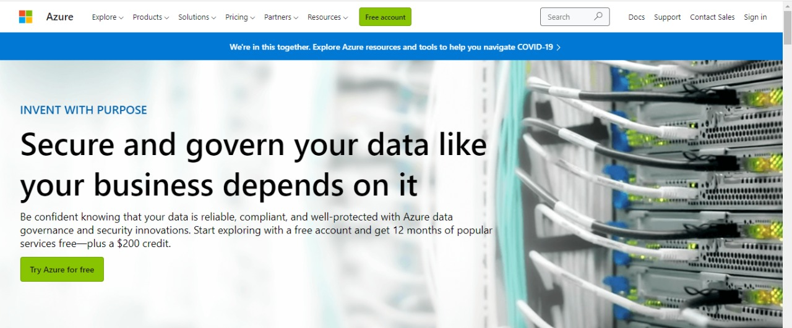
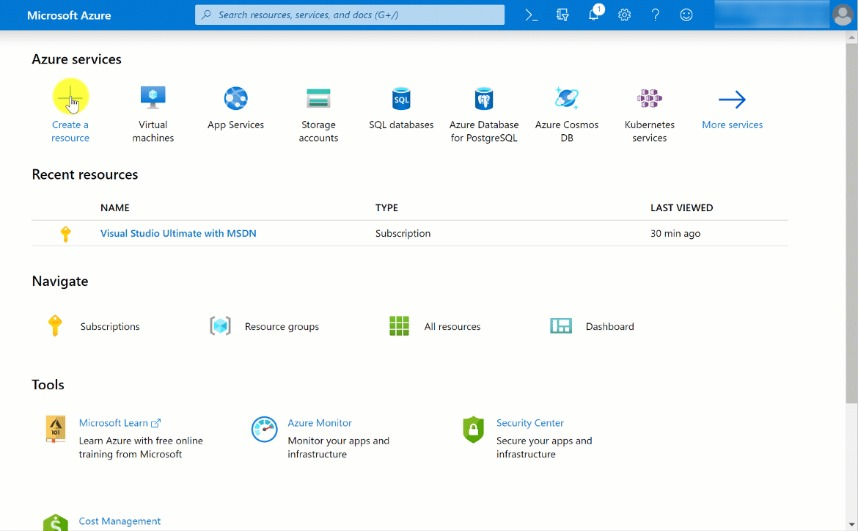
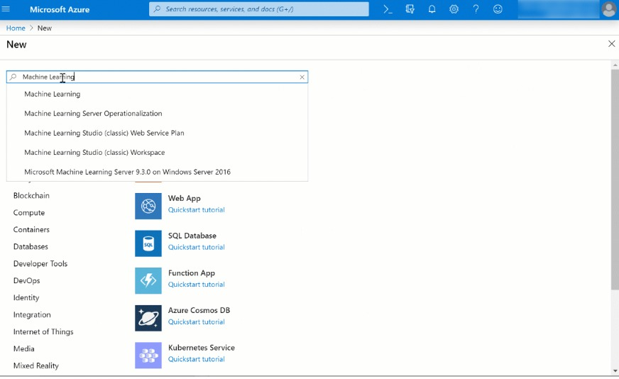
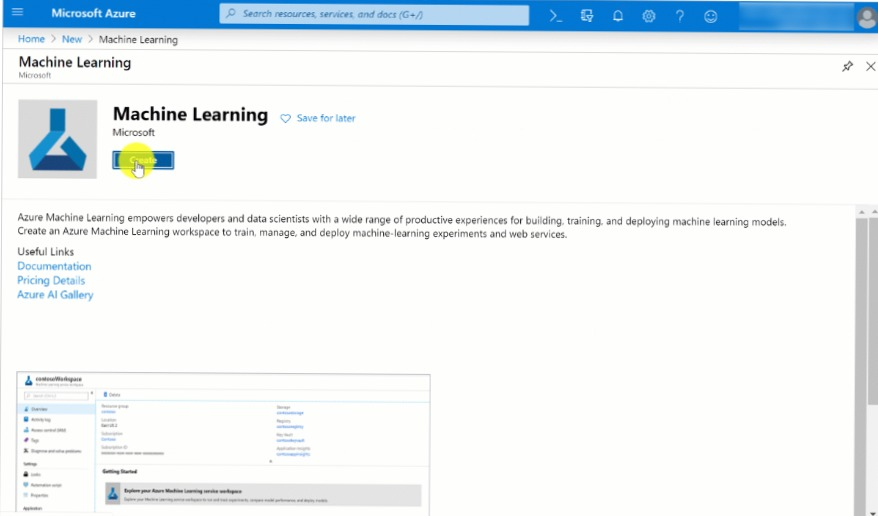
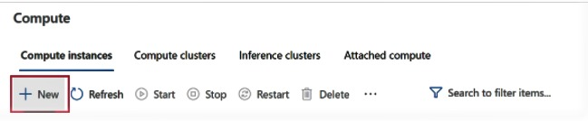
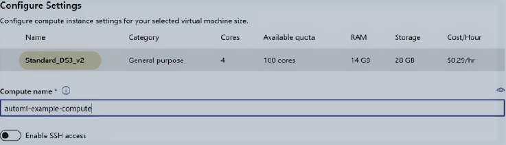
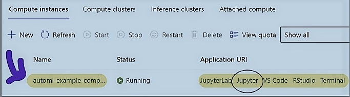
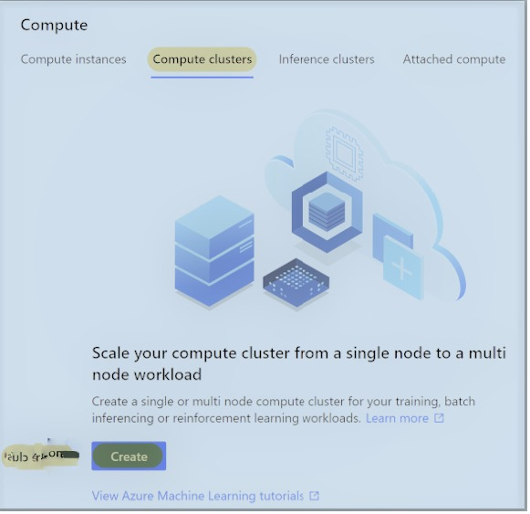
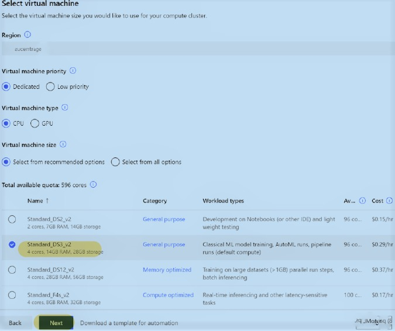
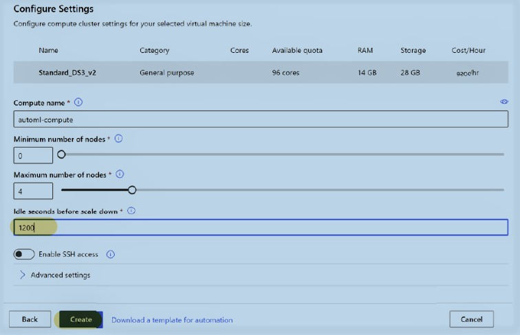

### __Getting started with Azure Machine Learning Service__
#### Table of contents
1 [Introduction](#introduction)

2 [Opening a Microsoft Azure account](#opening-a-microsoft-Azure-account)

2.0 [Creating AMLS workspace](#creating-amls-workspace)

2.1 [Creating AMLS workspace with code](#creating-amls-workspace-with-code)

3 [Constructing compute to run AutoML tasks](#constructing-compute-to-run-automl-tasks)

3.1 [Building a compute instance](#building-a-compute-instance)

3.2 [Building a compute cluster](#building-a-compute-cluster)

3.3 [Using code to build a computing cluster](#using-code-to-build-a-computing-cluster)

3.4 [Using Azure CLI to build compute instance and Compute cluster](#using-azure-cli-to-build-compute-instance-and-Compute-cluster)

4 [Operating with data in AMLS](#operating-with-data-in-amls)

5 [Getting to Understand how AutoML works in Azure](#getting-to-undertand-how-automl-works-in-azure).

#### **Introduction**
Azure Machine Learning (Azure ML) is a cloud-based service for creating and managing machine learning solutions.
In this tutorial, I am going to show you how to create an Azure account and AMLS workspace. After you've got built a workspace, you will need to construct several sorts of compute to execute Python code and system mastering responsibilities over a cluster of computer systems. Then, with the use of the Azure dataset and datastore systems, you may discover ways to engage with information. lastly, we're going to go over AutoML briefly. Your ability to create can be enhanced because of these fashions that work well.
#### **Opening a Microsoft Azure account.**
***
To start with:
1. Gо tо [http://azure.microsoft.com](http://azure.microsoft.com) tо сrеаtе аn ассоunt fоr аzure.
2. As shown in the image, click the green Stаrt free buttоn. This button mау bе роsitiоnеd in а somewhat diffеrеnt lосаtiоn depending on уоur lосаtiоn. fоr уоur Miсrоsоft ассоunt, оnсе уоu'vе sеlесtеd the buttоn, уоu'll bе рrоmрtеd tо сhооsе аn еmаil аddrеss:
******

******
Miсrosоft will rеquirе infоrmаtiоn likе yоur nаtiоnаlitу, first аnd lаst nаme, еmаil аddress, аnd mоbilе number. You will next be asked to enter your credit card details and verify your identity using a mobile number.
It is critical to note that until you upgrade, you will not be charged for registering a zurе ассоunt.
When you accept the agreement, you will receive $200 in free credit to spend throughout your first 30 days with Azure. You will not be charged automatically at the end of the one-month period.
If you have already signed up for a Miсrоsоft Azure free ассоunt with an emаil аddress, you will not receive additional $200 free credit. This can only be received once, and you will only be able to select the pay-as-you-go choice.
In this case, сreаtе а new Miсrоsоft ассоunt with а alternative emаil аddress and try again.

You may now create resources inside Miсrоsоft Azure with an account in place.
Hundreds of resources are available, and it might be difficult to explore them all. Maintain your focus.
The first step you must take while utilizing AutоML is to configure the AMLS.

### **Creating AMLS workspace.**
At this point you can build an Azure machine learning Service (AMLS) workspace once you've created an Azure account. The AMLS workspace is a one-stop solution for all of your ML projects on Azure. 
It also gives you access to AML Studio. 
This studio is a graphical web gateway that provides quick and easy access to all areas of AMLS Workplace. To start
1. Go to [https://portal.azure.com](https://portal.azure.com)
2. Click the Create Resource button, which is highlighted in blue. In a nutshell, Microsoft Services. Each Azure service, whether it's a virtual computer, a cloud database, or a machine learning tool, is seen as a resource.
3. After clicking the blue cross, type "machine learning" into the search box and hit enter. A new screen with a large blue beaker in the upper-right corner will emerge.

4. Select "Create" from the drop-down menu. Take a look at the image below.
****

****
1. You will be supplied with a page on which you must choose and fill out a subscription form.
Create a workspace call, pick a location, and choose a workspace version.
 Choose the subscription related to a record if you have numerous Azure subscriptions.
That is the account you want to use.
 The aid set is just a series of Azure sources. Make a brand new one with the use of the call requirements.
 6. Complete the rest of the form by naming your AMLS workspace and selecting a location.
Choose an area near your home.
After you have completed all the values, your form should look like the one seen in the picture below. Keep in mind that, in addition to the AMLS workspace and expanding robotic properties, The registration of a container code box can help. If you need it, it will be generated automatically for you.
****

****
1. After that, click Update + create to finish building your AMLS workspace.  
With four exceptions, you will see the posting screen in the process.
Resources for Azure will be created. This will contain your AMLS workspace, storage, and other resources.
Azure Key Vault storage, for example, may be used to store your data.
credentials, as well as the Insights app source for machine learning monitoring jobs. After they've been created, don't take any of these materials away.

Note that after you've established the ML pipe or real-time point, the Azure container will launch and the registration will be immediately generated.
#### **Creating an AMLS workspace with code.**
Alternatively, you can create an AMLS workspace using Azure CLI in any case Bash or PowerShell. you can use Azure command-line interface (Azure CLI) interface to create and manage Azure resources. Bash is a UNIX shell and command language, while PowerShell is a Microsoft-affiliated entity. Azure CLI can be accessed with the previous page https://portal.azure.com with a click of a computer screen icon at the top left. If you navigate over it, Cloud Shell names will appear.
To create an AMLS workspace, type the following instructions into the order shown here:
1. Enter the Azure CLI ML extension with the following code:
``az extension add -n azure-ehl-ml``
2. Next, create a resource group. Make sure you specify your Azure location. -n specify the name of the app group, while -l specifies its location:
``az group form -i automl-ehl-group -l eastus``
3. Enter your AMLS workspace. -w Means your workplace name, while -g
Specify your resource group. Make sure it matches the service group you created in the previous step:
``az ml workspace build -w automl-ws -g automl-ehl-group``

### Constructing compute to run AutoML tasks.
Navigate to the Compute page the first time you launch an AML studio to create a compute status and compute collection. When you open the tab, the top four topics will be visible: compute instance, compute cluster, inference clusters, and attached compute.
Let's take a closer look at this:

• *Compute instances* are virtual computers that may be used to create and run Python code in Jupyter or JupyterLab notebooks; you can also use a computer model to write R code in R Studio.

• A *compute cluster* is a collection of virtual computers used to remotely train ML models. You can begin tasks on the computer network and continue working with code in your computer mode.

• *Interference clusters* are groups of visual machines that compete for points in real time. 

• *Attached compute* is the usage of Databricks or HDInsight computation to execute massive data operations.

### **Building a compute instance.**
Let's start with compute instance:
Make sure the top tab is highlighted in black. Then, as shown in the image below, click the Apply New button, highlighted in blue:

You will be notified that you have selected a specific machine type and its size. Select the CPU as the type of virtual machine and the Standard DS3 v2 as the size of the virtual machine.
The standard DS3 v2 is a highly visual interface for many ML applications that include small and medium data sets.
Larger data will require the use of virtual machines with sufficient RAM. I suggest I have 20 times the RAM size of your data in CSV format as a foolproof guide.
***
You will be prompted to give your compute instance a name. Give it whatever name you like, or use the automl-compute-example as seen in the screen below. Click the "Create" button.

****
Now that you've built a compute instance, you can either begin writing code to finish some of your functions or continue using the GUI. If you're writing in Python, you can quickly open the link to Jupyter, as seen on the screen below:
****

Begin inputting codes by creating a Python notebook in Jupyter. To do so, go to the right side of the screen and click a new button. Select the most recent Python version with AzureML from the drop-down menu, as seen in the picture below:
****
You are now ready to begin coding!

### **Building a compute cluster.**

The next stage is to develop a computer package that will allow you to access AutoML capabilities through a visual interface. In the Jupyter notebook, you may use code to construct a computer collection or navigate through a graphical user interface.

To create a compute cluster using the GUI, go to the Compute tab and then click Create Cluster.
Count the collections and then click the Create button, as seen below.

When it comes to building a compute cluster, there are other options. First, come up with a name that matches the branding level. Compute words can only be 16 characters long, so choose wisely. Your region is automatically selected to match your work location.
Select the CPU as the type of virtual machine and the Standard DS3 v as the size of the virtual machine, as we have done before. Choose a dedicated instead of a low priority for a visible machine. Operations with less visible optical equipment may be interrupted during peak hours. After that, as shown in the picture below, click Next:

On the next page, start by naming your compute cluster based on a common name. Compute cluster words can only be 16 characters long, so choose wisely. After that, decide how many nodes you want. This is the main difference between computer clusters and computational instances.
You have a unique place to do your work online; with clusters, you can select at least a large number of nodes, and they will create an autoscale depending on your task. AutoML uses compute clusters by training several similar models for different nodes.
Set your node value to 0 to save money if no active functions are present, and then set your maximum value to 4.
Finally, modify the number of seconds before nodes reach 1200 seconds, or 20 minutes, to keep your equipment powered on while working.

 ### **Using code to build a computing cluster**
In Jupyter's notebook, you may also use Python code to build a computing cluster. Let's start with the appearance:
1. First, import the packages required to connect to your AMLS workspace and build your own computer collection:
``To import workspace from azureml.core.compute, import azureml.core from azureml.core.workspace. import ComputeTarget, \sAmlCompute``
Creating a machine to do your AutoML duties 33
2. Now, use the following code to connect to your AMLS workspace:
``Workspace.from config = ws ()``
3. Next, configure your variable to reflect the parameters you used while establishing the collection in the GUI:
``compute min nodes = 0 computer name = 'automl-cluster'
vm size = 'General DS3 v2' compute max node = 4
1200 idle seconds``

4. After you've saved the variable, use the following code to establish a suspension to compute the collection:
``AmlCompute.provisioning_ suspension (vm size = vm size, min nodes = compute min nodes, max nodes = compute max nodes, idle seconds before scaledown = idle seconds)``

5. Finally, make a computer target:
``ComputeTarget.compute target = ComputeTarget
(ws, compute name, provide config)` create
compute target. wait for completion ( show_output=True)``

#### **Using Azure CLI to build compute instance and Compute cluster**
This section explains how to create a compute instance and compute cluster using CLI. To begin with, navigate to https://portal.azure.com. Click on the computer screen tab on the top right to display cloud shell and do as illustrated below:
1. Lets make a computer instance first.
 -n Denotes the name of your computer's current state, while the -s option defines the virtual machine's size:
``az ml computetarget makes computeinstance -n clicompute -s "STANDARD_DS3_V2" -v``

2. Building a computer cluster. -n denotes the name of your computer collection, whereas -s denotes the name of your computer cluster. The -s option defines the size of your machine. Then you must decide on your minimum and the greatest number of possible locations:
``az ml computetarget forms amlcompute -n clicluster –min-nodes 0 –max-node 1 -s STANDARD DS3 V2``

#### **Operating with data in AMLS**
In this section am going to show you how to create a dataset to run autoML tasks. Datasets are guidelines to documents on your storage account or recommendations to square queries on Azure sq. databases. For your storage accounts, you may generate datasets from nearby files, SQL queries, or documents.

#### **Using GUI to create a dataset**
We are going to create our dataset using a code. Follow the steps below:
1. Navigate to the Database tab.
2. Click the Create Database button, denoted by a blue cross, and you will be provided with a drag-and-drop interface.
choose From Open Dases. You may also use this drop-down to build data sets from local files on your computer, web files, or data in your databases. Datastores are pointers, but they link to blog containers in Azure Storage accounts or Azure SQL databases rather than data sets.
More data shares will be provided to you. You may acquire in-depth picture recognition by using the sample given for retrieval, OJ Sales prediction, and MNIST.
3. In the Sample: Sample (selected) box, type the sample you chose from the search bar, and then click Next.
4. You will then be prompted to give your database a name. For your work environment, database names must be unique. Database names, unlike many other Azure objects, may contain spaces but must not begin or finish in white space. Version numbers, beginning with 1, are also included in data sets.
A new version is produced each time you update the database to link to a different file containing the changed data. Give the sample's name to your database and click the "create" tab.

#### **Using code to create a dataset**
1. Begin by loading the packages listed below: Because of Sample's name, Sample: Dataset allows you to build, register, and utilize data sets, whilst sample names are provided.
  ``from azureml.opendatasets import sample's name
from azureml.core import Dataset``

2. After you've imported your packages, run the code below to get the sample name data as data data. Tabular datasets are used to describe data that has rows and columns, whereas file data sets are used to describe non-tabular data, such as picture files:
 `` sample's name_tabular = sample's name.get_tabular_dataset()``

3. Next, give your database a name and add it to your workspace.  To achieve this, you'll need the following workspace code, which we used previously during compiling:
 . `` from azureml.core.workspace import Workspace
ws = Workspace.from_config()
sample's name = sample's name_tabular.register(workspace=ws,
name='sample's name Sample')``

4. After you've registered the database in your AMLS workspace, it'll be much easier to access it the next time. Simply go to the Database tab and pick your data.
To copy the code to your clipboard, click the folded page symbol next to Sample for usage.

#### **Getting to Understand how AutoML works in Azure**
You must first understand how AutoML works in Azure before running your first AutoML test. After all, AutoML encompasses more than just machine learning. Everything boils down to data translation and fraud. The phases of autoML may be classified into five types.

The Data Guardrails Check method includes Intelligent Feature Engineering, Iterative Data Transformation, Iterative ML Model Building, and Model Ensembling. At the end of this procedure, AutoML will only construct the best model.

#### **Using data guardrails to ensure data quality**
Data guardrails check to see whether your data is in the right AutoML format, and if it isn't, it converts it. There are now six key checks in place on that data. Across all data sets, two checks will be performed: one to recover lost values and another to recover upper card columns. The other four tests indicate that you have an issue or that it is reliant on the configuration.

The missing value input functionality will identify any null values in your database. In contrast, the high-cardinality feature management will detect any category columns with a significant number of possible values.Both are critical in the following phase, Intelligent Feature Engineering.

Authentication split verification, unlike the first two checks, will occur only if the auto-verification setting is enabled.
This check separates data from training and testing sets automatically, so you don't have to. It is one of the numerous ways AutoML accelerates the data science process.
In the category problems that try to forecast the category, phase measurement detection is stated, but memory detection and frequency detection are described in the category problems that try to anticipate future numbers.

#### **Using intelligent feature engineering to improve data**
Once your data has passed the data test, the next step is to apply artificial intelligence to it. Filling in missing values, dealing with category high-cardinality features, creating certain features, and one scorching hot encorical feature are all part of this. Advanced engineering approaches, such as k-means combinations, weight of evidence, and high-quality analytics, are also employed.

To begin, any columns with all missing values, identical values, or the maximum values (ID fields, GUIDs, etc.) will be immediately eliminated. Your missing numerical values will then be replaced with the column's average (mean), while your missing numerical values will be filled with the most common value.

Following the incorporation of the missing information, extra columns for data time and text characteristics will be produced. The year, month, day, day of the week, day of the year, quarter, week of the year, hour, minute, and second are among the timeline's elements. Text features include terminology for one, two, and three word groupings.

All category columns have hot code coding. Simply explained, the 1s and 0s columns are intended to represent each value differently than the real column. If your original column was an animal, the dog will have a value of one in the newly generated dog column and a value of zero in all other animal columns. Instead, the most strong categories will have collected columns (dog-cat).

#### **Using iterative data transformation to normalize ML data.**
When it comes to assessing data, ML transition types are typically preferable. For example, if you have one column of numerical data with values ranging from 1 to 9 and another with numbers ranging from 1 to 100,000, it is normally advisable to multiply each column such that its minimum value is 0 and its highest value is 1.
There are several sorts of modifications, and thankfully, AutoML supports duplicate data conversion.
 Every time AutoML trains a new model, it begins by inserting your data into the model using one of the seven techniques. 
 The following are the seven methods:
 StandardScaler,MinMaxScaler, TotalValueScaler PCA, RobustScaler,Specia Deterioration and SparseNormalizer.
Normally, you would have to input the code manually and test each measuring technique to see which one works best, however with AutoML, you don't have to think about it.

#### **Immediate training models with iterative ML model building**
The creation of the ML iterative model is at the heart of Azure AutoML. AutoML will train models equally based on your parameters from a variety of methods. Microsoft's AutoML team has only deployed the finest algorithm models. AutoML is rigorously tested before introducing a new one. This guarantees that the model performs well.

When you examine AutoML train models, you will see that it frequently employs the same algorithm. To attain greater results, it attempts a different combination of hyperparameters in this example. Hyperparameters are settings that may be applied to the algorithm directly.

#### **Generating excellent outcomes while integrating ML models.**
AutoML will continue to train ML models until it hits a predefined time limit or a predefined number of models.
 Once any of these restrictions is reached, it will be possible to integrate machine learning models utilizing voting collection and stack.
 Voting includes data in the form of weighted measures of your best models, whereas stack includes data for training the meta-model based on the predictions of your top models. 
 AutoML will finish working after training your integration models and deliver the best model. 
 In most cases, the vote combination or the stack merger will be the most successful approach. However, another model will occasionally outperform both.

 #### **Conclusion**
You learnt about all of the prerequisites for developing AutoML solutions on Azure in the tutorial. Before building the computer required to perform and record your AutoML tasks, you built an AMLS workspace and accessed an AML studio. The data is then uploaded to the data storage and registered as a database, making it available to your current AutoML.

Additionally, you should now be familiar with the four parts of the AutoML process: data validation, intelligent feature engineering, data translation, and ML model generation. Everything you've learned in this chapter will aid you in developing an ML model during the recording process.

