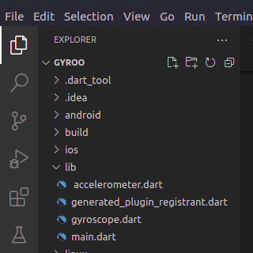

### Overview

Motion is a simple concept that has escaped most technological discussions. Have you ever wondered how your gadget determines whether or not it is in motion or what direction it is in? This is all done via sensors that are built into your device, and the objective of this tutorial is to show you how I retrieved data from these sensors using a flutter app.

### Table of Content

  - [Overview](#overview)
  - [Prerequisites](#prerequisites)
  - [Flutter sensor library introduction](#flutter-sensor-library-introduction)
  - [AccelerometerEvent](#accelerometerevent)
  - [UserAccelerometer Event sensor](#useraccelerometer-event-sensor)
    - [GyroscopeEvent.](#gyroscopeevent)
  - [Flutter app](#flutter-app)
  - [Hierarchy](#hierarchy)
  - [Create a new flutter project](#create-a-new-flutter-project)
  - [Add the sensor dependencies](#add-the-sensor-dependencies)
  - [import the package](#import-the-package)
  - [snippet code example](#snippet-code-example)
  - [app layout and navigation](#app-layout-and-navigation)
  - [Using the accerolemeter sensor](#using-the-accerolemeter-sensor)
  - [The full example of the accelerometerEvent sensor in an app](#the-full-example-of-the-accelerometerevent-sensor-in-an-app)
  - [Using the gyroscope](#using-the-gyroscope)
  - [the full example of the gyroscopeEvent sensor in an app](#the-full-example-of-the-gyroscopeevent-sensor-in-an-app)
  - [Conclusion](#conclusion)
  - [Further reading](#further-reading)


### Prerequisites 
To follow along with this tutorial, you’ll need the following:

* A basic understanding of the object oriented programming language.
* Have flutter installed in your system.
* If you do not have flutter installed in yours system click [here](https://docs.flutter.dev/get-started/install) to install 
* A foundation in flutter app development is required.

### Flutter sensor library introduction 
To detect the motion and orientation of your device, flutter has a sensor library that allows you to do so.
which include:

 * UserAccelerometerEvent sensor
 * AccelerometerEvent 
 * GyroscopeEvent 

 
 ### AccelerometerEvent 
 It is used to measure the velocity of an object at rest i.e proper  acceleration. Imaine your device in your hand it may seem motion less but there is gravity acting on it  hence it tends to move down wards to the surface at a constant downward force of g ≈ 9.81 m/s2.Flutter Accelerometer simply uses accelerometer reading and tell weather the device is currently moving and if moving then in which direction it’s moving .To get more on the accelerometer[click here](https://en.wikipedia.org/wiki/Accelerometer)

 ### UserAccelerometer Event sensor 
 This works in the same way as the accelerometerEvent but in this case gravity is ignored and uses the user motion instead.

 #### GyroscopeEvent.
 the gyroscope sensor is also known as angular rate sensors or angular velocity sensors, are devices that sense angular velocity. In simple terms, angular velocity is the change in rotational angle per unit of time. Angular velocity is generally expressed in deg/s (degrees per second).The data from the sensor is used to determine the orientation of the device.
for more information on gyroscope [click here](https://en.wikipedia.org/wiki/Gyroscope)


### Flutter app
 Now that we have understood what we are about to implement lets dive right into it.
### Hierarchy
for easy while coding kindly follow the file arrangement above 


 ### Create a new flutter project
 First you create a new flutter project by running the code below on your terminal
 ```flutter
  flutter create gyro
 ```
   or open an existing project where you what to implement this but for quick and easy understanding  we are going to a new project.

 ### Add the sensor dependencies
 After successfully creating a flutter project you need to add the dependencies that allow you to access the sensors_plus package.
  do this by adding the following lines in pubspec.yaml file.
   Get the latest version of Flutter Sensor package here from official site [here](https://pub.dev/packages/sensors_plus/changelog)

  ```flutter
  dependencies:
    flutter:
     sdk: flutter
     sensors_plus: ^1.2.2
  ```
 
  ### import the package
  In the main dart file you need to import the package by writting the following code.
  ```
 import 'package:sensors_plus/sensors_plus.dart';

  ```
  This line of code can also be added to any to any file you want to implement it like we are goin to do in our examples later on in ths tutorial.

  ### snippet code example

 The sensors are accessed through streams with the following snippet codes.
 ```dart
accelerometerEvents.listen((AccelerometerEvent event) {
  print(event);
});
// [AccelerometerEvent (x: 0.0, y: 9.8, z: 0.0)]

userAccelerometerEvents.listen((UserAccelerometerEvent event) {
  print(event);
});
// [UserAccelerometerEvent (x: 0.0, y: 0.0, z: 0.0)]

gyroscopeEvents.listen((GyroscopeEvent event) {
  print(event);
});
// [GyroscopeEvent (x: 0.0, y: 0.0, z: 0.0)]
 ```
### app layout and navigation
   In my case i am using visual code to write the code.
   To create a well designed app,a nice and simple layout is key,hence we are goin to start with creating the apps layout
   first  you need to clear all the contents in the main.dart file.After that you need to coppy the following code there.
   ```dart
import 'package:flutter/material.dart';
import './ accelerometer.dart';
import './gyroscope.dart';

Future<void> main() async {
  runApp(MyApp());
}


class MyApp extends StatelessWidget{
  @override
  Widget build(BuildContext context) {
    return MaterialApp(
      home: Nav(),
    );
  }
}


class Nav extends StatefulWidget {
  const Nav({ Key? key }) : super(key: key);

  @override
  State<Nav> createState() => _NavState();
}

class _NavState extends State<Nav> {
  int selectedIndex = 0;
  
  late Widget _body;
  late String _title;
  @override
  void initState() {
    // TODO: implement initState
    super.initState();
      changeview(0);
    
  }
    
  
  void _onItemTapped(int index) {
    changeview(index);
  }

  void changeview(index){
    selectedIndex=index;
    setState(() {
      
    
    switch(index) {
      
      
      case 0:{
        _title= 'groscope';
        _body= Home();
         break;
      }

      case 1:{
        _title= 'list';
        _body= MyHomePage();
        break;
      }
    }
    });
  }
  @override
  Widget build(BuildContext context) {
    return Scaffold(


      appBar: AppBar(title:  Text(_title),),
      body: _body,
         

      
      
    
     bottomNavigationBar: BottomNavigationBar(
        items: const <BottomNavigationBarItem>[
          BottomNavigationBarItem(
            icon: Icon(Icons.home),
            label: 'home',
          ),
          BottomNavigationBarItem(
            icon: Icon(Icons.list),
            label: 'list',
          ),
         
        ],
        currentIndex: selectedIndex,
        selectedItemColor: Colors.amber[800],
        onTap: _onItemTapped,
     )

     
    );
  }
}

   ```
   the  code above simply  has the main funtion that runs the whole app also it has the bottom navigation bar that is used to navigate between the  two widgets we are going to create for accelerometer and gyroscope.
 next you will need to create two new dart files in the lib file namely  accelerometer.dart and  gyroscope.dart where we are going to  write the code for the  accelerometer sensor and the gyroscope sensor respectively


   
 ### Using the accerolemeter sensor
 
First your we going to create an initState() method that will sending data as soon as the application starts 
 

 ```dart
@override
  void initState() {
    // TODO: implement initState
    super.initState();
    accelerometerEvents.listen((AccelerometerEvent event) {
      setState(() {
        x = event.x;
        y = event.y;
        z = event.z;
      });
    });
  }

 ```
 This stream sends events  x ,y, z axis that are accessed through doubles x ,y ,z datatypes that I have initialized.
  
 Now we are going to display this data using the text widget in form of a table with the following lines
 ```
 Text(x.toStringAsFixed(2), style: TextStyle(fontSize: 20.0)),
 ```

 ### The full example of the accelerometerEvent sensor in an app
 As shown in this example the sensors_plus package has been imported in the accelerometer file where it is needed rather than the main,dart file which we have used to create the app layout and anvigation

 ```dart
 import 'package:flutter/material.dart';
import 'package:sensors_plus/sensors_plus.dart';


class MyApp extends StatelessWidget {
  // This widget is the root of your application.
  @override
  Widget build(BuildContext context) {
    return MaterialApp(
      title: 'Flutter Demo',
      theme: ThemeData(
       
        primarySwatch: Colors.blue,
      ),
      home: MyHomePage(),
    );
  }
}

class MyHomePage extends StatefulWidget {
  @override
  _MyHomePageState createState() => _MyHomePageState();
}

class _MyHomePageState extends State<MyHomePage> {
  late double x, y, z;

  @override
  void initState() {
    // TODO: implement initState
    super.initState();
    accelerometerEvents.listen((AccelerometerEvent event) {
      setState(() {
        x = event.x;
        y = event.y;
        z = event.z;
      });
    }); //get the sensor data and set then to the data types
  }

  @override
  Widget build(BuildContext context) {
    return Scaffold(
        appBar: AppBar(
          title: const Text("Flutter Sensor Library"),
        ),
        body: Center(
          child: Column(
            mainAxisAlignment: MainAxisAlignment.center,
            children: <Widget>[
              const Padding(
                padding: EdgeInsets.all(10.0),
                child: Text(
                  "An Example How on Flutter Sensor library is used",
                  style: TextStyle(fontSize: 18.0, fontWeight: FontWeight.w900),
                ),
              ),
              Table(
                border: TableBorder.all(
                    width: 2.0,
                    color: Colors.blueAccent,
                    style: BorderStyle.solid),
                children: [
                  TableRow(
                    children: [
                      const Padding(
                        padding: EdgeInsets.all(8.0),
                        child: Text(
                          "X Asis : ",
                          style: TextStyle(fontSize: 20.0),
                        ),
                      ),
                      Padding(
                        padding: const EdgeInsets.all(8.0),
                        child: Text(x.toStringAsFixed(2), //trim the asis value to 2 digit after decimal point
                            style: const TextStyle(fontSize: 20.0)),
                      )
                    ],
                  ),
                  TableRow(
                    children: [
                      const Padding(
                        padding: EdgeInsets.all(8.0),
                        child: Text(
                          "Y Asis : ",
                          style: TextStyle(fontSize: 20.0),
                        ),
                      ),
                      Padding(
                        padding: const EdgeInsets.all(8.0),
                        child: Text(y.toStringAsFixed(2),  //trim the asis value to 2 digit after decimal point
                            style: const TextStyle(fontSize: 20.0)),
                      )
                    ],
                  ),
                  TableRow(
                    children: [
                      const Padding(
                        padding: EdgeInsets.all(8.0),
                        child: Text(
                          "Z Asis : ",
                          style: TextStyle(fontSize: 20.0),
                        ),
                      ),
                      Padding(
                        padding: const EdgeInsets.all(8.0), 
                        child: Text(z.toStringAsFixed(2),   //trim the asis value to 2 digit after decimal point
                            style: const TextStyle(fontSize: 20.0)),  
                      )
                    ],
                  ),
                ],
              ),
            ],
          ),
        ));
  }
}
 ```

 ### Using the gyroscope
  as we did in the  accelerometer section we a going to create a initstate() method and invoke the stream for gyroscopeEvent

  ```dart
   @override
  void initState() {
    gyroscopeEvents.listen((GyroscopeEvent event) {
       print(event);

       x = event.x;
       y = event.y;
       z = event.z;
      x > 0){ 
           direction = "back";
       }else if(x < 0){
           direction = "forward";
       }else if(y > 0){
           direction = "left";
       }else if(y < 0){
           direction = "right";
       }

       setState(() {
         
       });
    });
    super.initState();
  }


  ```

  Similarly the gyro scope has three events that are accessed  through double datatypes x ,y ,z that we will have to initialize

  the data retrieved is then taken through  if loop  to calculate the orientation of the device 
after the calculation has been done we display the results using a container widget  on the screen

```dart
 Container( 
            alignment: Alignment.center,
            padding: const EdgeInsets.all(30),
            child: Column(
               children:[
                   Text(direction, style: const TextStyle(fontSize: 30),)
               ]
            )
          ),
```

### the full example of the gyroscopeEvent sensor in an app

```dart
import 'package:flutter/material.dart';
import 'package:sensors_plus/sensors_plus.dart';


class Home extends StatefulWidget{
  @override
  _HomeState createState() => _HomeState();
}

class _HomeState extends State<Home> {

  double x = 0, y = 0, z = 0;
  String direction = "none";
  
  

  @override
  void initState() {
    gyroscopeEvents.listen((GyroscopeEvent event) {
       print(event);

       x = event.x;
       y = event.y;
       z = event.z;

       //rough calculation, you can use 
       //advance formula to calculate the orentation
       if(x > 0){ 
           direction = "back";
       }else if(x < 0){
           direction = "forward";
       }else if(y > 0){
           direction = "left";
       }else if(y < 0){
           direction = "right";
       }

       setState(() {
         
       });
    });
    super.initState();
  }

  @override
  Widget build(BuildContext context) { 
    return  Scaffold(
          appBar: AppBar( 
              title: const Text("Gyroscope Sensor in Flutter"),
              backgroundColor: Colors.redAccent,
          ),
          body: Container( 
            alignment: Alignment.center,
            padding: const EdgeInsets.all(30),
            child: Column(
               children:[
                   Text(direction, style: const TextStyle(fontSize: 30),)
               ]
            )
          ),
           
       );
  }
}``

```

### Conclusion
In this tutorial, we learned about all the functionalities of the sensor_plus package.Don’t forget to try out the examples yourself to fully understand how they work.

 ### Further reading
 [flutter sensors](https://pub.dev/packages/sensors_plus)