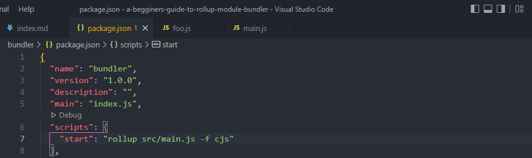
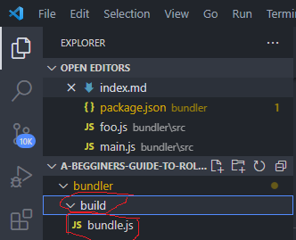
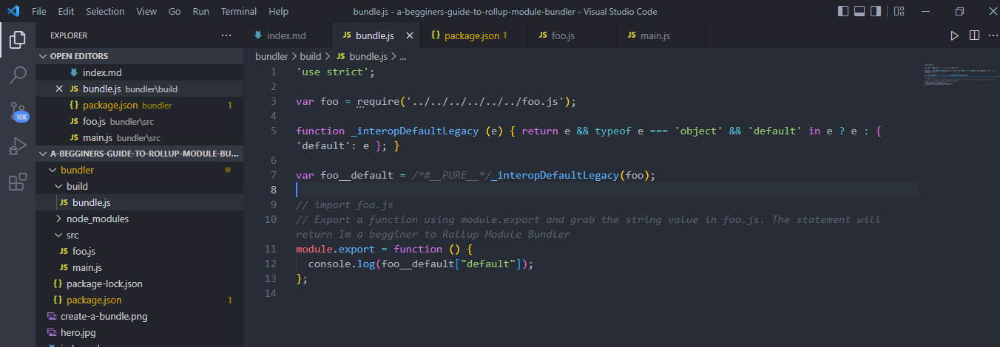
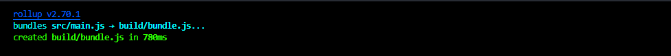

### Introduction

Being quick and lightweight Rollup is credited with compressing multiple JavaScript files to a single file. In this post, you will learn how to use the rollup module bundler in JavaScript.

### Table of content

- [Introduction](#introduction)
- [Table of content](#table-of-content)
- [Prerequisites](#prerequisites)
- [Why should you use Rollup](#why-should-you-use-rollup)
- [Step 1: Rollup Installation and Configuration](#step-1-rollup-installation-and-configuration)
- [Step 2: Create your First Rollup Bundle](#step-2-create-your-first-rollup-bundle)
- [Step 3: Plugins](#step-3-plugins)
- [Conclusion](#conclusion)
- [Further reading](#further-reading)

### Prerequisites

- Fundamentals of JavaScript programming language.
- Text editor(vs code will be used in this article).
- You need to have [NodeJs](https://nodejs.org/en/) installed on your machine.

### Why should you use Rollup

1. It offers tree-shaking which removes unused codes to ease project development.
2. Eases application development since it is easier to work with small manageable files.
3. Rollup is pretty fast and lightweight.
4. It is compatible with EcmaScript 5.

### Step 1: Rollup Installation and Configuration

Open `vscode`, create a new folder, and name it `bundler`. We will initialize the folder as an `npm` package and to do that open your vscode terminal and change the current directory to the one you have just created through `cd bundler`. In my case, I will have the following.


Run the below code to initialize the folder as an `npm` package

```bash
npm init -y
```


Next up is to install rollup in our folder by running the following command.

```bash
npm i -D rollup
```

> Note that by including `-D` in the installation command, rollup will be installed as a development dependency.

If your installation was successful you should have the following with you in your folder.


### Step 2: Create your First Rollup Bundle

Start by creating a folder for example, in my case I have named the folder `src`. This folder will house several JavaScript files and in that case, create two files in this folder and name them `main.js` and `foo.js`. In the `foo.js` file we are going to export a default string and if you want you can export functions, variables, or any valid data type.

```javascript
export default "I'm a beginner to Rollup Module Bundler";
```

We will import `foo.js` in the `main.js` file and export a function using `module.export` which will then grab and display the string value from `foo.js`.

```javascript
// import foo.js
import foo from "/foo.js";
// Export a function using module.export and grab the string value in foo.js. The statement will return Im a begginer to Rollup Module Bundler
module.export = function () {
  console.log(foo);
};
```

To create a bundle we will have to create a `script command` in the pakage.json file and specify the format as `cjs` (common JavaScipt) as shown below.



open the terminal and run the script command to create the bundle

```bash
npm start
```

You should have a bundle created in your terminal as shown below.


If you would prefer to have the bundle code in a file rather than the terminal you have to carry out the following.

In the start command located in `package.json`, specify the output file such that when you execute it, you are going to get your code in a file. Let's see how you go about it.

```json
"scripts": {
    "start": "rollup src/main.js -o build/bundle.js -f cjs"
  }
```

`-o` is a flag that specifies the output file which in this case is `bundle.js`. The format will remain as common javascript. Now executing the `start` command a folder(build) will be created with a file(bundle.js) that has combined all our code as shown below.





One more way in which you could create a bundle is by creating a javaScript file and naming it `rollup.config.js`.

> Note that the file should only be named as stated so that rollup can find it with ease

In our case here, our config file will entail the following:

```javascript
export default {
  input: "src/main.js", // Here is the entry point of our application
  output: {
    file: "build/bundle.js", // Bundled code will be contained here
    format: "cjs", // species the format of our file
  },
};
```

Now that you have a config file, instead of having all that path address in the `script` command of the package.json. We will simply have.

```json
"scripts": {
    "start": "rollup --config"
  }
```

### Step 3: Plugins

Plugins allow you to customize Rollup behavior. For example, transpiling code before bundling, and finding third-party modules in your node module folder. Let's see an example of how we can use CSS plugins in the rollup. By default, rollup will only transpile files with the `.js` extension. Importing other files for example let's suppose we have a stylesheet it will result in an error as demonstrated below.

- Here is our stylesheet that we wish to include in the `main.js` file.

```css
body {
  background-color: green;
}
```

- main.js

```js
// import style.css
import "./style.css";

module.export = function () {
  console.log(foo);
};
```

When you run this file in the terminal, the following error will show up. This is because we have installed any plugin to handle stylesheet(CSS) files since rollup will only work with JavaScript files.


To solve this error let's first install the CSS plugin from the terminal as shown below:

```bash
npm i rollup-plugin-css-only
```

In your `rollup.config.js` file, import the module and create an object, plugins, and set its value as an array since it may contain more than one value as shown below.

```javascript
import css from "rollup-plugin-css-only";

export default {
  input: "src/main.js",
  output: {
    file: "build/bundle.js",
    format: "cjs",
  },
  plugins: [
    css({
      output: "bundle.css",
    }),
  ],
};
```

Head to the terminal run your file and the in your build folder you should have two files as shown below.




### Conclusion

From this post, you learned how you can use a rollup module bundler at a beginner's level. If you want to learn more about rollup see the official documentation [here](https://rollupjs.org/guide/en/).

### Further reading

[An Beginners Introduction to Browsify](https://medium.com/@christopherphillips_88739/a-beginners-guide-to-browserify-1170a724ceb2)
