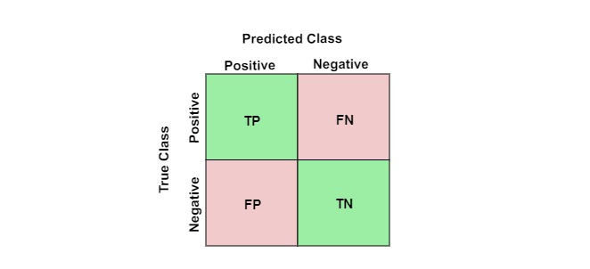
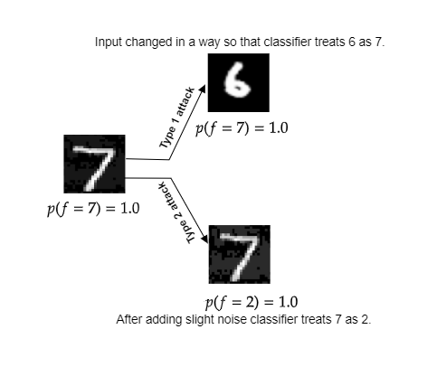
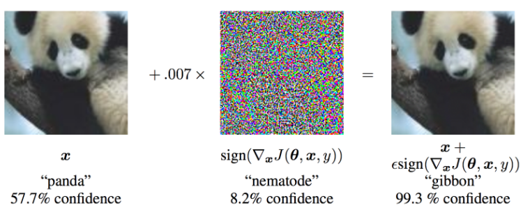
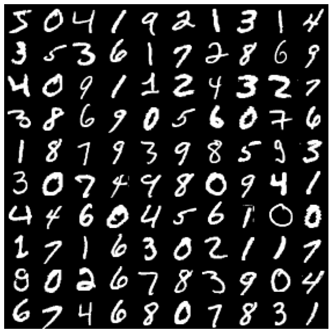
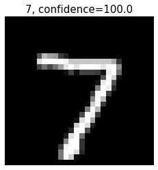
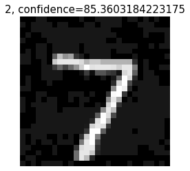
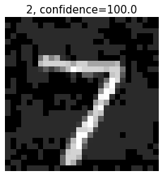
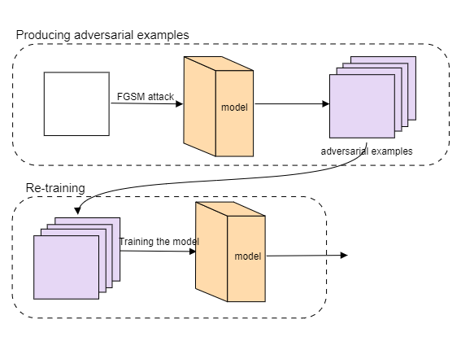

With the current research advancements in deep learning since the past decade, we can say that we live in the era of neural networks and expect them to play more significant roles in the coming years. From suspicious activity monitoring to self-driving cars, we harness its abilities in countless dimensions. Now, imagine a scenario where you are riding a self-driving car, and someone manipulates the speed limit signboard so that instead of slowing down, the car picks up the very speedy pace. Unfortunately, this act may lead to a dangerous accident. Such types of attacks which can fool an AI model to produce unexpected results are called adversarial attacks. In this blog, readers will learn what adversarial attacks are and implement one of its famous techniques, FGSM(Fast Gradient Sign Method).

**Table of contents**
- [Prerequisites](#prerequisites)
- [Key takeaways](#key-takeaways)
- [Introduction](#introduction)
- [What is an adversarial attack?](#what-is-an-adversarial-attack)
- [FGSM(Fast sign gradient method)](#fgsmfast-sign-gradient-method)
- [Implementation of FGSM attack](#implementation-of-fgsm-attack)
- [How to prevent FGSM attack](#how-to-prevent-fgsm-attack)
- [Conclusion](#conclusion)
- [References](#references)
  
### Prerequisites

This blog requires the basic knowledge of artificial neural networks and its implementation to solve classification problems in computer vision. Also, the implementation of FGSM requires knowledge of the gradient descent rule in machine learning. [Here]('https://blog.paperspace.com/intro-to-optimization-in-deep-learning-gradient-descent/') is an excellent blog that readers may refer to before reading this blog.

### Key takeaways

After finishing this blog, the reader will understand how an adversarial attack fools an ML model, implement one of its techniques known as FGSM and learn the defence against it. 

### Introduction

Though adversarial attacks can also be carried out for text data for this blog, we will limit our discussion of adversarial attacks to the field of computer vision only. Therefore, before we begin our discussion on adversarial attacks, let us talk about image classification.

The classification task is a supervised learning mechanism that uses input features to predict the corresponding class label.



For example, there are four possible outcomes in a binary classification task: true positive, true negative, false positive, and false negative. Let us take an example to understand it better. 

Assume given a patient's medical record. Our classification task is to identify whether the person has cancer or not. If the patient is a cancer patient and the model predicts the same, this case is true positive. Similarly, if a patient is not a cancer patient and the model predicts it correctly, this would be a true negative. So both of these situations are classified correctly. 
On the other hand, if a patient has cancer and the model cannot predict it right, this is a false negative. Similarly, if a patient does not have cancer and the model predicts vice versa, this is a false positive.

Out of the four outcomes, false negative and false positive are errors. These errors are also known as type 1 and type 2 errors. Therefore, we can fool a neural network to commit either of these two errors using adversarial examples. 

### What is an adversarial attack? 



In a type 1 adversarial attack, the attacker must give such input to the classifier that the classifier classifies the input to the same class despite belonging to different classes. For example, in the above figure, we can see that the image of digit six is manipulated so that the model classifies it as seven. In contrast, our eyes can easily spot the difference. Type 1 adversarial attacks are also called targeted attacks. For example, the attacker targets the image containing digit six and manipulates it so that the model classifies it as an image of digit seven. The targeted adversarial attacks are carried out with the help of autoencoders and GANs. 
As in this blog, we will implement an FGSM attack, an untargeted attack. We will limit our discussion of targeted attack up to its definition. For further reading, you can refer to [this](https://www.pyimagesearch.com/2020/10/26/targeted-adversarial-attacks-with-keras-and-tensorflow/) informative article.

In a type 2 adversarial attack, the attacker must give such input to the classifier that the classifier classifies the input belonging to the different class despite belonging to the same class. For example, in the above figure, we can see that by manipulating a few pixel values of an image of digit seven, the model classifies it as an image of two. Type 2 attacks are also known as untargeted attacks because our only aim here is to misclassify the input image with anything except the true label. The following section will discuss one such attack known as the fast sign gradient method.


### FGSM(Fast sign gradient method)



[Image source](https://pytorch.org/tutorials/beginner/fgsm_tutorial.html)

In any deep learning problem statement, we formulate a loss function. The loss function defines an objective to evaluate the model's performance during training. By minimizing the loss function, the parameters of the model are learned. After calculating the loss function, we compute its gradient with respect to the model parameters. A gradient is a derivative of a function with more than one input variable, and it records the change in all parameters with regard to change in error. To minimize the loss function, we tune the parameters with a factor called as learning rate in the direction opposite of the gradient. This rule is known as gradient descent rule and given as:

$GD: w_{t+1} = w_t - \alpha \cdot \nabla_wJ(X,Y)$

The FSGM technique uses the gradient to change the input to maximize the loss function, and hence the model misclassifies the input. 

The FSGM attack is an untargeted white-box attack. It is untargeted because we only ensure that the model's response is anything except the true label and the white box attack means we have access to the trained model beforehand.

$FSGM: x_{Adversarial} = x + \epsilon \cdot {sign}( \nabla_xJ(X,Y))$

We perform an FSGM attack when we have the trained model. In place of updating the parameters, we will be updating the input. Updation of input maximizes the loss function, and hence the classification model misclassifies the slightly modified input. In this technique, we intend to add noise in the direction of the gradient of the loss function with respect to the data. This noise is tuned using epsilon(\epsilon). An important point to note is that we need only the direction of the gradient, not the magnitude.

### Implementation of FGSM attack

Now it's time to implement the FGSM technique. The implementation requires a tensorflow library of 2.6.0 version along with numpy and matplotlib with no version dependency. First, we will start with standard imports.

```python
#Standard imports
import tensorflow as tf
import numpy as np
import matplotlib.pyplot as plt
```
We aim to train a model using the standard MNIST dataset and then perform an adversarial attack on that trained model. First, we will load the MNIST dataset using tf.keras.datasets API. Further, after loading the train data, we will scale it in the range of 0 to 1.

```python
#loading the MNIST dataset
(trainX, trainy), (testX, testy) = tf.keras.datasets.mnist.load_data()
#scaling pixel values between 0 and 1
trainX = trainX/255
testX = testX/255
```
The cell below plots the MNIST data.

```python
n=10
figure = np.zeros((28*10, 28*10))
temp=0
for i in range(n):
  for j in range(n):
    data = trainX[temp].reshape(28,28)
    figure[i*28 : (i + 1)*28,
           j*28 : (j + 1)*28] = data
    temp+=1

plt.figure(figsize=(10, 10))
plt.imshow(figure, cmap='Greys_r')
plt.axis('off')
plt.show()
```



To define the model, we will use the Sequential API. As the MNIST dataset is straightforward, the model with one hidden layer will be sufficient to capture the features. Note that the final layer has a softmax activation function with ten labels. Each label will have a probability value associated with it. The label with maximum probability will be the label predicted by the model. 

```python
model = tf.keras.models.Sequential([
  tf.keras.layers.Flatten(input_shape=(28, 28)),
  tf.keras.layers.Dense(128, activation='relu'),
  tf.keras.layers.Dense(10, activation='softmax')
])
```
After defining the model, now we need to compile it. As an optimizer, we can use the standard Adam optimizer. This problem is a multi-class classification task. We will be using sparse categorical cross-entropy as a loss function and categorical accuracy as a metric to evaluate the training process.

```python
Adam = tf.keras.optimizers.Adam(learning_rate=0.001)
model.compile( optimizer=Adam, loss='sparse_categorical_crossentropy', metrics='sparse_categorical_accuracy')
```
Once model is compiled it is ready for the training. We will call fit method to start the training process. We can choose the batch size and the number of epochs heuristically.

```python
model.fit(x=trainX,y=trainy,batch_size=8,epochs=10)
```
The method defined in the cell below is for ploting the model prediction.

```python
def plot_model_output(image):
  input_image = np.expand_dims(image, axis=0)
  output = model(input_image)
  predicted_label = np.argmax(output)
  prediction_probability = np.max(output)*100
  label = str(predicted_label)+', confidence='+str(prediction_probability)

  plt.imshow(image, cmap='gray')
  plt.title(label=label, fontsize=15)
  plt.axis('off')
```
Let's test the model by giving it an image from the test dataset as an input. We can see that the model correctly predicts the given image as seven.

```python
plot_model_output(testX[0])
```



Finally, we are ready to perform an adversarial attack using the method defined in the cell below. We will pass the image, label, epsilon and the trained model as parameters. Remember that the epsilon acts as a tuner for the image transformation. Now, we will calculate the loss function by passing the image to the trained model and then calculate the gradient of the loss function with respect to the image. Gradient computation is done using the gradient tape API of tensorflow. [Here]('https://www.tensorflow.org/guide/autodiff') is an excellent blog about gradient computation from tensorflow for further reading. After calculating the gradient, we will add epsilon in the direction of the gradient to the original image. The model will return the perturbed image at last.

```python
def attack(image,label,epsilon,model):
  with tf.GradientTape() as g:
    g.watch(image)
    pred = model(image)
    #loss function calculation
    y = tf.keras.losses.sparse_categorical_crossentropy(y_true=label,y_pred=pred)
  grad = g.gradient(y,image) #gradient
  sign = tf.sign(grad) #calculates the sign of gradient
  p_image = image + epsilon*sign #perturbation
  return p_image
```
In the next cell, we can see that the model predicts it as two with 85% confidence after the perturbation. But visually, we can see it is still an image of seven. This is the effect of the FGSM technique. So we can fool a well-trained model by a small amount of perturbation.

```python
#converting test image from numpy array to tensor
image = tf.convert_to_tensor(np.expand_dims(testX[0], axis=0),dtype=tf.float32)
label = testy[0] #true label
p_image = attack(image=image, label=label, epsilon=0.05, model=model)
p_image = p_image.numpy().reshape(28,28)

#Ploting the prediction of the trained model on the perturbated image
plot_model_output(p_image)
```


We can manipulate the value of epsilon to see its effect. For example, in the cell below, epsilon increases from 0.05 to 0.1. Now, it predicts an image of seven as an image of 2 with 100% confidence.

```python
p_image = attack(image=image, label=label, epsilon=0.1, model=model)#modifying the epsilon value
p_image = p_image.numpy().reshape(28,28)
plot_model_output(p_image)
```



### How to prevent FGSM attack



We can prevent the FGSM attack using **Adversarial Training**. We have already seen how we can leverage the FGSM technique to produce large batches of adversarial examples from an image. What if we use these examples to train the model and assign these examples with the same label as the original image. Doing this not only helps the model defend against the attack but also increases the training dataset. But it is to be noted that adversarial training is a heuristic defence where the defender generates a lot of adversarial examples to train the targeted model. Therefore, there is no guarantee of defence against all attacks, which may fail in some cases.

An important thing to remember is that adversarial training is valid only when the adversarial examples are crafted on the original model.

### Conclusion

As we have seen in this blog how an ml model can be exposed and broken to produce surprising results. These failures show us how an ml model acts very differently from its expectation. Therefore, with the advancements in machine learning, it is also essential to tackle its possible exposure from the attackers. 

### References

- https://pytorch.org/tutorials/beginner/fgsm_tutorial.html
- https://towardsdatascience.com/how-to-fool-a-neural-network-958ba5d82d8a
