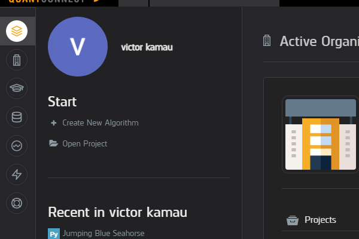
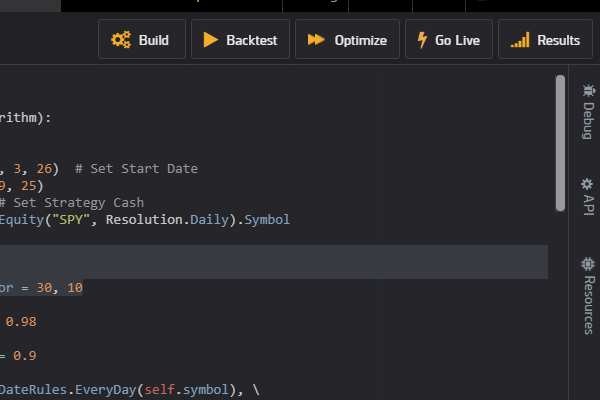
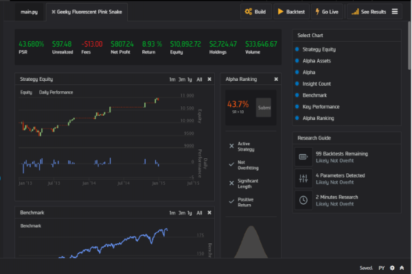

### Algorithmic-Trading-Bot-Using-Python

### Table of Contents

- [Introduction](#introduction)

- [What is a Trading Bot](#what-is-a-trading-bot)

- [Prerequisites/Requirements](#prerequisites-requirements)

- [Coding and Development](#coding-and-development)

- [Steps to be followed](#steps-to-be-followed)

- [Why Algorithmic Trading Bot](#why-algorithmic-trading-bot)

- [Why are people still against Algorithmic Trading?](#why-are-people-still-against-algorithmic-trading)

- [Conclusion](#conclusion)


### Introduction
Trading online has become one of the most popular investment in the current world. 
The likes of cryptocurrency and forex being the leading areas.
Due to this popularity, programmers have emerged trying to come up with a way in which the trading process can be 
automated for more profits.

In this tutorial, we are to look at how one can start off his/her journey in programming a trading bot.

### What is a Trading Bot?

As stated in the introduction, a trading bot is simply a robot in form of software that automates the trading process.
It uses past data to give out expected outcomes that look down to the past data patterns.From these past patterns, 
it generates predictions to immitate past data.

### Prerequisites/ Requirements

The main prerequisite for this tutorial is the basic knowledge of python and its algorithms. 
For the matter of testing, we will use **QUANTCONNECT** which uses the lean engine to integrate your code with the trading site.

That means that you don't actually require an offline editor since the site provides
its own coding environment.


### Coding and Development


With your prerequisites and requirements ready, you can now code along for a practical understanding.
Go to www.quantconnect.com and sign up to set up your coding environment. 
You can also use an offline editor and upload the code later for testing.

Let's get started...

### Steps to be followed

We are going the develop it stepwise. Follow the steps below;

1. **Create a new Algorithm**

From the options on the left side of the page, click *Create new Algorithm* as shown in the photo below. You will be taken to the editor with with a class generated automatically.
 

For my case, here is the class generated
```python
class GeekyBlueSeahorse(QCAlgorithm):

    def Initialize(self):


    def OnData(self, data):


```

2.  **Import required Libraries**

In this case, we will only require one library i.e. *NumPy*.

Import at the top as follows;

```python

import NumPy as np


```

3.  **Initialize required variables**

Under the initialize method, we will initialize several parameters;
- Initialize cash for the purpose of the backtest(we call it the strategy cash) which would be  used on a real account.
- Set the start and end date for the backtest.

The code is as follows;

```python
        self.SetStartDate(2015, 3, 26)  # Set Start Date

        self.SetEndDate(2021, 9, 25) # Set End Date

        self.SetCash(100000)  # Set Strategy Cash

```

- Still under the initialize method, we will;
    - Use AddEquity function to monitor the resolution of the intended data.

    - Initialize the amount of days we will look back to determine our break point.
        - Set limits for the lookback i.e a lower and an upper limit

    In this case, we will use a daily resolution.

```python

    self.symbol = self.AddEquity("SPY", Resolution.Daily).Symbol

    self.lookback = 20

    self.ceiling, self.floor = 30, 10


```

- The last thing to initialize is the stop loss extent.

```python
    self.initialStopRisk = 0.98

    self.trailingStopRisk = 0.9

```
The first variable determines *how close our stop loss will be to the security price* meaning that it will allow a 2% loss before it gets hit.
The second variable indicates how close our trading stop will follow the assets' price.
This means that it will trail the price for 10% which is quite big but it gives more room for price flexibility.

4. #### **Define a Method to Plot the Data**

We will define the onData method to create a plot of the price of the securities.
This gives a benchmark to compare our algorithm performance.

```python
def OnData(self, data):

        self.Plot("Data Chart", self.symbol, self.Securities[self.symbol].Close)


```

This will also determine the closing price.

5. #### **Create the Trading method**

The next step will be to create the method that will do all the trading for us which will be called after every market open.
We will call it "**EveryMarketOpen**" for simplicity.

```python
def EveryMarketOpen(self):

```

After this, we will have to initialize one more function in the *initialize* method.
This the **Schedule.On** function which takes three parameters;

- The first specifies on which day the method is called.

- The second specifies at which time the method is called

- The last specifies which method is called, in this case it's EveryMarketOpen method.

Add this to the initialize method;

```python
self.Schedule.On(self.DateRules.EveryDay(self.symbol), \

                self.TimeRules.AfterMarketOpen(self.symbol, 20), \

                Action(self.EveryMarketOpen))

```

6. #### **Implement the EveryMarketOpen method**

First, we will determine the lookback length for our breakout.Within a utility of 60 days, 
we will compare the current value today with the same value yesterday.
This will help determine the length of the lookback window.

- Call the History function to get data for the last 61 days or your preferred number of days.

- This is where we use the NumPy library to calculate the standard deviation for the two days.

- We will list all the highest and lowest prices within a specified range, for this case, 60days

The following code falls under this *EveryMarketOpen* method to perform all the comparisons required to give a result;

```python


    def EveryMarketOpen(self):
        close = self.History(self.Symbol, 61, Resolution.Monthly)["close"]
        todayvol = np.std(close[1:61])
        yesterdayvol = np.std(close[0:60]) // standard deviation
        initialvol = (currentvol - yestervol) / (currentvol)

        self.lookback = round(self.lookback * (1 + initialvol))

        if self.lookback > self.highest:
            self.lookback = self.highest
        elif 
          self.lookback < self.lowest:
            self.lookback = self.lowest

        self.high = self.History(self.Symbol, self.lookback, Resolution.Minute)["high"]

        if not self.Securities(self.Symbol).Invested and \
                self.Securities(self.Symbol).Close >= max(self.high[:-1]):

                self.SetHoldings(self.Symbol, 1)
                self.breakoutlevel = max(selt.high[:-1])
                self.highestPrice = self.breakoutlevel

        if self.Securities(self.Symbol).Invested:

            if not self.Transactions.GetOpenOrders(self.symbol):
                self.endMarketTicket = self.endMarketOrder(self.symbol, \
                                        -self.Portfolio[self.symbol].Quantity, \
                                        self.initialStopRisk * self.breakoutlevel)


            if not self.Securities(self.Symbol).Close > self.highestPrice and \
                    self.initialStopRisk * self.breakoutlevel < self.Securities[self.symbol].Close * self.trailingStopRisk:

                    self.highestPrice = self.Securities[self.symbol].Close
                    updateFields = UpdateOrderFields()
                    updateFields.stopPrice = self.Securities[self.Symbol] * self.trailingStopRisk
                    self.endMarketTicket.Update(updateFields)

```

7. #### **Plot the stop price**

Lastly, print the new stock price to the console, to check the new order price every time they get updated.We cannot 
use the normal *print* function but instead use the *self.Debug* function which is *quant equivalent* to print.
Finalize by plotting the stop price of our position onto the data chart we created earlier.This allows us to 
view where our stop price is compared to the securities trading price.


```python

self.Debug(updateFields.stopPrice)

        self.Plot("Data Chart", "Stop Price", self.stopMarketTicket.Get(OrderField.StopPrice))


```

Below is how the complete code looks like.

```python

import numpy as np

class GeekyBlueSeahorse(QCAlgorithm):

    def Initialize(self):
        self.SetStartDate(2015, 3, 26)  # Set Start Date
        self.SetEndDate(2021, 9, 25)
        self.SetCash(100000)  # Set Strategy Cash
        self.symbol = self.AddEquity("SPY", Resolution.Daily).Symbol

        self.lookback = 20

        self.ceiling, self.floor = 30, 10

        self.initialStopRisk = 0.98

        self.trailingStopRisk = 0.9

        self.Schedule.On(self.DateRules.EveryDay(self.symbol), \
                         self.TimeRules.AfterMarketOpen(self.symbol, 20), \
                          Action(self.EveryMarketOpen))


    def OnData(self, data):

        self.Plot("Data Chart", self.symbol, self.Securities[self.symbol].Close)

 def EveryMarketOpen(self):
        close = self.History(self.Symbol, 61, Resolution.Monthly)["close"]
        todayvol = np.std(close[1:61])
        yesterdayvol = np.std(close[0:60]) // standard deviation
        initialvol = (currentvol - yestervol) / (currentvol)

        self.lookback = round(self.lookback * (1 + initialvol))

        if self.lookback > self.highest:
            self.lookback = self.highest
        elif 
          self.lookback < self.lowest:
            self.lookback = self.lowest

        self.high = self.History(self.Symbol, self.lookback, Resolution.Minute)["high"]

        if not self.Securities(self.Symbol).Invested and \
                self.Securities(self.Symbol).Close >= max(self.high[:-1]):

                self.SetHoldings(self.Symbol, 1)
                self.breakoutlevel = max(selt.high[:-1])
                self.highestPrice = self.breakoutlevel

        if self.Securities(self.Symbol).Invested:

            if not self.Transactions.GetOpenOrders(self.symbol):
                self.endMarketTicket = self.endMarketOrder(self.symbol, \
                                        -self.Portfolio[self.symbol].Quantity, \
                                        self.initialStopRisk * self.breakoutlevel)


            if not self.Securities(self.Symbol).Close > self.highestPrice and \
                    self.initialStopRisk * self.breakoutlvl < self.Securities[self.symbol].Close * self.trailingStopRisk:

                    self.highestPrice = self.Securities[self.symbol].Close
                    updateFields = UpdateOrderFields()
                    updateFields.stopPrice = self.Securities[self.Symbol] * self.trailingStopRisk
                    self.endMarketTicket.Update(updateFields)


                    self.Debug(updateFields.stopPrice)

                    self.Plot("Data Chart", "Stop Price", self.endMarketTicket.Get(OrderField.StopPrice))


```


For more explanations or inconveniences, you can refer to this [video](https://www.youtube.com/watch?v=s8uyLscRl-Q) for more understanding.


7. #### Perform a Backtest

A backtest is performed to evaluate the performance of the algorithm.

It integrates the code with your brokerage site to get results as if it was an actual trading practice.

You can see the picture below;



According to the values you entered, you should get your results in a similar interface to the one shown in the photo below.




### Why Algorithmic Trading Bot

Here are some of the key merits of this algorithmic trading;

1. **Saves on time** since a trader does not need to sit there all day doing the trade.

This allows one to work on other things while earning at the same time.

2. **Higher accuracy** expected since the bot compares and considers a large volume of data before coming up with a prediction.

This is a bonus since a trader cannot go through data of up to or maybe more than a year.

3. **Increased trading time** - Most probably, the bot can trade for 24hrs in a day without getting tired.

This means that if its accuracy is higher enough, then the profits made are higher than human-guided trading.


### Why are people still against Algorithmic Trading?

Besides giving better results, some people are still against this type of trading.

This is the one **Main** reason;

**Systemic Risk**

Sometimes, there occur linkages between financial markets.

As a result, algorithms operating under those markets transmit rapid shocks from one market to another thus triggering a systematic risk.

These systematic risks bring about **huge losses**, which is considered a great risk.

Due to such risk, people prefer to trade on their own rather than depending on the software.

### Conclusion

With the growing E-economy, e-trading has become one of the biggest contributors.
Giving a verdict on whether to use automated software(Trading bot) or not is always a personal decision.
This article sets a journey for those who are interested in developing their algorithm for trading rather than using the ready-made. 

Happy coding...
