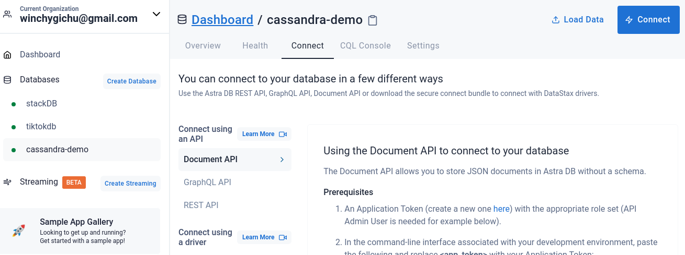
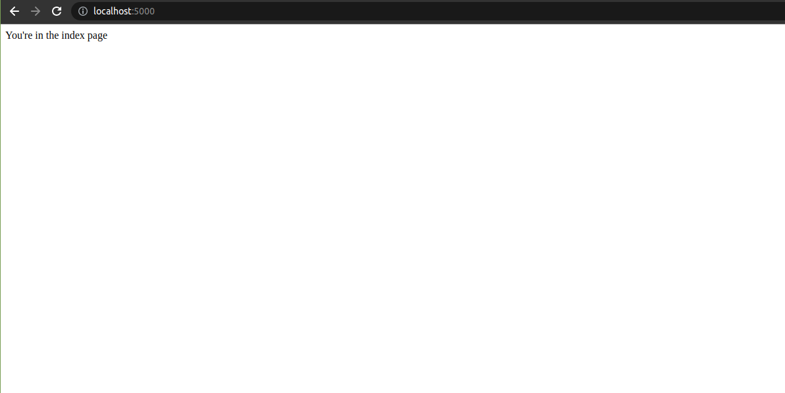
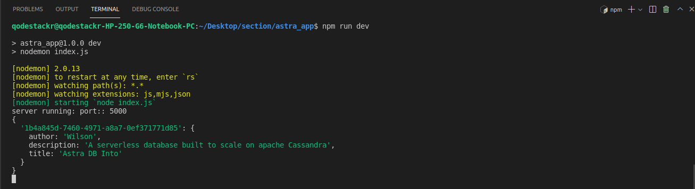
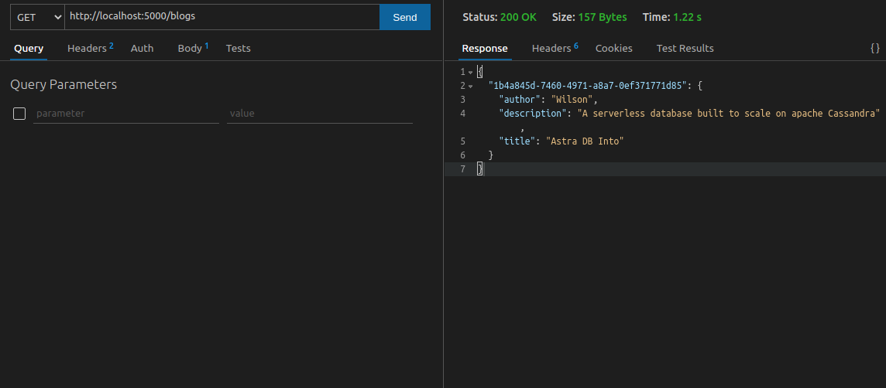
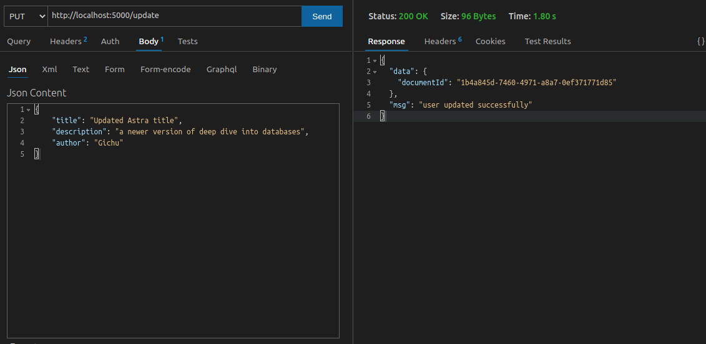

Apache cassandra is distributed No SQL database management system. To ensure reliablility at scale, Apache cassandra relies on replication and partitioning of its infrastructure. However, this form of cloud-native development is normaly complicated. 

This article focuses on the basics of using Apache Cassandra and Astra DB. We will perform CRUD operations on a blog database using Node.js and Datastax's document API. We will create tables, read database records, perform updates, and deletions.


### Prerequisites
1. You'll need an [Astra DB](https://www.datastax.com/products/datastax-astra) account for the database.

2. Have [Node.js] (https://nodejs.org/en/) runtime installed on your development system

3. An IDE, I recommend [VS Code](https://code.visualstudio.com/) for developement. 

### Database Setup

First, you'll need to login to DataStax. I use my GitHub account.However, you connect your Google account or even use email and password.


A successful login will take you to your AstraDB dashboard. On the left panel of the dashboard, click `create database`. 


To create a serverless database, choose a name and a keyspace. Apache Cassandra will use keyspaces to group data together. In my case, I will use `cassandra-demo` as the database name and `blog` as the keyspace.


>>> Documetation refers to keyspace as a bucket that will hold your tables. You can create different keyspaces for groups of tables”. 

Datastax's Astra DB is distributed on different regions. Before completing the database setup, pick a provider from the options. In my case, I will chose GCP and the region as us-east1.


### Insert data to the database
The Apache Cassandra is a NoSQLand therefore it organizes data in collections. When we create a Cassandra collection, it automatically exposes a REST or GraphQL API as an endpoint where we can interact with data from our database. We will utilize the document API gateway from our Node.js application.

First, we need to create a new token for access to DataStax's database in our application. Head over to the DataStax Astra DB dashboard. On the panel, click connect. This shows various ways in cwhich we can access our application including REST and GraphQL APIs. We will use the Document API hence head over under the prerequisites and click the link to create a new Application token.



In this project, we will use the `Administrator role` to access every privilege in the database security. Finally, copy the generated `Client ID`, `Token`, and `Client Secret` and store them on your `env` file.

Since we have no interface created, we will use [curl](https://curl.se/) command line to insert data. 
The curl command to make POST request will be similar to the following:

 ```bash
 curl --request POST \
--url https://$ASTRADB_ID-$ASTRADB_REGION.apps.astra.datastax.com/api/rest/v2/namespaces/$ASTRA_DB_KEYSPACE/collections/members \
-H "X-Cassandra-Token: $ASTRADB_TOKEN" \
-H 'Content-Type: application/json' \
-d '{
"title": "New Title",
"description": "descriptive stuff...",
"author": "john doe"
}'
```
To insert more data, rerun this command with different title and other to insert more data. However, don't forget to change the `title`, `description` and `author` from the json body. 

### Project setup 

On your terminal, create a project folder and name it `astra-app-demo`:

```bash 
mkdir astra-app-demo
```
Next, navigate inside the folder and open it in your IDE:

```bash
cd astra-app-demo && code .
```

To bootstrap this project, initialize using the command `npm init -y` to create a `package.json` file. Let's now install the following dependencies:

Our Node.js application will need the following packages from npm:
- Express : `express` is a low overhead Node.js web application framework that relies on middlewares in request/response cycle.

- @strajs/collections: This is the module that acts as driver to our document [stargate API]() in AstraDB. DataStax uses a Stargate API gateway to connect from Node.js application. 
  
- Dotenv: Since we are using a serverless database, we need a way to store API keys. It injects environment varuables from a `.env` file in our application therefore avoiding hardcoding any sensitive data. Make sure to add a .env in your `.gitignore` file so that this is not pushed to a GitHub repository.
  
- Nodemon: `nodemon` module monitors changes in our application and restarts our application server.

On your terminal, install the packages using the command below:

```bash
  npm i express @astrajs/collections dotenv nodemon
```

If you are using the current version of Node.js, it has support for ES modules. To enable this, head to your package.json and add:

```json
  "type": "module",
```

Next, create an entry `index.js` file inside our `astra-app-demo` directory and add the following code to initiate our server:

```js
// import express and dotenv package installed above
import express from 'express'
import dotenv from 'dotenv'

// instantiate our express app
const app = express()

// enable env varibales for .env file
dotenv.config()

// a basic index route
app.get('/', (req,res)=>{
  res.send("You're in the index page")
})

// run application on Port:: 5000
app.listen(5000, () => {
    console.log(`server running: port:: 5000`)
})
```

Finally, add `nodemon` script in your `package.json` to restart our server:

```json
"scripts": {
    "dev": "nodemon index.js"
  },
```

If everything is okay, head over to your browser on `localhost:5000`. 



Congratulations, the server setup is up and running! In the next sections, we will be manipulating our DataStax Astra database using the Document API and `@astrajs/collections` in Node.js


### Connecting and Retrieving data

The initially generated credentials can now be added to the `.env` file. Under the `,gitignore`, make sure to exclude its commit to github public repository. The file should look like the following:

```bash
ASTRA_DB_REGION=us-east1
ASTRA_DB_KEYSPACE=stackr
ASTRA_DB_APPLICATION_TOKEN=AstraCS:cfytbTtziwRAJZLPrCREbwGr:ca95e6a3af67c4b9491980cb6806473f7705efe9bc7cc29b89d3d49324922873

ASTRA_DB_CLIENT_ID=cfytbTtziwRAJZLPrCREbwGr
ASTRA_DB_CLIENT_SECRET=4ZeNCi8J3fTtb6ZUvKUMqMRHh,eN+E4v-a.5X55WcGPR9NNCf++kNQTJH6rPHnHcA9WvHfkS.GvW5_4,ysCB+hpgiJP-r3+TA.3Mr-dUaC5_dhvjIHZwy,CgPyDUp12H
```
 
At the top of our `index.js` file, let's import `createClient` from `@astrajs/collections` with:

```js
import { createClient } from "@astrajs/collections"`
```

Since we are interacting with an API, we use express middlewares to to parse json and url encoded data with the following:

```js
// enable json and url encoded data
app.use(express.json())
app.use(express.urlencoded({extended: false}))
```

Finally, we need to create an instance of the collection client, `createClient`. Invoke the function passing the environment varibales set earlier as object arguments.

```js
// create an Astra DB client
const astraClient = await createClient({
  astraDatabaseId: process.env.ASTRA_DB_ID,
  astraDatabaseRegion: process.env.ASTRA_DB_REGION,
  applicationToken: process.env.ASTRA_DB_APPLICATION_TOKEN,
})
```

To simplify the database collection, we will create for the collection that we will work on:

```js
const collection = astraClient.namespace("stackr").collection("testcollection")
```

The collection needs a namespace which is the keyspace, and a name. I've used `testcollection`.

Let' head over to list all blogs in our collection. Create a `GET` route that will list all collections. The `find` method provided by our `collection` instance while passing an empty query to display everything. This is an asynchrnous task hence we utilize the `async/ await` syntax.

```js
// get all documents
app.get('/blogs', async (req, res) => {
  const blogs = await collection.find({})
  return res.json(blogs)
}
```

Under the `GET` endpoint, we simply return a json response with blogs. I will use the thunder client as the API client, however, you can use [postman]() as well. AstraDB sends back the data with the document ID as the key.





### Creating documents in AstraDB

```js
// post route
app.post('/new', async(req, res) => {
  const {title, description, author} = req.body
  const newUser = await collection.create({
    title: title,
    description: description,
    author: author
  })

  console.log(req.body)
  return res.json({data: newUser, msg: 'user created successfully'})
})
```


### Updating documents in AstraDB

```js
// updating docs
app.put('/update', async(req, res)=>{
  const {title, description, author} = req.body
const updatedUser = await collection.update("1b4a845d-7460-4971-a8a7-0ef371771d85", {
  title: title,
    description: description,
    author: author
  })

  return res.json({data: updatedUser, msg: 'user updated successfully'})
})
```


### Deleting documents in AstraDB

```js
app.delete('/delete', async(req,res)=>{
  const user = await collection.delete("1b4a845d-7460-4971-a8a7-0ef371771d85")

  if(!user){
    return res.json({msg: '404 user not found'})
  }

  return res.json({msg: 'user deleted successfuly'})
})
```


### Conclusion
Being open source, the Cassandra is a popular database due to its ability to maintain seamless scalability and consistency in a distributed cloud infrastructure. Combining this technical features with DataStax stargate API gateway gives us the ability to develop a serverless database with zero configuration. The database is serverless which has a great free tier and developer experience.

DataStax's free account includes a generous free tier of upto 25 USD of usage credit. Past this, the payment scales with a pay-as-you-go plan. To read more, check the `astrajs` docs [here](https://docs.datastax.com/en/astra/docs/astra-collection-client.html).

I hope you enjoy this article.
