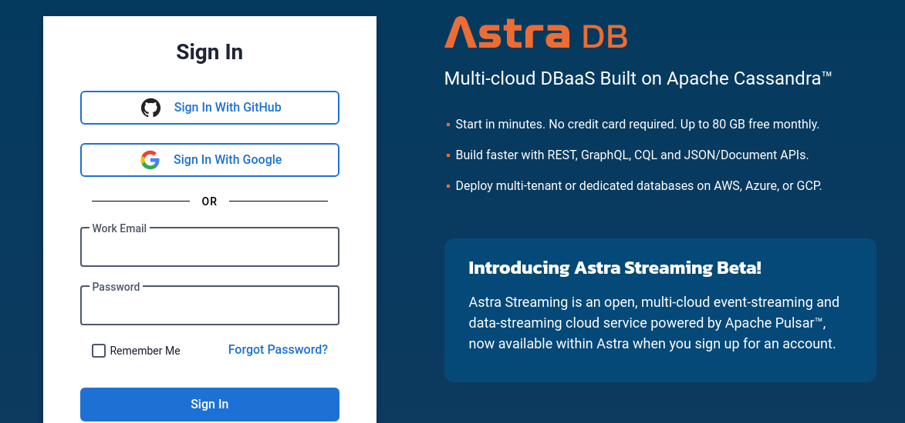
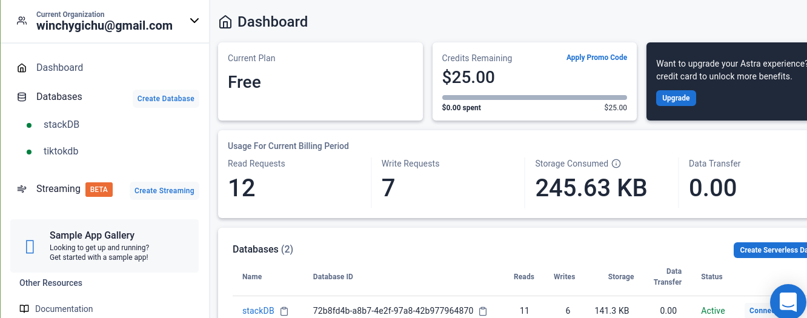
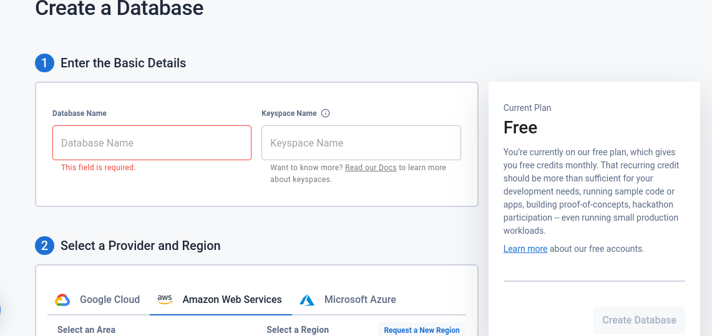
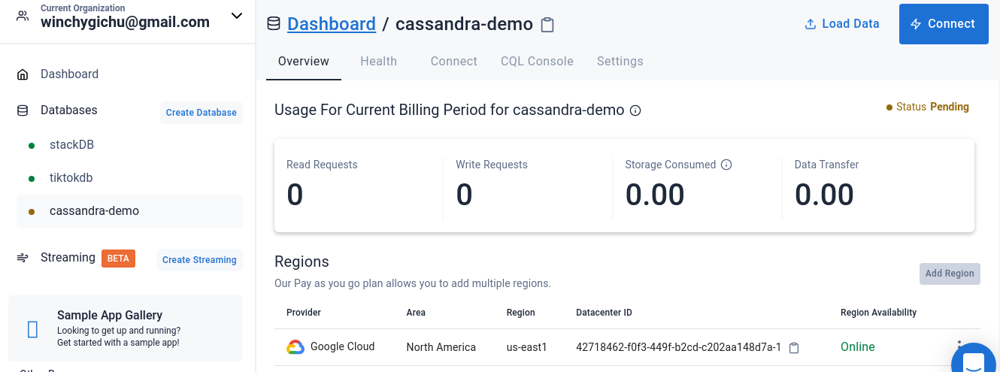

Apache cassandra is distributed No SQL database management system. To ensure reliablility at scale, Apache cassandra relies on replication and partitioning of its infrastructure. However, this form of cloud-native development is normaly complicated. 

This article focuses on the basics of using Apache Cassandra and Astra DB. We will perform CRUD operations on a blog database using Node.js and Datastax's document API. We will create tables, read database records, perform updates, and deletions.

### Prerequisites
1. You'll need an [Astra DB](https://www.datastax.com/products/datastax-astra) account for the database.

2. Have [Node.js] (https://nodejs.org/en/) runtime installed on your development system

3. An IDE, I recommend [VS Code](https://code.visualstudio.com/) for developement. 

### Database Setup

First, you'll need to login to DataStax. I use my GitHub account.However, you connect your Google account or even use email and password.

A successful login will take you to your AstraDB dashboard. On the left panel of the dashboard, click `create database`. 

To create a serverless database, choose a name and a keyspace. Apache Cassandra will use keyspaces to group data together. In my case, I will use `cassandra-demo` as the database name and `blog` as the keyspace.

>>> Documetation refers to keyspace as a bucket that will hold your tables. You can create different keyspaces for groups of tables”. 

Datastax's Astra DB is distributed on different regions. Before completing the database setup, pick a provider from the options. In my case, I will chose GCP and the region as us-east1.

### Insert data to the database

Since we have no interface created, we will manually use curl command to insert data. When we create a Cassandra collection, it automatically exposes a REST or GraphQL API as an endpoint where we can interact with data from our database. We will utilize the document API gateway.
  

### `Node.js` setup

DataStax uses a Stargate API gateway to connect from Node.js application. 

### Conclusion
Being open source, the Cassandra is a popular database due to its ability to maintain seamless scalability and consistency in a distributed cloud infrastructure. Combining this technical features with DataStax stargate API gateway gives us the ability to develop a serverless database with zero configuration. The database is serverless which has a great free tier and developer experience.

I hope you enjoy this article.
