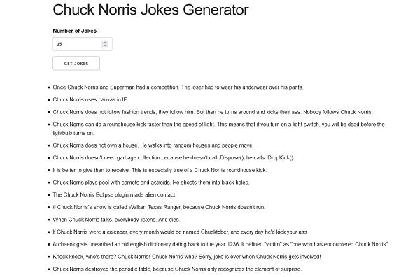

## Asynchronous JavaScript: Fetching Data from external API using AJAX

### Introduction

**AJAX** stands for Asynchronous JavaScript and XML, it’s a set of web technology used to send and receive data between a client and server. Ajax allows you to make requests asynchronously without having to reload the page. Ajax can send and receive information in various formats, including JSON, XML, HTML, and text files. In this tutorial. To show how Ajax works, we’ll create a JavaScript program that fetches data from an external API, format it, and return random Chuck Norris’ Jokes. It’s pretty simple, Ajax goes out, gets the joke, returns them, and then displays them to the user.

### Prerequisites

To followup this tutorial, you will need to have a basic idea of the following :

- [JavaScript.](https://www.geeksforgeeks.org/introduction-to-javascript/#:~:text=JavaScript%20is%20a%20lightweight%2C%20cross,well%20as%20Server%2Dside%20developments.)
- [HTML.](https://www.w3schools.com/html/default.asp)
- [Skeleton CSS.](http://getskeleton.com/#intro)
- Code editors (Preferably [visual studio code](https://code.visualstudio.com/)).
- [How API works](https://developer.mozilla.org/en-US/docs/Learn/JavaScript/Client-side_web_APIs/Introduction)

### Goals of the Tutorial

This tutorial aims to create a webpage that gets random jokes from the [Chuck Norris Jokes API](http://api.icndb.com/random) and displays them to the user. At the end of this tutorial, the reader should be able to make a call to an external API, get data and display the result on the webpage.

### First thing first, Build out the UI

- Create an HTML file
- Save the file as index.html
- Create an Html Boilerplate

  ```html
  <!DOCTYPE html>
  <html lang="en">
    <head>
      <meta charset="UTF-8" />
      <meta http-equiv="X-UA-Compatible" content="IE=edge" />
      <meta name="viewport" content="width=device-width, initial-scale=1.0" />
      <title>Document</title>
    </head>
    <body></body>
  </html>
  ```

- Change the title to your preferred title
- Add Skeleton CSS CDN (To make a simple and responsive UI)

  ```html
  <link
    rel="stylesheet"
    href="https://cdnjs.cloudflare.com/ajax/libs/skeleton/2.0.4/skeleton.css"
    integrity="sha512-5fsy+3xG8N/1PV5MIJz9ZsWpkltijBI48gBzQ/Z2eVATePGHOkMIn+xTDHIfTZFVb9GMpflF2wOWItqxAP2oLQ=="
    crossorigin="anonymous"
    referrerpolicy="no-referrer"
  />
  ```

- Create a form with an input and a button

  ```html
  <div class="container">
    <h2>Chuck Norris Jokes Generator</h2>
    <form>
      <div>
        <label for="number"> Number of Jokes</label>
        <input type="number" id="number" />
      </div>

      <div>
        <button class="get-jokes">Get Jokes</button>
      </div>
    </form>
  </div>
  ```

- Create an unordered list (ul) for the jokes to render below the form
- Create a JavaScript file and save it with index.js
- Include the index.js

- Your html file should look like this 👇:

  ```html
  <!DOCTYPE html>
  <html lang="en">
    <head>
      <meta charset="UTF-8" />
      <meta http-equiv="X-UA-Compatible" content="IE=edge" />
      <meta name="viewport" content="width=device-width, initial-scale=1.0" />
      <!-- Skeleton CSS -->
      <link
        rel="stylesheet"
        href="https://cdnjs.cloudflare.com/ajax/libs/skeleton/2.0.4/skeleton.css"
        integrity="sha512-5fsy+3xG8N/1PV5MIJz9ZsWpkltijBI48gBzQ/Z2eVATePGHOkMIn+xTDHIfTZFVb9GMpflF2wOWItqxAP2oLQ=="
        crossorigin="anonymous"
        referrerpolicy="no-referrer"
      />
      <style>
        ul {
          list-style: square;
        }
      </style>

      <title>External API: Chuck Norris Jokes Generator</title>
    </head>
    <body>
      <div class="container">
        <h2>Chuck Norris Jokes Generator</h2>
        <form>
          <div>
            <label for="number"> Number of Jokes</label>
            <input class="numbers" type="number" id="number" />
          </div>

          <div>
            <button class="get-jokes">Get Jokes</button>
          </div>
        </form>
        <ul class="jokes"></ul>
      </div>
      <script src="./index.js"></script>
    </body>
  </html>
  ```

### The JavaScript

- Open Index.js
- Grab the button from the DOM
  ```javascript
  const button = document.querySelector(.get-jokes);
  ```
- Add an event listener to the button to listen for a click
  ```javascript
  button.addEventListener("click", getJokes);
  ```

### Prepare the AJAX Request

- Create a function name for the click event
- Grab the number from the UI and assign it to a variable
- Create a variable called xhr and set it to new [XHR](https://en.wikipedia.org/wiki/XMLHttpRequest) object

  ```javascript
  function getJokes(e) {
    const number = document.querySelector(".numbers").value;
    const xhr = new XMLHttpRequest();
  }
  ```

  > **_XMLHttpRequest (XHR)_** objects are used to interact with servers. You can retrieve data from a URL without having to do a full page refresh. This enables a Web page to update just part of a page without disrupting what the user is doing, [MDN](https://developer.mozilla.org/en-US/docs/Web/API/XMLHttpRequest).

- Create the object, xhr.open() takes three parameters:

  - The request, which is [GET method](https://developer.mozilla.org/en-US/docs/Web/HTTP/Methods)
  - The link and append the number variable to get the numbers entered by the user and pass it to the.
  - Set the last variable to true to make it asynchronous

  ```javascript
  xhr.open("GET", `http://api.icndb.com/jokes/random/${number}`, true);
  ```

### xhr.onload

- Set xhr.onload to a function

  ```javascript
  xhr.onload = function () {};
  ```

- Check if [XHR STATUS](https://www.w3schools.com/xml/ajax_xmlhttprequest_response.asp) returns 200
- Parse the response text in a JSON format to a variable
- Initialize a variable and set it to nothing (we will use it to concatenate the response)
- Check to see if the Response Type returns success
- If the response type returns success, create a [forEach](https://developer.mozilla.org/en-US/docs/Web/JavaScript/Reference/Global_Objects/Array/forEach) loop to loop through the values of the response to get the jokes and append the joke inside a li tag (using [template literals](https://developer.mozilla.org/en-US/docs/Web/JavaScript/Reference/Template_literals) for flexible formatting)
- If the response type is not success, append an error response to the list item.
- Set the innerHTML of the ul with the class of jokes to the output

  ```javascript
  if (this.status === 200) {
    const response = JSON.parse(this.responseText);
    let result = "";
    if (response.type === "success") {
      response.value.forEach(function (joke) {
        result += `<li>${joke.joke}</li>`;
      });
    } else {
      result += `<li>Something went wrong</li>`;
    }

    document.querySelector(".jokes").innerHTML = output;
  }
  ```

- Then send the xhr.

  ```javascript
  xhr.send();
  ```

  **_ Note_**: _To prevent the button from performing its default action, use the e.preventDefault on the function that is called when the button is clicked._

The final js file should look like this 👇:

```javascript
button.addEventListener("click", getJokes);

function getJokes(e) {
  const xhr = new XMLHttpRequest();
  const number = document.querySelector(".numbers").value;
  console.log(number);
  xhr.open("GET", `http://api.icndb.com/jokes/random/${number}`, true);

  xhr.onload = function () {
    if (this.status === 200) {
      const response = JSON.parse(this.responseText);
      let result = "";
      if (response.type === "success") {
        response.value.forEach(function (joke) {
          result += `<li>${joke.joke}</li>`;
        });
      } else {
        result += `<li>Something went wrong</li>`;
      }

      document.querySelector(".jokes").innerHTML = output;
    }
  };

  xhr.send();

  e.preventDefault();
}
```



### Conclusion

Using the **ICNDB API** is an easy way to show how getting data from an external API using AJAX works. It uses the GET method to pull jokes from the Internet Chuck Norris Jokes Database.
A point to also note is that all APIs do not work the same way nor do they do not handle requests and respond the same way. It is very important to check the documentation of the API one intends to work with.
