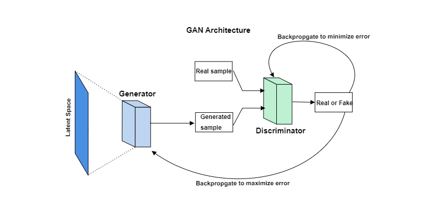

As we know, deep learning has been the most evolving area in Artificial intelligence since the last decade due to research advancements in this area. However, Generative Modeling is a specific field in Deep Learning that has been a topic of interest for the last few years after discovering GANs. In this article, we will be looking forward to the concept of Generative Modeling from scratch and understanding its significance.
<!--more-->

Before we dig deeper, I will try to present a basic notion of Generative Modeling for our readers by taking an example. Let us suppose we want to classify an image into a dog or a cat. We can solve this problem simply by feeding the image as an input to a convolutional neural network that can output the image's corresponding category. What if we want this process to be reversed? We describe what we want as an input to the model and get the image as output, and this is generative modeling in its simplest and most informal form.
This blog will dig deep into Generative Modelling concepts and try to understand GANs(Generative Adversarial Networks).

**Table of content**
- [Prerequisites](#prerequisites)
- [Key takeaways](#key-takeaways)
- [Introduction](#introduction)
- [What is Generative Modeling](#what-is-generative-modeling)
- [Discriminative vs Generative Modeling](#discriminative-vs-generative-modeling)
- [Why Generative Modeling?](#why-generative-modeling)
- [GAN](#gan)
- [Conclusion](#conclusion)

### Prerequisites

Although I have tried to keep this blog as self-contained as possible, basic prior knowledge of probability and machine learning is still required. Therefore, here is an excellent blog on the conditional probability that readers can refer to before reading the article. 

### Key takeaways

After finishing this blog, readers will understand what a generative model is, how it works, the difference between generative and discriminative models, and how it can impact the future of AI.

### Introduction

Most machine learning practitioners are exposed to the classification or the regression tasks in machine learning first due to its extensive scope and straightforward approach. However, the generative modeling that we are going to cover in this article is less understood. So let's dive deep into the concepts of Generative modeling and understand how it can affect the future of machine learning.

### What is Generative Modeling

Before we start, let's get into the formal definition of Generative modeling:

>Generative modeling is an unsupervised form of machine learning where the model learns to discover the patterns in input data. Using this knowledge, the model can generate new data on its own, which is relatable to the original training dataset.

To understand it a bit more formally, let $x$ be the actual data sample. We will take a particular prescription $z$ using which we will try to generate a sample $x^*$. Ideally, this generated sample $x^*$ would look like one from the actual sample $x$. The prescription $z$ is called a learned representation of $x$, present in a latent space and acts as an inspiration. Therefore, the $x^*$ is different every time. Different models will have different $z$ for the same dataset.

Let's try to break the above paragraph by taking a real-life example. Consider a scenario where you get appointed as a machine learning engineer in some company. Now, you give this excellent news to your parents, and now they ask you what an ML engineer is and what will be your everyday job. Let us take your information about an ML engineer as $x$. To make someone understand who has never studied ML in their life, you have to give some basic information only because too much of the technicalities will be of no use. Now you explain your job to parents in leman terms, let the information they learnt as $z$(hidden representation of actual information $x$). Now using this $z$ as an inspiration, they will draw a picture in their mind of what an ML engineer does, $x^*$. Now ideally, you want $x^*$ to be almost the same as $x$, but it will solely depend on the hidden representation of the $x$. Again, if you have to give the same information to one of your colleagues who knows ML, the $z$ will be different, and the $x^*$ will be closer to the $x$. The same applies to generative modeling. Different models will learn different hidden representations $z$ of original data, and the generated data becomes unique. 

### Discriminative vs Generative Modeling

Machine learning models can broadly be categorized into two categories, Discriminative and Generative Models. Before we compare both of them, let's talk about the discriminative models. In simple terms, as its name suggests, the discriminative model aims to discriminate between multiple data instances. It takes input data for training and makes predictions for the unseen data. Most of the classification and regression techniques fall under this category.
To understand it mathematically, let's take an example of a set of data instances $X$ and a corresponding set of labels $Y$.

[Image source](https://www.analyticsvidhya.com/blog/2021/07/deep-understanding-of-discriminative-and-generative-models-in-machine-learning/)

The discriminative model aims to capture $p(Y|X)$, that is, the conditional probability of $Y$ given $X$. In contrast, the generative model aims to capture joint probability $p(X, Y)$, or just $p(X)$ if there is no $Y$ present. 

### Why Generative Modeling?

>*The Future of AI is Generative, not Discriminative.*
> 
> Steve Omohundro, Research Scientist at Facebook 

Generative modeling is a most underrepresented topic in machine learning. However, still, a lot of research is going on this topic. This section will discuss why generating data is essential and how it can transform the future of machine learning by taking a few interesting use-cases.

The most trending topic in generative modeling is GAN. It is the most effective technique when it comes to generating data. We will talk more about GAN in the next section. For now, let's stick to its applications. GANs have transformed the world of deep learning and are considered the most remarkable invention in artificial intelligence. From generating portraits to the whole new virtual world, GAN never fails to surprise. [Here](https://www.cnet.com/news/ai-made-portrait-sells-at-christies-auction-for-432500/) is one such exciting story of GANs. In 2018, a French art collective named Obvious used GAN to generate a portrait sold for half a million dollars. 

[Image Source](https://www.cnet.com/news/ai-made-portrait-sells-at-christies-auction-for-432500/)

Imagine what a future would be if one can use generative modeling to make a complete 2-hour movie using existing movies, compose a piece of music, or maybe write a novel. The innovation will match human expertise, which is the end goal of an AI system.

One more important application of generative modeling is data augmentation. Of course, the most crucial aspect for applying any ML technique is training data. Still, there are certain areas where we have a lot of constraints associated with data availability. One such sector is the medical field. There are a lot of applications of machine learning in the medical field, from diagnosing disease to finding its cure. But medical datasets are harder to collect. Here generative modeling plays a vital role to produce the synthetic data to enlarge the training dataset. This process of extending the training dataset by producing the synthetic data is called Data Augmentation. There is much work done in data augmentation using generative modeling. For example, one search work is done by [Maayan Frid-Adar and others](https://arxiv.org/abs/1803.01229) where they used GAN for synthetic image augmentation to increase the existing performance for liver lesion classification.

### GAN

A generative adversarial network or a GAN is a technique of generative modeling where we train two neural networks simultaneously, one of which is the generator that generates new data. The other one is discriminator, which classifies it as an original sample from a training dataset or data generated by the generator. 

The word __adversarial__ in GAN refers to the competition like the arrangement between generator and discriminator where the generator tries to fool the discriminator. The discriminator's job is to detect the fake data generated by the generator. To understand this, let's imagine a scenario where a thief tries to steal a painting from a museum by replacing it with a fake painting, whereas there will be a curator whose job will be to detect whether the painting is real or fake. In this example, our thief is the generator, and the curator is the discriminator.

Now let's take a look at the architecture of GAN.

[Image source](https://developers.google.com/machine-learning/gan/gan_structure)

We provide random noise input to our generator, which transforms the noise into a data sample. The generated data then acts as an input to the discriminator model. The discriminator model also takes real data samples as input, and its job is to classify the input as fake generated data or real data samples. In this way, we frame two loss functions, one is discriminator loss, and the other is generator loss. The discriminator loss is a classification error, and it is back-propagated through the discriminator network. In contrast, the generator loss is an error of classifying the fake generated data as real data, and it is back-propagated through the generator network. This way, two neural networks are being trained simultaneously in an adversarial manner. 

The convergence of training a GAN is when the discriminator cannot classify between real and fake generated data, which means the probability of classification becomes $0.5$. This point of convergence is known as **Nash Equilibrium**. You can read more about the training of GANs from this excellent [article](https://developers.google.com/machine-learning/gan) by Google Developers.

### Conclusion
In this blog, we have seen how innovative a generative model can be. To manage such innovation, we will need AI systems that can deal with the changing environment. For that, old discriminative models trained on a large amount of hand-labelled data for a fixed environment will fail. Therefore, we need generative models in future to respond to that rapidly changing social environment. Moreover, in the future, the generative models will empathize and co-create with humans, which will prove to be a stimulating environment for people to live in.
