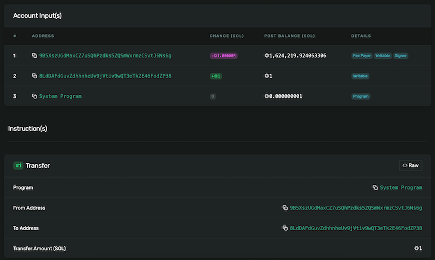

Web3.0 is an evolution of the internet utilizing blockchain technology and decentralization tools. On the other side, Solana is a fast, cheap, and monstrous blockchain tool. Solana is a high-performance, scalable blockchain that can support crypto applications.

[Solana ($SOL)](https://coinmarketcap.com/currencies/solana/) is a decentralized blockchain network just like the likes of bitcoin, ethereum, and litecoin. Salona has programmable blockchains that allow you to use smart contracts and create your own token, or NFTs. Solana aims to do is to be much more scalable and a faster network. Solana can currently handle 50k transactions per second with an average 400ms block time. This extremely fast transaction speed makes salona one of the most scalable layer one blockchain solutions.

This guide will implement the Salona blockchain concept using Android. We will consume a Salona API using the android Retrofit library.

### Prerequisites

To follow along with this guide, it is essential to have the following:

- Basic working knowledge of how blockchain technology and architecture work.
- Working knowledge running applications using Android.

### Setting up the application

First, we need to set up an android application. Go to your Android Studio and create a new Java-powered android project with an empty activity.

Once the app is set, and the griddle setting has been configured, add the Retorfy library. Retrofit is an HTTP client library that helps us handle network operations. To set it up to your application, add the following libraries to the `app.gradle` file.

```java
implementation 'com.squareup.retrofit2:retrofit:2.9.0'
implementation 'com.squareup.retrofit2:converter-gson:2.9.0'
```

Once you have added them, sync your project so that android can download Retrofit and use it in your android project.

Next, you need a Salona wallet that will provide you with the wallet address. This address helps you access the Salona wallet, get the balances and even receive or Transfer Solana to another wallet. Check this guide and learn how to set up a [salona wallet](https://solpadfinance.medium.com/how-to-create-a-solana-wallet-in-the-sollet-web-wallet-4e050587aca6#:~:text=Sollet%20%E2%80%94%20Solana%20SPL%20token%20wallet&text=Go%20to%20https%3A%2F%2Fwww,wallet%20seed%20using%20a%20password.) using the [Solana SPL token wallet](https://www.sollet.io/).



In this guide, we will get the address from this list of available and ready-made wallets.

### Setting the android Salona interface

To start interacting with the salona, you need to first create the request and response interfaces. This will help you access the salon and decide what to do based on the sent request and the received response.

To do that, go ahead and create a new Java class interface file and name it `SInterface.java` as shown below:


```java
class GetBalanceRequest {

    public GetBalanceRequest(String jsonrpc, Integer id, String method, String[] params) {
        this.jsonrpc = jsonrpc;
        this.id = id;
        this.method = method;
        this.params = params;
    }

    @SerializedName("jsonrpc")
    String jsonrpc;
    @SerializedName("id")
    Integer id;
    @SerializedName("method")
    String method;
    @SerializedName("params")
    String[] params;
}
```

```java
class GetBalanceResponse {

    class Result {
        class Context {
            @SerializedName("slot")
            Integer slot;
            @Override
            public String toString() {
                return "Context{" +
                        "slot=" + slot +
                        '}';
            }
        }
        @SerializedName("context")
        SInterface.GetBalanceResponse.Result.Context context;
        @SerializedName("value")
        BigInteger value;

        @Override
        public String toString() {
            return "Result{" +
                    "context=" + context +
                    ", value=" + value +
                    '}';
        }
    }

    @SerializedName("jsonrpc")
    String jsonrpc;
    @SerializedName("id")
    Integer id;
    @SerializedName("result")
    SInterface.GetBalanceResponse.Result result;

    @Override
    public String toString() {
        return "GetBalanceResponse{" +
                "jsonrpc='" + jsonrpc + '\'' +
                ", id=" + id +
                ", result=" + result +
                '}';
    }
}
```

```java
@POST("/")
Call<GetBalanceResponse> retreiveBalance(
        @Body GetBalanceRequest request
);
```

```java
TextView textView = findViewById(R.id.textView);
Retrofit retrofit = new Retrofit.Builder()
        .baseUrl("http://api.testnet.solana.com")
        .addConverterFactory(GsonConverterFactory.create())
        .build();
```

```java
SInterface solanaInterface = retrofit.create(SInterface.class);
```

```java
String[] walletAddress = {"8tfDNiaEyrV6Q1U4DEXrEigs9DoDtkugzFbybENEbCDz"};
Call<SInterface.GetBalanceResponse> responseCall = solanaInterface.retreiveBalance(
        new SInterface.GetBalanceRequest(
                "2.0",
                1,
                "getBalance",
                walletAddress
        )
);
```

```java
responseCall.enqueue(new Callback<SInterface.GetBalanceResponse>() {
});
```

```java
@Override
public void onResponse(@NonNull Call<SInterface.GetBalanceResponse> call, Response<SInterface.GetBalanceResponse> response) {
    try {
        if(response.isSuccessful()){
            textView.setText("Success: " + response.body().toString());
        } else {
            textView.setText("Failed to access Salona wallet: " + response.errorBody().string());
        }
    } catch (IOException exception){
        textView.setText(exception.getMessage());
    }
}
```

```java
@Override
public void onFailure(Call<SInterface.GetBalanceResponse> call, Throwable t) {
    t.printStackTrace();
    textView.setText("onFailure: "+t.getMessage());
}
```
