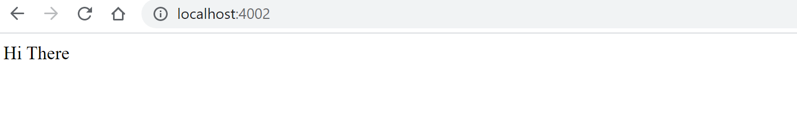

React is one of the common and famous front web frameworks. Nevertheless, in most situations, a web application will require back-end services to process different transactions. In this case, React as a front-end framework is not complete, and thus you need a back-end service to make up a complete full-stack application. On the other hand, Docker is the perfect containerizing technology to set up all the environments you need to set up this full-stack application. This is because Docker uses an abstract concept built on top of a low-level operating system platform that enables you to execute one or even more containerized activities or services within one or more virtualized instances. Thus, Docker will help you set React and any back-end environments such as Node.js and Django, then run and build the whole application on a virtual environment using Docker.

### Why Dockerize a React application with Docker

- A React full-stack application has different services, and thus it runs as a multi-container Docker application. Here React is not a standalone application as it depends on other services such as a database. Docker-compose will allow you to spin all the services you need and runs all the containers on a single host.
- Docker promotes components reusability. For example, one instance of Node.js can be used by different containers to run different services.
- Docker containers allow you to spin up an application stack and run them with a lightweight footprint, reduced overhead, and a stable performance
- Docker allows developers to share Docker images and Docker files across machines. This enhances CD/CD DevOps and thus fast application development and testing with rapid application deployment.

### Goal

This tutorial will build a very handy React full-stack application and then dockerize and run the application environments in Docker containers. We will dockerize this full-stack React application with Node.js as the back-end service, MySQL as the application database, and NginX for reverse proxy. Nginx will be used for two objectives. We'll utilize it as a router in front of our front-end and Node.js express servers, as well as an HTTP server, to deliver our built React front-end code.

### Prerequisites

- Have [Node.js](https://nodejs.org/en/download/) and [Docker](https://www.docker.com/products/docker-desktop) installed on your computer.
- Prior knowledge on how to use Docker and Docker-compose to run and manage Docker containers
- Good understanding of using [React](https://www.youtube.com/watch?v=w7ejDZ8SWv8) to create front-end templates
- Understand How to [create API services using the Node.js](https://www.youtube.com/watch?v=Oe421EPjeBE) framework.

### Setup project basics

This involves two major setups a client and back-end API services. The application involves multi-stage building. You utilize several FROM statements in your Dockerfile for multi-stage builds. Then write a docker-compose.yml file to execute all the Dockerfiles with the proper instructions to set a fully dockerized application. To start with, create a project directory to work on. We will start by creating a Node.js back-end API with Express to expose a REST API and communicate with the MySQL database.

### Build the back-end Node.js application

Node.js will help us to process all tractions and communication that we need to make to the database. In this case, we will use a CRUD use case to implement a simple Node.js Rest API.

#### Step1: Project structure

Inside your project directory, go ahead and create a new folder and name it a server. Will write our backed login inside this directory. So once created cd to this folder and initialize a Node.js application with `npm init -y`. Once executed, a `package.json` file will be created to add any dependencies that we need our application to use.

#### Step2: Project dependencies

Here we will use the following libraries.

- CORS - a technique that permits restricted resources on a web page to be accessed from a domain different than the one from which the initial resource was provided, a case that occurs when you are creating an Express API.
- Express - a Node.js framework that enables us to create API endpoints to request data from the server, a process that requests and sends a response with the requested information. Express will help us write different functions that will help us process different CRUD requests.
- Mysql2 - will enable us to write different functions that will help us access MySQL Server and execute SQL queries from different requests.

Run the following command (inside the server folder) to install the above packages

```bash
npm install cors express mysql2
```

#### Step3: Writing the API configurations

We will start by creating an `index.js` file (still inside your server directory) and start coding the API logic.

- Import the packages that we downloaded above

```js
const express = require('express');
const mysql = require('mysql2');
const cors = require('cors');
```

- Add MySQL database connection. We will define these environments later using the `docker-compose.yml`. We are using a dockerized MySQL server instance. That's why we will define these variables inside the MySQL Docker container.

```js
const db = mysql.createPool({
  host: 'mysql_db', // the host name MYSQL_DATABASE: node_mysql
  user: 'MYSQL_USER', // database user MYSQL_USER: MYSQL_USER
  password: 'MYSQL_PASSWORD', // database user password MYSQL_PASSWORD: MYSQL_PASSWORD
  database: 'books' // database name MYSQL_HOST_IP: mysql_db
})
```

- Enable cors security headers

```js
app.use(cors())
```

- Add an Express method to parse the POST method as well as use the Express framework.

```js
const app = express();
app.use(express.json())
app.use(express.urlencoded({ extended: true }));
```

- Add a home page route

```js
app.get('/', (req, res) => {
  res.send('Hi There')
});
```

- We a using a book scenario here. Add a route that will process a Select query to retrieve all the books from the database.

```js
//get all of the books in the database
app.get('/get', (req, res) => {
  const SelectQuery = " SELECT * FROM books_reviews";
  db.query(SelectQuery, (err, result) => {
    res.send(result)
  })
})
```

- And an endpoint to process and INSERT SQL command.

```js
// add a book to the database
app.post("/insert", (req, res) => {
  const bookName = req.body.setBookName;
  const bookReview = req.body.setReview;
  const InsertQuery = "INSERT INTO books_reviews (book_name, book_review) VALUES (?, ?)";
  db.query(InsertQuery, [bookName, bookReview], (err, result) => {
    console.log(result)
  })
})
```

- Add a route that will allow us to delete a book record. This must include a book id that is unique to the book recorded being deleted.

```js
// delete a book from the database
app.delete("/delete/:bookId", (req, res) => {
  const bookId = req.params.bookId;
  const DeleteQuery = "DELETE FROM books_reviews WHERE id = ?";
  db.query(DeleteQuery, bookId, (err, result) => {
    if (err) console.log(err);
  })
})
```

- Add a route that will allow us to update a book review. This must include a book id that is unique to the book recorded being updated.

```js
// update a book review
app.put("/update/:bookId", (req, res) => {
  const bookReview = req.body.reviewUpdate;
  const bookId = req.params.bookId;
  const UpdateQuery = "UPDATE books_reviews SET book_review = ? WHERE id = ?";
  db.query(UpdateQuery, [bookReview, bookId], (err, result) => {
    if (err) console.log(err)
  })
})
```

- And finally, add a port the will expose the API when the server is running.

```js
app.listen('3001', () => { })
```

### Adding running a script and testing

Head over to the package.json file and add the following start script inside the script tags.

```js
  "start": "node index.js",
```

Now you can run `npm start` inside the server folder. Access the home route (`http://localhost:3001/`) on the browser to see if it is working. If so, you are now set.


### Build the front-end React application

Let's now write our application front-end logic to process all the API endpoints we have defined above. Go to your project root directory to start a new React project. We will be running this command to create and generate a React application boilerplate. Add an `npm` flag to implies that we will NPM as the package manager.

```bash
npx create-react-app client --use-npm
```

#### Step1: The client project structure

We now have a React template, but we don't need all the files here. So you can go ahead and delete some files inside the `public` and `src` directories. And this should be your project structure after removing the unused files.

```bash
└───client
    │
    ├───public
    │ index.html
    └───src
            App.css
            App.js
            index.js
```

#### Step2: Adding project dependencies

Here will add some additional packages. This includes;

- Axios - a promise-based HTTP request library that allows us to intercept requests with REST API.
- Bootstrap and React-bootstrap -  CSS frameworks that have custom CSS styles for elements such as Buttons, Input text, Cards, etc.

To install them, run this command inside the client application.

```bash
npm install Axios bootstrap react-bootstrap
```

#### Step3: Writing the React front-end logic

Here will write down the code that will help the client React application to communicate with the server Node.js API.

Step3: Start by import the necessary modules

Head over to the src directory and make sure you have the following;

```js
import React, { Component } from 'react';
import './App.css';
import axios from 'axios';
import { Button, Container, Card, Row } from 'react-bootstrap'
```

Here we are;

- Importing the React Component from the React library
- Importing the App.css. This is where we will later write some CSS to style a React page.
- Importing Axios so that we can process and handle any incoming requests.
- Importing Button, Container, Card, and Row from bootstrap. These elements will help us lay down our page elements using the bootstrap classes.

#### Step4: Add the application props

```js
class App extends Component {
  constructor(props) {
    super(props),
      this.state = {
        setBookName: '',
        setReview: '',
        fetchData: [],
        reviewUpdate: ''
      }
  }
}
export default App;
```

Moving forward, anything we write will fall under the class `App`.

#### Step5: Add change handlers

Since we are manipulating some information by adding new records and updating some records, we need to add some states. This states will helps us handle both update operation and insert operation.

```js
handleChange = (event) => {
    let nam = event.target.name;
    let val = event.target.value
    this.setState({
      [nam]: val
    })
}

handleChange2 = (event) => {
    this.setState({
      reviewUpdate: event.target.value
    })
}
```

#### Step6: Perform request to server API using Axios

Here we add the respective routes that we defined in the Node.js server API. Axios will help us to intercept these requests so that they can communicate with the back-end.

```js
componentDidMount() {
    axios.get("/api/get")
        .then((response) => {
            this.setState({
                fetchData: response.data
            })
        })
}

submit = () => {
    axios.post('/api/insert', this.state)
        .then(() => { alert('success post') })
    console.log(this.state)
    document.location.reload();
}

delete = (id) => {
    if (confirm("Do you want to delete? ")) {
        axios.delete(`/api/delete/${id}`)
        document.location.reload()
    }
}

edit = (id) => {
    axios.put(`/api/update/${id}`, this.state)
    document.location.reload();
}
```

Note how the endpoint is written here with the `/api`. This is because, in the Node.js application, we used `/get`, `/insert`, etc. We add `/api` in the Axios requests because Nginx will redirect `/api` to the requested route (for example, `/get`) into the Node.js application. The Nginx proxy in our container will handle this.

In this case, we will be creating Node.js as an `api` service in the same container that will run this React application. When Axios requests `/api/get`, the Nginx server will redirect it to the endpoint `/get` on the back-end server.

Normally, you assign `http://localhost:3001/get/` instead of `/api/get` when you run the application directly from the base metals. But in this case, that won't work as the application is running as a virtual instance where Node.js is dockerized. For that reason, the Node.js (server) will run as a container instance as API on the docker-compose.yml. We will implement this logic later.

#### Step7: Rendering the React component

Here we are adding the necessary input texts and buttons that will handle the necessary states and response data.

```js
render() {
    let card = this.state.fetchData.map((val, key) => {
        return (
            <React.Fragment>
                <Card style={{ width: '18rem' }} className='m-2'>
                    <Card.Body>
                        <Card.Title>{val.book_name}</Card.Title>
                        <Card.Text>
                            {val.book_review}
                        </Card.Text>
                        <input name='reviewUpdate' onChange={this.handleChange2} placeholder='Update Review' ></input>
                        <Button className='m-2' onClick={() => { this.edit(val.id) }}>Update</Button>
                        <Button onClick={() => { this.delete(val.id) }}>Delete</Button>
                    </Card.Body>
                </Card>
            </React.Fragment>
        )
    })

    return (
        <div className='App'>
            <h1>Dockerized Fullstack React Application</h1>
            <div className='form'>
                <input name='setBookName' placeholder='Enter Book Name' onChange={this.handleChange} />
                <input name='setReview' placeholder='Enter Review' onChange={this.handleChange} />
            </div>
            <Button className='my-2' variant="primary" onClick={this.submit}>Submit</Button> <br /><br />
            <Container>
                <Row>
                    {card}
                </Row>
            </Container>
        </div>
    );
}
```

#### Step8: Adding CSS to style App.js

Now we will add some ccs styling to layout the above CSS forms on a web page. So go ahead to the `App.css` file and add the following CSS code.

```css
.App {
  text-align: center;
}
.form{
  display: inline-block;
  justify-content: center;
}
.form input{
  width: 250px;
  margin: 10px;
}
```

Also, on the `index.html` and `index.js`, add the following to add the bootstrap links and execute `ReactDOM` rendering, respectively.

```html
<!doctype html>
<html lang="en">
  <head>
    <meta charset="utf-8">
    <meta name="viewport" content="width=device-width, initial-scale=1">
    <link rel="shortcut icon" href="%PUBLIC_URL%/favicon.ico">
    <link
  rel="stylesheet"
  href="https://maxcdn.bootstrapcdn.com/bootstrap/4.5.0/css/bootstrap.min.css"
  integrity="sha384-9aIt2nRpC12Uk9gS9baDl411NQApFmC26EwAOH8WgZl5MYYxFfc+NcPb1dKGj7Sk"
  crossorigin="anonymous"
/>
   
    <title>React Fullstack Application</title>
  </head>
  <body>
    <div id="root"></div>
  </body>
</html>
```

```js
import React from 'react';
import ReactDOM from 'react-dom';
import App from './App';
import 'bootstrap/dist/css/bootstrap.min.css';

ReactDOM.render(
  <App />,
  document.getElementById('root')
);
```

#### Step9: Test

Inside the client folder, run `npm start` to check if this is working. Then, open `http://localhost:3000/` and a page similar to this show be sown on your web browser.


### Create the Dockerfiles environments

Now we have both applications ready, and now we can go ahead and define some Docker environments using Dockerfile. This application is running on the host machine's base metals. We need to copy the necessary file to Docker and run the necessary commands with the help of a Dockerfile. Let's start by defining the client application Dockfile environments.

#### Client Dockerfile

Navigate to the client folder and create a new file and name it `Dockerfile`. We will add the following to this file.

```bash
FROM node:alpine
WORKDIR /app
COPY package.json ./
COPY package-lock.json ./
COPY ./ ./
RUN npm i
CMD ["npm", "run", "start"]
```

The application will now be running on Docker. So we need to pull the Node.js image to run this application inside a container that will then be used to create our client image to run the React application. Inside the client image, we have defined the working directory as `/app`. When the image is created, this directory will also be created inside Docker. Then we will copy the `package-lock.json` and `package.json` from the computer to `/app` on the client's Docker image.

After that, we will copy everything else from our client root folder to the client container's working directory. Then call the `npm runs start` command to start up React application in the container.

Let's now test if this Dockerfile is working. On your terminal change directory to point to the client directory and execute this command;

```bash
docker build -f Dockerfile -t client .
```

The above command will create an image called client on Docker. To test it, we will create a container that will help us to run this image. Here is the command to do so.

```bash
docker run -it -p 4001:3000 client
```

Here will are exposing port 3000 (the port that runs the React application) to port 4001 outside the container—run the above command. And if now you open `http://localhost:4001` on a browser, you can see that the React app is working inside Docker.


#### Server Dockerfile

```bash
FROM node:alpine
WORKDIR /app
COPY package.json ./
COPY package-lock.json ./
COPY ./ ./
RUN npm i
CMD ["npm", "run", "start"]
```

This looks similar to the client Dockerfile, and the same process is being carried out here to create `/app` working directory, copy all the necessary files, and then run the `npm runs start` script (as defined in the package.json) to start up the server.

We can test the Dockerfile by creating a server image and a container to run the image. To create the server image run;

```bash
docker build -f Dockerfile -t server .
```

To create a container to execute the server image, run;

```bash
docker run -it -p 4002:3001 server
```

Here will are exposing port 3001 (the port that is running the Node.js server application) to port 4002 outside the container—run the above command. And if now you open `http://localhost:4002/` on a browser, you can see that the Node.js home route is okay and the app is working inside Docker.



### Setting the Nginx server

Navigate to the project root directory and create an Nginx folder. Here we will write the Nginx server proxy configurations to power up both the client and server API together. Inside the Nginx folder, create a `default.conf` file. We will the following into it.

```bash
upstream client {
    server client:3000;
}

upstream api {
    server api:3001;
}

server {
    listen 80;

    location / {
        proxy_pass http://client;
    }

    location /sockjs-node {
        proxy_pass http://client;
        proxy_http_version 1.1;
        proxy_set_header Upgrade $http_upgrade;
        proxy_set_header Connection "Upgrade";
    }
    
    location /api {
        rewrite /api/(.*) /$1 break;
        proxy_pass http://api;
    }
}
```

Here we are;

- Adding the two apps upstreams, the client and the server API, and adding the ports assigned to each app. An upstream module is used to define a group of servers that the proxy pass can reference.
- Creating our main config, which is the Nginx server listening to port 80.
- Adding the location `/`. `/` will redirect to the client-server. Note that we are setting `proxy_pass` as `http://client`. The client is the name of the service that we will configure in our docker-compass.yml file to power up the client React application.
- Adding the location `/sockjs-node`. for the client to make the web sockets connection and connect to the server, we should define the `sockjs-node` path here.
- Adding the location `/api`. Remember we added this to the Axios requests URLs. This will redirect to the Node.js back-end. `api/anything` should redirect to the parameter `/$1`, which is any section of our Node.js routes such as `/get`.

#### Nginx server Dockerfile

Inside the Nginx folder, add a Dockerfile and include the following to pull the Nginx image and execute the `default.conf` file.

```bash
FROM nginx
COPY ./default.conf /etc/nginx/conf.d/default.conf
```

### Setting up the docker-compose.yml

Now we have all the configurations for the client, and the server API hooked to the Nginx server and ready to spin up everything together with the docker-compose.yml, including our database. At the root of your project, create a docker-compose.yml file.

```yml
version: '3.8'

x-common-variables: &common-variables
  MYSQL_DATABASE: books
  MYSQL_USER: MYSQL_USER
  MYSQL_PASSWORD: MYSQL_PASSWORD

services:
  mysql_db:
    image: mysql
    restart: always
    cap_add:
      - SYS_NICE
    volumes:
      - "./setup.sql:/docker-entrypoint-initdb.d/setup.sql"
    ports:
      - "9906:3306"
    environment:
      <<: *common-variables
      MYSQL_ROOT_PASSWORD: MYSQL_ROOT_PASSWORD
      MYSQL_HOST: localhost

  nginx:
    depends_on:
      - api
      - client
    restart: always
    build:
      dockerfile: Dockerfile
      context: ./nginx
    ports:
      - "3050:80"

  api:
    build:
      dockerfile: Dockerfile
      context: "./server"
    depends_on:
      - mysql_db
    volumes:
      - /app/node_modules
      - ./server:/app
    environment:
      <<: *common-variables
      MYSQL_HOST_IP: mysql_db

  client:
    stdin_open: true
    environment:
      - CHOKIDAR_USEPOLLING=true
    build:
      dockerfile: Dockerfile
      context: ./client
    volumes:
      - /app/node_modules
      - ./client:/app

  adminer:
      image: adminer:latest
      restart: unless-stopped
      ports:
        - 8000:8080
      depends_on:
        - mysql_db
      environment:
        ADMINER_DEFAULT_SERVER: mysql_db
```

Here we are adding the following services;

- `mysql_db` - this will run the MySQL server. Once the MySQL instance is executed, a database `books` will be created and all the environments that power a MySQL server (we also added them in the Node.js database connection). Also, note we are executing a `setup.sql` script inside the `mysql_db` volumes. So on you, the project root directory creates this `setup.sql` file and adds this SQL script.

```sql
CREATE TABLE IF NOT EXISTS `books_reviews` (
  `id` int(11) NOT NULL AUTO_INCREMENT,
  `book_name` varchar(50) NOT NULL,
  `book_review` varchar(50) NOT NULL,
  PRIMARY KEY (`id`)
) ENGINE=InnoDB AUTO_INCREMENT=9 DEFAULT CHARSET=latin1;
```

When the `mysql_db` instance has been created, this script will be executed, and a table `books_reviews` automatically created the defined fields.

- `nginx` - to power up the Nginx server. This will be exposed on port 3050.
- `api` - this will power up the Node.js server. Note the name of this service is `api`, just as we defined in the Nginx proxy settings.
- `client` - this will power up the React client application. Note that the name of this service is `client`, just as we defined in the Nginx proxy settings.
- `adminer` - we will use Adminer as an interactive interface to access the MySQL server. This way, we will view the created database and table and see when a new item is added, updated, or deleted.

At this point, your project should at least have these files and folders.

```bash
│   docker-compose.yml
│   setup.sql
|
├───client
│   │   Dockerfile
│   │   package-lock.json
│   │   package.json
│   │
|   ├───node_modules
│   ├───public
│   │       index.html
│   |
│   └───src
│           App.css
│           App.js
│           index.js
│
├───nginx
│       default.conf
│       Dockerfile
│
└───server
    |    Dockerfile
    |    index.js
    |    package-lock.json
    |    package.json
    |
    ├───node_modules 
```

### Run and test the fully containerized application instance

All is now ready. On your project root directory, execute the following command to run the docker-compose.yml file.

```bash
docker-compose up --build
```

This will build and run all the containers in Docker.


Now you access the Adminer using route `http://localhost:8000/`.


To log in, use `mysql_db` as the server Username as `root` and password as `MYSQL_ROOT_PASSWORD`. You can see we have database `books` set and table `books_reviews` created.


To start interacting with the application, open `http://localhost:3050/` on a browser. Now you can start adding new records, editing book reviews, and deleting records. In addition, you can refresh the `books_reviews` table on Adminer to view if the changes were implemented in the database.

### Conclusion

We have created a front-end application using React and a back-end API using Node.js. Docker has helped us o created a virtual instance that allows the two to communicate interactively with the back-end database.

I hope you find this tutorial informative and helpful.
