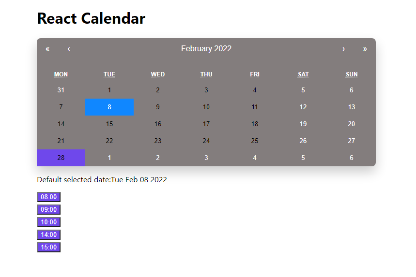

# Build a Calendar in React Using React-Calendar Library


Oftentimes, you want to manage and manipulate dates in your web app. These may include adding events or setting reminders. Having a calendar in your web application is a way to implement this. 

In this tutorial, you will learn how to manage and manipulate dates in React using React-Calendar.

### What is React-Calendar
React-calendar is an easy-to-use react calendar library. It provides functionality that helps you to manipulate and manage date and time. 

React-Calendar gives end-users the ability to pick days, months, or even years.
### Goals

In this tutorial, you will learn:
* How to add React-Calendar to your React app.
* How to style React-Calendar.
* How to customize React-Calendar.
* How to select a date range in React-Calendar.
* How to create a date picker

### Prerequisite
* Basic understanding of React.
* Basic understanding of the command line(Nodejs 14.5.1 or higher).
* A command line or terminal.
* A code editor. I use VS Code.
* Google Chrome.

### Installation
You need to install Nodejs 14.5.1 or higher. Visit Nodejs' official website to download and install Nodejs. It comes with a pre-installed Node Package Manager(NPM).

Check Nodejs version installed. Open your terminal and copy and paste the command below

```properties

node --version

```

Verify the installation and version of NPM using the command below.

```properties

npm --version

```

### Creating a New React Project
To get started you need to set up a react development environment.

Type the command below in the built-in terminal of your code editor.

```properties

npm create-react-app calendar-project

```
Wait for the installation of the development environment.

Your development environment will set up an application structure that looks like the one below.


You can run or test your application using the command below

```properties

npm start

```

### Integrate React Calendar Library into Your Project

Run the command below to integrate React-Calendar into your React project.

```properties
npm install react-calendar

```

### Add calendar to our project using React-Calendar
In this step, you will add a calendar to your React project. The calendar will enable users to select their date of birth.

1. Navigate to `app.js`.

2. Clear the boilerplate.

3. Import calendar component from react-calendar in `App.js`.

4. Copy the code below into your `App.js` file.


**src/App.js**
```jsx
import {useState} from 'react';
import Calendar from 'react-calendar'; 
import './App.css';

function App() {
 const [date, setDate] = useState(new Date())


return (
 <div className="app">
   <h1 className="header">React Calendar</h1>
   <div className="calendar-container">
     <Calendar onChange={setDate} value={date}/>
   </div>
   <div className="text-center">
      Selected date: {date.toDateString()}
   </div>
 </div>
  )

}

export default App;
```

In the code above, we used `useState` to store a date and we set the present date as its initial value using `Javascript Date object`. We then pass the date as a value to our Calendar component. 

When a user selects a date the value of date will be set to the user's selected date. The selected date is then printed below your calendar.

Your application should look like the one below.


### Add Style to Your Calendar

Your calendar user interface lacks good design. You can improve this by importing react-calendar default stylesheet.

Add the line below to `App.js`. Add it below `import Calendar from 'react-calendar'`

```js

import 'react-calendar/dist/Calendar.css'

```

### Add Custom Styling to your Calendar
You may want your calendar to be consistent with a particular design. You can achieve this by following the step below.

1. Navigate to `node_modules/react-calendar/dist`.

2. Copy the code in the stylesheet into `App.css`.

3. Remove import `'react-calendar/dist/Calendar.css'` from `App.js`

4. You can now edit the code according to your taste.

I changed the default styling by implementing the custom styling in this [link](https://gist.github.com/codeInn001/b479eaab3e612a1edc4448451379a0ed).

<script src="https://gist.github.com/codeInn001/b479eaab3e612a1edc4448451379a0ed.js"></script>


My customized calendar now look like this.


IMAGE

### Select Date Range
React-calendar has the date range feature. This enables users to select a custom date range. You can then provide some data between the user's desired date range.

Copy the code below into your `App.js`

**src/App.js**
```js

import { useState } from 'react';
import Calendar from 'react-calendar';
import './App.css';

function App() {
 const [date, setDate] = useState(new Date());

 return (
 <div className='app'>
   <h1>React Calendar with Range</h1>
   <div>
     <Calendar onChange={setDate} value={date} selectRange={true}/>
   </div>
   {date.length > 0 ? (
   <p>
     <span>Start:</span>{' '} {date[0].toDateString()}
     &nbsp; to &nbsp;
     <span>End:</span> {date[1].toDateString()}
   </p>
        ) : (
   <p>
     <span>Default selected date:</span>{' '} {date.toDateString()}
   </p>
        )}
 </div>
  );
}

export default App;

```

We passed a `selectRange` prop into our Calendar component. `selectRange` has a default value of `false`. We changed this value to `true`, this enables the user to select a date range. 

When a user selects a date range. It highlights the range. React-calendar returns an array containing two elements as our state. The two elements indicate the start date and the end date. We can then print the start date and end date in our array.


### Build Booking App with React-Calendar
You can integrate other features with react-calendar to build an application with a complex feature.

We will demonstrate this by building a booking app. In the booking app, users can click on a date of their choice. After clicking on the desired date, the application will display the available time slot. Users can then select a time slot. After selecting a time slot, the date and time of appointment will be displayed on the screen.

Copy the code below in your `app.js` file.
**src/App.js**

```jsx
import {useState} from 'react';
import Calendar from 'react-calendar';
import './App.css';
import Time from './Time.js'


function App() {
 
const [date, setDate] = useState(new Date());

const [showTime, setShowTime] = useState(false) 

 return (
 <div className='app'>
   <h1 className='header'>React Calendar</h1>
   <div>
    <Calendar onChange={setDate} value={date} onClickDay={() => setShowTime(true)}/>
   </div>

   {date.length > 0 ? (
   <p>
     <span>Start:</span>
     {date[0].toDateString()}
     &nbsp;
     &nbsp;
     <span>End:</span>{date[1].toDateString()}
   </p>
          ) : (
   <p>
      <span>Default selected date:</span>{date.toDateString()}
   </p> 
          )
   }
   <Time showTime={showTime} date={date}/>

 </div>
  )
}

export default App;


```

In the code above, we used `useState` to store the initial value of `showTime` as false.

`Calendar` component have a default `onClickDay` prop, this listen to user click event. We passed in `setShowTime` into `onClickDay` prop, this sets `showTime` new value to true when any day in the calendar is clicked. 

The `Time` component displays the time slot when the value of `showTime` changes to true. We passed `showTime` and `date` as props in `Time` component.

### Create Time Component
Create a `Time.js` component. This will display the elements in `Times.js` component.

Copy the code below into your `Time.js` file.

**src/Time.js**

```js

import {useState} from 'react';
import Calendar from 'react-calendar';
import './App.css';
import Times from './Times.js'

import React from 'react'

function Time(props) {
 
 return (
 <div>
  {props.showTime ? <Times date={props.date}/> : null}
 </div>
  )
}

export default Time;

```

In the code above, when  `showTime` is true, our application display elements of `Times.js` component. If false, they are not displayed.

### create Times.js Component
Create `Times.js` component. This will contain an array of time slots.

Copy the code below into `Time.js` component.

```js

import React from 'react'
import {useState} from 'react';
import Calendar from 'react-calendar';
import './App.css';

const time = ['08:00','09:00','10:00','14:00','15:00']

function Times(props) {

 const [event, setEvent] = useState(null)
 const [info, setInfo] = useState(false)

 function displayInfo(e) {
   setInfo(true);
   setEvent(e.target.innerText);
}


return (
 
 <div className="times">
   {time.map(times => {
    return (
    <div>
      <button onClick={(e)=> displayInfo(e)}> {times} </button>
    </div>
        )
     })}
    <div>
      {info ? `Your appointment is set to ${event} ${props.date.toDateString()}` : null}
    </div>
 </div>
  )
}

export default Times;

```
The code above has an array of time slots called `time`. We map through the array to display each time slot in a button element. Also, the button element has an `onClick` event handler. It contains a `dislayInfo` function that triggers when a user clicks any of the buttons.

The `displayInfo` function contains two `useState`. When `displayInfo` triggers, the value of info and event changes to true and innerText of button element respectively.

We passed in date as a prop from  `App.js` to `Time.js` finally to `Times.js`.

When the value of `info` changes to true, the app displays the time slot and date selected by the user.

Our final application will look like the image below.



### Conclusion
We covered how to integrate react-calendar app, customize, set a date range and add a booking feature into our react app.

Happy coding!

