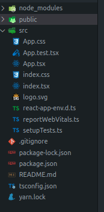
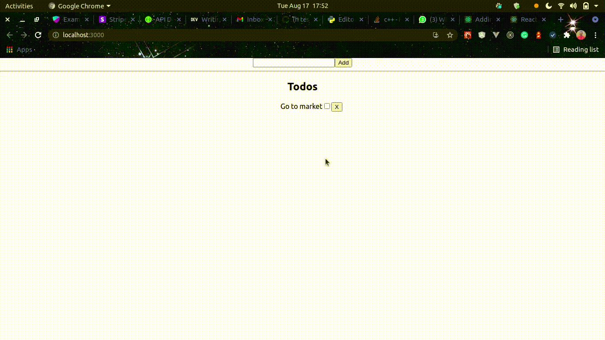

## Introduction


React is one of the most popular and best front-end libraries as of today this has made a lot of developers make it their primary library used for creating front-end applications. Typescript on the other hand is a strict and statically typed programming language which makes our javascript code more predictable. As developers, our goal is not just to create products but to create products that we can always predict their behavior, this is one of the main reasons why Typescript was created. Using Typescript to create our React applications will make our react applications more predictable as we will be able to catch alot of errors at runtime(during compilation).
In this article, I'd explain the following while building a simple Todo Application:
1. How to bootstrap a react typescript application
2. What are types and interfaces in typescript and how to use them
3. How to declare types for states and props in functional components
4. Events and how to deal with event types in our react applications
5. How to declare types for states and props in class base components.

If you are interested in the code alone, you can check out this Github repo [here](https://github.com/Babatunde13/react-ts-section)

This article isn't a beginner guide to React or Typescript but instead a guide on how to integrate Typescript in React applications.


### Setup a React Typescript Application
We use Create React App to set up our react application that way we do not need to worry about all the webpack and babel stress, as you might have guessed to set up a react typescript application we'd still use create-react-app just with some extra flags. In our terminal we'd type the following to bootstrap our application

```bash
npx create-react-app todo-app --template typescript
```

This command will create a react typescript application for us then we can set up the server as we will normally. Our app structure should look like this



Let's test that everything is working fine, we need to run the app by typing the following 
```bash
npm start #or yarn start
```

You can check out this [link](https://create-react-app.dev/docs/adding-typescript/) for more details about setting up a react typescript app with create-react-app

### Types and Interfaces


Before we start building our application, let's talk about one of the most important features of typescript, types and interfaces. These two things are very much alike and we might not even be able to spot the differences but there are some differences. Types and interfaces are mainly to tell us more about what an object or data is, it's datatype, what it can contain and all.
Let's look at some example:

```typescript
let num: number = 4
const name: string = "John Doe"
```
The example above is pretty straightforward as a matter of fact in this case we do not need to specify the type of the variables, typescript is smart enough to determine the type.

```typescript
type something = string
type IProps = {
  disabled: false,
  title: "Hello" | "Hi"
}

interface Props {
  disabled: boolean,
  title: string
}

const props_types: IProps = {
  disabled: false,
  title: "Hello"
}

const props_interface: Props = {
  disabled: false,
  title: "Hello"
}

const data: something = "Hey"

```

As we can see we were able to define a type for a more complex data and we can use this idea to model a much more complex data. From this example we might be able to see a difference between type and interface


### More Details ABout Our Application
In our `App.tsx` file we need to delete the everything inside the function and return a simple text 
```tsx
import React 'react'

function App() {
  return <h1>Hello World</h1>
}

export default App;
```

Now let's think about the structure of the application. To make things simple,we'd have the code for the whole app inside this file. We need 2 components to sit inside the `App` component, `AddTodoComponent` and `TodosComponent`, these 2 components will be responsible for creating a new todo and displaying the list of todos that have been created respectively. 

1. `AddTodoComponent`: This component contains a form with one input field and when the **Add** button is clicked a new todo data is added to the state and then the `TodosComponent` is updated.
2. `TodosComponent`: This component contains a list of all the create todos, we can toggle the completed field of a todo and we can also delete a todo.

### How to Declare Types In React Applications
Firstly let's create a type for our **Todo** object, inside the `App.tsx` file place this object after the import
```typescript
type ITodo = { 
  // Our todo should have the title and completed fields and the id field to 
  id: number;
  title: string;
  completed: boolean;
}

type ITodos = {
  todos: ITodo[], // Our Todos is an array of Todo
}
```

### How To Declare State and Props In A Functional Component
We'd see different ways to declare type for `props` in a functional component and we'd also see how to declare the type for state in a functional component. To declare `props` for a functional component we can either use normal type efinition for functions or we can pass the type as a generic type to the `React.FC` type
Let's see how we can demonatrate the initial by creating our `AddTodoComponent`. This component has it's own state and it also accept `props` with one field `addTodos` which is a function that takes in a string and returns nothing, it just updates the `ITodos` state.
To declare a type for a state in a functional component, all we need to do is to pass the type of that state as a generic type to `useState`.
```typescript
const AddTodoComponent = ({addTodos} : {addTodos: (text: string) => void}) => {
  const [todo, setTodo] = React.useState<string>("");
  const submit = (e: React.MouseEvent<HTMLButtonElement, MouseEvent>) => {
    e.preventDefault();
    if (!todo) {
      alert("Please enter a todo");
    } else {
      addTodos(todo);
      setTodo("");
    }
  };
  return (
    <div className="AddTodo">
      <form>
        <input
          value={todo}
          onChange={e => {setTodo(e.target.value)}} />
        <button onClick={submit}>Add</button>
      </form>
    </div>
  );
};

```

What goes in the component is pretty straightforward, but the `submit` function defined inside this component is worth talking about. This function takes in an `event` object and returns `void`.

#### Event Types In React
Now the question how do we get to know the type that's given to the event, well React has alot of events but we certainly can not know the type assigned to each of them, so what I normally do is to put the event object in the handler that it's being used and hover on it then copy the type 
```typescript
<button onClick={e => {console.log(e) }}>Add</button>
```

```typescript
(parameter) e: React.MouseEvent<HTMLButtonElement, MouseEvent>
```
Then we can pass the type to the function, that seems cool right!

### Declaring Prop Types using `React.FC`

Let's create our `TodosComponent` below the root `App` component definition
```typescript
const TodosComponent: React.FC<{
  todos: ITodos, 
  toggleTodos: (id: number) => void,
  deleteTodos: (id: number) => void
}> = ({todos, toggleTodos, deleteTodos}) => {
  const deleteTodo = (id: number) => {
    if (window.confirm(`Are you sure you want to delete todo?`)) {
      deleteTodos(id);
    }
  }
  return (
    <div className="section__todos">
    <h2>Todos</h2>
    {todos.todos.length ? <ul className="todos">
      {todos.todos.map(todo => (
        <li key={todo.id}>
          <span style={{textDecoration: todo.completed? 'line-through': 'none'}}>{todo.title}</span>
          <input 
            type="checkbox" 
            checked={todo.completed} 
            onChange={() => toggleTodos(todo.id)} />
          <button onClick={() => {deleteTodo(todo.id)}}>X</button>
        </li>
      ))}
    </ul>: <div>No Todo has been created</div>}
  </div>
  );
};
```

React gives us access to some in built types that we can use, one of them is the `React.FC` type which we use to tell Typescript that this function returns JSX and that the function is a functional component. `React.FC` is a general tyoe which means it takes in another Type, this type indicates the kind of **props** this function is expecting, this makes sense as we're ensuring that the component will be used in the right way otherwise there will be compilation error. This component expects the following props
1. `todos`: This is of the type `ITodos` that was declared earlier. The todos array is the array of all todos. 
2. `toggleTodos`: This is a function that takes in an integer (`id`) and returns nothing (`void`) all it does is to change the completed field of the current `ITodo`
3. `deleteTodos`: This is similar to `toggleTodos` except from the fact that instead of toggling it it removes it from the state(`ITodos` array)

What is going on inside the function is pretty much straight forward.

So far we've created the componnents that we need in our application but our app is empty which is because we've not connected it to the root `App` component

Let's update our root `App` component to the following

```typescript
function App() {
  const [todos, setTodos] = React.useState<ITodos>({todos: []});
  const addTodos = (title: string) => { 
    setTodos({
      todos: [
        {title, completed: false, id: todos.todos.length+1}, 
        ...todos.todos
      ]
    });
  };
  const deleteTodos = (id: number) => {
    setTodos({
      todos: todos.todos.filter(t => t.id !== id)
    });
  };
  const toggleTodos = (id: number) => {
    setTodos({
      todos: todos.todos.map(todo => todo.id === id ? {...todo, completed: !todo.completed} : todo)
    });
  }

  return (
    <div className="App">
      <AddTodoComponent addTodos={addTodos} />
      <hr />
      <TodosComponent 
        todos={todos} 
        toggleTodos={toggleTodos}
        deleteTodos={deleteTodos} />
    </div>
  );
}

```

This component has a state `ITodos` and 3 functions which are passed down as props to the children component, there really isn't anything special going on in the component.



### How To Declare Types For State and Props In A Class Based Component
So far we've been talking about functional components, but what if the codebase you're working is a class based component, then we need to figure out a way to connect our app with it, everything remains the same except for how we create state and props and that's because they are created in a different way. All we need to do is to the type of the prop and state as generic type to `React.Component`.

```typescript
class App extends React.Component<IProps, Istate> {
  constructor(props: IProps) {
        super(props)
        this.state = {
            // your state should be in here
        }
  }

  // Your helper functions and component life cycle

  render () {
    // return your JSX here
  }
}
```

### Conclusion
This article has walked you through how to integrate Typescript in Your React Applications by building a Simple Todo App. If you have any questions you can reach out to me via [twitter](https://github.com/bkoiki950). The code is available on [Github](https://github.com/Babatunde13/react-ts-section). You can check out the following resources for a deep guide on [React](https://reactjs.org/) and [Typescript](https://www.typescriptlang.org/), [static typing typescript](https://www.section.io/engineering-education/typescript-static-typing/), [beginner guide to typescript](https://www.section.io/engineering-education/a-friendly-beginner-guide-to-typescript/), [javascript and typescript](https://www.section.io/engineering-education/javascript-vs-typescript/).