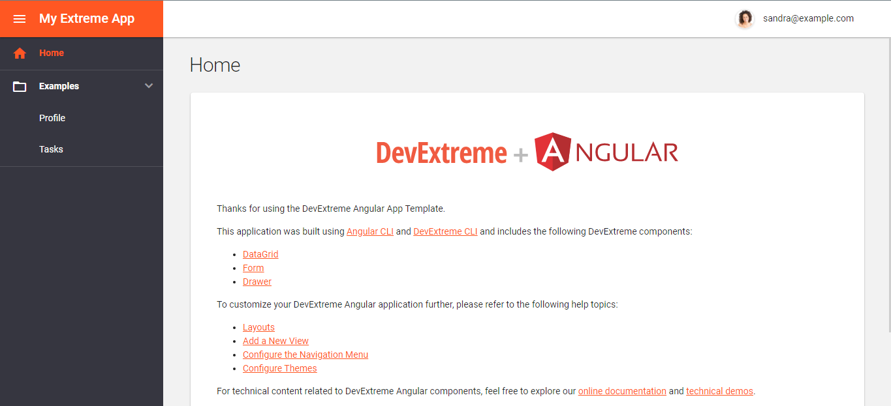
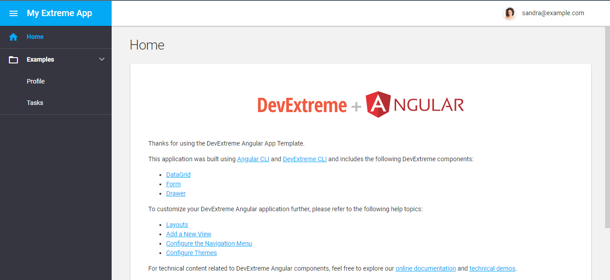

### Building Web Applications With DevExtreme

Building Web applications from scratch as a Web developer can be painful and time-consuming.

As web developers, we want to build fast and responsive web applications. Since we are always implementing the same UI component in every project, Components like authentication, headers, user menu, footer, Navigation e.t.c. so why start over and over again. DevExtreme is here to take all the pain away. Devextreme is one of the [DevExpress](https://www.devexpress.com/) components. It includes the collection of high-performance and responsive UI widgets which can be used to build both mobile and web applications.

DevExtreme mainly works with Javascript frameworks which are Angular, React jQuery & Vue. It can also be used with technologies like ASP.NET MVC, Knockout & ASP.NET Core. It is fast and easy to use cause of its ready-built responsive UI components e.g. Interactive charts components, Data editors, Drop Down Box, and much more. DevExtreme can also be added to existing applications. [Read More](https://js.devexpress.com/). 

### When to use Devextreme
**Note** DevExtreme is recommended when building a CRM system or robust Application. Else it's not a good choice when building simple websites or apps due to heavy bundled template size. 

### Prerequisites
To understand this article basic knowledge of the following are required.
- JavaScript frameworks (React, Angular, Vue & jQuery).
- APP Templating.
- Visual Studio Code/Visual Studio (Recommended)

### DevExtreme UI Components
DevExtreme has several ready-built, interactive UI components for you to build your next application easily. Examples are Data Tables, Charts, Data Reporting Tools, Autocomplete, File Manager, File Uploader  Button, Box, Accordion e.t.c. With all these ready-built components building applications are very easy, fast and fun using DevExtreme.  [Read more](https://js.devexpress.com/Documentation/Guide/UI_Components/).

I recommend you try to use DevExtreme with your favorite Javascript framework so you can make use of these awesome reactive components.

### Download DexExpress
To finally use Devextreme you have to download [DevExpress](https://www.devexpress.com/) cause it's one of the Devexpress components. [Click to download](https://js.devexpress.com/Download/)

**Note** DevExpress is not free, but for start, you can use the free trial version.

### Requirements for DevExtreme
- Node.js v12.6.0 or later
- npm v6.2.0 or later

### DevExtreme CLI Installation
Run the command in your terminal.
1. Run `npm i -g devextreme-cli` (Note: This command will install the CLI Globally. Alternatively execute this command [npx](https://www.npmjs.com/) to call the CLI command without global installation)

### Creating DevExtreme Application
The way we create Devextreme application is quite different depending on the javascript framework we are using [React.js, Angular & Vue.js]

**Note** to fully understand this lesson you must be familiar with the basic concept and patterns of the framework you want to use. For beginners, I suggest you use the free trial first so you get yourself familiar with DevExteme and its components.

### For React Application
```bash
 1. npx -p devextreme-cli devextreme new react-app application-name
 2. cd application name
 3. npm run start
```
- [Documentation](https://js.devexpress.com/Documentation/Guide/React_Components/Create_a_DevExtreme_Application/)

### For Angular Application
```bash
 1. npx -p devextreme-cli devextreme new angular-app application-name
 2. cd application name
 3. npm run start
```
- [Documentation](https://js.devexpress.com/Documentation/Guide/Angular_Components/Getting_Started/Create_a_DevExtreme_Application/)

### For Vue Application
```bash
 1. npx -p devextreme-cli devextreme new vue-app application-name
 2. cd application name
 3. npm run start
```
- [Documentation](https://js.devexpress.com/Documentation/Guide/Vue_Components/Create_a_DevExtreme_Application/)

### For the demonstration purpose in this tutorial I will create a DevExtreme application using my favorite JS framework Angular.

- To create my Angular app firstly I have to run 
```bash
npx -p devextreme-cli devextreme new angular-app my-extreme-app

```
- After the installation, I have to cd into the project
```bash
cd my-extreme-app

```
- to start my application
```bash
npm run start

```
To view your DevExtreme template. DevExtreme runs on default port `http://localhost:4200/` so check the URL on your favorite browser. Always remember to go through the ReadMe file before starting the application in case of any change or update. 

**Note** DevExtreme application template comes with Drawer, Data Grid, and forms Components.

### Default Template View



### DevExtreme ThemeBuilder
Manipulating DevExtreme is really easy. The ThemeBuilder is a tool that allows you to customize themes based on the DevExtreme default theme. [DevEtreme ThemeBuilder](https://devexpress.github.io/ThemeBuilder/).
 To configure the template theme open `src\themes\metadata.additional.json` and `src\themes\metadata.base.json` in the template,  edit the theme name in the json file. By default, the theme is orange as you can see in the image above. So I changed mine to blue in the two json files.
```bash
{
  "items": [],
  "baseTheme": "material.blue.light",
  "assetsBasePath": "../../../node_modules/devextreme/dist/css/",
  "outputColorScheme": "base",
  "base": true
}
```

```bash
{
 {
  "items": [],
  "baseTheme": "material.blue.dark",
  "assetsBasePath": "../../../node_modules/devextreme/dist/css/",
  "outputColorScheme": "additional",
  "makeSwatch": true,
  "base": true,
  "widgets": [
    "treeview",
    "navbar"
  ]
}
}
```


As you can see above I changed mine to blue. [Click](https://js.devexpress.com/Documentation/Guide/Themes_and_Styles/Predefined_Themes/) to view DevExtreme predefined themes using Material Designs themes and Generic Compact.

### Conclusion
DeveExtreme is one of DevExpress Components which works with javascript frameworks [React, Angular, Vue & jQuery] to build fast responsive Web or Mobile applications. It has a lot of ready-built UI Components and other awesome features it is fast easy to use and well documented. 
I suggest you read more about [DevExpress](https://docs.devexpress.com/)  

### Further reading
[DevExpress Documentation](https://docs.devexpress.com/)
[The DevExtreme Documentation](https://js.devexpress.com/Overview/)

