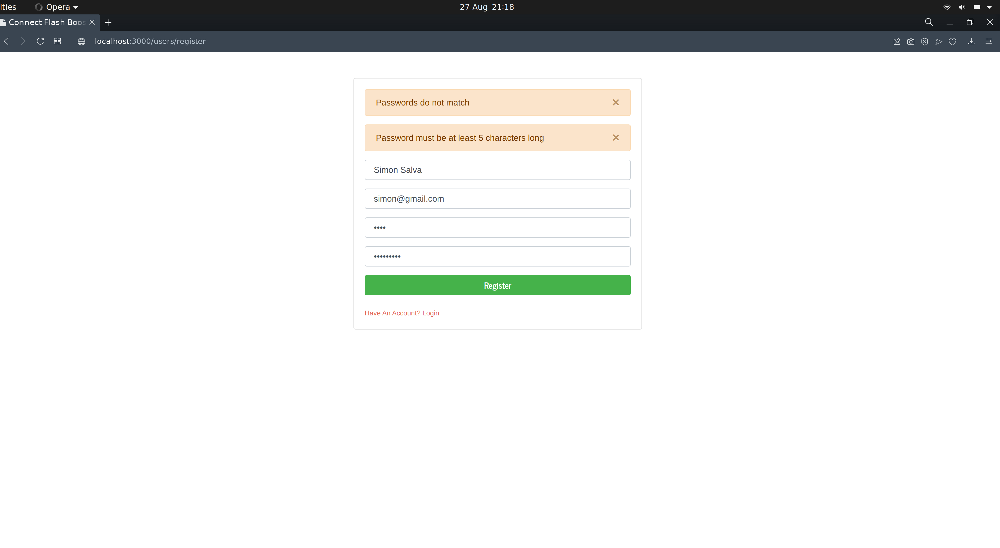
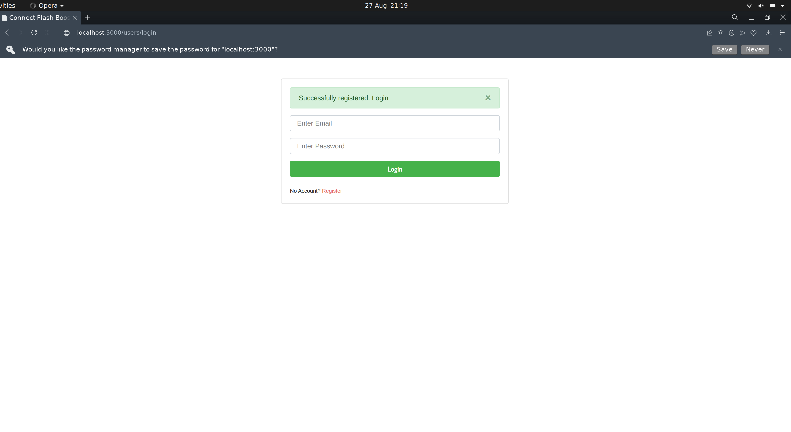
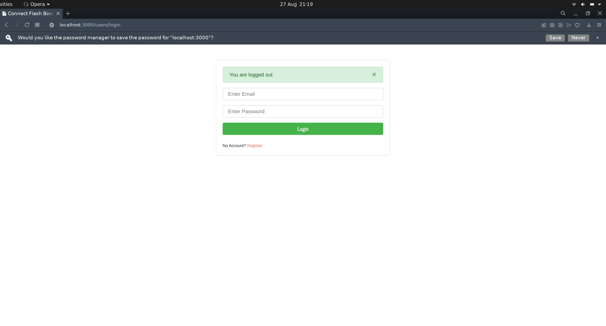

### Introduction
This article aims at exploring `express-session`, `connect-flash`, `passport`, and `bootstrap` modules and demonstrating their functionality in a single application. We will build a login system based on `Passport authentication`,  manage our sessions using `express sessions` and, show flash messages using `connect-flash` with `Bootstrap` styling.

### Prerequisites
To follow along, the reader needs to have the following.
- Have [Node.js](https://nodejs.org/) installed on your computer.
- A suitable code editor, preferably [VS Code](https://code.visualstudio.com/download).
- Basics of MongoDB database

### Installing dependencies
Execute the command below in the terminal.

```bash
npm install express passport passport-local bcryptjs ejs express-ejs-layouts mongoose connect-flash express-sessions 

npm i -D nodemon
```

### Setting app, the entry point
We begin by setting up the entry point as `main.js` and importing the dependencies as  below:

```js
const express  = require('express')
const app = express()
const passport = require('passport');
const expressLayouts = require('express-ejs-layouts')
const flash = require('connect-flash');
const session = require('express-session');
```

### Project setup
We will have a separate folder for our routes, so create a folder called `routes` in the application's root folder. In the routes' folder, create two files named `index.js` and `users.js`. The authentication requests will go to the `user.js`  while other requests will go to the `index.js` route.

Create another folder called `views`. This folder will contain our view files that will be rendered to the user on the screen. In the folder, add the following files. The `login.ejs` `register.ejs` `layout.ejs` and `dashboard.ejs`. 

When a user navigates to the index route of the project, he will be redirected to the welcome page, which renders the `welcome.ejs` file. From there, he chooses to log in or register a new account. Once the user is successfully registered, he can log in, he then he is redirected to the dashboard page.

In the `login.ejs`, we have a form that submits user email and password for authentication, as the snippets below illustrate.

```html
 <form action="/users/login" method="POST">
    <div class="form-group">
        <input  type="email"  id="email" name="email" class="form-control" placeholder="Enter Email" />
    </div>
    <div class="form-group">
        <input type="password" id="password"  name="password" class="form-control" placeholder="Enter Password" />
    </div>
    <button type="submit" class="btn btn-success btn-block">Login</button>
</form>
```

For the registrations page, we will have a form that submits users data to the database generated by the following snippets/

```html
<form action="/users/register" method="POST">
    <div class="form-group">
        <input type="name" id="name" name="name" class="form-control" placeholder="Enter Name" value="<%= typeof name != 'undefined' ? name : '' %>" />
    </div>
    <div class="form-group">
        <input  type="email" id="email"  name="email" class="form-control"  placeholder="Enter Email"   value="<%= typeof email != 'undefined' ? email : '' %>" />
    </div>
    <div class="form-group">
        <input type="password" id="password" name="password" class="form-control" placeholder="Create Password" value="<%= typeof password != 'undefined' ? password : '' %>" />
    </div>
    <div class="form-group">
        <input type="password" id="password2" name="password2" class="form-control" placeholder="Confirm Password" value="<%= typeof password2 != 'undefined' ? password2 : '' " />
    </div>
    <button type="submit" class="btn btn-success btn-block">
        Register
    </button>
</form>
```

### Connecting to database
Since the application will use Mongo Atlas, we will create a connection string and store it into a file. First, create a directory in the root directory of the application called `config`. In the created folder, add two files named `connection.js` and `config.env`.

The `config` file contains environmental variables that are uniform throughout the application. This file restores our connection string and the port in which our application will run.

```js
PORT = 5000
MONGO_URI = 'YOUR CONNECTION STRING'
```

The `connection.js` file will contain the `connection function`. The function is responsible for creating a connection between the application and the remote database using the database URL in the config file. We export this function to the application's entry point such that the database is connected as the server is set up.

```js
const mongoose = require('mongoose')

//connnect to database
const connectDB = async () => {
    try {
        const conn = await mongoose.connect(process.env.MONGO_URI, {
            useNewUrlParser: true,
            useUnifiedTopology: true,
            useFindAndModify: false,
        })
        console.log(`MongoDB Connected: ${conn.connection.host}`)
    } catch (err) {
        console.error(err)
        process.exit(1)
    }
}

module.exports = connectDB
```

### Creating the user model
Models define how database records look like. For our case, users will keep a record of the emails, usernames, and passwords. These fields need to appear in the user model and the database as well. In the root folder of the application, create a new folder called `models`. Create a new file called `user.js` in the' models' folder, then add the snippet below.

```js
const mongoose = require('mongoose');

//user schema
const UserSchema = new mongoose.Schema({
    name: {type: String, required: true },
    email: {type: String, required: true },
    password: {type: String, required: true },
    date: {type: Date, default: Date.now }
});

const User = mongoose.model('User', UserSchema);

//export user model
module.exports = User;
```

### Registration of users
In this face, we will register users by collecting the data from the form defined before. Since we are collecting data from a form, we need to use body-parser middleware as below.

```js
//Body parser
app.use(express.urlencoded({ extended: false}))
```

Next, we need to set up a register-handler that collects the form data from the request made in the front end. In the first step, the registration route extracts the form data from the request body then check if the form data are entered correctly.

```js
//registration handler
router.post('/register', (req, res) =>{

    //extract the data from request body
    const { name, email, password, password2 } = req.body;
    let errors = []

    //validation
    if (!name || !email || !password || !password2) {
        errors.push({ msg: 'Please enter all fields in the form' });
    }

    if (password != password2) {
        errors.push({ msg: 'Passwords do not match' });
    }

    if (password.length < 5) {
        errors.push({ msg: 'Password must be at least 5 characters long' });
    }

    if (errors.length > 0) {
        res.render('register', { errors, name, email,  password, password2  });
    }else{
        //Check if the user exists
    }
})

```

After the form validation is passed, we need to check if the email submitted by the user already exists in the database or not. If the email exists, we push the error to the errors array, then render the registration page with the errors.

```js
User.findOne({email: email}).then(user =>{
    if(user){
        errors.push({msg: 'Email already in the database'})
        res.render('register', {  errors,  name, email,  password,   password2 })
    }else{

        //hash the password and register the user
    }
})
```

If the supplied email is unique, `bcryptjs` hashes the password. Saving a plain text password is a security risk, so we hash the password to avoid system breaches. After hashing, the user instance is saved to the database, then the user is redirected to the login page.


```js
const newUser = new User({name, email, password});

bcrypt.genSalt(10, (err, salt) =>{
    bcrypt.hash(password, salt, (err, hash) => {
        if(err){
            throw err;
        }else{
            newUser.password = hash
            newUser.save().then(user =>{
                req.flash('success_msg', 'Successfully registered. Login')
                res.redirect('/users/login')
            }).catch(err =>{
                console.log(err)
            })
        }
    })
})
```


### Implementing connect-flash module
At the moment, we are passing the errors to a view that will render on the registration page. However, we want to store the messages in a session to display them after a redirect is done. This operation requires the `connect-flash` middleware.

```js
const flash = require('connect-flash');
const session = require('express-session');

// Express sessions
app.use(session({ secret: 'yoursecret', resave: true,  saveUninitialized: true }));

// Connect flash
app.use(flash());
```

To make every error appear in a different color, we create global variables and set up the colors for every error in the application's entry point just below where we defined connect flash.

```js
// Global variables
app.use(function(req, res, next) {
    res.locals.success_msg = req.flash('success_msg');
    res.locals.error_msg = req.flash('error_msg');
    res.locals.error = req.flash('error');
    next();
});
```

In the `messages.js` file, we check whether a message is a `success` or an `error` then render the respective alert. 

```html
<% if(typeof errors != 'undefined') { %>
    <% errors.forEach( error => { %>
        <div class="alert alert-danger alert-dismissible fade show" role="alert">
            <%= error.msg %>
            <button type="button" class="close" data-dismiss="alert" aria-label="Close">
              <span aria-hidden="true">&times;</span>
            </button>
          </div>
    <% })%>
<% } %>

<% if(success_msg != ''){ %>
    <div class="alert alert-success alert-dismissible fade show" role="alert">
      <%= success_msg %>
      <button type="button" class="close" data-dismiss="alert" aria-label="Close">
        <span aria-hidden="true">&times;</span>
      </button>
    </div>
<% } %>

<% if(error_msg != ''){ %>
    <div class="alert alert-danger alert-dismissible fade show" role="alert">
      <%= error_msg %>
      <button type="button" class="close" data-dismiss="alert" aria-label="Close">
        <span aria-hidden="true">&times;</span>
      </button>
    </div>
<% } %>
```



### Passport authentication setup
Create a new file called `passport.js` in the' config' folder, then add the snippet below.

```js
const LocalStrategy = require('passport-local').Strategy;
const bcrypt = require('bcryptjs');

// Load User model
const User = require('../models/User');
```
First, we need to bring in the `local strategy` and `mongoose` to find users in the database. In this case, we are using `bcrypt` to compare the password entered by the user during registration to the one entered during login. 

The passport needs to check email and password, then tries to find a user with the same email. If there exists a record of a user with the same email, then the supplied password is compared against the user's password to see if there is a match; if the password is similar to the entered password, the passport authenticates the user. However, if the password is not similar an error is displayed to the user telling him to correct the email of the password.

```js
module.exports = function(passport) {
    passport.use(
        new LocalStrategy({ usernameField: 'email' }, (email, password, done) => {
            // find user with supplied email
            User.findOne({
            email: email
            }).then(user => {

                //user not found
                if (!user) {
                    return done(null, false, { message: 'Thhe email entered is not with our records' });
                }
        
                //use bcrypt to compare the passwords and validate
                bcrypt.compare(password, user.password, (err, isMatch) => {
                    if (err) throw err;
                    if (isMatch) {
                        return done(null, user);
                    } else {
                        return done(null, false, { message: 'Password entered is incorrect.' });
                    }
                });
            });
        })
    );
  
    passport.serializeUser(function(user, done) {
      done(null, user.id);
    });
  
    passport.deserializeUser(function(id, done) {
      User.findById(id, function(err, user) {
        done(err, user);
      });
    });
};
```
[Login validatrion](login-form-validation.png)

### Building the login module handler.
The login handler uses the Passport middleware to authenticate users. An authenticated user is redirected to the `home` route to see his account details. However, if the user is not authenticated, the system redirects him to the login page to correct their details and try again.

```js
//handling login
router.post('/login', (req, res, next) => {
    passport.authenticate('local', {
        successRedirect: '/home',
        failureRedirect: '/users/login',
        failureFlash: true
    })(req, res, next);
});
```

### Securing routes
We secure a route to make it inaccessible to unauthenticated users. For our case, the only route that can be secured is the `home` route. A user then needs to be authenticated in order to access the resources on this page. So first, we need to create a new file called `autheticate.js` in the `config` folder to secure the route, then add the snippet below.

```js
module.exports = {
    ensureAuthenticated: function(req, res, next) {
        if (req.isAuthenticated()) {
            return next();
        }
        req.flash('error_msg', 'Please log in to access the requested page');
        res.redirect('/users/login');
    },

    forwardAuthenticated: function(req, res, next) {
        if (!req.isAuthenticated()) {
            return next();
        }
        res.redirect('/home');      
    }
};
```

In the `index.js` file in the `routes` folder, add the code below to import the authentication and secure the `home` route.

```js
router.get('/home', ensureAuthenticated, (req, res) => {
    res.render('dashboard')
})
```

[User's homepage](homepage.png)

### Setting up the logout handler
The logout handler is responsible for signing out a user and destroying the session of the logged-in user. When users are logged in, their sessions are stored in a cookie that the logout handler destroys.

```js
//logout handler
router.get('/logout', (req, res) => {
    req.logout();
    req.flash('success_msg', 'You are logged out');
    res.redirect('/users/login');
});
```


### Conclusion
This article taught us how to use connect-flash to display error messages in a system, store the messages in express sessions, and style error messages using bootstrap. We implemented these concepts by building a complete authentication system based on the passport. This project should provide a head start for actively working on the authentication module of any node.js project.

You can find the source code for this application in [this.](link)
