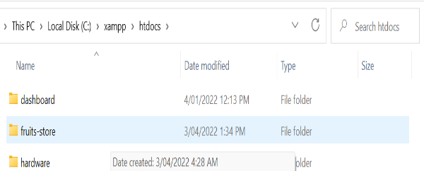

**CONTROLLING WEB PAGES VISIBLE TO DIFFERENT USERS USING PHP**

Different categories of users access a website at any given time.
Certain pages in a website are meant to be accessed by specific users.
For instance, web pages that are accessed by the system administrator
may not be the same as the pages which are accessed by the general
users. When deploying critical websites for banks and other
organizations with critical user details for example the Directorate of
criminal investigation website, protection of the pages is a must.

Due to this reason, it is important to protect certain web pages to
control user access. This article aims at educating the learner on how
they can ensure that their web pages are protected.

**Prerequisites**

To gain much from this tutorial, you will need to have the following:

-   Basic knowledge of HTML, CSS, and PHP.

-   An editor such as visual studio code or any other you prefer.

-   Localhost installed and working properly e.g., XAMPP.

-   Bootstrap 5 file (download at bootstrap.com)

**STEP 1: CREATING OUR PROJECTS FOLDER**

In Local Disk C, browse for a folder called "xampp" (Assuming you
installed xampp). Open this folder then browse and locate another folder
called "htddocs". Inside htdocs, create another folder and call it your
project's name. In this tutorial, I named the folder "fruits-store"

{width="6.5in" height="1.25in"}

Inside "fruits-store" create another folder and name it css. Inside CSS,
insert the bootstrap file you downloaded (i.e., bootstrap.min.css).
{width="6.5in" height="1.1375in"}

**STEP 2: ENSURE XAMPP IS WORKING CORRECTLY**

double-click on the XAMPP application and starts Apache and MySQL
services. Ensure these services are running normally without errors.

{width="6.5in" height="1.2875in"}

**STEP 3: OPENING THE PROJECT FOLDER IN YOUR EDITOR**

Open your preferred editor such as visual studio code. Browse for file
at the top of the editor then click on open folder. Browse inside your
Local Disk C\>\>xampp\>\>htdocs\>\>fruits-store (your project name
created in step 1) then select folder.

{width="6.5in" height="0.725in"}

**STEP 4: CREATE A HOME PAGE**

Insert the following code in your "home.php" file:

\<!DOCTYPE html\>

\<html lang=\"en\"\>

\<head\>

    \<meta charset=\"UTF-8\"\>

    \<meta http-equiv=\"X-UA-Compatible\" content=\"IE=edge\"\>

    \<meta name=\"viewport\" content=\"width=device-width,
initial-scale=1.0\"\>

    \<title\>home page\</title\>

    \<link rel=\"icon\" type=\"image/x-icon\"
href=\"images/logo.jfif\"\>

    \<link rel=\"stylesheet\" type=\"text/css\"
href=\"css/bootstrap.min.css\"\>

\</head\>

\<body\>

\<?php include \'nav.php\'?\>

     \

         \<h3 class=\"text-center\"\>welcome to our fruit store\</h3\>

         \<h2 class=\"text-center\"\>we deliver fruits to your door
step\</h2\>

     \</div\>

 \

     \

         \

            \

            \

            \<h4 class=\"card-title\"\>Apple\</h4\>

            \
Price: \$0.5\</p\>

            \<a href=\"#\" class=\"btn btn-primary\"\>Order\</a\>

            \</div\>

         \</div\>

         \

            \

            \

            \<h4 class=\"card-title\"\>Banana\</h4\>

            \
Price: \$0.3\</p\>

            \<a href=\"#\" class=\"btn btn-primary\"\>Order\</a\>

            \</div\>

         \</div\>

         \

            \

            \

            \<h4 class=\"card-title\"\>Grapes\</h4\>

            \
Price: \$2.5\</p\>

            \<a href=\"#\" class=\"btn btn-primary\"\>Order\</a\>

            \</div\>

         \</div\>

         \

            \

            \

            \<h4 class=\"card-title\"\>Strawberry\</h4\>

            \
Price: \$5.5\</p\>

            \<a href=\"#\" class=\"btn btn-primary\"\>Order\</a\>

            \</div\>

     \</div\>

 \</div\>

 

\</body\>

\</html\>

**STEP 5: CREATE CONTACT US PAGE**

Insert the following code in your "contact.php" file:

\<?php include \'protect.php\'?\>

\<!DOCTYPE html\>

\<html lang=\"en\"\>

\<head\>

    \<meta charset=\"UTF-8\"\>

    \<meta http-equiv=\"X-UA-Compatible\" content=\"IE=edge\"\>

    \<meta name=\"viewport\" content=\"width=device-width,
initial-scale=1.0\"\>

    \<title\>Contact us\</title\>

    \<link rel=\"icon\" type=\"image/x-icon\"
href=\"images/logo.jfif\"\>

    \<link rel=\"stylesheet\" type=\"text/css\"
href=\"css/bootstrap.min.css\"\>

\</head\>

\<body\>

\<?php include \'nav.php\'?\>

      \

          \

              \

                  \<form action=\"\"\>

                  \<h2\>send us a massage\</h2\>

                     \

                        \<label\>Name\</label\>

                        \<input type=\"text\" class=\"form-control
mb-4\" placeholder=\"text\"\>

                     \</div\>

                     \

                        \<label\>Subject\</label\>

                        \<input type=\"text\" class=\"form-control
mb-4\" placeholder=\"subject\"\>

                     \</div\>

                     \

                        \<label\>Subject details\</label\>

                        \<input type=\"text\" class=\"form-control
mb-4\" placeholder=\"subject details\"\>

                     \</div\>

                     \<button\>submit\</button\>

                  \</form\>

              \</div\>

             

          \</div\>

      \</div\>

\</body\>

\</html\>

**STEP 6: CREATE ABOUT US PAGE**

Insert the following code in your "about.php" file:

\<?php include \'protect.php\'?\>

\<!DOCTYPE html\>

\<html lang=\"en\"\>

\<head\>

    \<meta charset=\"UTF-8\"\>

    \<meta http-equiv=\"X-UA-Compatible\" content=\"IE=edge\"\>

    \<meta name=\"viewport\" content=\"width=device-width,
initial-scale=1.0\"\>

    \<title\>About us\</title\>

    \<link rel=\"icon\" type=\"image/x-icon\"
href=\"images/logo.jfif\"\>

    \<link rel=\"stylesheet\" type=\"text/css\"
href=\"css/bootstrap.min.css\"\>

\</head\>

\<body\>

\<?php include \'nav.php\'?\>

    \<h2 class=\"text-center\"\>about fruits vendor Ltd\</h2\>

    \

    \<p\>Lorem ipsum dolor sit amet consectetur adipisicing elit

        .Iste quas provident dolorum! Voluptate totam illum eum! Fugia

        t corrupti sint perspiciatis minus neque, cupiditate aperiam
saepe quisq

        uam asperiores illum itaque autem!\</p\>

    \<p\>

        Lorem ipsum dolor sit amet consectetur adipisicing elit.
Possimus

         quas minus autem tenetur neque quos ut sunt aliquid
reprehenderit magni nostrum, dol

        or culpa dolorum deleniti quidem libero pariatur quam explicabo!

    \</p\>

    \</div\>

\</body\>

\</html\>

**STEP 7: CREATE A REGISTRATION FORM**

The registration form will be used to store users' information in the
database. This information is used when the user wants to log in to the
system. Create a new file and name it "register.php"

Ensure the form action points to the action in the same file i.e.,
register.php, and the form method to be posted as it is a secure way to
send data.

In the form items, ensure each item has a name as the name will be
useful when accessing the database.

Copy the code below into your \"register.php" file

\<?PHP

     if(isset(\$\_REQUEST\[\"name\"\]))

     {

      \$name = \$\_REQUEST\[\"name\"\];

      \$email= \$\_REQUEST\[\"email\"\];

      \$phone = \$\_REQUEST\[\"phone\"\];

      \$password = \$\_REQUEST\[\"password\"\];

         \$password = password_hash(\$password, PASSWORD_BCRYPT);

     

    include \'connect.php\';

     \$sql = \"INSERT INTO \`clients\`(\`id\`, \`name\`, \`email\`,
\`phone\`, \`password\`) VALUES
(null,\'\$name\',\'\$email\',\'\$phone\',\'\$password\')\";

     mysqli_query(\$con,\$sql) or die(mysqli_error(\$con));

     

     header(\"location:home.php\");

     }

?\>

\<!DOCTYPE html\>

\<html lang=\"en\"\>

\<head\>

    \<meta charset=\"UTF-8\"\>

    \<meta http-equiv=\"X-UA-Compatible\" content=\"IE=edge\"\>

    \<meta name=\"viewport\" content=\"width=device-width,
initial-scale=1.0\"\>

    \<title\>Register\</title\>

    \<link rel=\"icon\" type=\"image/x-icon\"
href=\"images/logo.jfif\"\>

    \<link rel=\"stylesheet\" type=\"text/css\"
href=\"css/bootstrap.min.css\"\>

\</head\>

\<body\>

\<?php include \'nav.php\'?\>

   

\

         \

             \

\<form action=\"register.php\" method=\"post\" class=\"mb-5 mt-5
rounded-top rounded-bottom form-group\"\>

   \

   \

   \

   \<h3\>Fruits vendors Ltd\</h3\>

   \</div\>

   \<h4\>Registration form\</h4\>

   \</div\>

\

  \<label\>Enter Your Name\</label\>

  \<input type=\"text\" class=\"form-control mb-4\" placeholder=\"name\"
name=\"name\" required\>

\</div\>

\

  \<label\>Enter Your Email\</label\>

    \<input type=\"email\" class=\"form-control mb-4\"
placeholder=\"email\" name=\"email\" required\>

\</div\>

\

   \<label\>Enter Your Phone Number\</label\>

   \<input type=\"tel\" class=\"form-control mb-4\"
placeholder=\"phone\" name=\"phone\" required\>

\</div\>

\

   \<label\>Set Password\</label\>

   \<input type=\"password\" class=\"form-control mb-4\"
placeholder=\"password\" name=\"password\" required\>

\</div\>

 

\<button class=\"btn btn-block col-sm-4 btn-outline-info
btn-control\"\>register\</button\>

\</form\>

\</div\>

\</div\>

\</div\>

\</body\>

\</html\>

**STEP 8: CREATE A DATABASE**

On your browser type localhost and on the page that loads afterward,
click on "phpMyAdmin". On the page that loads afterward, click on new
then enter database name i.e., fruits-store, then create.

{width="6.5in" height="1.1729166666666666in"}

Inside this database, create a table a call its "clients". It should
have the fields:

Id - (type INT, primary key),

name - (type CHAR, size 50),

email - (type VARCHAR, size 50),

phone - (type VARCHAR, size 30)

password - (type VARCHAR, size 100)

After saving the clients table, select the phone and the email field and
make them unique. This is done to ensure that the same email or phone
number cannot be entered twice.

{width="6.5in" height="1.5347222222222223in"}

**STEP 8: CREATING A DATABASE CONNECTION**

Create a new PHP file and name it "connect.php". the essence of creating
this file is that it will save us time and help us to avoid repetition
of the same code in any files.

Create a variable called con that will be used to store the connection.
mysqli_connect in a build in php function used for connections to the
database. It takes four parameters i.e., name of host, username,
password and database name.

\<?php

  \$con = mysqli_connect(\"localhost\", \"root\", \"\",
\"fruits-store\") or die(mysqli_connect_error());

?\>

**STEP 9: CREATE A NAVIGATION PAGE**

Navigation plays a very important role here as to some extent it will be
used to determine the pages which will be visible by different users who
visit the website. In addition, navigation between the pages will be
very easy and faster.

Create a PHP file and name it "nav.php". copy this code and use it in
the nav.php file that you have created.

Include this file in all the pages, right after the body tag in your
html.

\<nav class=\"navbar navbar-expand-sm navbar-light bg-info p-2 mb-5\"\>

  \

      \<a class=\"navbar-brand d-block mx-auto text-center\"
href=\"home.php\"\>

          \

          \<h4 class=\"vollkorn text-white\"\>fruits vendor Ltd\</h4\>

      \</a\>

       \<button class=\"navbar-toggler\" type=\"button\"
data-bs-toggle=\"collapse\" data-bs-target=\"#mynavbar\"\>

          \\</span\>

       \</button\>

    \

      \<ul class=\"navbar-nav ms-auto px-4\"\>

     

        \<li class=\"nav-item\"\>

          \<a class=\"nav-link link-success\"
href=\"home.php\"\>Home\</a\>

        \</li\>

        \<li class=\"nav-item\"\>

          \<a class=\"nav-link link-primary\"
href=\"contact.php\"\>contact us\</a\>

        \</li\>

        \<li class=\"nav-item\"\>

          \<a class=\"nav-link link-primary\" href=\"about.php\"\>about
us\</a\>

        \</li\>

        \<li class=\"nav-item\"\>

          \<a class=\"nav-link link-primary\"
href=\"register.php\"\>Register\</a\>

        \</li\>

       

        \<li class=\"nav-item\"\>

          \<a class=\"nav-link link-primary\"
href=\"login.php\"\>login.php\</a\>

        \</li\>

          \<li class=\"nav-item\"\>

          \<a class=\"nav-link link-primary\"
href=\"logout.php\"\>logout\</a\>

        \</li\>

      \</ul\>

    \</div\>

  \</div\>

\</nav\>

**STEP 9: CREATE A LOGIN FORM**

We now want to implement login so that it will be used to control web
page user access. Certain pages will not be accessible before logging
into the system while others will be visible even before logging into
the system after implementation full implementation of the login
functionality.

To get started with the login form paste the following code into your
"login.php" file;

\<!DOCTYPE html\>

\<html lang=\"en\"\>

\<head\>

    \<meta charset=\"UTF-8\"\>

    \<meta http-equiv=\"X-UA-Compatible\" content=\"IE=edge\"\>

    \<meta name=\"viewport\" content=\"width=device-width,
initial-scale=1.0\"\>

    \<title\>login\</title\>

    \<link rel=\"icon\" type=\"image/x-icon\"
href=\"images/logo.jfif\"\>

    \<link rel=\"stylesheet\" type=\"text/css\"
href=\"css/bootstrap.min.css\"\>

\</head\>

\<body class=\"bg-light\"\>

\<?php include \'nav.php\'?\>

     \

         \

       

             \

             \

                        \

                            \

                            \<h3 class=\"vollkorn\"\> Fruits Vendor
Ltd\</h3\>

                        \</div\>

                        \<h4\>Login\</h4\>

             \</div\>

                 \<form action=\"login.php\" method=\"post\"
class=\"mb-5 mt-5 rounded-top rounded-bottom\"\>

                    \

                        \<label\>Enter Your Email\</label\>

                        \<input type=\"email\" class=\"form-control
mb-4\" placeholder=\"email\" name=\"email\" required\>

                    \</div\>

                    \

                        \<label\>Enter Your Password\</label\>

                       \<input type=\"password\" class=\"form-control
mb-4\" placeholder=\"password\" name=\"password\" required\>

                    \</div\>

                   

                    \

                        \

                            \

                                 \<button class=\"btn btn-control
btn-outline-info btn-block col-sm-4\"\>login\</button\>

                            \</div\>

                            \

                                 \
Don\'t have
an account? \</p\>

                                 \<a href=\"register.php\"
class=\"signin\"\>register\</a\>  

                            \</div\>

                        \</div\>

               \</div\>

                 \</form\>               

             \</div\>

         \</div\>

     \</div\>

\</body\>

\</html\>

**STEP 10: IMPLEMENTING LOGIN FUNCTIONALITY**

Now let's implement the functionality of the login form that will be
fetching the login details of the user from the database and verifying
if its correct before allowing user to view certain web pages.

At the start of your login.php file, include the code below;

\<?php

  if(isset(\$\_REQUEST\[\"password\"\]))

{

 \$email = \$\_REQUEST\[\"email\"\]; checking and retrieving email

 \$password = \$\_REQUEST\[\"password\"\];

 include \'connect.php\';

//retrieve one record that matches the email

//check the password hash

//store data in a session

//preparing the query so that hacking the database becomes difficult

 \$query = mysqli_prepare(\$con, \"SELECT \* FROM \`clients\` WHERE
email = ?\");

 mysqli_stmt_bind_param(\$query, \"s\", \$email);

 mysqli_stmt_execute(\$query);

 \$result = mysqli_stmt_get_result(\$query);

//checking number of rows that are stored in the result variable

 if(mysqli_num_rows(\$result) == 1){ //counting number of rows in result

      \$client = mysqli_fetch_assoc(\$result);

      \$hash = \$client\[\"password\"\]; //retrieving the encrypted
password

    if(password_verify(\$password, \$hash)){ //compare the password user
provided and the hash password. If the passwords matches then the user
can login. If they do not match then an error message is displayed using
a cookie

//storing user information in a session

         session_start();

         \$\_SESSION\[\"name\"\] = \$customer\[\"name\"\];

         \$\_SESSION\[\"id\"\] = \$customer\[\"id\"\];

         \$\_SESSION\[\"logged_in\"\] = true;

         

         header(\"location:home.php\");

            //success

    }else{

//if the number of rows is not one then show this message

        setcookie(\"error\", \"wrong username or password\", time()+3);

    }

 }else{

//if the password provided by user and hash do not match

     setcookie(\"error\", \"wrong username or password\", time()+3);

 }

}

?\>

To this point, the login should be working perfectly fine.

**STEP 11: PROTECTING FILES FROM UNAUTHORIZED ACCESS**

Create a new file and name "protect.php". This file checks if the
session exists meaning that the user has already logged in. if the
session is not found this file will redirect the user to the login page.
This also protects certain files from being accessed by unauthorized
users. In this case, you cannot access a page if you are not logged in,
it will always redirect you to the login page. To prove this try it on
another browser, not the one you logged in earlier.

Copy the code below and paste it your "protect.php" file.

\<?php

  session_start();

//checking if the session exists

//if the session is not set it redirects the user to the login form/page

  if(! isset(\$\_SESSION\[\"logged_in\"\]))

  {

      header(\"location:login.php\");

  }

?\>

When we want to protect a file, we include this file at the start of the
file you want to protect. Use this code to accomplish this task.

\<?php include \'protect.php\'?\>

**STEP 12: CREATE A LOGOUT PAGE**

Insert the following code in "logout.php" file:

\<?php

session_start();

session_destroy();

header(\"location:login.php\");

**STEP 13: HIDING CERTAIN WEB PAGES**

Now we have to include an if statement in our "nav.php" file which will
ensure that a user cannot access certain pages if they are not logged
in.

Assuming that you have created all the pages you need for your website,
in our case, we have a home, login, logout, register, contact, and about
page. We want to make the login, home, and register page accessible even
when one is not logged into the system. Logout, contact, and about pages
will only be visible when a user has logged in. In addition, home and
register pages will also be visible even after login into the system.

In the "nav.php" file, "contact.php", "about.php", and "logout.php"
should be enclosed in an if statement which will check if the session
\["logged_in"\] exists first. If it exists, these pages can be accessed.

\<?php if (isset(\$\_SESSION\[\"logged_in\"\])): ?\>

        \<li class=\"nav-item\"\>

          \<a class=\"nav-link link-primary\"
href=\"contact.php\"\>contact us\</a\>

        \</li\>

        \<li class=\"nav-item\"\>

          \<a class=\"nav-link link-primary\" href=\"about.php\"\>about
us\</a\>

        \</li\>

        \<li class=\"nav-item\"\>

          \<a class=\"nav-link link-primary\"
href=\"logout.php\"\>logout\</a\>

        \</li\>

\<?php endif; ?\>

Furthermore, if the session is not set, we direct the user to the
"login.php" page. Modify "nav.php" under "login.php" by enclosing in an
if statement as follows:

\<?php if (! isset(\$\_SESSION\[\"logged_in\"\])): ?\>

        \<li class=\"nav-item\"\>

          \<a class=\"nav-link link-primary\"
href=\"login.php\"\>login\</a\>

        \</li\>

       

        \<?php endif; ?\>

By correctly following the steps above, you will have achieved
controlling web pages visible to different users.
