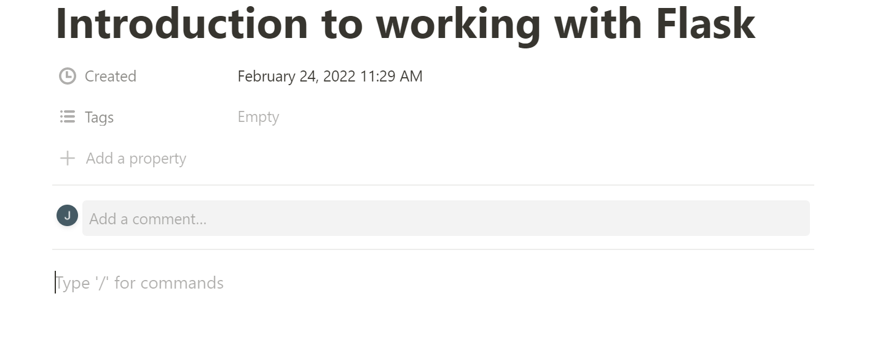

Next.js has been used to create Server-side Rendering" (SSR) and "Static Site Generation" (SSG) apps using JavaScript. This means the app fetches extra data from the server after the browser loads the website's HTML page. Technologies such as SSG often have to rebuild the app when data from the source is updated and render it to the user at build time—making the site load even faster. Hence good user experiences.

This guide will help you learn how to use Next.js with Notion API and create a blog app powered by Typescript code.

### Prerequisites

To continue with this article, it is helpful to have the following:

- [Node.js](https://nodejs.org/en/) installed on your computer.
- Basic knowledge working with Typescript and Next.js.

### Overview

- [Prerequisites](#prerequisites)
- [Overview](#overview)
- [Setting up the database on Notion](#setting-up-the-database-on-notion)
- [Setting up an integration on Notion](#setting-up-an-integration-on-notion)
- [Setting up the Next.js application](#setting-up-the-nextjs-application)
- [Querying multiple posts](#querying-multiple-posts)
- [Querying single post](#querying-single-post)

### Setting up the database on Notion

First, create a notion account. If you already have an account, just [login](https://www.notion.so/login) or [register](https://www.notion.so/login) a new account.

Once you have created an account, Hover over the `Getting Started` section of the dashboard page and click on the plus icon to add a new notion page. On the resulting popup, under `Database`, click on `list`. A sample skeleton will be loaded. Go ahead and enter a project title.


Navigate to the first default page, `page 1` and click on it. Change the title to fit your page preferences. For example:


  
Change the icon and cover image too. You can choose to use free images from [Unsplash](https://unsplash.com/). To add this cover image, hover over just above the page title and click the `Add cover` button.


Every new page you create is a blank canvas where you can add whatever content you like, such as plain text, lists and images, etc. To add content to this page, scroll down to the content section and add some `prerequisites` to your blog page as shown below:




Add dummy body to the post body:


Add an image. Select an image of your choice from [Unsplash](https://unsplash.com/):


Append some conclusions:


Click outside the modal when done. Your post should now be listed as shown below:


Feel free to add as many posts as you can while following the same steps described above.

### Setting up an integration on Notion

Navigate to the `Settings & Members` section of your notion dashboard page. On the resulting modal, Click `Integrations` under the `Workspace` section. Then set the notion integration as shown in the following steps:


First, create a new integration. To do so, click on `Develop your Integration`. Then Click the plus bur=toon to set up a new integration:


Name your integration `blog_app_integration`, then click `Submit` to set it up. Once done, you should now be able to view your notion integrations settings, i.e., the integration token:

To save this integration, scroll down and click Save changes. This will reveal your notion integration key. Copy this key so that you can use it later to connect to Next.js


Go back to the workspace you created in the previous step, where you created your pages, i.e., `Latest posts`, and click on `Share`:


Click on Invite. On the resulting modal, you should be able to see the integration you just created:


Click on the `blog_app_integration` integration, and then `Invite` to add your pages to this new notion integration.


With that, you will be able to access your workspace using the integration-generated token.

### Setting up the Next.js application

To set up a Next.js project, create a project folder where you want your app to live. Then run the following command to bootstrap the application inside the created directory:

```bash
npx create-next-app blog_app --ts
```

The `--ts` flag allows your app to run using Typescript.

This will create a basic Next.js app inside the folder `blog_app`. Once the process is done, navigate to the `blog_app` folder using the command `cd blog_app` and install the notion client package:

```bash
npm install @notionhq/client
```

On the project root folder, create a `.env` file. This file will host the notion integration key that Next.js needs to access and connect with the notion API. Go ahead and add the host two notion variables, the integration token key and the database id:

```bash
NOTION_KEY=""
NOTION_DATABASE=""
```

Paste the integration key you copied earlier and add it to the `NOTION_KEY`. If you didn't copy this key, navigate to the integration page, under `Secrets`, Click on `Show` and then `Copy` and paste it in the `NOTION_KEY` entry.

To get the `NOTION_DATABASE` ID, check your workspace page URL. Copy the first path parameter before the query parameter as shown in the illustration below:

```bash
https://www.notion.so/your_database_id?v=some_long_hash
```

Start the development server to test if the set app is working as expected. To do so, run the following command:

```bash
npm run dev
```

On your browser, open `http://localhost:3000`, you should be able to view the default Next.js page.

### Querying multiple posts

On the project root folder, create a folder `lib`. Inside `lib`, create a file `notion.ts`. Then add the following code to querying multiple posts from the notion API.

Start by importing the notion client package:

```ts
import {Client} from '@notionhq/client';
```

Instantiate the notion client using your notion integration key:

```ts
const client = new Client({
   auth: process.env.NOTION_KEY,
});
```

Define a function to get the posts. This function processes and queries the list of posts from the notion database:

```ts
async function posts() {
   const myPosts = await client.databases.query({
     database_id: process.env.NOTION_DATABASE,
   });
   return myPosts;
}
```

Export an object with the function. This export will make the function accessible by other files inside your project:

```ts
export {
   posts
}
```

On `pages/index.tsx`, import the function you have defined above and the Next.js Link dependencies:

```ts
import Link from 'next/link';
import {posts} from '../lib/notion'
```

Then fetch the posts from the server-side using the Next.js `getServerSideProps()` function;

```ts
export async function getServerSideProps() {
   // Get the posts
   let { results } = await posts();
   // Return the result
   return {
     props: {
       posts: results
     }
   }
}
```

Define an interface for the props. This creates the structure of `posts` ad holds the array of posts:

```ts
interface Props {
   posts: [any]
}
```

To show the list of posts, render the posts to the view that lists down the fetch the posts from the server-side:

```html
const Home: NextPage<Props> = (props ) => {
   return (
     <div className={styles.container}>
     <Head>
       <title>Latest posts</title>
     </Head>

     <main className={styles.main}>
       <h1 className={styles.title}>
       Latest posts
       </h1>
       {
         props.posts.map((result,index) => {
         return (
           <div className={styles.cardHolder} key={index}>
           <Link href={`/posts/${result.id}`}>
             <Image src={result.cover.external.url} width={300} height={200} />
           </Link>
           <div className={styles.cardContent}>
             <Link href={`/posts/${result.id}`}>
             <a className={styles.cardTitle}>{
             result.properties.Name.title[0].plain_text
             }</a>
             </Link>
           </div>
           </div>
           )
         })
       }
     </main>

     <footer className={styles.footer}>
       <p>Blog application</p>
     </footer>
     </div>
   )
}
```

Add the following styles to `styles/Home.module.css`. This will style the listed of the fetched posts:

```css
.cardHolder {
   display: flex;
   width: 40%;
   margin: 10px auto;
   justify-content: space-between;
   padding: 10px;
   border: 1px solid #d4d4d4;
}

.cardContent {
   width: 100%;
   display: flex;
   align-items: center;
   justify-content: center;
}
```

To test this, ensure your development server is up and running. You should now be able to view your posts on the home page.


### Querying single post

Let’s create a function that will help you fetch a single post from the notion database. Navigate to the `lib/notion.ts` file and add a function to get a single post based on the post id as shown below:

```ts
async function post(id: string) {
   const myPost = await client.pages.retrieve({
     page_id: id,
   });
   return myPost;
}
```

Add another function inside the `lib/notion.ts` file. A post has other properties such as prerequisites and conclusion, which can be referred to as the children's properties of a particular post. Create a function `blocks()` to get the children (blocks) of a particular post:

```ts
async function blocks(id: string) {
   const myBlocks = await client.blocks.children.list({
     block_id: id
   });
   return myBlocks;
}
```

Export the functions `post()` and `blocks()`. This exports them and makes the functions accessible by other files inside your project:

```ts
export {
   posts,
   post,
   blocks
} 
```

On the root folder, create a `posts` folder. Inside it, create an `[id].tsx` file. This file will serve the dynamic post based on the parameter id. In `[id].tsx`, add the following imports:

```ts
import { GetStaticProps, NextPage, GetStaticPaths } from 'next';
import Image from 'next/image';
import Head from 'next/head';
import Link from 'next/link';
import { ParsedUrlQuery } from 'querystring';
import { post, posts, blocks } from '../../lib/notion';
import styles from '../../styles/Home.module.css';
```

Implement an interface for this context. This will be applied when getting the dynamic id:

```ts
interface IParams extends ParsedUrlQuery {
   id: string
}
```

Get the dynamic post and the children properties from the server-side:

```ts
export const getStaticProps: GetStaticProps = async (ctx) => {
   let { id } = ctx.params as IParams; 
   // Get the dynamic id
   let page_result = await post(id); 
   // Fetch the post
   let { results } = await blocks(id); 
   // Get the children
   return {
     props: {
       id,
       post: page_result,
       blocks: results
     }
   }
}
```

Implement the paths for fetching all posts using `getStaticPaths`. Then map the results using the parameter id. This will help Next.js to go through every fetched post and display it based on its dynamic id:

```ts
export const getStaticPaths: GetStaticPaths = async () => {
   let { results } = await posts(); 
   // Get all posts
   return {
     paths: results.map((post) => { 
       // Go through every post
       return {
         params: { 
           // set a params object with an id in it
           id: post.id
         }
       }
     }),
     fallback: false
   }
} 
```

Implement an interface for the `Props`:

```ts
interface Props {
   id: string,
   post: any,
   blocks: [any]
}
```

Implement a function to render each child. A single post has a heading, a hero image, the post content and an unordered list of items. This function will help render them to from the server.

```ts
const renderBlock = (block: any) => {
   switch (block.type) {
     case 'heading_1': 
     // For a heading
       return <h1>{ block['heading_1'].text[0].plain_text } < /h1> 
     case 'image': 
     // For an image
       return <Image src={ block['image'].external.url } width = { 650} height = { 400} />
       case 'bulleted_list_item': 
       // For an unordered list
       return <ul><li>{ block['bulleted_list_item'].text[0].plain_text } < /li></ul >
       case 'paragraph': 
       // For a paragraph
       return <p>{ block['paragraph'].text[0]?.text?.content } < /p>
     default: 
     // For an extra type
       return <p>Undefined type < /p>
   }
}
```

Implement the view to render the post. Once the post has been rendered, create a view that will display the post to the user as shown below:

```js
const Post:NextPage<Props> = ({id,post,blocks}) => {
   return (
     <div className={styles.blogPageHolder}>
       <Head>
         <title>
           {post.properties.Name.title[0].plain_text}
         </title>
       </Head>
       <div className={styles.blogPageNav}>
         <nav>
           <Link href="/">
             <a>Home</a>
           </Link>
         </nav>
       </div>
       {
         blocks.map((block,index) => {
           return (
             <div key={index} className={styles.blogPageContent}>
               {
                 renderBlock(block)
               }
             </div>
           )})
       }
     </div>
   )
}
```

Add the view export:

```ts
export default Post;
```

Add some style to the `blogPageHolder` class to format the rendered post:

```css
.blogPageHolder {
   display: flex;
   flex-direction: column;
   justify-content: left;
   width: 50%;
   margin: 10px auto;
}
```

Ensure that the development server is running, and then click on any title of the posts on the home page:


You have now implemented a blog application utilizing Notion as your CMS/Database API.

This guide helped you set up a notion database. We then used that setup and run it with Next.js. I hope you found this stack helpful.

For any code reference, check this project on this [GitHub](https://github.com/kimkimani/nextjs-blog-app-using-typescript-and-notion) repository.
