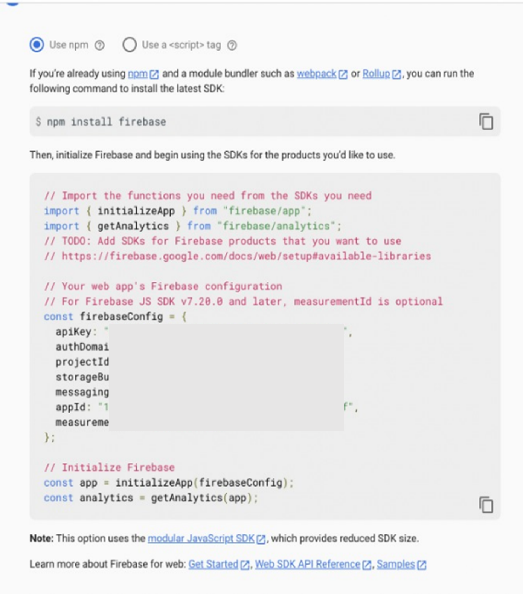

### Create a registration form using React.js and connecting it with Firebase 

In this tutorial, you are going to learn how to make a registration form using React.js and connect it with firebase from scratch using react hooks, bootstrap, and firebase.


You will begin with setting up your coding environment. For that, you must require a code editor and node.js installed on your device.

*Note-* you can use any code editor you prefer. In this tutorial Visual Studio is used.

Now the environment is ready next, you have to open your terminal or PowerShell and run the below commands to create your react app.

```
npx create-react-app loginforms
cd loginforms
npm start
```


After running the commands you will get to see the below screen:-


Now you will add the CDN links of bootstrap in your react app. 

Open `index.html` which is in the `public` folder.
Add the CDN links there at the end of this file or just replace the below code in your file.


``` html
<!DOCTYPE html>
<html lang="en">
  <head>
    <meta charset="utf-8" />
    <link rel="icon" href="%PUBLIC_URL%/favicon.ico" />
    <meta name="viewport" content="width=device-width, initial-scale=1" />
    <meta name="theme-color" content="#000000" />
    <meta
      name="description"
      content="Web site created using create-react-app"
    />
    <link rel="apple-touch-icon" href="%PUBLIC_URL%/logo192.png" />
    <link rel="stylesheet" 
          href="https://maxcdn.bootstrapcdn.com/bootstrap/4.0.0/css/bootstrap.min.css" 
          integrity="sha384-Gn5384xqQ1aoWXA+058RXPxPg6fy4IWvTNh0E263XmFcJlSAwiGgFAW/dAiS6JXm" 
          crossorigin="anonymous">
   
    <link rel="manifest" href="%PUBLIC_URL%/manifest.json" />
    <title>React App</title>+
  </head>
  <body>
    <noscript>You need to enable JavaScript to run this app.</noscript>
    <div id="root"></div>
    <script src="https://code.jquery.com/jquery-3.2.1.slim.min.js" integrity="sha384-KJ3o2DKtIkvYIK3UENzmM7KCkRr/rE9/Qpg6aAZGJwFDMVNA/GpGFF93hXpG5KkN" crossorigin="anonymous"></script>
    <script src="https://cdnjs.cloudflare.com/ajax/libs/popper.js/1.12.9/umd/popper.min.js" integrity="sha384-ApNbgh9B+Y1QKtv3Rn7W3mgPxhU9K/ScQsAP7hUibX39j7fakFPskvXusvfa0b4Q" crossorigin="anonymous"></script>
    <script src="https://maxcdn.bootstrapcdn.com/bootstrap/4.0.0/js/bootstrap.min.js" integrity="sha384-JZR6Spejh4U02d8jOt6vLEHfe/JQGiRRSQQxSfFWpi1MquVdAyjUar5+76PVCmYl" crossorigin="anonymous"></script>
  </body>
</html>

  </body>
</html>
```


Now the basic requirements are completed. You may change the meta tags as per your preference.


#### Creating a Registration Form

The Registration form is divided into two components in this tutorial i.e. Header and registrationForm, and they will get rendered in `App.js`.

Create a new folder named "components" inside the src folder.
In the components folder following files will be created:
1. `header.js`
2. `registrationForm.js`
3. `style.css`

*Note-* In react, JSX is used instead of HTML code. JSX is a language that is a mixture of HTML & JavaScript.

In the `header.js` write the following code. You can copy-paste as well from here.

``` javascript
import React from 'react';
function Header() {
    return(
        <nav class="bg-dark navbar-dark navbar">
            <div className="row col-12 d-flex justify-content-center text-white">
                <h3>Registration</h3>
            </div>
        </nav>
    )
}
export default Header;
```

Your header is ready. Now to display it on the website you have to import the `header.js` in `App.js`. Write the following code in the `App.js`.

```javascript
import logo from './logo.svg';
import './App.css';
import Header from './components/header';

function App() {
  return (
    <div className="App">
      <Header/>
    </div>
  );
}

export default App;
```

If you have written the above code correctly the webpage will look like this:

;


Moving forward to the next component i.e. registrationForm. The form consist of the following fields:
1. First Name
2. Last Name
3. Email id 
4. Password 
5. Confirm Password 
6. Submit Button 
   
Write the following code in the `registrationForm.js` to create the form body.

``` javascript
import React, {useState} from 'react';
import './style.css'
function RegistrationForm() {
    return(
      <div className="form">
          <div className="form-body">
              <div className="username">
                  <label className="form__label" for="firstName">First Name </label>
                  <input className="form__input" type="text" id="firstName" placeholder="First Name"/>
              </div>
              <div className="lastname">
                  <label className="form__label" for="lastName">Last Name </label>
                  <input  type="text" name="" id="lastName"  className="form__input"placeholder="LastName"/>
              </div>
              <div className="email">
                  <label className="form__label" for="email">Email </label>
                  <input  type="email" id="email" className="form__input" placeholder="Email"/>
              </div>
              <div className="password">
                  <label className="form__label" for="password">Password </label>
                  <input className="form__input" type="password"  id="password" placeholder="Password"/>
              </div>
              <div className="confirm-password">
                  <label className="form__label" for="confirmPassword">Confirm Password </label>
                  <input className="form__input" type="password" id="confirmPassword" placeholder="Confirm Password"/>
              </div>
          </div>
          <div class="footer">
              <button type="submit" class="btn">Register</button>
          </div>
      </div>      
    )       
}
export default RegistrationForm;
```
Your basic structure is ready but needs some styling right? 

For that write the following code in `style.css`.

*Note:* Don't forget to import `style.css` in `registrationForm.js`. In this tutorial, it is already added.

```css
body{
    background: #bdc3c7;  /* fallback for old browsers */
    background: -webkit-linear-gradient(to right, #2c3e50, #bdc3c7);  /* Chrome 10-25, Safari 5.1-6 */
    background: linear-gradient(to right, #2c3e50, #bdc3c7); /* W3C, IE 10+/ Edge, Firefox 16+, Chrome 26+, Opera 12+, Safari 7+ */
}

.form{
    background-color: white;
    border-radius: 5px;
    width: 550px;
    margin: 20px auto;
    padding: 20px;
    /* height: 600px; */
}

.form-body{
    text-align: left;
    padding: 20px 10px;
}

.form-body > *{
    padding: 5px;
}

.form__label{
    width: 40%;
}

.form_input{
    width: 60%;
}

.footer{
    text-align: center;
}


```

Make sure to include this component in  `App.js` 

``` javascript
import logo from './logo.svg';
import './App.css';
import Header from './components/header';
import RegistrationForm from './components/registrationForm'

function App() {
  return (
    <div className="App">
      <Header/>
      <RegistrationForm/>
    </div>
  );
}

export default App;
```

#### Implementing  hooks in Registration Form
You will have an overview of hooks in react.js For more details I will recommend you to first go through react official documentation.

`useState` hook is used to maintain a state of a variable which you can update dynamically using `setState` 

Now get to your form where you need to maintain the state of every input in the form. So that when users hit submit button you can send the data to the backend API. 

If you remember in vanilla javascript you used to update this using `document.getElementById("demo").value` but in react you have a state for every input and you will update it on every onChange event. 

import `useState` and `setState` hooks from react on top of your code. Now you make a state for all input elements. 

```jsx
    const [firstName, setFirstName] = useState(null);
    const [lastName, setLastName] = useState(null);
    const [email, setEmail] = useState(null);
    const [password,setPassword] = useState(null);
    const [confirmPassword,setConfirmPassword] = useState(null);
```

For being functional we will add two attributes in the `input` tag  to maintain the state variable i.e.
1. value 
2. onChange

*Value*

Value attribute will contain the name of the fields, that we used while declaring states. 

*onChange*

Write the following code for onChange attribute.

`onChange = {(e) => handleInputChange(e)}`

```javascript
<input className="form__input" type="text" value={firstName} onChange = {(e) => handleInputChange(e)} id="firstName" placeholder="First Name"/> 
<input  type="text" name="" id="lastName" value={lastName}  className="form__input" onChange = {(e) => handleInputChange(e)} placeholder="LastName"/>
<input  type="email" id="email" className="form__input" value={email} onChange = {(e) => handleInputChange(e)} placeholder="Email"/>
<input className="form__input" type="password"  id="password" value={password} onChange = {(e) => handleInputChange(e)} placeholder="Password"/>
<input className="form__input" type="password" id="confirmPassword" value={confirmPassword} onChange = {(e) => handleInputChange(e)} placeholder="Confirm Password"/>
```

Inside the onChange event, you have called a function `handleInputChange` that will handle state updates of all the input changes. Write the following function:-

```javascript
 const handleInputChange = (e) => {
        const {id , value} = e.target;
        if(id === "firstName"){
            setFirstName(value);
        }
        if(id === "lastName"){
            setLastName(value);
        }
        if(id === "email"){
            setEmail(value);
        }
        if(id === "password"){
            setPassword(value);
        }
        if(id === "confirmPassword"){
            setConfirmPassword(value);
        }

    }
```

In this function, you get the id and the value entered inside the input box, as soon as you type anything there, the state of that particular field will get updated. This is how you will maintain all the states so that on submit button you can send all the required information to the backend APIs.

In this tutorial `handleSubmit` function is used in which you will get all the values that are filled in the form. This function will be used to connect the app with the firebase.

The following code is the final code for the registration form which includes all the details you have learned above in the tutorial so far.

```javascript
import React, {useState,setState} from 'react';
import './style.css'
function RegistrationForm() {
    
    const [firstName, setFirstName] = useState(null);
    const [lastName, setLastName] = useState(null);
    const [email, setEmail] = useState(null);
    const [password,setPassword] = useState(null);
    const [confirmPassword,setConfirmPassword] = useState(null);

    const handleInputChange = (e) => {
        const {id , value} = e.target;
        if(id === "firstName"){
            setFirstName(value);
        }
        if(id === "lastName"){
            setLastName(value);
        }
        if(id === "email"){
            setEmail(value);
        }
        if(id === "password"){
            setPassword(value);
        }
        if(id === "confirmPassword"){
            setConfirmPassword(value);
        }

    }

    const handleSubmit  = () => {
        console.log(firstName,lastName,email,password,confirmPassword);
    }

    return(
        <div className="form">
            <div className="form-body">
                <div className="username">
                    <label className="form__label" for="firstName">First Name </label>
                    <input className="form__input" type="text" value={firstName} onChange = {(e) => handleInputChange(e)} id="firstName" placeholder="First Name"/>
                </div>
                <div className="lastname">
                    <label className="form__label" for="lastName">Last Name </label>
                    <input  type="text" name="" id="lastName" value={lastName}  className="form__input" onChange = {(e) => handleInputChange(e)} placeholder="LastName"/>
                </div>
                <div className="email">
                    <label className="form__label" for="email">Email </label>
                    <input  type="email" id="email" className="form__input" value={email} onChange = {(e) => handleInputChange(e)} placeholder="Email"/>
                </div>
                <div className="password">
                    <label className="form__label" for="password">Password </label>
                    <input className="form__input" type="password"  id="password" value={password} onChange = {(e) => handleInputChange(e)} placeholder="Password"/>
                </div>
                <div className="confirm-password">
                    <label className="form__label" for="confirmPassword">Confirm Password </label>
                    <input className="form__input" type="password" id="confirmPassword" value={confirmPassword} onChange = {(e) => handleInputChange(e)} placeholder="Confirm Password"/>
                </div>
            </div>
            <div class="footer">
                <button onClick={()=>handleSubmit()} type="submit" class="btn">Register</button>
            </div>
        </div>
       
    )       
}

export default RegistrationForm
```

You can refer to this link to find the full code of this registration form 
[link](https://replit.com/@AnubhavBansal1/Registration-Form-1#README.md)

#### Connecting Registration Form with Firebase 

Hurray!! Your Registration form is completed but you need to store the information registered by the user, which will be done by using firebase.


Good news guys, for using firebase you don't need to install any app just need Google/Gmail mail id. You all do have that id right?
Now you will start learning how to connect firebase to your Registration form. For that, you need to do the following.

- *At first what do you require?* You require a space where you can record your data. For that, you will go to the firebase homepage [Click here.](https://firebase.google.com/) Or Type firebase.google.com
 The homepage will appear 


Then, Click on the Get Started button 

- You will begin your project. Click on Add project. 
 
 
 
 - Give the preferable name to the project. In this tutorial, Registration-Form is taken. 
  


Then click on continue. 

-  Next step will appear to click on continue then after that you need to choose Default Account for Firebase. 
  


Then click on "Create project"

Now your project file is ready. You will use it to build the real-time database. 

- To make a setup for real-time data you will select "Realtime Database" from the left panel. 


Then click on the "Create Database" button. The Setup database dialog box will appear 


You will go to the next step by leaving the default location. Since you are in developing mode, you will select "Start in test mode" and enable it.

Now your place is ready where the real-time data is stored.
image of real-time data 

You need to create a linkage between your react project and the  
 
- For that, you will go to project overview from the left panel and then click on the Web button.


- You have to register your app and give a nickname to it. In this tutorial "Registration Form" is taken or you can choose any name of your choice. Since you are not hosting you will not select the option "set up Firebase hosting for this app" and then click on Register App. 


- Now you need to add the package into your react app you have to install the firebase package over there. Now using terminal or command prompt go to the directory where your project is and run this command. 
 
`npm install firebase`



Create a new file with the name "firebase.js" in the Src folder where you will copy the code. 

You have to initialize the firebase. Now you will import the database into your code. 
- For importing the data write the following statement

`import { getDatabase } from "firebase/database"`

- To use this database in your registration form component you will use an export statement. Add the following statements in the code.
`export const database = getDatabase(app);`

In the registration, form component import the following files

`import {database} from '../firebase'
import {ref,push,child,update} from "firebase/database";`

- To store the input entered by the user you need to add the following code in the handle Submit function you made earlier 

```javascript
const handleSubmit = () =>{
    let obj = {
            firstName : firstName,
            lastName:lastName,
            email:email,
            password:password,
            confirmPassword:confirmPassword,
        }       
    const newPostKey = push(child(ref(database), 'posts')).key;
    const updates = {};
    updates['/' + newPostKey] = obj
    return update(ref(database), updates);
}
```

Now you have completed your steps successfully. 

****Now you will see how it work****

You will fill in the details in the form then click on register.


For checking the input you can see that from your firebase account. It will appear as shown below.


***Conclusion***

In this tutorial you have learned how to make Registration Form with react and hooks. You learned how to store the data base in firebase.

Tutorial have used react for creating a structure of the registration form, and to add styling to it. Hooks of react is used to maintain the state so that you can store the data in the database.

Firebase real-time database is used as the database for storing the submissions of registration form.

Congratulation you have successfully learned how to make a registration form and connect it to firebase to store real-time data.


