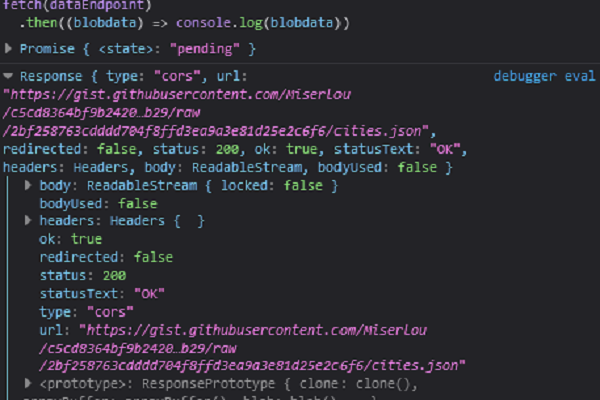

## Create a Type Ahead Feature in JavaScript using Fetch and Regex

### Introduction

Part of the job of a front-end developer is to create intuitive user interfaces that deliver the best user experience to website users. Part of getting this job done is creating search suggestions or what is known as type-ahead feature for websites/webpages.

In this tutorial, I will explain how to create an **ajax type-ahead feature** for your website using [cities.json file](). This file contains information about states and cities in America.

What this feature does is, if a user types `name`, every state and city that matches the word name pops up.

### Prerequisite

Basic knowledge of the following helps understand this tutorial better.

- Basic HTML and CSS knowledge
- ES6 JavaScript/Asynchronous JavaScript
- A Code Editor
- [Understand Regular Expression (RegExp)](https://eloquentjavascript.net/09_regexp.html)

### Table of Contents

- [How FETCH works](#How-fetch-works)
- [Getting Started](#getting-started)
- [The JavaScript](#the-javascript)
- [Getting the Data](#getting-the-data)
- [Displaying Data to the UI](#displaying-data-to-the-ui)
- [Formating the Output](#formating-the-output)
- [The Complete JavaScript Code](#the-complete-javascript-code)
- [Conclusion](#conclusion)

### How `fetch` works

`Fetch`, like XMLHttpRequest, provides a method to get resources asynchronously across networks. But, the Fetch method provides an easy, cleaner and, more efficient way to handle resources across networks.
The fetch method uses `Promise` to deliver more flexible features to make requests to servers from the web browsers.
_Syntax_
`Fetch(URL, options)`
The fetch method requires the URL of the resource requested and an optional parameter that allows you to control other settings.
[More about fetch](https://developer.mozilla.org/en-US/docs/Web/API/Fetch_API/Using_Fetch).

### Getting Started

### Create the Html and CSS

- Create an HTML page with a search `input` and a `ul`.

- The input form allows the user to enter the word to search, and the `ul` (unordered list) will display the matching states and cities.

The HTML should look like this 👇

```HTML
<body>
 <h2 class="header"><span>Find </span>State or City</h2>
 <main class="main">
 <section class="section search">
 <form>
 <div class="input-group">
 <label for="search"><i class="ri-search-line"></i> </label>
 <input
 type="search"
 name="search"
 id="search "
 placeholder="Type to search"
 />
 </div>
 </form>

 <ul class="card"></ul>
 </section>
 </main>

 <script src="./index.js"></script>
 </body>
```

_You can create the Html how you want - what is important is, a search box and a container to display matching results._

- Create CSS to style as needed. In your CSS, add a `.highlight` or `.hl` style to format the search term when you return the result.

The CSS should look somewhat like this 👇

```css
@import url("https://fonts.googleapis.com/css2?family=Poppins:wght@400;500;600;700;800&display=swap");

*,
*::before,
*::after {
  padding: 0;
  margin: 0;
  box-sizing: border-box;
}

body {
  width: 80%;
  margin: 3rem auto;
  display: flex;
  flex-direction: column;

  justify-content: center;
  gap: 2rem;
  font-family: "Poppins", sans-serif;
}

ul {
  list-style: none;
}

.section {
  display: flex;
  flex-direction: column;
  align-items: flex-start;
  gap: 0.6rem;
  padding: 2rem;
}

form {
  width: 100%;
}
.input-group {
  border: 1px solid rgb(46, 43, 43);
  border-radius: 15px;
  padding: 0.5rem;
  display: flex;
  flex-direction: row;
  align-items: center;
  justify-content: space-evenly;
  gap: 0.5rem;
  width: 90%;
  max-width: 500px;
}

input[type="search"] {
  border: none;
  outline: 0;
  width: 90%;
  font-family: inherit;
  font-size: 1rem;
}

.card {
  width: 70%;
  display: flex;
  flex-direction: column;
  align-items: flex-start;
  gap: 1rem;
}

.card-item {
  width: clamp(200px, 50vw, 550px);
  border: 2px solid rgb(3, 3, 3);
  border-radius: 15px;
  padding: 1rem;
  padding-inline: 2rem;
  display: flex;
  flex-direction: row;
  justify-content: space-between;
}

.hl {
  color: red;
}
```

**Ps:** Style the CSS according to your preference.

### The Javascript

### Getting the data

The data for this project is from the [cities.json](https://gist.githubusercontent.com/Miserlou/c5cd8364bf9b2420bb29/raw/2bf258763cdddd704f8ffd3ea9a3e81d25e2c6f6/cities.json) file, a file that has information of states cities in America.

From the file, we get access to the following information of each state in America:

1. State name
2. City name
3. Population
4. latitude and longitude
5. Growth_from_2000_to_2013
6. Rank

**Ps:** You can choose the data to display from above this list.

- Get the search word and the `ul` from the UI.

  ```javascript
  const searchText = document.querySelector('input[type="search"]');
  ```

const card = document.querySelector(".card");

````

- Create the data endpoint and create an empty array.

```javascript
const dataEndpoint =
"https://gist.githubusercontent.com/Miserlou/c5cd8364bf9b2420bb29/raw/2bf258763cdddd704f8ffd3ea9a3e81d25e2c6f6/cities.json";

const cities = [];
````

- Now, we need to fetch our data from the endpoint and assign the returned value to the empty array we created.

  ```javascript
  fetch(dataEndpoint)
    .then((blobdata) => blobdata.json())
    .then((data) => cities.push(...data));
  ```

> The blobdata object, in turn, does not contain the actual JSON response body but is instead a representation of the entire HTTP response. To extract the JSON body content from the Response object, we use the JSON() method, which returns a second promise that resolves with the result of parsing the response body text as JSON. -[MDN](https://developer.mozilla.org/en-US/docs/Web/API/Fetch_API/Using_Fetch)


_blobdata returns entire HTTP response_

    **Here are some things to note**

      - We defined the empty cities array using a `const` declaration, so we cannot reassign data into it.
        What we can do is declare the cities array with a let keyword.
      - Or you can push and [spread the data into the cities array](https://www.samanthaming.com/tidbits/92-6-use-cases-of-spread-with-array/).

- Create a function called `getMatches` that take two arguments, the `wordToMatch`and the `cities` array.
- In the function, we return a filtered subset of the `cities` array and check to see if what the user typed is returned.
  o To check if what the user typed is inside the array, we will [use Regex](https://www.w3schools.com/js/js_regexp.asp) to check if the searched word match any state or city in the `cities` array.

  ```js
  function getMatches(wordToMatch, cities) {
    return cities.filter((place) => {
      const regex = RegExp(wordToMatch, "gi");
      return place.city.match(regex) || place.state.match(regex);
    });
  }
  ```


_Arrays of objects returned by the `getMatches` Function_

### Displaying Data to the UI

Now that we can get the `getMatches` function display arrays of searched words to the console, let us find a way to hook them up to the `ul`.

- First, listen to the UI element that will call trigger the display.

  ```js
  searchText.addEventListener("change", displayMatchedResults);
  searchText.addEventListener("keyup", displayMatchedResults);
  ```

- Now, create a function named `displayMatches`.
- Create a variable `searchTerm` and assign the search term from the UI to it.
  ```js
  const searchTerm = this.value;
  ```
- Call the `getMatches` function and assign it to a variable called `outputted`.

  ```js
  const outputted = getMatches(searchTerm, cities);
  ```

_`getMatches` function takes two arguments, the search word from the UI and the cities array returned from the fetch statement we created earlier._

- At this point, `outputted` now holds an array of every state and city that matches the search word.
- Now, loop over outputted with the `.map()` array function and return the following Html element.

  ```js
  const htmlToDisplay = outputted.map((place) => {
    return `
  <li class ='card-item'>
  <span class ='name '> ${place.city}, ${place.city}</span>
  <span class 'population'> ${place.population}</span>
  </li>`;
  });
  ```

- Since the `.map()` function returns an array, simply append `.join()` method to convert it to one big string.

  ```js
  const htmlToDisplay = outputted
    .map((place) => {
      return `
  <li class ='card-item'>
  <span class ='name '> ${place.city}, ${place.city}</span>
  <span class 'population'> ${place.population}</span>
  </li>`;
    })
    .join();
  ```

- Set the inner Html of the `ul` element to the string returned from the above step.

`card.innerHTML = htmlToDisplay;`

Left like this, the `card.innerHTML` will display every state and city when the search box is empty. To handle this, you can throw in some control.

```js
if (searchTerm === "") {
  card.innerHTML = "";
} else {
  card.innerHTML = htmlToDisplay;
}
```

### Formating the output (Optional)

Next, let's format the output to highlight the text on the result which matches the text the user entered in the search box. Also, we will format the population to be comma-separated.

This is achieved by replacing the following code.

```js
const htmlToDisplay = outputted
  .map((place) => {
    return `
 <li class ='card-item'>
 <span class ='name '> ${place.city}, ${place.city}</span>
 <span class 'population'> ${place.population}</span>
 </li>`;
  })
  .join();
```

with...

```js
const htmlToDisplay = outputted
  .map((place) => {
    const regex = RegExp(searchTerm, "gi");

    const cityName = place.city.replace(
      regex,
      `<span class='hl'>${this.value}</span>`
    );

    const stateName = place.state.replace(
      regex,
      `<span class='hl'>${searchTerm}</span>`
    );

    const commaSeperated = place.population
      .toString()
      .replace(/\B(?=(\d{3})+(?!\d))/g, ",");

    return `
  <li class ='card-item'>
  <span class ='name '> ${cityName}, ${stateName}</span>
  <span class 'population'> ${commaSeperated}</span>
  </li>`;
  })
  .join("");
```

Read more about replacing string with `.replace` and **regex** [here.](https://www.freecodecamp.org/news/javascript-string-replace-example-with-regex/)

### The Complete JavaScript Code

Below is the complete JS code for this tutorial. save the javascript in the same folder as the HTML file and link them using the `script` tag.

```js
const dataEndpoint =
  "https://gist.githubusercontent.com/Miserlou/c5cd8364bf9b2420bb29/raw/2bf258763cdddd704f8ffd3ea9a3e81d25e2c6f6/cities.json";

const searchText = document.querySelector('input[type="search"]');
const card = document.querySelector(".card");

const cities = [];

fetch(dataEndpoint)
  .then((blobdata) => blobdata.json())
  .then((data) => cities.push(...data));

function getMatches(wordToMatch, cities) {
  return cities.filter((place) => {
    const regex = RegExp(wordToMatch, "gi");
    return place.city.match(regex) || place.state.match(regex);
  });
}

searchText.addEventListener("change", displayMatchedResults);
searchText.addEventListener("keyup", displayMatchedResults);

function displayMatchedResults() {
  const searchTerm = this.value;
  const outputted = getMatches(searchTerm, cities);

  const htmlToDisplay = outputted
    .map((place) => {
      const regex = RegExp(searchTerm, "gi");

      const cityName = place.city.replace(
        regex,
        `<span class='hl'>${this.value}</span>`
      );

      const stateName = place.state.replace(
        regex,
        `<span class='hl'>${searchTerm}</span>`
      );

      const commaSeperated = place.population
        .toString()
        .replace(/\B(?=(\d{3})+(?!\d))/g, ",");

      return `
        <li class ='card-item'>
        <span class ='name '> ${cityName}, ${stateName}</span>
        <span class 'population'> ${commaSeperated}</span>
        </li>`;
    })
    .join("");

  if (searchTerm === "") {
    card.innerHTML = "";
  } else {
    card.innerHTML = htmlToDisplay;
  }
}
```

### Conclusion

In this tutorial, we have learned how to build a type-ahead feature for a website. It displays the search suggestion containing the words that match the user input. We also learned an optional way to format the output to highlight the matched words.

You can use the lessons from this tutorial on any project, with a different data source, of course.

I hope you find this tutorial helpful one way or another.

Thanks for reading and happy coding.

### References

[Using Fetch - MDN](https://developer.mozilla.org/en-US/docs/Web/API/Fetch_API/Using_Fetch)

[JavaScript String.Replace() Example with RegEx - Freecodecamp](https://www.freecodecamp.org/news/javascript-string-replace-example-with-regex/)

[Understanding Regex](https://www.computerhope.com/jargon/r/regex.htm)

[Eloquent JavaScript](https://eloquentjavascript.net/09_regexp.html)
