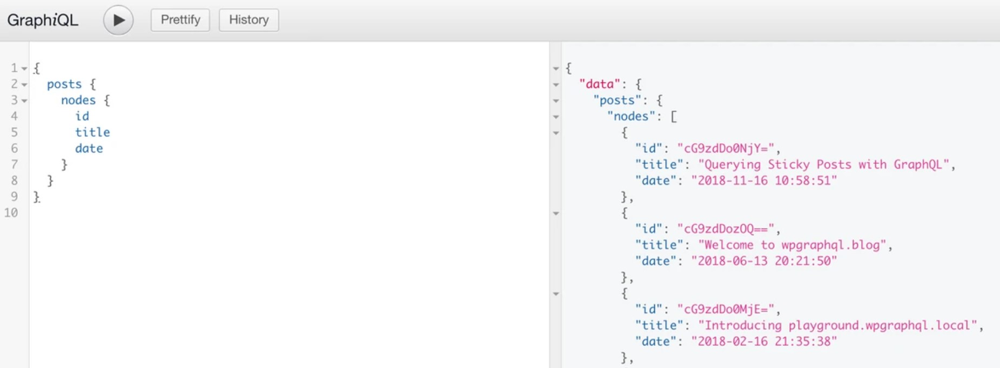
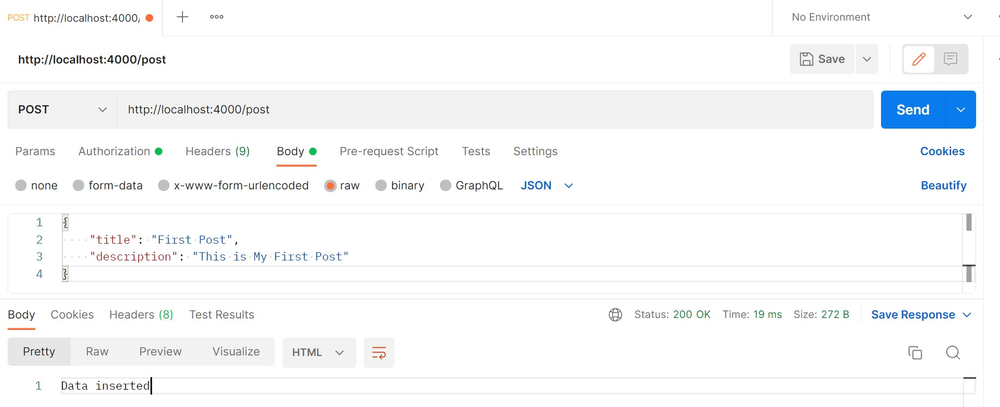
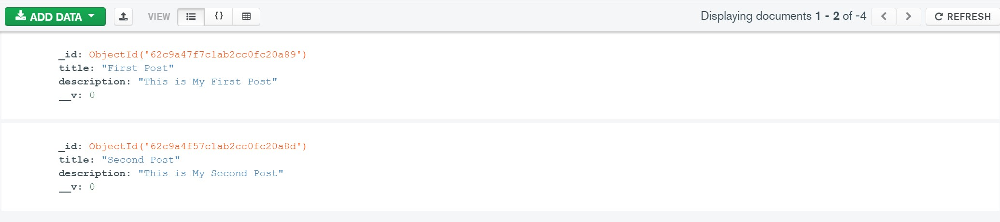
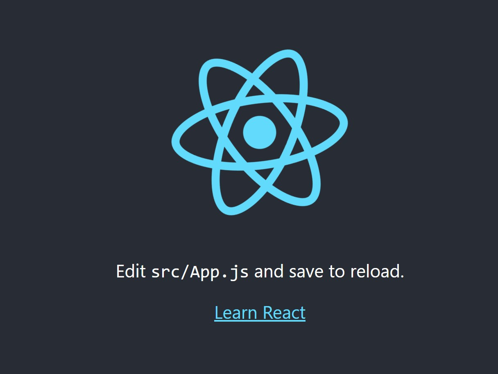
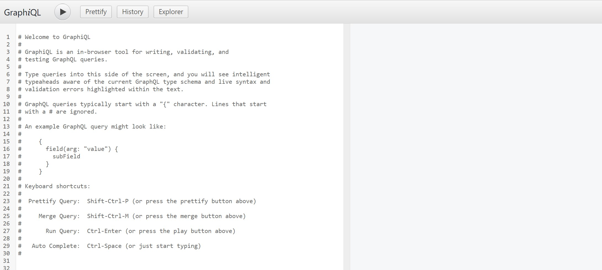
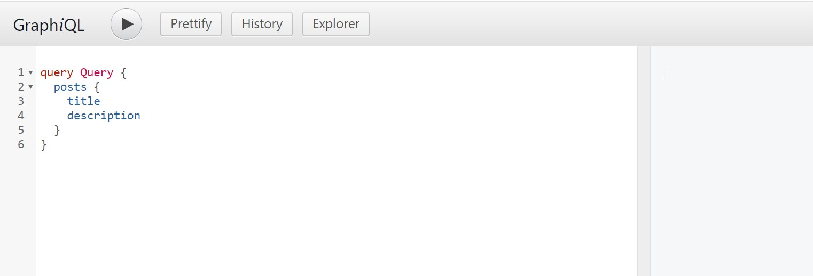
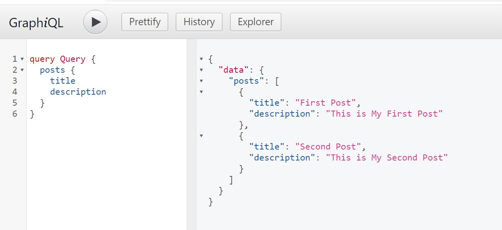

GraphQL is a query language for APIs used to communicate data between a client and a server. This allows you to structure data-driven applications much more flexibly and efficiently than the [REST AND SOAP approach](https://www.techtic.com/blog/comprehensive-guide-to-soap-rest-graphql-web-protocols/#:~:text=GraphQL%20is%20used%20to%20leverage,and%20REST%20represent%20data%20resources.). GraphQL provides a complete and understandable description of the data in your API. It gives clients the power to ask for exactly what they need and nothing more.

This makes it easier to evolve APIs over time and enables powerful developer tools. It also gives developers more control over how they use data in their apps.

GraphiQL is an interactive development environment. It's a tool built into many GraphiQL graphical services that allow you to interact with your app data and GraphQL APIs.

We will create a basic browser GraphiQL tool featuring React.js, Node.js, and MongoDB.

### Table of contents

- [Table of contents](#table-of-contents)
- [Prerequisites](#prerequisites)
- [An overview](#an-overview)
- [Create a Simple Node.js MongoDB GraphQL API](#create-a-simple-nodejs-mongodb-graphql-api)
- [Model the GraphQL data](#model-the-graphql-data)
  - [Create a GraphQL Post Schema](#create-a-graphql-post-schema)
  - [Create the server](#create-the-server)
- [Create React App](#create-react-app)
  - [Install Frontend packages](#install-frontend-packages)
  - [Creating and Rendering the GraphiQL UI with React](#creating-and-rendering-the-graphiql-ui-with-react)
- [Testing](#testing)
- [Conclusion](#conclusion)

### Prerequisites

It is important to have the following to follow along with this tutorial:

- A [Node.js runtime](https://nodejs.org/en/download/) is installed on your local machine. We need Node.js to create React application.
- A MongoDB database setup. This can be locally installed [MongoDB Compass](https://www.mongodb.com/try/download/compass) or use the cloud [MongoDB Atlas](https://www.mongodb.com/atlas/database). MongoDB is the most popular NoSQL database. We will use it to save data that React will communicate with.

### An overview

Whenever you create a GraphQL API, GraphQL provides an extendable playground to execute and a GraphQL schema for the created API. However, take a scenario where you have a CMS such as WordPress. You need to generate API data to separate the presentation layer.

In this case, an API plays a big role in helping users fetch data from the CMS. Therefore, you need to create a GraphQL interface that will allow these users to generate GraphQL-based queries using GraphiQL.

This helps bridge modern frontend stacks with content management with systems such as CMS. GraphQL queries allow you to have access to multiple root resources with a single request. Below is a basic example of a GraphiQL tool.



We will build such a GraphiQL tool with React.js and demonstrate how to use it with a GraphQL API. Therefore, we need to create a GraphQL API that GraphiQL will use.

In this guide, we will create a simple GraphiQL using Node.js and MongoDB. A GraphQL API can be implemented using different technologies. If you have one running, you can skip this step.

### Create a Simple Node.js MongoDB GraphQL API

Create a [Node.js `server` folder](https://levelup.gitconnected.com/set-up-and-run-a-simple-node-server-project-38b403a3dc09) and change the directory to it:

```bash
cd server
```

Then initialize a Node.js project using `npm init -y`. To create this API, we need some npm packages. These are:

- **[Express](https://www.npmjs.com/package/express)** - A Node.js web framework for creating minimalistic HTTP servers.
- **[GraphQL](https://www.npmjs.com/package/graphql)** - Used to build GraphQL type schema and serve GraphQL queries.
- **[Express-GraphQL](https://www.npmjs.com/package/express-graphql)** - An Express-based HTTP web framework for creating GraphQL HTTP servers.
- **[Mongoose](https://www.npmjs.com/package/mongoose)** - Provides MongoDB schema object modeling.
- **[Body-parser](https://www.npmjs.com/package/body-parser)** - A parsing middleware used to handle request body properties.
- **[CORS](https://www.npmjs.com/package/cors)** - To allow cross-origin resource sharing.

To install these packages, run the following command inside the server folder:

```bash
npm install express graphql express-graphql body-parser mongoose cors
```

### Model the GraphQL data

To use a GraphQL API, we need to model the data using the mongoose. This will set up the schema needed by the API to interact with the MongoDB database. Create a `post.js` file inside the `server` folder and create a post schema as follows:

```js
const mongoose = require("mongoose");

const PostSchema = new mongoose.Schema({
    title: {
        type: String,
        required: true
    },
    description: {
        type: String,
        trim: true
    },
});

const Post = mongoose.model("Post", PostSchema);

module.exports = Post;
```

#### Create a GraphQL Post Schema

A GraphQL Schema defines GraphQL queries and mutations. A query in GraphQL is used to fetch data from the server, while mutation is used to manipulate data from the server. Mutations involve operations such as adding a post, updating post values, and deleting a post.

To create these GraphQL Post Schema, create a `schema.js` inside the `server` folder. Add the post model and the GraphQL entities required to create a GraphQL API.

```js
const graphql = require('graphql');
const Posts = require('./post');

const {
    GraphQLObjectType,
    GraphQLList,
    GraphQLString,
    GraphQLSchema,
    GraphQLID,
} = graphql;
```

Set the GraphQL Object for the post. This represents how the posts will be defined in the database.

```JS
const Post = new GraphQLObjectType({
    name: 'Post',
    fields: {
        id: {
            type: GraphQLID,
        },
        title: {
            type: GraphQLString,
        },
        description: {
            type: GraphQLString,
        },
    },
});
```

Create a query to get posts from the database.

```js
const RootQuery = new GraphQLObjectType({
    name: 'RootQueryType',
    fields: {
        posts: {
            type: new GraphQLList(Post),
            resolve(parent, args) {
                return Posts.find();
            },
        },
    },
});
```

Create a mutation to manipulate the database data.

```js
const Mutation = new GraphQLObjectType({
    name: 'Mutation',
    fields: {
        addPosts: {
            type: Post,
            args: {
                title: { type: GraphQLString },
                description: { type: GraphQLString },
            },
            resolve(parent, args) {
                const post = new Posts({
                    title: args.title,
                    description: args.description,
                });
                return post.save();
            },
        },
    },
});
```

You can add other mutations for updating and deleting the post using the `addPosts` mutation as a reference.

Export the query and mutation so that we can use them within the server.

```js
module.exports = new GraphQLSchema({
    query: RootQuery,
    mutation: Mutation,
});
```

#### Create the server

To server, the above query and mutation, create a basic Node.js server. Create a `server.js` file inside the `server` folder and set up the server as follows:

- Add the serve imports.

```js
const express = require('express');
const { graphqlHTTP } = require('express-graphql');
const mongoose = require('mongoose');
const Posts = require('./post');
const schema = require('./schema');
var bodyParser = require('body-parser');
const cors = require('cors');
```

- Create the server middleware.

```js
// express
const app = express();
// parse application/x-www-form-urlencoded
app.use(bodyParser.urlencoded({ extended: false }));

// parse application/json
app.use(bodyParser.json());

//log body
main().catch((err) => console.log(err));
```

- Establish a connection to the MongoDB database.

```js
async function main() {
    const connect = await mongoose.connect(
        `mongodb://localhost:27017`,
        {
            useNewUrlParser: true,
            useUnifiedTopology: true,
        }
    );
    if (connect) {
        console.log('connected');
    }
}
```

- Perform a basic CRUD operation with MongoDB. This tutorial only uses Create and Read operations for demonstration purposes.

```js
// GET
app.get('/post', async (req, res) => {
    try {
        const postDetails = await Posts.find();
        res.send(postDetails);
    } catch (err) {
        console.log('~ err', err);
    }
});

// POST
app.post('/post', async (req, res) => {
    console.log('body', req.body);
    try {
        const newPost = new Posts(req.body);

        newPost.save(function (err, data) {
            if (err) {
                console.log(err._message);
            } else {
                res.send('Data inserted');
            }
        });
    } catch (err) {
        console.log('~ err', err);
    }
});
```

- Execute the API GraphQL playground

```js
app.use(
    '/graphql',
    graphqlHTTP({
        schema,
        graphiql: true,
    })
);
```

- Start the server

```js
app.listen(4000, () => {
    console.log('connected port 4000');
});
```

- Run the server using node `server.js`. This will establish a connection to the database and execute the server on port 4000.

To test the server, you can open the GraphQL playground `http://localhost:4000/graphql`. Or use API testing utilities such as PostMan to send GET and Post requests to `http://localhost:4000/post`.

Using the PostMan Post method, ahead a few posts to the database as follows:



You can confirm if the data was successfully added to the database.



### Create React App

We will use the above GraphQL API to integrate with a React GraphiQL tool. Let's dive in and create GraphiQL using React.js. First, we need to create a basic React app using the `create-react-app` command as follows:

```bash
npx create-react-app client
```

This command will create a React App. Change the directory to created `client` folder:

```bash
cd client
```

Starts the development server:

```bash
npm start
```

You can now view the created React app in the browser `http://localhost:3000`.



#### Install Frontend packages

To create a GraphiQL tool, we need the following packages:

- **[GraphQL](https://www.npmjs.com/package/graphql)** - Used to build GraphQL type schema and serve GraphQL queries.
- **[GraphiQL](https://www.npmjs.com/package/graphiql)** - It allows to create in-browser GraphQL IDE to create interactive GraphQL components for frontend frameworks.

Run the following command to install these packages.

```bash
npm install graphql graphiql
```

#### Creating and Rendering the GraphiQL UI with React

Let's create a UI for interactive GraphQL queries. Head to your React app `src/app.js` file and implement the GraphiQL tool as described in the following steps:

- Import the dependencies and the peer dependencies as follows:

```js
import React from 'react';
import GraphiQL from 'graphiql';
import { getIntrospectionQuery, buildClientSchema } from 'graphql';
import 'graphiql/graphiql.min.css';
```

- Send requests to the server using fetch. In this case, make sure you add the GraphQL URL that executes the GraphQL route of your server.

```js
const fetcher = async (graphQLParams) => {
  const data = await fetch(
    'http://localhost:4000/graphql',
    {
      method: 'POST',
      headers: {
        Accept: 'application/json',
        'Content-Type': 'application/json',
      },
      body: JSON.stringify(graphQLParams),
      credentials: 'same-origin',
    },
  );
  return data.json().catch(() => data.text());
}
```

- Create a class React component.

```js
class App extends React.Component {
}
```

Inside this component, create a GraphiQL component as follows:

- Define the state. Here, create the state for the GraphQL schema and query as follows:

```js
_graphiql;
state = { schema: null, query: '# Hola!' };

_handleEditQuery = (query) => this.setState({ query });

componentDidMount() {
    this.updateSchema();
}
```

- Execute the GraphQL from the server and sever the result of the server JSON response.

```js
executeQuery = async (graphQLParams) => {
    const response = await fetch('http://localhost:4000/graphql', {
        method: 'POST',
        headers: {
            Accept: 'application/json',
            'Content-Type': 'application/json',
        },
        credentials: 'same-origin',
        body: JSON.stringify(graphQLParams),
    });

    const result = await response.json();
    return result;
}
```

- Using an async method, Fetch the schema from the response result executed by the `executeQuery` function. In this case, create an async method and fetch the schema inside a try and catch block as follows:

Create the `updateSchema()` funtion

```js
async updateSchema() {
    try {
    }
}
```

Inside this function, try block fetch the schema using introspection query.

```js
const { data } = await this.executeQuery({ query: getIntrospectionQuery() });
```

Use the data we got back from GraphQL to build a client schema.

```js
const schema = buildClientSchema(data);
```

Update our component with the new schema.

```js
this.setState({ schema });
```

Log any errors.

```js
this.setState({ error: null });
```

Finally, close the catch block inside `updateSchema()` to catch errors as follows:

```js
catch (error) {
    console.error('Error occurred when updating the schema:');
    console.error(error);
    this.setState({ error });
}
```

- Render the GraphQL data on the browser. This references the `_graphiql` and fetches the execute the GraphQL requests from the server.

Additionally, you can add the Prettify, History, and Explorer toolbar to GraphiQL. Here they are represented as dummies. Go ahead and implement them if your GraphiQL needs such functionalities.

```js
render() {
    return (
        <div className="graphiql-container">

            <GraphiQL
                ref={ref => (this._graphiql = ref)}
                fetcher={fetcher}
            >
                <GraphiQL.Toolbar>
                    <GraphiQL.Button
                        title="Prettify Query (Shift-Ctrl-P)"
                        label="Prettify"
                    />
                    <GraphiQL.Button
                        label="History"
                        title="Show History"
                    />
                    <GraphiQL.Button
                        label="Explorer"
                        title="Construct a query with the GraphiQL explorer"
                    />
                </GraphiQL.Toolbar>
            </GraphiQL>
        </div>
    );
}
```

- Finally, export the `App` component.

```js
export default App;
```

### Testing

Let's test if this tool is working as expected. At this point:

- Enure your Node.js server is running and described in the previous steps
- Ensure the React app is running and open the app in the browser using the URL `http://localhost:3000`. You will be served with the GraphiQL tool we have just created.



Let's test if the React GraphiQL tool can interact with the API data. We will execute a query to fetch posts from the database as follows:

```js
query Query {
  posts {
    title
    description
  }
}
```

Add this query to the GraphiQL tool.



Then hit the play button.



And there you have it. The frontend tool you created can directly interact with your server, deploy it, and allow users to interact with the content managed by your API.

### Conclusion

GraphQL uses a mechanism that queries data and then displays that data with the GraphQL schema. This uses GraphiQL. You might want to query data from your application. A good example is how WordPress uses [wpGraphQL](https://www.wpgraphql.com/) to fetch WordPress-driven data.

This guide helped you create a GraphiQL tool to perform such GraphQL tasks. This provides extendable GraphQL features within your application.