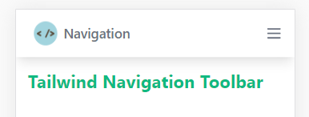

### Introduction

What is a navigation bar? A navigation bar is a tool at the top most position of a webpage which is used by website visitors to steer through to different sections in the webpage. When a webpage is long a navigation bar comes in handy. It helps the user to easily navigate through to specific sections of the webpage. A navigation bar should therefore, be simple and easy-to-use.

In Tailwind CSS framework, you can easily style up your website by adding styles directly into your HTML file by using the various Tailwind CSS classes. This has made it much easier to create both mobile friendly and desktop friendly designs which transform the layouts of the objects in the website according to the size of the screen in which the website is being viewed on, this kind of website is said to be responsive.

In this tutorial, we are creating a responsive top navigation bar with Tailwind CSS and JavaScript. The navigation bar will transform into a mobile menu button on small screen devices and the menu items will be in vertical position. We will use JavaScript to create the toggle functionality for the mobile menu button to make it clickable.

The navigation bar will look like this when complete in different screen sizes:

a) On large screens


b) On medium screens


c) On small screens



### Prerequisites

1. Knowledge of Tailwind CSS classes
2. Latest version of Tailwind CSS installed
3. Knowledge of JavaScript functions

### Adding Tailwind CSS to your project.

Visit this [link](https://github.com/section-engineering-education/engineering-education/blob/master/articles/introduction-to-tailwind-css/index.md) for the complete installation process of Tailwind CSS framework.

After the full installation of the Tailwind CSS framework, we will link our Tailwind stylesheet using the link tag like this:

```HTML
<!DOCTYPE html>
<html lang="en">
    <head>
        <meta charset="UTF-8" />
        <meta http-equiv="X-UA-Compatible" content="IE=edge"/>
        <meta name="viewport" content="width=device-width, initial-scale=1.0"/>
        <title>Navigation</title>
        <link rel="stylesheet" href="./css/tailwind.css">
    </head>
```

Now we are all set to begin creating our navigation bar!

### Our HTML

As from the snippet above, We gave our page a title, "Navigation".

Next, in the `<body>` tag, we will add a `<nav>` tag and classes as shown:

```HTML
	<body>
		<!--Navbar goes here-->
		<nav class="bg-white shadow-lg">
			<div class="max-w-6xl mx-auto px-4">
				<div class="flex justify-between">
					<div class="flex space-x-7">
						<!--Website Logo-->
						<div>
							<a href="#" class="flex items-center py-4 px-2">
								
								<span class="font-semibold text-gray-500 text-lg">Navigation</span>
							</a>
						</div>
						<!--Primary Navbar items-->
						<div class="hidden md:flex items-center space-x-1">
							<a href="" class="py-4 px-2 text-green-500 border-b-4 border-green-500 font-semibold ">Home</a>
							<a href="" class="py-4 px-2 text-gray-500 font-semibold hover:text-green-500 transition duration-300">Services</a>
							<a href="" class="py-4 px-2 text-gray-500 font-semibold hover:text-green-500 transition duration-300">About</a>
							<a href="" class="py-4 px-2 text-gray-500 font-semibold hover:text-green-500 transition duration-300">Contact Us</a>
						</div>
					</div>
```

In the above snippet, we have added a white background color and a large shadow for our navigation bar to make it pop up a little.

Next we will add the following classes to the first `<div>` tag:

```html
<div class="max-w-6xl mx-auto px-4">
```
 
This is the containment `<div>` into which all our navigation bar items will be placed. We have added the following classes to the tag :

- `max-w-6xl` class will limit the width of our navigation bar to 1152px.
- `mx-auto` class centers the navigation bar.
- `px-4` class will add a padding of 16px on the left and right side of the content in the navigation bar so that the navbar items will not be at the edge of the screen.

Next we will add the following classes to the second `<div>` tag:

```html
<div class="flex justify-between">
```

This is another containment `<div>` which makes our  navbar items to be side by side. We have added the following classes to the tag :

- `flex` class will align the children `<div>` tags vertically.

- `justify-between` class creates a space between children `<div>` tags. So from our divisions, space will be added between the first division that contains the website logo and the primary navbar items and the second division that contains the secondary navbar items.

Next we will add the following classes to the third `<div>` tag:

```html
<div class="flex space-x-7">
```

This tag wraps the two `<div>` tags containing our website logo and our primary navbar items to make them as one division. We will add `flex` and `space-x-7` classes to which will align our logo and the navbar items vertically and add some space around the items.

### Website Logo
For this tutorial, I have used a basic image file as a logo and modified its height and width to make it fit in the Navigation bar. Here is our code :

```html 
<div>
<!--Website Logo-->
	<a href="#" class="flex items-center py-4 px-2">
		
		<span class="font-semibold text-gray-500 text-lg">Navigation</span>
	</a>
</div>
```
In the above snippet, we have used `<a>`, `` and `<span>` tags to create our logo. We have added the following classes to the `<a>` tag :

- `flex` class will align the image and text vertically.
- `items-center`  class will center the logo and text in the container.
- `py-4` class will adding a padding of 16px
- `px-2` class will adding a padding of 8px
  
To the `` tag, we have added the following classes :

- `h-8` class will limit the height of the image to 32px
- `w-8` class will limit the width of the image to 32px
- `mr-2` class will add space of 8px to the right margin of the image

To the `<span>` tag, we have added the following classes :

- `font-semibold` class will make the text to appear semi-bold.
- `text-gray-500` class will make the text appear gray in color.
- `text-lg` class will increase the font size of the text.
  
### Primary Menu Items
This section contains the menu items that wil be used by the website visitor to navigate through the page. Here is our code :

```html
<!--Primary Navbar items-->
<div class="hidden md:flex items-center space-x-1">
	<a href="" class="py-4 px-2 text-green-500 border-b-4 border-green-500 font-semibold ">Home</a>
	<a href="" class="py-4 px-2 text-gray-500 font-semibold hover:text-green-500 transition duration-300">Services</a>
	<a href="" class="py-4 px-2 text-gray-500 font-semibold hover:text-green-500 transition duration-300">About</a>
	<a href="" class="py-4 px-2 text-gray-500 font-semibold hover:text-green-500 transition duration-300">Contact Us</a>
</div>
```

We have used the following classes in the `<div>` tag :

- `hidden` will hide the navbar items when viewed in a small screen size.
- `md:flex` means that on medium screen devices the navbar items will appear side by side.

On the `<a>` tags, we have used the following classes :

- `hover:text-green-500` will add a hover effect on the link by making the text color change to green.
- `transition` will make the hover effect have a delay to make it appealing.
- `duration-300` will add a transition delay of 300 milliseconds.
### Secondary Menu Items
This section shows the sign up and login links. Here is our code :

```html
<!--Secondary Navbar items-->
<div class="hidden md:flex items-center space-x-3 ">
	<a href="" class="py-2 px-2 font-medium text-gray-500 rounded hover:bg-green-500 hover:text-white transition duration-300">Log In</a>
	<a href="" class="py-2 px-2 font-medium text-white bg-green-500 rounded hover:bg-green-400 transition duration-300">Sign Up</a>
</div>
```

We have used the following classes :

- `rounded` to make the button have a rounded look.
- `hover:bg-green-500` will add a hover effect on the link by making the background color change to green.

### Mobile Menu Button
The navigation bar will transform into a mobile menu button on small screen devices and the menu items will be in vertical position. We will use JavaScript to create the toggle functionality for the mobile menu button to make it clickable.

Here is our code:
```html
<!--Mobile menu button-->
<div class="md:hidden flex items-center">
	<button class="outline-none mobile-menu-button">
		<svg class="w-6 h-6 text-gray-500" x-show="!showMenu" fill="none" stroke-linecap="round" stroke-linejoin="round" 				  		stroke-width="2" viewBox="0 0 24 24" stroke="currentColor">
			<path d="M4 6h16M4 12h16M4 18h16"></path>
		</svg>
	</button>
</div>
```

We have used an SVG to make the Hamburger menu button and modified its height and width with the `h-6` and `w-6` classes and its color to gray with `text-gray-500` class.

We have used the following classes :

- `md:hidden` class will hide the the mobile menu button when viewed in a medium screen size.
- `flex` means that the mobile menu button will be placed side by side with the other items in the navbar.
- `outline-none` this will remove the outline border when the button is clicked.

We have named our button as `mobile-menu-button` so that we may be able to identify it when we are writing our JavaScript code.

### Mobile Menu
We will have to create new menu items that will appear when the mobile menu button is clicked. Here is our code :

```HTML
<!--mobile menu-->
<div class="hidden mobile-menu">
	<ul class="">
		<li class="active">
			<a href="index.html" class="block text-sm px-2 py-4 text-white bg-green-500 font-semibold">Home</a>
		</li>
		<li><a href="#services" class="block text-sm px-2 py-4 hover:bg-green-500 transition duration-300">Services</a></li>
		<li><a href="#about" class="block text-sm px-2 py-4 hover:bg-green-500 transition duration-300">About</a></li>
		<li>
			<a href="#contact" class="block text-sm px-2 py-4 hover:bg-green-500 transition duration-300">Contact Us</a>
		</li>
	</ul>
</div>
```
We have used the following classes :

- `hidden` it means that on default the mobile menu items will be hidden and will show when the mobile menu button is clicked.
- `block` will make the menu items be in vertical position like a list.

We have named our mobile menu as `mobile-menu` so that we may be able to identify it when we are writing our JavaScript code.

### Toggle Functionality
We will use JavaScript to add the toggle functionality to our mobile menu button so that when we click the button, it hides or shows the mobile menu items.

We will add the JavaScript code directly into our HTML code  using the `<script>` tag instead of creating a JavaScript file and linking it to our HTML.

We will grab our HTML elements that we want to add functionality to, like this:
```JavaScript
// Grab HTML Elements
const btn = document.querySelector("button.mobile-menu-button");
const menu = document.querySelector(".mobile-menu");
```

Then we will add event listeners, like this :
```JavaScript
// Add Event Listeners
btn.addEventListener("click", () => {
	menu.classList.toggle("hidden");
});
```

This will add the toggle functionality to the mobile menu button, therefore, when you click the button the mobile menu shows and when you click again it hides.

Here is the full JavaScript code :
```HTML
<script>
	// Grab HTML Elements
	const btn = document.querySelector("button.mobile-menu-button");
	const menu = document.querySelector(".mobile-menu");

	// Add Event Listeners	
	btn.addEventListener("click", () => {
	menu.classList.toggle("hidden");
	});
</script>
```

Our fully reponsive Navigation Bar is complete!

This is the full code :
```HTML
<!DOCTYPE html>
<html lang="en">
	<head>
		<meta charset="UTF-8" />
		<meta
			http-equiv="X-UA-Compatible"
			content="IE=edge"
		/>
		<meta
			name="viewport"
			content="width=device-width, initial-scale=1.0"
		/>
		<title>Navigation</title>
		<link rel="stylesheet" href="./css/tailwind.css">
	</head>
	<body>
		<!--Navbar goes here-->
		<nav class="bg-white shadow-lg">
			<div class="max-w-6xl mx-auto px-4">
				<div class="flex justify-between">
					<div class="flex space-x-7">
						<div>
							<!--Website Logo-->
							<a href="#" class="flex items-center py-4 px-2">
								
								<span class="font-semibold text-gray-500 text-lg">Navigation</span>
							</a>
						</div>
						<!--Primary Navbar items-->
						<div class="hidden md:flex items-center space-x-1">
							<a href="" class="py-4 px-2 text-green-500 border-b-4 border-green-500 font-semibold ">Home</a>
							<a href="" class="py-4 px-2 text-gray-500 font-semibold hover:text-green-500 transition duration-300">Services</a>
							<a href="" class="py-4 px-2 text-gray-500 font-semibold hover:text-green-500 transition duration-300">About</a>
							<a href="" class="py-4 px-2 text-gray-500 font-semibold hover:text-green-500 transition duration-300">Contact Us</a>
						</div>
					</div>
					<!--Secondary Navbar items-->
					<div class="hidden md:flex items-center space-x-3 ">
						<a href="" class="py-2 px-2 font-medium text-gray-500 rounded hover:bg-green-500 hover:text-white transition duration-300">Log In</a>
						<a href="" class="py-2 px-2 font-medium text-white bg-green-500 rounded hover:bg-green-400 transition duration-300">Sign Up</a>
					</div>
					<!--Mobile menu button-->
					<div class="md:hidden flex items-center">
						<button class="outline-none mobile-menu-button">
						<svg
							class="
								w-6
								h-6
								text-gray-500			
								hover:text-green-500
							"
							x-show="!showMenu"
							fill="none"
							stroke-linecap="round"
							stroke-linejoin="round"
							stroke-width="2"
							viewBox="0 0 24 24"
							stroke="currentColor"
						>
							<path d="M4 6h16M4 12h16M4 18h16"></path>
						</svg>
					</button>
					</div>
				</div>
			</div>
			<!--mobile menu-->
			<div class="hidden mobile-menu">
				<ul class="">
					<li class="active">
						<a href="index.html" class="block text-sm px-2 py-4 text-white bg-green-500 font-semibold">Home</a>
					</li>
					<li><a href="#services" class="block text-sm px-2 py-4 hover:bg-green-500 transition duration-300">Services</a></li>
					<li><a href="#about" class="block text-sm px-2 py-4 hover:bg-green-500 transition duration-300">About</a></li>
					<li>
						<a href="#contact" class="block text-sm px-2 py-4 hover:bg-green-500 transition duration-300">Contact Us</a>
					</li>
				</ul>
			</div>
			<script>
				const btn = document.querySelector("button.mobile-menu-button");
				const menu = document.querySelector(".mobile-menu");
		
				btn.addEventListener("click", () => {
					menu.classList.toggle("hidden");
				});
			</script>
		</nav>
		<h1 class="text-green-500 text-2xl md:text-3xl lg:text-4xl font-bold p-4">Tailwind Navigation Toolbar</h1>
	</body>
</html>

```
### Conclusion
A navigation bar is one example of the many things you create using Tailwind classes. A navigation bar is an important tool for user navigation experience. 

I hope you will find this tutorial helpfull!