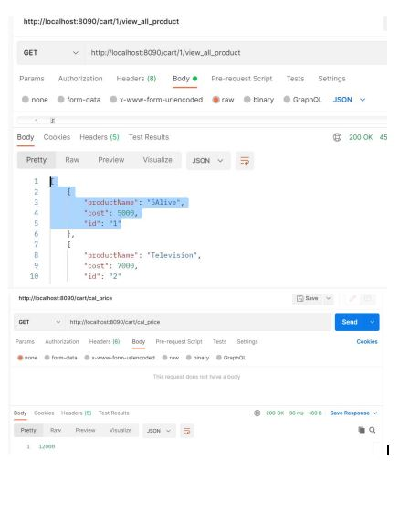
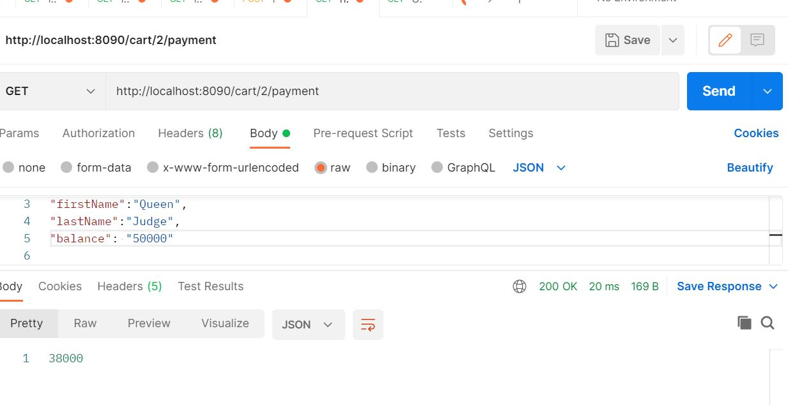

Building a dynamic web app, website, android for mobile or IOS requires the consumption of APIs(Application Programming Interface), most company provides API for carrying out some task, such as building an eCommerce web app, you will call consume an API from the central bank of your country or some established applications like PayPal, Paystack, etc.
<!--More -->
### Introduction
In this tutorial I will guide you through building a basic shopping cart API, this shopping cart shows how an actual shopping cart functions.
In a real web app, you will be consuming APIs into this code that I have created but for now, we have to use actual value as the amount in the shopping cart.
You can always visit this link [Github](https://github.com/kingsleynwafor54/shopping_cart_with_springboot) to review the code base and check the disparity between yours and the tutorial.
#### Prerequisite
1. Intermediate knowledge of Java
2. Full understanding of object-oriented programming in Java
3. a Basic understanding of spring-boot
4. a Basic understanding of postman
#### Objectives
1. To enable beginners in spring-boot find fitting and will be able to do more       projects
2. To serve as a road map for more similar and complex projects
3. To enable beginners to code to interface
4. To enable the reader always to write unit tests on every line of code
#### Setting Your Spring boot
Firstly go to [Spring Boot Initializer](https://start.spring.io/), there you will download a full project with the basic dependencies. The Dependencies for this project are not much, below is a list of what you will fill.
1. Project -> Maven Project
2. Language -> Java
3. Spring boot-> don't use the one with a snapshot, better still use the default 
4. Group-> shopping
5. Artifact->cart
6. Name-> cart
7. Description-> it is for you to explain briefly what your project is all about but for now we will leave it like that.
8. Dependencies-> Search for the following in the search bar and add them to your dependencies for this project.
- Lombok->  
Lombok is a java library that is utilized to limit/eliminate the boilerplate code and save the time of development simply by utilizing a few annotations. Notwithstanding it, it additionally builds the clarity of the source code and saves space.
Lombok gives a bunch of annotations to make our coding life simpler. The following annotations are provided by Lombok: @ToString, @Getter, @Setter, @EqualsAndHashCode,  @NoArgsConstructor,
@AllArgsConstructor,
@RequiredArgsConstructor and @Data.
For the sake of this tutorial, we will focus on @Data. This annotation comprises a couple of other annotations that help you save time, it's like a collection of all of the other annotations except @NoArgsConstructor and @AllArgsConstructor.
- Spring web -> necessary when building a web app
- devtool-> For automatic reloading
9. Packaging -> Jar
10.Java-> 11 or anyone you choose, better still choose the default.
#### Creating Your Entities/Models
Here you create the entities that will relate to the database or the data structure you are mapping your object to if you are not using a database. Before we view the code base of creating our entities let's view what the structure of the entire application will look like
Here you can see the various classes in the package
.
In our models we have the following classes:
- Admin
- Customer
- Product
#### Admin
```java
@Data
public class Admin {
    private Long id;
    private String firstName;
    private String lastName;

    public Admin(Long id, String firstName, String lastName) {
        this.id = id;
        this.firstName = firstName;
        this.lastName = lastName;
    }
}

}
```
#### Customer
```java 
@Data
public class Customer {

    private Long id;
   private String firstName;
   private String lastName;
   private BigDecimal Balance;


    public Customer(Long id, String firstName, String lastName, BigDecimal balance) {
        this.id = id;
        this.firstName = firstName;
        this.lastName = lastName;
        Balance = balance;
    }
}
```
#### Product
```java
@Data
public class Product {
    private String Id;
    private String productName;
    private BigDecimal cost;

    public Product(String id, String productName, BigDecimal cost) {
        Id = id;
        this.productName = productName;

        this.cost = cost;
    }

    public Product() {

    }

    @Override
    public String toString() {
        return "Product{" +
                "Id='" + Id + '\'' +
                ", productName='" + productName + '\'' +
                ", cost=" + cost +
                '}';
    }
}
```
In the model package as stated early in the image provided above, you should have these classes in it. These classes provide the feature, attribute or field we will be needing for the creation of objects.
#### Creating Your Repository
The importance of creating a repository is to map your entity to the database. Creating a repository helps you communicate with the database, it's like you having your database in you code for easy access. Spring-book provides the @Repository annotation that helps the compiler know that this is a gateway to the database.
In the repository package we have the following:
AdminDao
CustomerDao
ProductDao
#### AdminDao
```java
@Repository
public class AdminDao {
    Map<Long, Admin> adminDao=new HashMap<>();
    public Admin registerAdmin(Long id,Admin admin){
      return   adminDao.put(id,admin);
    }
    public void removeAdmin(Long id){
        adminDao.remove(id);
    }
    public Admin getAdmin(Long id){
        return adminDao.get(id);
    }
    public Map<Long,Admin> getAllAdmin(){
        return adminDao;
    }
}
```
#### CustomerDao
```java
@Repository
public class CustomerDao {

    Map<Long, Customer> customerDao=new HashMap<>();
    public Customer registerCustomer(Long id,Customer customer){
       return customerDao.put(id,customer);
    }
    public void removeCustomer(Long id){
        customerDao.remove(id);
    }
    public Customer getCustomer(Long id){
        return customerDao.get(id);
    }

public int totalNumberOfCustomers(){
        return customerDao.size();
}
public Map<Long,Customer> gettingAllTheCustomers(){
        return customerDao;
}

}
```
```java
@Repository
public class productDao {
    Map<Long, Product> productDao=new HashMap<>();
    // The products are stored in the product dao like that of a shelf in the super market
    public void customerCanAddProduct(Long id,Product product){
        productDao.put(id,product);
    }
    public void customerCanRemoveProduct(Long id,Product product){
        productDao.remove(id,product);
    }
    public Product customerCanGetProduct(Long id,Product product){
        return productDao.get(id);
    }
}
```
N/B At the top of the class, you must put the 
@Repository to let spring but know that that particular class is a repository that maps the entities to the database.
#### Creating Service Layer
The service layer is where we create our interface and also implement it. This layer contains all our business logic and you must always but the @Service at either in the interface or the implementation.
We will see the interface and later the implementation.
The service layer contains the following interfaces:
1. cart service
2. data service
#### cart service
```java

public interface cartService {
    void addProductToCartByCustomer(Long id, Product product);
    void addProductToCartByAdmin(Long id, Product product);
    void removeProductsFromCartByCustomer(Long id, Product product);
    void removeProductsFromCartByAdmin(Long id, Product product);
    List<Product> checkAllTheProductsInTheCartByCustomer(Long id);
    List<Product> checkAllTheProductsInTheCartByAdmin(Long id);
    BigDecimal calculatePrice();
    int totalNumberOfItems();
    BigDecimal calculatingPurchase(Long id);
}
}
```
#### dataService
```java
public interface dataService {
    Customer registerCustomer(Customer customer);
    Admin registerAdmin(Admin admin);
    List<Customer> gettingAllCustomers();
    void removeCustomer(Long id);
    void removeAdmin(Long id);
    List<Admin> getAllAdmin();
}
}
```
Now You will see how we code to the interface, any method that is in the interface must correlate to the implementation. In this code, I used the `@Service` in the implementation.
We have the following implementation of the two classes in our interface and they are:
1. CartServiceImpl
2. DataServiceImpl
#### CartService Implementation
```java
@Service
public class CartServiceImpl implements cartService{
    @Autowired
    private CustomerDao customerRepo;
    @Autowired
    private productDao productRepo;
    @Autowired
    private Cart cart;
    @Autowired
    private AdminDao adminDao;

    @Override
    public void addProductToCartByCustomer(Long id, Product product) {
if(customerRepo.getCustomer(id)!=null){

    cart.addToTheCart(product);
}
    }

    @Override
    public void addProductToCartByAdmin(Long id, Product product) {
        if(adminDao.getAdmin(id)!=null){
            cart.addToTheCart(product);
        }
    }

    @Override
    public void removeProductsFromCartByCustomer(Long id, Product product) {
if(customerRepo.getCustomer(id)!=null){
    cart.removeFromCart(product);
}
    }

    @Override
    public void removeProductsFromCartByAdmin(Long id, Product product) {
        if(adminDao.getAdmin(id)!=null){
            cart.removeFromCart(product);
        }
    }

    @Override
    public List<Product> checkAllTheProductsInTheCartByCustomer(Long id) {
        List<Product> productList=new ArrayList<>();
        if (customerRepo.getCustomer(id) != null) {
            productList=cart.displayAllItems();
        }
            return productList;
        }

    @Override
    public List<Product> checkAllTheProductsInTheCartByAdmin(Long id) {
        List<Product> productList=new ArrayList<>();
        if (adminDao.getAdmin(id) != null) {
            productList=cart.displayAllItems();
        }
        return productList;
    }


    @Override
    public BigDecimal calculatePrice() {
        return cart.calculatePriceInCart();
    }


    @Override
    public int totalNumberOfItems() {
        return cart.totalNumberOfProducts();
    }

    @Override
    public BigDecimal calculatingPurchase(Long id) {
        return customerRepo.getCustomer(id).getBalance().subtract(calculatePrice());
    }
}
```
N/B In this code snippet I used descriptive terms to enable you to understand the function of the methods.
#### DataService Implementation
```java
@Service
public class DataServiceImpl implements dataService{
    @Autowired
    private CustomerDao customerRepo;
    @Autowired
    private AdminDao adminRepo;
    @Override
    public Customer registerCustomer(Customer customer) {

        if(customerRepo.getCustomer(customer.getId())==null){
           customer= customerRepo.registerCustomer(customer.getId(),customer);
        }
        else
            System.out.println("Customer Already Exist");
        return customer;
    }


    @Override
    public Admin registerAdmin(Admin admin) {

    if(adminRepo.getAdmin(admin.getId())==null) {

        admin = adminRepo.registerAdmin(admin.getId(), admin);
    }
       else
        System.out.println("Admin Already Exist");
        return admin;

    }

    @Override
    public List<Customer> gettingAllCustomers() {
        List<Customer> customerList=new ArrayList<>();
        for(int counter=1;counter<=customerRepo.gettingAllTheCustomers().size();counter++){
            Long l2= (long) counter;
            customerList.add(customerRepo.getCustomer(l2));
        }
        return customerList;
    }

    @Override
    public void removeCustomer(Long id) {
        if(customerRepo.getCustomer(id)==null){
            System.out.println("Customer does not exist");
        }
        else
            customerRepo.removeCustomer(id);
    }

    @Override
    public void removeAdmin(Long id) {
        if(adminRepo.getAdmin(id)==null){
            System.out.println("Customer does not exist");
        }
        else
            adminRepo.removeAdmin(id);
    }

    @Override
    public List<Admin> getAllAdmin() {
        List<Admin> adminList=new ArrayList<>();
        for(int counter=1;counter<=adminRepo.getAllAdmin().size();counter++){
            Long l2= (long) counter;
            adminList.add(adminRepo.getAdmin(l2));
        }
        return adminList;
    }
}
```
Next up in the agenda is to create a cart package and in the cart package we create a cart object(class) to carry out certain functions with it methods.
#### Cart Package
cart class
```java
@Component
public class Cart {
    //The cart is an aggregation of product
    private List<Product> productCart=new ArrayList<>();
    public void addToTheCart(Product product){
        productCart.add(product);
    }
    public void removeFromCart(String productName) {
        for (Product pro : productCart) {
            if (pro.getProductName().equalsIgnoreCase(productName)) ;
            productCart.remove(pro);
        }

    }
    public int totalNumberOfProducts(){
        return productCart.size();
    }
    public void removeFromCart(Product product){
        productCart.remove(product);
    }
    public BigDecimal calculatePriceInCart(){
        BigDecimal total=BigDecimal.ZERO;
        for(Product product:productCart){
       total= total.add(product.getCost());
        }
   return total;
    }
    public List<Product> displayAllItems(){
       return productCart;
    }
}
```
#### Controller Package
The last package to review is the controller, in the controller we have our end point or apis that connect to the internet all the basic functionalities of your service implementation.
```java
@RestController
@RequestMapping("cart")
public class controller {
    @Autowired
    DataServiceImpl dataService;
    @Autowired
    CartServiceImpl cartService;
   @PostMapping("/create_customer")
   public Customer registerCustomer(@RequestBody Customer customer){
 return  dataService.registerCustomer(customer);
    }
    @GetMapping("/get_all_customers")
    public List<Customer> gettingAllList(){
       return dataService.gettingAllCustomers();
    }

    @PostMapping("/create_admin")
    public Admin registerAdmin(@RequestBody Admin admin){
        return  dataService.registerAdmin(admin);
    }
    @GetMapping("/get_all_admins")
    public List<Admin> getAllAdmin(){
        return dataService.getAllAdmin();
    }
    @PostMapping("/{id}/add_product")
    public void addProducts(@PathVariable Long id ,@RequestBody Product product){
         cartService.addProductToCartByCustomer(id,product);
    }
@GetMapping("/cal_price")
    public BigDecimal calculatingPrice(){
       return cartService.calculatePrice();
}
@GetMapping("/{id}/payment")
    public BigDecimal payment(@PathVariable Long id){
       return cartService.calculatingPurchase(id);
}
@GetMapping("/{id}/view_all_product")
    public List<Product> viewAllProducts(@PathVariable Long id){
       return cartService.checkAllTheProductsInTheCartByCustomer(id);
}
@GetMapping("/{id}/view_all_productAdmin")
    public List<Product> viewAllProduct(@PathVariable Long id){
    return cartService.checkAllTheProductsInTheCartByAdmin(id);
    }
}
```
N/B @POSTMapping is for creating new objects, @GetMapping for retrieving data from the database, @PatchMapping, and PutMapping are for updating, DeleteMapping is for deleting.
In this tutorial, we'll annotate the fields of the class with `@Autowire` annotation to inject the dependency of the object we want to use to avoid initializing a new object but using the very object each time a call is made, throughout the whole code-base.
#### Running the server
```java
@SpringBootApplication
public class ShoppingApplication {

    public static void main(String[] args) {
        SpringApplication.run(ShoppingApplication.class, args);
    }

}
```
You have to click on the play button on the SpringBootApplication to run your server.
#### Unit Testing
Create a class and call it customerTest, use `@Autowire` to insert the dependencies on the Services you want to test.
```java
@SpringBootTest
@Slf4j
public class customerTest {

        @Autowired
        private DataServiceImpl dataService;
        @Autowired
        private CartServiceImpl cart;

        @Autowired
        private CustomerDao customerDao;

    @Test
    void testThatCustomerIsNotNull() {
        Customer customer = new Customer(1L, "Kingsley", "Chukwudi", new BigDecimal("2000"));
        assertNotNull(customer);
    }

    @Test
    void createCustomer() {
       Customer customer=new Customer(1L, "Kingsley", "Chukwudi", new BigDecimal("2000"));
       dataService.registerCustomer(customer);
        assertEquals(1, customerDao.totalNumberOfCustomers());
        customerDao=null;
        cart=null;
    }

    @Test
    void customerCanAddProductToCart() {
        Product product = new Product("1", "Sandine", new BigDecimal(1000));
        Customer customer=new Customer( 1L, "Kingsley", "Chukwudi", new BigDecimal("2000"));
        dataService.registerCustomer(customer);
        cart.addProductToCartByCustomer(1L, product);
        System.out.println(dataService.gettingAllCustomers());
        assertEquals(1, cart.totalNumberOfItems());
        customerDao=null;
        cart=null;
    }

    @Test
    void customerCanRemoveProduct() {
        Product product = new Product("1", "Sandine", new BigDecimal(1000));
        Product product2 = new Product("2", "SandineBread", new BigDecimal(1100));
        Customer customer=new Customer(1L, "Kingsley", "Chukwudi", new BigDecimal("2000"));
        dataService.registerCustomer(customer);
        cart.addProductToCartByCustomer(1L, product);
        cart.addProductToCartByCustomer(1L, product2);
        cart.addProductToCartByCustomer(1L, product);
        assertEquals(3, cart.totalNumberOfItems());
        cart.removeProductsFromCartByCustomer(1L, product);
        assertEquals(2, cart.totalNumberOfItems());
        cart=null;

    }

    @Test
    void calculatingAllTheProductsInTheCart() {
        Product product = new Product("1", "Sandine", new BigDecimal(1000));
        Product product2 = new Product("2", "SandineBread", new BigDecimal(1100));
        Customer customer=new Customer(1L, "Kingsley", "Chukwudi", new BigDecimal("2000"));
        dataService.registerCustomer(customer);
        cart.addProductToCartByCustomer(1L, product);
        cart.addProductToCartByCustomer(1L, product2);
        cart.addProductToCartByCustomer(1L, product);
        assertEquals(3,cart.totalNumberOfItems());

        assertEquals(new BigDecimal( 3100), cart.calculatePrice());
        customerDao=null;
    }
    @Test
    void addProductToCartByAdmin(){
        Product product = new Product("1", "Sandine", new BigDecimal(1000));
        Product product2 = new Product("2", "SandineBread", new BigDecimal(1100));
        Admin admin=new Admin(1L, "Kingsley","Nwafor");
        dataService.registerAdmin(admin);
        cart.addProductToCartByAdmin(1L, product);
        cart.addProductToCartByAdmin(1L, product2);
        cart.addProductToCartByAdmin(1L, product);
        assertEquals(3,cart.totalNumberOfItems());
        cart=null;
    }
    @Test
    void removeProductsFromCartByAdmin(){
        Product product = new Product("1", "Sandine", new BigDecimal(1000));
        Product product2 = new Product("2", "SandineBread", new BigDecimal(1100));
        Admin admin=new Admin(1L, "Kingsley","Nwafor");
        dataService.registerAdmin(admin);
        cart.addProductToCartByAdmin(1L, product);
        cart.addProductToCartByAdmin(1L, product2);
        cart.addProductToCartByAdmin(1L, product);
        System.out.println(cart);
        assertEquals(3,cart.totalNumberOfItems());
        cart.removeProductsFromCartByAdmin(1L,product);
        System.out.println(cart);
        assertEquals(2,cart.totalNumberOfItems());

    }
    @Test
    void checkAllTheProductsInTheCartByCustomer(){
        Product product = new Product("1", "Sandine", new BigDecimal(1000));
        Product product2 = new Product("2", "SandineBread", new BigDecimal(1100));
        Product product3 = new Product("3", "SandineBread", new BigDecimal(1100));
        Admin admin=new Admin(1L, "Kingsley","Nwafor");
        dataService.registerAdmin(admin);
        cart.addProductToCartByAdmin(1L, product);
        cart.addProductToCartByAdmin(1L, product2);
        cart.addProductToCartByAdmin(1L, product3);
        System.out.println(  cart.checkAllTheProductsInTheCartByCustomer(1L));
        cart=null;
    }
    @Test
    void checkAllRegisteredAdmin(){
        Admin admin=new Admin(1L, "Kingsley","Nwafor");
        dataService.registerAdmin(admin);
        System.out.println(dataService.getAllAdmin());
    }
}
```
#### Using Postman to verify the output on the web



#### Conclusion
In the end, we've seen how to code to an interface, how to write a unit test, how to create an endpoint, and also how we used postman to view our endpoint. 
Also, we discussed how we used field dependency injection and not constructor dependency injection which will still suffice, we also took a deep dive into creating APIs that adds and also get customers, admins, then we also added products to our cart and the cart could calculate the cost of products in the cart since the products have an attribute of price.
In this tutorial, we didn't integrate any other API for an actual business transaction that either works with your bank account or your credit card, hopefully, we'll work on that in the next tutorial and the use of an actual database that could be used in the real-life event.
Once again you can check [Github](https://github.com/kingsleynwafor54/shopping_cart_with_springboot) for more on the entire code structure in case you want to save time from copying code or you have an error maybe you miss-spelled or you didn't add a certain dependency etc. Thanks for staying with me all the way, do have a nice time.
#### Referrence
[Rapidapi](https://rapidapi.com/section.io/api/section-io/details)

[Getting Started with Stripe-springboot](https://www.section.io/engineering-education/stripe-springboot/).
#### Happy coding!