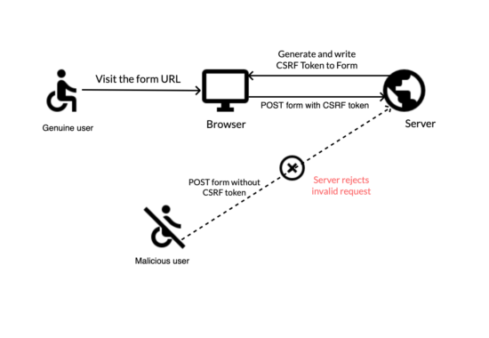
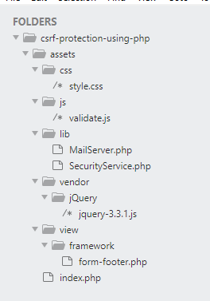
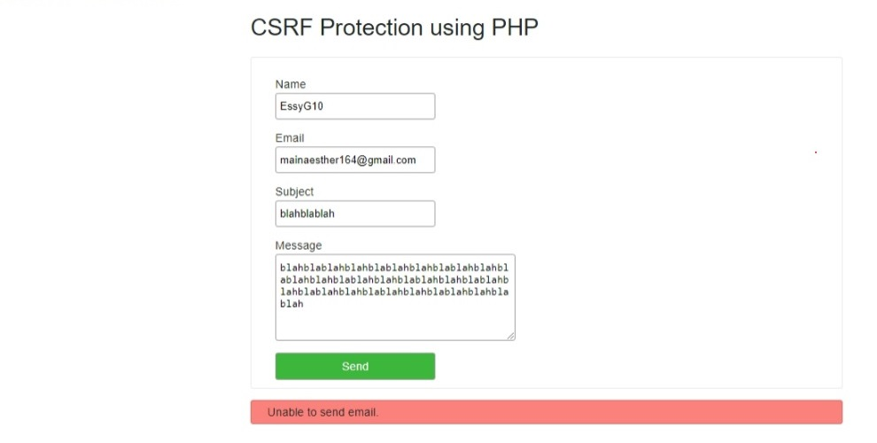

### Introduction

Cross-Site Request Forgery (CSRF) assault is a typical security misuse that occurs throughout the Internet. Ensuring a web server against this assault is a first-level assurance system in securing your site.
Noxious clients over the web used to clone solicitations to assault weak web servers. This cloning might occur by implanting the malevolent webpage connect to the client's page.
Hostility to CSRF execution lessens the weakness of the site. With this assurance, the site rejects noxious access that sends demands with no or wrong CSRF token.
The symbolic representation below presents the client's demand for approval against the CSRF assault. On the off chance that an authentic client posts the structure with the appropriate token, the worker measures the solicitation. It dismisses something else, without the CSRF token boundary.

In this educational exercise, we will see a model code of PHP contact form with CSRF affirmation. With this assurance, it guarantees the validity of the solicitation before preparing it.
I have made assistance in PHP to manage the security endorsement against the CSRF attack. Inquiries from clients without a token or with an erroneous token will be rejected by the domain controller.

### Table of contents

- [Introduction](#introduction)
- [About the Example](#about-the-example)
- [Produce CSRF token and make PHP session](#produce-csrf-token-and-make-php-session)
- [Render contact form structure with CSRF token](#render-contact-form-structure-with-csrf-token)
- [Anti Cross-Site Request Forgery (CSRF) approval in PHP](#anti-cross-site-request-forgery-approval-in-php)

- [Security administration to produce, embed, approve CSRF token](#security-administration-to-produce-embed-approve-csrf-token)

- [Yield: CSRF approval reaction from server](#yield-csrf-approval-reaction-from-server)
- [Conclusion](#conclusion)

### About the example

- [view source code](https://github.com/EssyG10/csrf-protection-using-php)

This code executes Anti CSRF insurance in a PHP contact structure. It delivers a contact structure. This structure post overseers approve the client demands against CSRF assault.
On stacking the greeting page, the PHP script produces the CSRF token. The structure footer will have this token as a secret field. Additionally, it deals with the token in a PHP meeting.
On posting the structure fields, the PHP code will check for the CSRF token boundary. Whenever discovered, then, at that point it approves it will the token from the meeting.
Assuming the client sends a solicitation without a CSRF token, the worker will dismiss the solicitation. Additionally, if the token isn't coordinated with the token from the meeting, the worker will dismiss the solicitation.
On fruitful CSRF token approval, it will send the contact email to the objective location.

- Below is the file structure of this example.
  

### Produce CSRF token and make PHP session

On a point of arrival, the structure footer script summons SecurityService. This is a PHP class to create a CSRF token.
It composes the token into a PHP session for future reference. It will help at the hour of handling the CSRF approval after the structure post.
The structure footer is a system document that heaps the produced token into a secret field.
The underneath code bit is from the `SecurityService.php` to create a CSRF token. The total code of the assistance class is displayed in the impending segment of this article.

```php
 public function generateCSRFToken()
    {
        if (empty($this->session[$this->sessionTokenLabel])) {
            $this->session[$this->sessionTokenLabel] = bin2hex(openssl_random_pseudo_bytes(32));
        }

        if ($this->hmac_ip !== false) {
            $token = $this->hMacWithIp($this->session[$this->sessionTokenLabel]);
        } else {
            $token = $this->session[$this->sessionTokenLabel];
        }
        return $token;
    }

```

### Render contact form structure with CSRF token

This is a contact structure HTML form with the standard fields name, email, subject, and message. Added to that, it has a secret field csrf-token with the produced token.
The submit activity measures jQuery structure approval before presenting the boundaries on the PHP.
The customer-side approval script handles the fundamental approval on submit. It applies the not-unfilled beware of each field.

- assets/index.php(contact form Template)

```php
<!DOCTYPE html>
<html lang="en">
<head>
    <meta charset="UTF-8">
    <meta http-equiv="X-UA-Compatible" content="IE=edge">
    <meta name="viewport" content="width=device-width, initial-scale=1.0">
    <link rel="stylesheet" href="assests/css/style.css">
    <title>CSRF Protection using PHP</title>
</head>
<body>
    <div class="container">
    <h1>CSRF Protection using PHP</h1>
    <form name="contact-form" id="contact-fm" class="c-form"
       method="POST" action="" enctype="multipart/form-data"
      onsubmit="return validateContactForm()">

      <div class="row">
        <div class="label">
          Name <span id="userName-info" class="validation-message"></span>
        </div>
        <input type="text" class="inpt" name="userName"
          id="userName"
          value="<?php if(!empty($_POST['userName'])&& $type == 'error'){ echo $_POST['userName'];}?>" />
      </div>
      <div class="row">
        <div class="label">
          Email <span id="userEmail-info" class="validation-message"></span>
        </div>
        <input type="text" class="inpt" name="userEmail"
          id="userEmail"
          value="<?php if(!empty($_POST['userEmail'])&& $type == 'error'){ echo $_POST['userEmail'];}?>" />
      </div>
      <div class="row">
        <div class="label">
          Subject <span id="subject-info" class="validation-message"></span>
        </div>
        <input type="text" class="inpt" name="subject" id="subject"
          value="<?php if(!empty($_POST['subject'])&& $type == 'error'){ echo $_POST['subject'];}?>" />
      </div>
      <div class="row">
        <div class="label">
          Message <span id="userMessage-info" class="validation-message"></span>
        </div>
        <textarea name="content" id="content" class="inpt" cols="60"
          rows="6"><?php if(!empty($_POST['content'])&& $type == 'error'){ echo $_POST['content'];}?></textarea>
      </div>
      <div class="row">
        <input type="submit" name="send" class="send-button" value="Send" />
      </div>

      <?php require_once __DIR__ . '/view/framework/form-footer.php';?>
      <?php if(!empty($message)) { ?>
    <div id="message" class="<?php  echo $type; ?>"><?php if(isset($message)){ ?>
            <?php echo $message; }}?>
                    </div>
    </form>
    </div>
    <script src="assets/js/validate.js"></script>
</body>
</html>

```

This is the structure footer script that triggers the help overseer to produce tokens. The `insertHiddenToken()` composes HTML code to stack the csrf token field into the structure.

- assests/view/framework/form-footer.php

```php
<?php
require_once __DIR__ . '/../../lib/SecurityService.php';
$antiCSRF = new\lib\SecurityService\securityService();
$antiCSRF->insertHiddenToken();
```

assets/js/validation.js

```javascript
function validateContactForm() {
  var valid = true;
  $("#userName").removeClass("error-field");
  $("#userEmail").removeClass("error-field");
  $("#subject").removeClass("error-field");
  $("#content").removeClass("error-field");

  $("#userName-info").html("").hide();
  $("#userEmail-info").html("").hide();
  $("#subject-info").html("").hide();
  $("#content-info").html("").hide();

  $(".validation-message").html("");
  $(".inpt").css("border", "#e0dfdf 1px solid");

  var userName = $("#userName").val();
  var userEmail = $("#userEmail").val();
  var subject = $("#subject").val();
  var content = $("#content").val();

  if (userName.trim() == "") {
    $("#userName-info").html("required.").css("color", "#ee0000").show();
    $("#userName").css("border", "#e66262 1px solid");
    $("#userName").addClass("error-field");

    valid = false;
  }
  if (userEmail.trim() == "") {
    $("#userEmail-info").html("required.").css("color", "#ee0000").show();
    $("#userEmail").css("border", "#e66262 1px solid");
    $("#userEmail").addClass("error-field");

    valid = false;
  }
  if (!userEmail.match(/^([\w-\.]+@([\w-]+\.)+[\w-]{2,4})?$/)) {
    $("#userEmail-info")
      .html("invalid email address.")
      .css("color", "#ee0000")
      .show();

    $("#userEmail").css("border", "#e66262 1px solid");
    $("#userEmail").addClass("error-field");

    valid = false;
  }

  if (subject == "") {
    $("#subject-info").html("required.").css("color", "#ee0000").show();
    $("#subject").css("border", "#e66262 1px solid");
    $("#subject").addClass("error-field");

    valid = false;
  }
  if (content == "") {
    $("#userMessage-info").html("required.").css("color", "#ee0000").show();
    $("#content").css("border", "#e66262 1px solid");
    $("#content").addClass("error-field");

    valid = false;
  }

  if (valid == false) {
    $(".error-field").first().focus();
    valid = false;
  }
  return valid;
}
```

### Anti Cross-Site Request Forgery approval in PHP

On presenting the token-installed contact structure, the structure-activity executes the accompanying content.

The SecuritySercive's `validate()` work contrasts the posted token and the one put away in the meeting.

If a match is discovered, it will continue further to send the contact email. Else, it will recognize the client with a mistake message.

```php
<?php
use lib\MailService;

session_start();
if (! empty($_POST['send'])) {
    require_once __DIR__ . '/lib/SecurityService.php';
    $antiCSRF = new \lib\SecurityService\securityService();
    $csrfResponse = $antiCSRF->validate();
    if (! empty($csrfResponse)) {
        require_once __DIR__ . '/lib/MailService.php';
        $mailService = new MailService();
        $response = $mailService->sendContactMail($_POST);
        if (! empty($response)) {
            $message = "Hi, we have received your message. Thank you.";
            $type = "success";
        } else {
            $message = "Unable to send email.";
            $type = "error";
        }
    } else {
        $message = "Security alert: Unable to process your request.";
        $type = "error";
    }
}

?>
```

### Security administration to produce, embed, approve CSRF token

This help class made in PHP incorporates techniques to handle the CSRF insurance-related activities.
It characterizes a class property to set the structure token field name, session file.
It has techniques to produces tokens and keep in touch with them in the HTML and a PHP session.
It utilizes XSS alleviations while composing the structure footer with the token.
Additionally, it has the choice to reject a few URLs from the approval interaction. The barred URLs sidestep the CSRF approval measure.
The code gets the current solicitation URL from the PHP SERVER factors. Then, at that point, it contrasts it and the variety of barred URLs to skirt the approval.

- assets/lib/SecurityService.php

```php
class securityService
{

    private $formTokenLabel = 'eg-csrf-token-label';

    private $sessionTokenLabel = 'EG_CSRF_TOKEN_SESS_IDX';

    private $post = [];

    private $session = [];

    private $server = [];

    private $excludeUrl = [];

    private $hashAlgo = 'sha256';

    private $hmac_ip = true;

    private $hmacData = 'ABCeNBHVe3kmAqvU2s7yyuJSF2gpxKLC';
    public function __construct($excludeUrl = null, &$post = null, &$session = null, &$server = null)
    {
        if (! \is_null($excludeUrl)) {
            $this->excludeUrl = $excludeUrl;
        }
        if (! \is_null($post)) {
            $this->post = & $post;
        } else {
            $this->post = & $_POST;
        }

        if (! \is_null($server)) {
            $this->server = & $server;
        } else {
            $this->server = & $_SERVER;
        }

        if (! \is_null($session)) {
            $this->session = & $session;
        } elseif (! \is_null($_SESSION) && isset($_SESSION)) {
            $this->session = & $_SESSION;
        } else {
            throw new \Error('No session available for persistence');
        }
    }
    public function insertHiddenToken()
    {
        $csrfToken = $this->getCSRFToken();

        echo "<!--\n--><input type=\"hidden\"" . " name=\"" . $this->xssafe($this->formTokenLabel) . "\"" . " value=\"" . $this->xssafe($csrfToken) . "\"" . " />";
    }
    public function xssafe($data, $encoding = 'UTF-8')
    {
        return htmlspecialchars($data, ENT_QUOTES | ENT_HTML401, $encoding);
    }
    public function getCSRFToken()
    {
        if (empty($this->session[$this->sessionTokenLabel])) {
            $this->session[$this->sessionTokenLabel] = bin2hex(openssl_random_pseudo_bytes(32));
        }

        if ($this->hmac_ip !== false) {
            $token = $this->hMacWithIp($this->session[$this->sessionTokenLabel]);
        } else {
            $token = $this->session[$this->sessionTokenLabel];
        }
        return $token;
    }
    private function hMacWithIp($token)
    {
        $hashHmac = \hash_hmac($this->hashAlgo, $this->hmacData, $token);
        return $hashHmac;
    }

    private function getCurrentRequestUrl()
    {
        $protocol = "http";
        if (isset($this->server['HTTPS'])) {
            $protocol = "https";
        }
        $currentUrl = $protocol . "://" . $this->server['HTTP_HOST'] . $this->server['REQUEST_URI'];
        return $currentUrl;
    }
    public function validate()
    {
        $currentUrl = $this->getCurrentRequestUrl();
        if (! in_array($currentUrl, $this->excludeUrl)) {
            if (! empty($this->post)) {
                $isAntiCSRF = $this->validateRequest();
                if (! $isAntiCSRF) {
                    return false;
                }
                return true;
            }
        }
    }
    public function isValidRequest()
    {
        $isValid = false;
        $currentUrl = $this->getCurrentRequestUrl();
        if (! in_array($currentUrl, $this->excludeUrl)) {
            if (! empty($this->post)) {
                $isValid = $this->validateRequest();
            }
        }
        return $isValid;
    }

    public function validateRequest()
    {
        if (! isset($this->session[$this->sessionTokenLabel])) {
            return false;
        }

        if (! empty($this->post[$this->formTokenLabel])) {
            $token = $this->post[$this->formTokenLabel];
        } else {
            return false;
        }

        if (! \is_string($token)) {
            return false;
        }
        if ($this->hmac_ip !== false) {
            $expected = $this->hMacWithIp($this->session[$this->sessionTokenLabel]);
        } else {
            $expected = $this->session[$this->sessionTokenLabel];
        }

        return \hash_equals($token, $expected);
    }
    public function unsetToken()
    {
        if (! empty($this->session[$this->sessionTokenLabel])) {
            unset($this->session[$this->sessionTokenLabel]);
        }
    }
}
```

This `MailService.php` utilizes the PHP center mail() capacity to send the contact messages. You might supplant this with the SMTP employing an email sending script.

- assets/lib/MailService.php

```php
<?php
namespace lib;

class MailService
{

    function sendContactMail($postValues)
    {
        $name = $postValues["userName"];
        $email = $postValues["userEmail"];
        $subject = $postValues["subject"];
        $content = $postValues["content"];

        $toEmail = "ADMIN EMAIL";
        $mailHeaders = "From: " . $name . "(" . $email . ")\r\n";
        $response = mail($toEmail, $subject, $content, $mailHeaders);

        return $response;
    }
}
```

### Yield: CSRF approval reaction from server

Beneath the contact form structure interface, this screen capture shows the security ready message in red. It recognizes the clients who send demands with some unacceptable or void token.


### Conclusion

Accordingly, we have executed the counter CSRF assurance in a PHP contact structure.
I expect that the model code is helpful and you get the execution interaction we examined here.
We have made a SecurityService class in PHP to deal with CSRF insurance. It is reusable for a few applications at any place you need to empower CSRF insurance.
The PHP code that profits reaction messages recognize the client appropriately.

Happy Coding !
