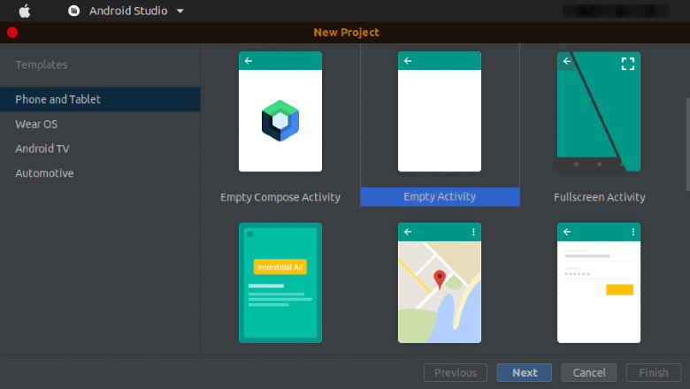
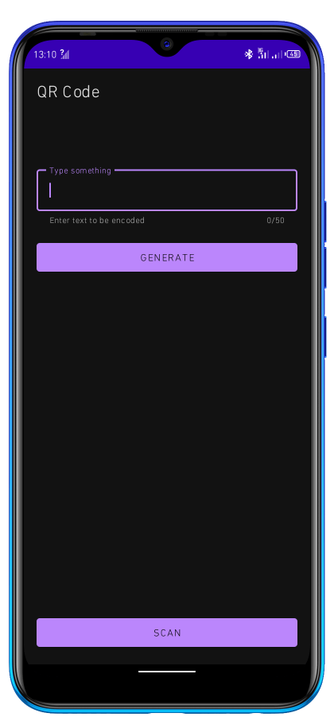
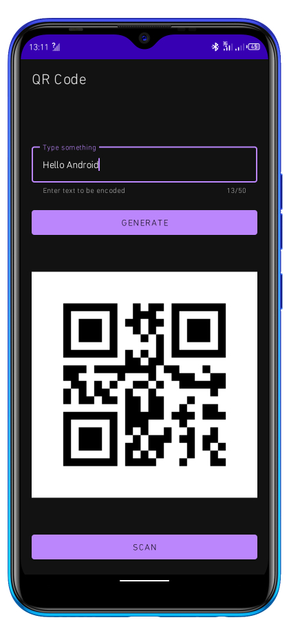
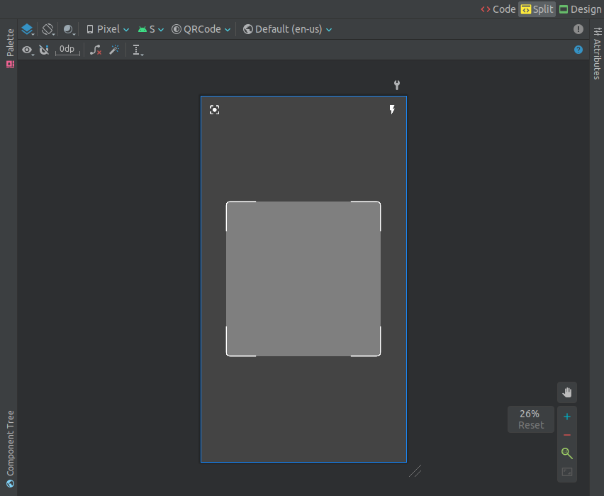
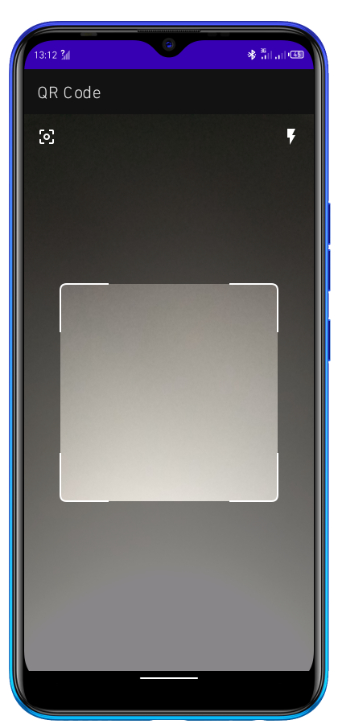
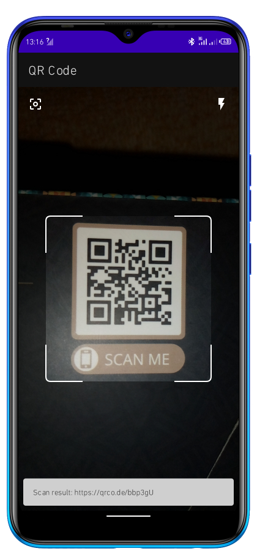

### Introduction
QR codes are a form of barcode, or scannable series, that can store a range of data, including web links, credit card info, contact information, and even freebies. To analyze information in a machine-readable format, many apps use QR codes. These patterns are used to encode information in a format that only machines, not humans, can understand.

In this tutorial, we will learn how to generate QR codes to store simple text format data in an Android application.

#### Why use Quick Response Code?
QR codes have the following advantages:
1. Unlike other barcodes, they are not subject to the same security risks as traditional barcodes.
2. QR codes hold large amounts of data -over 2000 characters.
3. They minimize processing errors since they are difficult to tamper with.
4. Unlike the traditional BarCode, QR codes stores data in 2D (both vertically and horizontally).

### Prerequisites
To follow through this tutorial, you'll need to be conversant with:
- Creating Android apps with the Kotlin programming language
- Imperative paradigm in Android (XML)
- ViewBinding
- Android permissions

### Creating an Android project
Run Android Studio and build a new `Empty Activity` project named `QR Code`.



### Setting up the project
Before we get into coding, let's first enrich our project in the following ways.

#### Add Camera Permission
Android OS prohibits the use of the camera without authorization. Since we'll need it when scanning a QR code, add the following permission in the manifest file.

```xml
<manifest xmlns:android="http://schemas.android.com/apk/res/android"
    package="com.demo.qrcode">

    <uses-permission android:name="android.permission.CAMERA" />

</manifest>
```

#### Add required dependencies and repositories

**ZXing Library**
`ZXing` (an acronym for "Zebra Crossing") -is Google's open-source, multi-format 1D/2D bar-code image processing tool built with Java and is compatible with other programming languages.

```gradle
implementation 'com.google.zxing:core:3.4.0'
implementation 'com.journeyapps:zxing-android-embedded:4.1.0'
```

**Budiyev Code Scanner**
This library offers an easy-to-use API that has a ready-made code scanner with additional control buttons.

```gradle
implementation 'com.github.yuriy-budiyev:code-scanner:2.1.0'
```

**JitPack Repository**
Due to `jcenter()` deprecation, Budiyev code scanner developers recommend using `jitpack.io` repository as they plan to migrate to `mavenCentral()`.

```gradle
// in the top-level build.gradle file
repositories {
    ...

    maven { url 'https://jitpack.io' }
}
```

**ViewBinding**
Easily access views in the UI in a safer way.

```gradle
android{
    ...

     buildFeatures{
        viewBinding true
    }
}
```

#### System requirements
ZXing creators recommend using Android API-24 as the minimum SDK version when working with ZXing. Failure to do this, the app won't compile.

```kotlin
android {
    ...

    defaultConfig {
        ...
        
        minSdk 24

    }
}
```

### Data Encoding/Encryption
To illustrate how QR code decoding works, we are going to create one activity named `GenerateQR` and its corresponding XML file named `activity_generate_qr`. You can also rename the default, `MainActivity.kt` and its XML file.

#### activity_generate_qr.xml

```xml
<?xml version="1.0" encoding="utf-8"?>
<androidx.constraintlayout.widget.ConstraintLayout xmlns:android="http://schemas.android.com/apk/res/android"
    xmlns:app="http://schemas.android.com/apk/res-auto"
    xmlns:tools="http://schemas.android.com/tools"
    android:layout_width="match_parent"
    android:layout_height="match_parent"
    android:padding="16dp">

    <com.google.android.material.textfield.TextInputLayout
        android:id="@+id/textInputLayout"
        style="@style/Widget.MaterialComponents.TextInputLayout.OutlinedBox"
        android:layout_width="match_parent"
        android:layout_height="wrap_content"
        android:layout_marginVertical="50dp"
        app:counterEnabled="true"
        app:counterMaxLength="50"
        app:helperText="Enter text to be encoded"
        app:layout_constraintEnd_toEndOf="parent"
        app:layout_constraintStart_toStartOf="parent"
        app:layout_constraintTop_toTopOf="parent">

        <com.google.android.material.textfield.TextInputEditText
            android:id="@+id/inputText"
            android:layout_width="match_parent"
            android:layout_height="wrap_content"
            android:hint="Type something"
            tools:text="Hello Android" />
    </com.google.android.material.textfield.TextInputLayout>

    <Button
        android:id="@+id/btnGenerateQRCode"
        android:layout_width="0dp"
        android:layout_height="wrap_content"
        android:layout_marginVertical="16dp"
        android:text="Generate"
        app:layout_constraintEnd_toEndOf="@+id/textInputLayout"
        app:layout_constraintStart_toStartOf="@+id/textInputLayout"
        app:layout_constraintTop_toBottomOf="@+id/textInputLayout" />

    <ImageView
        android:id="@+id/ivOutput"
        android:layout_width="match_parent"
        android:layout_height="0dp"
        android:layout_marginVertical="16dp"
        android:adjustViewBounds="true"
        app:layout_constraintBottom_toTopOf="@+id/btnScan"
        app:layout_constraintEnd_toEndOf="parent"
        app:layout_constraintStart_toStartOf="parent"
        app:layout_constraintTop_toBottomOf="@+id/btnGenerateQRCode"
        tools:src="@tools:sample/avatars" />

    <Button
        android:id="@+id/btnScan"
        android:layout_width="match_parent"
        android:layout_height="wrap_content"
        android:text="Scan"
        app:layout_constraintBottom_toBottomOf="parent"
        app:layout_constraintEnd_toEndOf="parent"
        app:layout_constraintStart_toStartOf="parent" />
</androidx.constraintlayout.widget.ConstraintLayout>
```
In the above code, we have created a text input field, two buttons, and an ImageView -where the QR Code will be displayed.

Preview:



#### GenerateQR.kt
This is where the logic to generate a QR code is applied. This class aims to encode the input (text) into a BitMap and display it in the ImageView.

**Set Click Listener using ViewBinding**

```kotlin
private var _genQRBinding: ActivityGenerateQrBinding? = null
private val genQRBinding get() = _genQRBinding!!

override fun onCreate(savedInstanceState: Bundle?) {
    super.onCreate(savedInstanceState)
    _genQRBinding = ActivityGenerateQrBinding.inflate(layoutInflater)
    setContentView(genQRBinding.root)

    // Handle button clicks
    genQRBinding.btnGenerateQRCode.setOnClickListener {
        val input = genQRBinding.inputText.text!!.toString().trim()
        genQRBinding.ivOutput.setImageBitmap(generateQRCode(input))
    }

    genQRBinding.btnScan.setOnClickListener {
        // This activity will be created later
        startActivity(Intent(this, ScanQR::class.java))
    }
}
```

**Generate QR Code**

```kotlin
private fun generateQRCode(inputText: String?): Bitmap? {
    val writer = MultiFormatWriter()
    var bitmap: Bitmap? = null

    if (!inputText.isNullOrEmpty()) {
        try {
            // init bit matrix
            val matrix = writer.encode(inputText, BarcodeFormat.QR_CODE, 350, 350)
            // init barcode encoder
            val encoder = BarcodeEncoder()
            // generate bitmap
            bitmap = encoder.createBitmap(matrix)
        } catch (e: WriterException) {
            // log error here
            Log.e("GENERATE QR CODE ACTIVITY", e.toString())
        }
    } else {
        genQRBinding.textInputLayout.error = "* required"
    }
    return bitmap
}
```

**Explanation:**
In the code above, we have captured the text entered by the user and encoded it into a square BitMap. If the input is not empty, the function returns a BitMap, otherwise it returns null and an error message is displayed in the textField.

In case an error occurs during the encoding process, the exception is displayed on the logCat for easy debugging.

`Matrix` - A data matrix is a two-dimensional code made up of white and black cells organized in a square arrangement (rectangular ones also exist). The number of columns and rows grows in proportion to the quantity of data stored in the code. 

Using the encoder provided by ZXing, the matrix is converted into a BitMap.

Upon running the app, you should see something similar to this:



That's all about generating QR codes from texts (Strings).

### Data Decoding/Decryption

Moving on, let's look at how we can scan an already existing QR Code. This is the reverse of encoding.

> NOTE: You can scan any QR code including the ones generated by other systems. The decoding algorithm will always produce the same data.

Create one more activity named `ScanQR` and its corresponding XML file named `activity_scan_qr` 

### activity_scan_qr.xml

```xml
<?xml version="1.0" encoding="utf-8"?>
<androidx.constraintlayout.widget.ConstraintLayout xmlns:android="http://schemas.android.com/apk/res/android"
    xmlns:app="http://schemas.android.com/apk/res-auto"
    android:layout_width="match_parent"
    android:layout_height="match_parent">

    <com.budiyev.android.codescanner.CodeScannerView
        android:id="@+id/codeScannerView"
        android:layout_width="match_parent"
        android:layout_height="match_parent"
        app:autoFocusButtonColor="@android:color/white"
        app:autoFocusButtonVisible="true"
        app:flashButtonColor="@android:color/white"
        app:flashButtonVisible="true"
        app:frameAspectRatioHeight="1"
        app:frameAspectRatioWidth="1"
        app:frameColor="@android:color/white"
        app:frameCornersRadius="8dp"
        app:frameCornersSize="60dp"
        app:frameSize="0.75"
        app:frameThickness="2dp"
        app:maskColor="#75000000" />

</androidx.constraintlayout.widget.ConstraintLayout>
```

The above code generates a code scanner used to capture a picture when correctly aligned with the frame. This code scanner provides two action buttons -the focus button and the flashlight button. The two can the enabled by altering the respective values in the attributes or using the scanner properties .

preview:



### ScanQR.kt file
Unlike when generating a QR code, scanning involves several stages discussed below.

#### i). Set up ViewBinding and CodeScanner
Inflate the UI and define code scanner variable.

```kotlin
private lateinit var scanBinding: ActivityScanQrBinding
private var codeScanner: CodeScanner? = null

override fun onCreate(savedInstanceState: Bundle?) {
    super.onCreate(savedInstanceState)
    scanBinding = ActivityScanQrBinding.inflate(layoutInflater)
    setContentView(scanBinding.root)

    checkPermissions()
}
```

#### ii). Check permissions
As mentioned earlier, we need to request permission from the system to use the camera.

```kotlin
private fun checkPermissions() {
    if (ContextCompat.checkSelfPermission(this, android.Manifest.permission.CAMERA) ==
        PackageManager.PERMISSION_GRANTED
    ) {
        initiateScan()
    } else {
        // request for Camera permission
        ActivityCompat.requestPermissions(this, arrayOf(android.Manifest.permission.CAMERA), 1)
    }
}
```

#### iii). Handle Permission CallBack
This is called immediately the permission dialog is dismissed. If the user grants the requested permission, the scanner is activated, otherwise, it stays inactive.

```kotlin
override fun onRequestPermissionsResult(
    requestCode: Int,
    permissions: Array<out String>,
    grantResults: IntArray
) {
    super.onRequestPermissionsResult(requestCode, permissions, grantResults)
    if (requestCode == 1) {
        if (grantResults[0] == PackageManager.PERMISSION_GRANTED) {
            Toast.makeText(this, "Permission granted", Toast.LENGTH_SHORT).show()
            initiateScan()
        } else {
            Toast.makeText(this, "Permission denied", Toast.LENGTH_SHORT).show()
        }
    }
}
```

#### iv). Initialize a Scan process

**Assign Scanner**
This involves instantiating the `CodeScanner` class by passing the context and the code scanner view. This object is used all through the scanning process and each process has a new object except when the app is not fully killed.

```kotlin
val scannerView = scanBinding.codeScannerView
codeScanner = CodeScanner(this, scannerView)
```

**Default Scanner values**
The following are the default values that the code scanner takes. You can use the dot (.) notation to see the available options/values.

```kotlin
codeScanner?.camera = CodeScanner.CAMERA_BACK
codeScanner?.formats = CodeScanner.ALL_FORMATS

codeScanner?.apply {
    isAutoFocusEnabled = true
    isFlashEnabled = false
    autoFocusMode = AutoFocusMode.SAFE
    scanMode = ScanMode.SINGLE
}
```

**Decode Callback (Results)**
The following code is called after a code is captured. Note that to capture a QR code successfully, it must be aligned it the scanner flame.

> 💡 TIP: The orientation does not matter 😎

```kotlin
codeScanner!!.decodeCallback = DecodeCallback {
    runOnUiThread {
        Snackbar.make(scannerView, "Scan result: ${it.text}", 5000).show()
    }
}
```

The result is displayed in a Snackbar that lasts for five seconds.

**Handle decryption error(s)**

```kotlin
codeScanner?.errorCallback = ErrorCallback {
    runOnUiThread {
        Toast.makeText(
            this, "Camera initialization error: ${it.message}",
            Toast.LENGTH_LONG
        ).show()
    }
}
```

This runs whenever an error occurs when decoding. In most cases, if for some reason the QR code is not decode-able, the scanner tends to ignore it. This way, you'll rarely get exceptions.

**Restart Scan when the Scanner is tapped**

```kotlin
scannerView.setOnClickListener {
    codeScanner!!.startPreview()
}
```

#### Combine the above sections into one function

```kotlin
private fun initiateScan() {
    val scannerView = scanBinding.codeScannerView
    codeScanner = CodeScanner(this, scannerView)

    // The default values
    codeScanner?.camera = CodeScanner.CAMERA_BACK
    codeScanner?.formats = CodeScanner.ALL_FORMATS

    codeScanner?.apply {
        isAutoFocusEnabled = true
        isFlashEnabled = false
        autoFocusMode = AutoFocusMode.SAFE
        scanMode = ScanMode.SINGLE
    }

    // Decode Callback (Results)
    codeScanner!!.decodeCallback = DecodeCallback {
        runOnUiThread {
            Snackbar.make(scannerView, "Scan result: ${it.text}", 5000).show()
        }
    }
    // Error CallBack
    codeScanner?.errorCallback = ErrorCallback {
        runOnUiThread {
            Toast.makeText(
                this, "Camera initialization error: ${it.message}",
                Toast.LENGTH_LONG
            ).show()
        }
    }

    scannerView.setOnClickListener {
        codeScanner!!.startPreview()
    }
}
```

#### Handle Android lifecycle Callbacks

```kotlin
// When the app resumes
override fun onResume() {
    super.onResume()
    codeScanner?.startPreview()
}
```

```kotlin
// just before the app is paused
override fun onPause() {
    codeScanner?.releaseResources()
    super.onPause()
}
```

### Run the App
Upon running the app, navigate to `ScanQR` activity and you should expect to see a QR code scanner similar to the one below:





### Conclusion
In this tutorial, we've covered the basics of how to encode data using quick response (QR) codes in an Android app. We've also learned how to use a `CodeScanner` to scan/decode QR codes. The knowledge gained in this tutorial can be applied to other scenarios where QR codes are used. Keep learning and stay safe!

Happy coding!