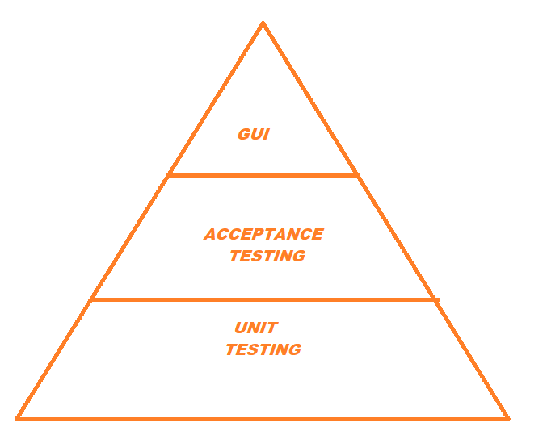
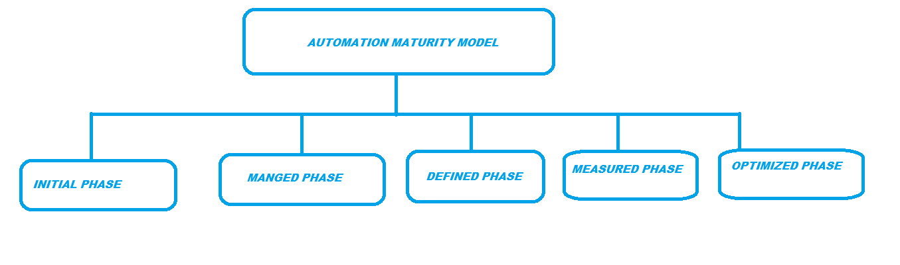

### Introduction 
Test robotization is the foundation of DevOps culture. While a ton of establishments have understood its need and importance for quite a while presently, the breakout of the COVID-19 pandemic has driven them to accept mechanized testing all through the SDLC for CI/CD. Nonetheless, the desperate requirement for cutting edge test robotization, attributable to the work from home the truth is making the test computerization execution testing. 
In IT organizations, designers, engineers in the tasks office and analyzers wear many caps, with different obligations and occupation profiles as they all work in particular working units as isolated bodies. Henceforward, the basic inquiry is whether QA can upgrade and provoke item conveyance by joining these particular bunches under the DevOps banner. What's more, on the off chance that it thus, then, at that point, the inquiry is how to consolidate robotized testing situations. This article will endeavor to address this multitude of inquiries and give steps to set up a hearty testing robotization methodology. 
### Table of content 
- [Introduction](#introduction)
- [Table of content](#table-of-content)
- [Why is having a test robotization procedure essential for CI/CD?](#why-is-having-a-test-robotization-procedure-essential-for-cicd)
- [Six ventures to construct a fruitful CI test computerization procedure](#six-ventures-to-construct-a-fruitful-ci-test-computerization-procedure)
  - [Define your projects extent of mechanization](#define-your-projects-extent-of-mechanization)
  - [Choose the fitting testing robotization tool](#choose-the-fitting-testing-robotization-tool)
  - [Set up your own cloud based test climate](#set-up-your-own-cloud-based-test-climate)
  - [Conduct an experiment hazard appraisal](#conduct-an-experiment-hazard-appraisal)
  - [Run and oversee experiments](#run-and-oversee-experiments)
  - [Analyze ceaselessly and redesign the methodology for development](#analyze-ceaselessly-and-redesign-the-methodology-for-development)
- [Benefits of test computerization](#benefits-of-test-computerization)
- [Conclusion](#conclusion)

### Why is having a test robotization procedure essential for CI/CD?
Automated testing is the chief move the right way when you set out on your robotization adventure. Nevertheless, for reliable transport to be correct a solid match for the designer, you truly need to create a quick and perpetual analysis part. But, just tolerating the DevOps test computerization part isn't good, considering the way that to achieve compelling CI/CD complete it precisely. 
A piece of the genuine instances of the best advancement disillusionments shows what can happen when adequate testing isn't done on independent structures/programming. For instance, 
> On April 26, 1994, a plane named Airbus A300B4-622R was finishing its standard flight plan, when not long before its landing in Nagoya Airport it crushed, causing a significant misfortune count of 264 people. To date, the setback remains as maybe the most dangerous fiascos all through the whole presence of China Airlines. 
> Similarly, on August 14, 2003, after 2:00 PM, a high-voltage power line in northern Ohio brushed against some blocked trees and shut down absolutely, obliging 50 billion people to live without power for two days. The ready system frustration achieved by programming issues made it likely the best blackout in North American history.
### Six ventures to construct a fruitful CI test computerization procedure
#### Define the extent of your project of mechanization 
The underlying advance is to dissect the degree of your endeavor as indicated by a robotization point of view. 
Here, all assumptions, endeavors, and runs ought to be obvious by the item bunch, including its intervals of time. 
The focal thought for motorizing tests is to know which ones to robotize. You can't robotize everything, so you should organize your requirements, which will ultimately achieve higher ROI. One of the outstanding models that can help you in shortlisting tests for computerization is Mike Cohen's test robotization pyramid, which consolidates: 
1. Unit test 
2. Acceptance test 
3. User Interface test 
 
Notwithstanding the quantity of Selenium arranges your analyzers might know without doubt testing orders they use, somethings basically can't be motorized like: 
> Ever-changing necessities 
> Exhaustive documentation 
> Anti-robotization 
> One-time testing 
> Ad-hoc testing
#### Choose the fitting testing robotization tool 
Picking a fitting test computerization gadget that satisfies the rules of your endeavor is crucial since it is one of the indispensable components to ensure the achievement of your flexible test motorization framework. Regardless, a focal issue is the decision of the right instrument from a wide display of computerization devices open in the market today. 
To pick the most fitting testing instrument that keeps an eye on your exceptional endeavor needs, follow these several direct advances: 
Step 1:	Understand your endeavor needs totally 
Stage 2: Check whether the gadget will maintain the stage/advancement on which your item/application is manufactured 
Step 3:	Examine if the gadget can execute cross-stage testing 
Step 4:	Verify if the gadget will see as some sort of concordance between effortlessness of movement and development 
Stage 5: While shortlisting instruments ponder these basic limits: 
Approving expense of the instrument 
Upkeep costs 
Gadget flexibility 
Planning and support 
Gadget execution and reliability 
Regardless, it is continually urged to guide the top-level all-around informed specialists with the right authority to pick/plan a fitting testing gadget. 
#### Set up your cloud-based test climate 
A test climate is a mix of equipment and programming, which empowers QA analyzers to run different tests on clever local/web applications. Be that as it may, it requires a lot of exertion and skill to assemble/convey an anticipated, cloud-based test climate for a substantial CI/CD pipeline. Henceforth, a savvy move is to counsel the right arrangement supplier for designing a steady, cloud-based test climate. 
Nonetheless, you should find specific ways to make/design a mechanized test climate for DevOps like: 
Step 1		Realizing the prerequisites of a testing climate.
Step 2		Planning, creating, and provisioning of the test climate. 
Step 3		Embracing vital innovations and apparatuses with licenses.
Step 4		Data veiling and desensitization.
Step 5		Controlling and noticing the test climate proactively.
#### Conduct an experiment hazard appraisal 
The fourth step is to analyze the perils associated with automation testing, check out the earnestness of those risks, and how to propel them. A trial risk assessment is a two-adventure strategy, which fuses: 

**Step 1:** 
Utilitarian way peril evaluation 
In this movement, you need to get the risk suggested in each helpful module and spotlight all viable modules against each other. 
**Step 2:** 
Hazard rating of analysis 
At the point when you recognize the utilitarian perils associated with a specific module, the ensuing development is to adjust those risks by seeing the probability of dissatisfaction and earnestness of business hurt and thereafter handling the risk factor for each test with the going with formula. 
- Risks rating of analysis = probability of dissatisfaction * earnestness of business hurt 
> Few unique perils that you ought to consider for your examinations are: 
- Configuration peril 
- API design peril 
- Refactoring peril 
- Integration peril 
- Market peril 
- Orchestration peril
#### Run and oversee experiments 
Portray the trials, execute them and manage them for practical robotized testing. An execution plan ought to involve two supervisor things: 
1. Step by step tasks and,
2. Robotization strategi
Additionally, there are certain test tips that you can follow while forming test scripts and executing them like: 
- Choosing the analyses that you will automate 
- Running and affirming investigates various events before adding them to a backslide suite 
- Trying to advance a test safeguard solid to changes 
- Using pipeline orchestrators to execute different examinations simultaneously
#### Analyze ceaselessly and redesign the methodology for development 
The last yet not the most un-advance is to ceaselessly take apart the accomplishment and re-try the test robotization framework model through motorization improvement model. All you truly need to do in re-trying the system is to go through everything in your present method, find defects and fix them using the computerization advancement model. This model is isolated into different stages as follows: 

 
### Benefits of test computerization 
- Higher ROI 
- Enhanced viability 
- Reduced freedom to-grandstand 
- Analysis of different investigations 
- Fast-paced input response 
- Optimum system use 
- Predictable cloud-based test environment 
### Conclusion 
To rehearse the advantages of test computerization, a top-notch test motorization strategy is should have been executed, which could be exorbitant. The other test is to search for the right test motorization game plan provider with a skilled gathering of experts to send, build and stay aware of the test robotization system/structure. On the off chance that you will leave on your DevOps motorization adventure, contact our space subject matter experts, who will help you from advising, developing a vanguard robotization methodology to staying aware of the test suite.
